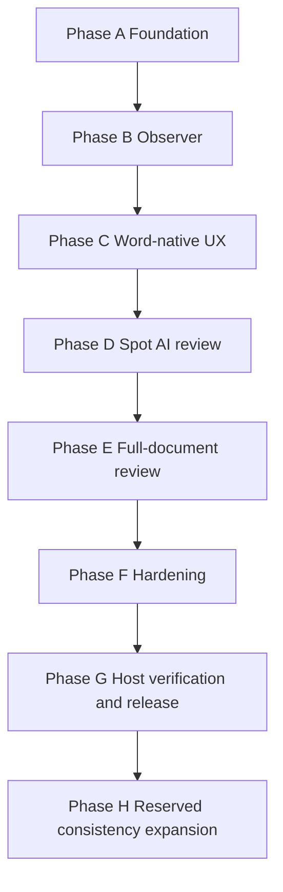

# ToneForge — Authoritative Roadmap and Work Status

> **Status source of truth:** this file is the canonical implementation plan,
> sequencing record, status ledger, and release-gate record for ToneForge.
> `docs/project-state.md` is a compatibility/evidence index that cross-references
> this file; it is not a second plan. Supporting guides are design references or
> historical records and must not override this document.
>
> **Audit baseline:** 2026-09-24 working tree. Git history is the primary evidence
> for committed work. The current working tree also contains an uncommitted A–G
> refactor candidate; its status is reported separately below.

## Mission

Build ToneForge as a production-quality Microsoft Word Web Add-in with:

- editable style learning from writing samples;
- deterministic micro-consistency and formatting checks;
- semantic AI review only where interpretation is required;
- unified findings and auditable `ChangePlan` objects;
- preview-before-apply and a single native Word mutation path;
- provider-agnostic LLM integration;
- explicit privacy, security, accessibility, testing, and host-compatibility
  discipline.

## Canonical rules

### Deterministic first

Use code for measurable or safely enumerable behavior, including typography,
quotes, whitespace, terminology, capitalization, spelling variants, formatting,
structure, coverage, protection, and preservation checks.

### AI only where interpretation is necessary

Use an LLM for tone, voice, rhetorical style, semantic flow, nuanced register,
grammar ambiguity, concision, and meaning-preserving editorial suggestions. AI is
optional and must not be required for deterministic governance.

### One canonical profile

The editable [`StyleProfile`](src/core/domain/StyleProfile.ts) remains the
profile learned from samples. The refactor adds an additive
[`GovernanceProfile`](src/core/domain/GovernanceProfile.ts) envelope for scope,
protection, terminology, editorial policy, rules, and provenance. The envelope
does not replace the existing profile contract.

### One mutation path

All proposed changes flow through `ChangePlan` and the
[`revisionAdapter`](src/word/revisionAdapter.ts). UI, rules, analysis, and
orchestration code do not mutate Word directly. The deprecated smoke helpers
remain only for reproducible historical verification.

### Coverage is measurable

Analysis records a [`CoverageReport`](src/core/domain/DocumentSnapshot.ts) when
structured nodes are available. Incomplete coverage blocks full-document review;
a partial run must not be presented as complete.

### Preserve source identity

Nodes and findings retain node identifiers, source paths, and/or character ranges
where the current Word API exposes them. The current text-offset path remains the
compatibility path until node-based navigation is proven in real Word.

### Privacy gate

Raw document text may leave the add-in only through an explicit raw-text opt-in.
Spot review and full-document review have separate consent settings. AI prompts
require `includeRawText: true`, and model responses are parsed with Zod.

## Verified architecture

The current code has two connected but distinct paths:

```text
Style sample
    -> deterministic metrics + optional semantic profile
    -> editable/versioned StyleProfile
    -> GovernanceProfile envelope
    -> structured DocumentSnapshot
    -> deterministic rules/formatting + optional AI review
    -> unified Findings
    -> ChangePlan
    -> stale/conflict/protection/preservation checks
    -> preview/confirmation
    -> revisionAdapter
    -> Word revisions
```

### Current modules and evidence

| Area                | Implemented evidence                                                                                                                                                                                                         | Boundary/status                                                                          |
| ------------------- | ---------------------------------------------------------------------------------------------------------------------------------------------------------------------------------------------------------------------------- | ---------------------------------------------------------------------------------------- |
| Core domain         | [`StyleProfile`](src/core/domain/StyleProfile.ts), [`Finding`](src/core/domain/Finding.ts), [`Change`](src/core/domain/Change.ts), [`ChangePlan`](src/core/domain/ChangePlan.ts)                                             | Zod-validated, strict TypeScript, additive refactor fields                               |
| Refactor domain     | [`DocumentSnapshot`](src/core/domain/DocumentSnapshot.ts), [`GovernanceProfile`](src/core/domain/GovernanceProfile.ts), [`ReviewRequest`](src/core/domain/ReviewRequest.ts)                                                  | Present in working tree; review/phase gates remain qualified                             |
| Persistence         | [`persistence.ts`](src/core/state/persistence.ts), [`migration.ts`](src/core/state/migration.ts)                                                                                                                             | Schema v3 with v0→v1→v2→v3 migration, Office roaming settings plus localStorage fallback |
| Deterministic rules | [`typography`](src/rules/typography.ts), [`houseStyle`](src/rules/houseStyle.ts), [`protection`](src/rules/protection.ts), [`registry`](src/rules/registry.ts)                                                               | Pure; no Office, LLM, or UI imports                                                      |
| Formatting          | [`formatting`](src/formatting/index.ts) and [`formattingReader`](src/word/formattingReader.ts)                                                                                                                               | Pure DTO engines; Word reads through `runInWord`                                         |
| Analysis            | [`unifiedFindings`](src/analysis/unifiedFindings.ts), [`consistencyChecker`](src/analysis/consistencyChecker.ts), [`coverage`](src/analysis/coverage.ts), [`incrementalCoordinator`](src/analysis/incrementalCoordinator.ts) | Pure/semantic boundaries; coverage and incremental behavior are qualified                |
| AI                  | [`providers`](src/ai/providers/index.ts), [`prompts`](src/ai/prompts/index.ts), [`review`](src/ai/review)                                                                                                                    | Provider abstraction, retry, redaction, consent-gated structured review                  |
| Planning            | [`planner`](src/changes/planner.ts), [`conflictDetector`](src/changes/conflictDetector.ts), [`staleGuard`](src/changes/staleGuard.ts), [`exportAdapter`](src/changes/exportAdapter.ts)                                       | Pure planning and export; no Word mutation                                               |
| Word boundary       | [`documentReader`](src/word/documentReader.ts), [`sourceLocator`](src/word/sourceLocator.ts), [`documentObserver`](src/word/documentObserver.ts), [`revisionAdapter`](src/word/revisionAdapter.ts)                           | Host access uses `runInWord`; adapter is the only mutation owner                         |
| UI                  | [`Dashboard`](src/taskpane/pages/Dashboard.tsx), Phase C/F components, [`ReformatPanel`](src/taskpane/components/ReformatPanel.tsx)                                                                                          | Task pane; no direct adapter import; host UX evidence incomplete                         |
| Verification        | [`package.json`](package.json), [`vitest.config.ts`](vitest.config.ts), [`eslint.config.mjs`](eslint.config.mjs), [`validate-manifest.mjs`](scripts/validate-manifest.mjs)                                                   | Full automated chain passes except global coverage threshold                             |

## Git and repository evidence

- The only local branch is `main`; `origin/main` is the sole remote branch.
- Local `main` is 44 commits ahead of `origin/main` at the audit baseline.
- Git history contains the original Stage 00–22 implementation, Stage 18 live
  smoke evidence, Stage 20–22 implementation, and the committed Phase B
  observer commit `d9a7dbf`.
- The A–G refactor candidate is not wholly committed. The working tree contains
  modified and untracked domain, AI review, analysis, UI, state, test, manifest,
  and documentation files. Those changes are real current implementation but
  are not represented as released history.
- No merge commit was used as evidence for the current work; commit messages and
  source/tests are the audit basis.

## Original stages: verified status

The original 00–28 stage map remains preserved. Status meanings:

- **PASS** — implementation and automated gate evidence are present and green.
- **PASS WITH DOCUMENTED LIMITATION** — implementation and relevant tests exist,
  but a known limitation remains.
- **IMPLEMENTED IN WORKTREE** — code exists in the current uncommitted working
  tree, but no commit/release evidence exists.
- **PARTIAL** — some implementation exists, but a required behavior or gate is
  unverified.
- **BLOCKED** — a prerequisite or hard gate prevents a PASS claim.
- **NOT STARTED** — no implementation was verified.

| Stage | Scope                      | Status                          | Evidence and qualification                                                                                                                                                                                             |
| ----- | -------------------------- | ------------------------------- | ---------------------------------------------------------------------------------------------------------------------------------------------------------------------------------------------------------------------- |
| 00    | Repository discovery       | PASS                            | Baseline files and repository inventory exist.                                                                                                                                                                         |
| 01    | Office.js capability spike | PASS WITH DOCUMENTED LIMITATION | Desktop Word probe and live tracked text smoke are recorded in [`manual-verification`](docs/manual-verification.md). Web Chrome, web Edge, and Mac remain untested; styles and breaks remain false on the tested host. |
| 02    | Scaffold                   | PASS                            | Build, manifest JSON/XML fallback, assets, tests, CI, and hooks exist.                                                                                                                                                 |
| 03    | Cline governance           | PASS                            | `.cline` rules, `.roo` skills, and scoped rules exist.                                                                                                                                                                 |
| 04    | Domain model               | PASS                            | Core Zod contracts and tests exist.                                                                                                                                                                                    |
| 05    | Storage/state              | PASS                            | Persistence, v3 migration, and corruption fallback exist.                                                                                                                                                              |
| 06    | LLM provider layer         | PASS                            | OpenAI and mock adapters, registry, retry, redaction, and tests exist.                                                                                                                                                 |
| 07    | Settings UI                | PASS                            | Provider, consent, and telemetry settings persist.                                                                                                                                                                     |
| 08    | Style sample               | PASS                            | Selection-preferred capture, clipboard fallback, and quality gate exist.                                                                                                                                               |
| 09    | Deterministic metrics      | PASS                            | Pure metrics and tests exist.                                                                                                                                                                                          |
| 10    | Style profiler             | PASS                            | Mock-driven semantic profiling and opt-in tests exist.                                                                                                                                                                 |
| 11    | Editable Style Profile UI  | PASS                            | Editor, validation, save/reset, and version controls exist.                                                                                                                                                            |
| 12    | Profile versioning         | PASS                            | v2 history, diff, changelog, and migration exist.                                                                                                                                                                      |
| 13    | Typography rules           | PASS                            | Pure rule engine and tests exist.                                                                                                                                                                                      |
| 14    | House-style rules          | PASS                            | Pure terminology/spelling/capitalization engine and tests exist; full spellcheck remains out of scope.                                                                                                                 |
| 15    | Formatting engine          | PASS                            | Pure analyzer/normalizer plus Word DTO reader and tests exist.                                                                                                                                                         |
| 16    | Unified findings           | PASS                            | Deterministic/formatting/semantic merge and tests exist.                                                                                                                                                               |
| 17    | Change planning            | PASS                            | Planner, conflict detector, stale guard, and tests exist.                                                                                                                                                              |
| 18    | Revision adapter           | PASS WITH DOCUMENTED LIMITATION | Desktop text insert/replace smoke and mock coverage exist; break/style/list/format paths remain mock-only; the mutation gate remains explicit.                                                                         |
| 19    | Semantic deviation         | PASS                            | Mock-only deviation engine, Zod response validation, retry, and abort behavior exist.                                                                                                                                  |
| 20    | Consistency checker        | PASS                            | Findings-only checker and mock-only tests exist.                                                                                                                                                                       |
| 21    | Reformat orchestrator      | PASS                            | Snapshot→analysis→plan→preview/apply path and integration tests exist.                                                                                                                                                 |
| 22    | Safe application           | PASS                            | Live re-hash, conflict refusal, adapter defense, and confirmation UI exist.                                                                                                                                            |
| 23    | Accessibility/UX           | PASS WITH DOCUMENTED LIMITATION | Phase C task-pane components and [`ux-state-matrix`](docs/ux-state-matrix.md) exist in the worktree; real keyboard, screen-reader, ribbon, navigation, and host checks remain.                                         |
| 24    | Performance                | PASS WITH DOCUMENTED LIMITATION | Debounce, bounded batches, cancellation, and finding-list pagination exist; live 50k-word and edit-to-finding measurements remain pending.                                                                             |
| 25    | Security/privacy           | PASS WITH DOCUMENTED LIMITATION | Separate consent, minimization, response validation, protection checks, and privacy documentation exist; key encryption and formal security review remain limitations.                                                 |
| 26    | Test/review                | BLOCKED                         | `npm run test` passes 593 tests, but `npm run test:coverage` fails the global 80% threshold: 43.13% lines/statements, 66.60% functions, 76.95% branches.                                                               |
| 27    | Manual Word verification   | PARTIAL                         | Desktop evidence exists; web Chrome, web Edge, Mac, and new Phase C/E paths are incomplete.                                                                                                                            |
| 28    | Release candidate          | BLOCKED                         | Version/manifests/build are prepared, but Stage 27 and coverage/release gates are not complete.                                                                                                                        |

## Refactor status and sequencing

The incoming `ToneForge_Refactor_Implementation` proposal used incompatible
stage numbers. Its implementation is intentionally mapped here to additive
phases rather than renumbered as a replacement roadmap.

| Refactor work                                                                    | Canonical phase          | Status                  | Verified implementation                                                                                                        | Remaining work / gate                                                                                                                                                                                           |
| -------------------------------------------------------------------------------- | ------------------------ | ----------------------- | ------------------------------------------------------------------------------------------------------------------------------ | --------------------------------------------------------------------------------------------------------------------------------------------------------------------------------------------------------------- |
| Document snapshot, governance envelope, coverage, protection, registry, state v3 | A — Foundation           | PARTIAL                 | Domain schemas, migration, coverage, protection, registry, adapter validation, and tests are in the worktree.                  | Snapshot currently exposes body/paragraph/heading-derived nodes rather than the full proposed Word structure; coverage/report semantics and protected-range linkage need stronger fixture evidence before PASS. |
| Incremental observer                                                             | B — Observer             | PARTIAL                 | Coordinator, observer, debounce, stale state, status UI, and tests exist; commit `d9a7dbf` records the initial implementation. | Observer currently has no verified Word change-range source and conservatively scans all structured nodes; the original Phase B “small edit avoids full scan” goal is not proven.                               |
| Ribbon, task pane, navigation, pending changes, UX states                        | C — Word-native UX       | IMPLEMENTED IN WORKTREE | Ribbon entries, commands, task-pane components, source locator, and UX matrix exist.                                           | Context-menu extension is not evidenced; real Word ribbon, navigation, accessibility, and host behavior remain unverified.                                                                                      |
| Spot selection/paragraph AI review                                               | D — AI spot review       | IMPLEMENTED IN WORKTREE | `ReviewRequest`, prompt gate, minimizer, response validator, review pipeline, UI entry, consent, and MockAdapter tests exist.  | Live provider/host behavior and a verified paragraph/context-menu flow remain open.                                                                                                                             |
| Full-document editorial review                                                   | E — AI full document     | IMPLEMENTED IN WORKTREE | Coverage gate, bounded batching, review pipeline, preflight/progress/results, consolidation, and export adapter exist.         | Token-aware limits, batch freshness after edits, live Word behavior, and end-to-end host validation remain open.                                                                                                |
| Safe apply, performance, security, regression                                    | F — Hardening            | PARTIAL                 | Dependency ordering, preservation checks, protected-node validation, bounded AI paths, privacy docs, and many tests exist.     | Post-apply verification, true incremental performance evidence, global coverage, formal security review, and long-document measurements remain open.                                                            |
| Host matrix, release acceptance, consistency seam                                | G — Verification/release | BLOCKED                 | Reserved consistency README and lint boundary exist.                                                                           | Full host matrix, release checklist, consistency types stub/guard, and release publication are incomplete.                                                                                                      |
| Content Consistency Review C1–C10                                                | H — Reserved future      | NOT STARTED             | Only the reserved seam exists; no engine is implemented or imported.                                                           | Must follow core release acceptance and a separately approved privacy/consent design.                                                                                                                           |

### Phase dependency graph



The sequence is retained because later phases consume earlier contracts, but a
phase marked partial or implemented in the worktree must not be treated as a
passed gate merely because its files exist.

## Refactor before/after architecture

### Before

The pre-refactor path had text snapshots, a `StyleProfile`, deterministic rule
and formatting findings, semantic deviation findings, a findings-only checker,
a planner, and the Word revision adapter. It had a small task pane, limited UX
states, and no structured node/coverage/protection/AI-review contracts.

### After as currently implemented

The refactor adds structured node DTOs, a governance profile envelope, additive
finding/change/plan metadata, state schema v3, coverage, protection, rule IDs,
an observer, source navigation, ribbon/commands, consent-gated AI review,
bounded full-document review, export adapters, and a reserved consistency seam.
The original `StyleProfile`, text snapshot, checker, orchestrator, and adapter
paths remain available for compatibility.

### Transitional and compatibility code

- [`DocumentSnapshot`](src/word/documentReader.ts) text interface and
  `getStructuredSnapshot()` coexist.
- `resolveSourceRange()` is additive; current navigation still uses character
  offsets because real Word node-path navigation is not proven.
- `ChangePlan.conflicts` accepts legacy strings and structured conflict entries.
- `Finding`, `Change`, and `ChangePlan` use defaults/additive fields to preserve
  existing fixtures.
- [`smokeApply`](src/word/smokeApply.ts) and the Stage 18 smoke panel are
  deprecated compatibility/reproduction paths, not competing production paths.
- The reserved [`consistency`](src/analysis/consistency/README.md) directory is
  documentation-only and must not be imported by live code.

## Verification and release gates

The required ordered chain is:

```text
typecheck -> lint -> format -> test -> build -> manifest validation
```

Commands:

- `npm run typecheck`
- `npm run lint`
- `npm run format`
- `npm run test`
- `npm run build`
- `npm run validate`
- `npm run stage:verify` — repeats the ordered automated checks.
- `npm run test:coverage` — required for the global 80% gate; currently fails.
- `npm run release:check` — must not pass while Stage 27 is incomplete.

### Current verification result

| Check               | Result                                       | Evidence                                                                                       |
| ------------------- | -------------------------------------------- | ---------------------------------------------------------------------------------------------- |
| Typecheck           | PASS                                         | `npm run typecheck`                                                                            |
| Lint                | PASS                                         | `npm run lint`                                                                                 |
| Format              | PASS                                         | `npm run format`                                                                               |
| Tests               | PASS                                         | `npm run test`: 58 files, 593 tests                                                            |
| Build               | PASS with warnings                           | `npm run build`; Webpack reports asset-size/runtime warnings                                   |
| Manifest validation | PASS                                         | `npm run validate`                                                                             |
| Stage verification  | Expected to pass after the individual checks | `scripts/stage-verify.mjs` runs the ordered chain                                              |
| Global coverage     | FAIL                                         | `npm run test:coverage`: 43.13% lines/statements, 66.60% functions, 76.95% branches versus 80% |
| Manual host matrix  | INCOMPLETE                                   | Desktop evidence only; web Chrome, web Edge, and Mac open                                      |
| Release check       | BLOCKED                                      | Hard host gate and coverage gate are open                                                      |

## Outstanding work and sequencing

1. **Close the live Word hard gates.** Re-run the capability probe, ribbon,
   selection/paragraph resolution, navigation/highlight, context-menu behavior,
   breaks/styles, tracking, protection, and observer events in every supported
   host. Update [`manual-verification`](docs/manual-verification.md) with exact
   host/version evidence.
2. **Finish or formally defer the A–G worktree candidate.** Specifically close
   true incremental change-range mapping, structured node coverage, source-range
   protection linkage, full-document token/freshness semantics, and post-apply
   verification.
3. **Restore the global coverage gate.** Add or identify tests for the global
   UI/word/style surfaces, or make an explicit governance decision to change the
   gate. Do not silently lower the threshold.
4. **Complete formal performance and security review.** Record measured
   baselines, inspect key storage limitations, audit logs/CSP/manifest behavior,
   and record any accepted limitations.
5. **Complete Phase G release evidence.** Add the planned consistency types stub
   and CI guard if that seam is part of the release scope, complete the release
   acceptance checklist, then run the full verification chain and release check.
6. **Only after release acceptance, open Phase H.** Do not implement C1–C10 as
   part of the live observer, spot review, or current release.

## Human decisions still required

- Which Word hosts are release-support commitments: web Chrome, web Edge, and
  Windows desktop are named; Mac is “if available” in the refactor materials.
- Whether the current global 80% coverage threshold remains mandatory for the
  release or whether a documented module-scoped policy is approved.
- Whether Phase G's proposed consistency `types.ts` stub and CI grep guard are
  required before release, or whether the current documentation-only seam is
  sufficient.
- Whether to retain the deprecated smoke panel in the release candidate UI or
  remove it after the final live verification record is complete.

## Documentation policy

Supporting documents retain historical or design detail, but status and plan
claims must point here. The following are compatibility evidence and guides,
not competing sources of truth:

- [`docs/project-state.md`](docs/project-state.md) — evidence index and stage-gate
  notes; authoritative statuses are the table in this file.
- [`docs/architecture.md`](docs/architecture.md) — current module boundaries and
  data flow.
- [`docs/decision-log.md`](docs/decision-log.md) — dated architectural decisions.
- [`docs/manual-verification.md`](docs/manual-verification.md) — host evidence.
- [`docs/CHANGELOG.md`](docs/CHANGELOG.md) — release history.
- [`plans/`](plans) — historical execution plans and audit records.
- `ToneForge_Refactor_Implementation/` — incoming proposal/design set; superseded
  for status and sequencing by this file.

When a supporting document conflicts with this file, correct the supporting
document or add a clear cross-reference; do not create another roadmap.
