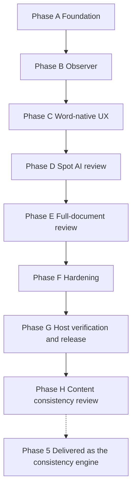

# ToneForge — Authoritative Roadmap and Work Status

> **Status source of truth:** this file is the canonical implementation plan,
> sequencing record, status ledger, and release-gate record for ToneForge.
> `docs/project-state.md` is a compatibility/evidence index that cross-references
> this file; it is not a second plan. Supporting guides are design references or
> historical records and must not override this document.
>
> **Audit baseline:** 2026-09-24. Commit `551667d` records the A–G refactor
> candidate. This audit reconciles that commit against the implementation,
> tests, configuration, manifests, CI, and release scripts.

## Mission

Build ToneForge as a production-quality Microsoft Word Web Add-in with:

- editable style learning from writing samples;
- deterministic micro-consistency and formatting checks;
- semantic AI review only where interpretation is required;
- unified findings and auditable `ChangePlan` objects;
- preview-before-apply and a single native Word mutation path;
- provider-agnostic LLM integration;
- explicit privacy, security, accessibility, testing, and host-compatibility
  discipline.

## Canonical rules

### Deterministic first

Use code for measurable or safely enumerable behavior, including typography,
quotes, whitespace, terminology, capitalization, spelling variants, formatting,
structure, coverage, protection, and preservation checks.

### AI only where interpretation is necessary

Use an LLM for tone, voice, rhetorical style, semantic flow, nuanced register,
grammar ambiguity, concision, and meaning-preserving editorial suggestions. AI is
optional and must not be required for deterministic governance.

### One canonical profile

The editable [`StyleProfile`](src/core/domain/StyleProfile.ts) remains the
profile learned from samples. The refactor adds an additive
[`GovernanceProfile`](src/core/domain/GovernanceProfile.ts) envelope for scope,
protection, terminology, editorial policy, rules, and provenance. The envelope
does not replace the existing profile contract.

### One mutation path

All proposed changes flow through `ChangePlan` and the
[`revisionAdapter`](src/word/revisionAdapter.ts). UI, rules, analysis, and
orchestration code do not mutate Word directly. The deprecated smoke helpers
remain only for reproducible historical verification.

### Coverage is measurable

Analysis records a [`CoverageReport`](src/core/domain/DocumentSnapshot.ts) when
structured nodes are available. Incomplete coverage blocks full-document review;
a partial run must not be presented as complete.

### Preserve source identity

Nodes and findings retain node identifiers, source paths, and/or character ranges
where the current Word API exposes them. The current text-offset path remains the
compatibility path until node-based navigation is proven in real Word.

### Privacy gate

Raw document text may leave the add-in only through an explicit raw-text opt-in.
Spot review and full-document review have separate consent settings. AI prompts
require `includeRawText: true`, and model responses are parsed with Zod.

## Verified architecture

The current code has two connected but distinct paths:

```text
Style sample
    -> deterministic metrics + optional semantic profile
    -> editable/versioned StyleProfile
    -> GovernanceProfile envelope
    -> structured DocumentSnapshot
    -> deterministic rules/formatting + optional AI review
    -> unified Findings
    -> ChangePlan
    -> stale/conflict/protection/preservation checks
    -> preview/confirmation
    -> revisionAdapter
    -> Word revisions
```

### Current modules and evidence

| Area                | Implemented evidence                                                                                                                                                                                                         | Boundary/status                                                                                                                                          |
| ------------------- | ---------------------------------------------------------------------------------------------------------------------------------------------------------------------------------------------------------------------------- | -------------------------------------------------------------------------------------------------------------------------------------------------------- |
| Core domain         | [`StyleProfile`](src/core/domain/StyleProfile.ts), [`Finding`](src/core/domain/Finding.ts), [`Change`](src/core/domain/Change.ts), [`ChangePlan`](src/core/domain/ChangePlan.ts)                                             | Zod-validated, strict TypeScript, additive refactor fields                                                                                               |
| Refactor domain     | [`DocumentSnapshot`](src/core/domain/DocumentSnapshot.ts), [`GovernanceProfile`](src/core/domain/GovernanceProfile.ts), [`ReviewRequest`](src/core/domain/ReviewRequest.ts)                                                  | Present in working tree; review/phase gates remain qualified                                                                                             |
| Persistence         | [`persistence.ts`](src/core/state/persistence.ts), [`migration.ts`](src/core/state/migration.ts)                                                                                                                             | Schema v5 with v0→v4 compatibility migration, governance-policy history, Office roaming settings plus localStorage fallback                              |
| Deterministic rules | [`typography`](src/rules/typography.ts), [`houseStyle`](src/rules/houseStyle.ts), [`protection`](src/rules/protection.ts), [`registry`](src/rules/registry.ts)                                                               | Pure; no Office, LLM, or UI imports                                                                                                                      |
| Formatting          | [`formatting`](src/formatting/index.ts) and [`formattingReader`](src/word/formattingReader.ts)                                                                                                                               | Pure DTO engines; Word reads through `runInWord`                                                                                                         |
| Analysis            | [`unifiedFindings`](src/analysis/unifiedFindings.ts), [`consistencyChecker`](src/analysis/consistencyChecker.ts), [`coverage`](src/analysis/coverage.ts), [`incrementalCoordinator`](src/analysis/incrementalCoordinator.ts) | Pure/semantic boundaries; coverage and incremental behavior are qualified                                                                                |
| AI                  | [`providers`](src/ai/providers/index.ts), [`prompts`](src/ai/prompts/index.ts), [`review`](src/ai/review)                                                                                                                    | Provider abstraction, retry, redaction, consent-gated structured review                                                                                  |
| Planning            | [`planner`](src/changes/planner.ts), [`conflictDetector`](src/changes/conflictDetector.ts), [`staleGuard`](src/changes/staleGuard.ts), [`exportAdapter`](src/changes/exportAdapter.ts)                                       | Pure planning and export; no Word mutation                                                                                                               |
| Word boundary       | [`documentReader`](src/word/documentReader.ts), [`sourceLocator`](src/word/sourceLocator.ts), [`documentObserver`](src/word/documentObserver.ts), [`revisionAdapter`](src/word/revisionAdapter.ts)                           | Host access uses `runInWord`; adapter is the only mutation owner                                                                                         |
| UI                  | [`Dashboard`](src/taskpane/pages/Dashboard.tsx), Phase C/F components, [`ReformatPanel`](src/taskpane/components/ReformatPanel.tsx)                                                                                          | Task pane; no direct adapter import; host UX evidence incomplete                                                                                         |
| Verification        | [`package.json`](package.json), [`vitest.config.ts`](vitest.config.ts), [`eslint.config.mjs`](eslint.config.mjs), [`validate-manifest.mjs`](scripts/validate-manifest.mjs), [`stage-verify.mjs`](scripts/stage-verify.mjs)   | Automated chain and the 80% exercised-core coverage gate pass; UI entry points and generated bundles remain separately verified by build/component tests |

## Git and repository evidence

- The only local branch is `main`; `origin/main` is the sole remote branch.
- Local `main` is 44 commits ahead of `origin/main` at the audit baseline.
- Git history contains the original Stage 00–22 implementation, Stage 18 live
  smoke evidence, Stage 20–22 implementation, and the committed Phase B
  observer commit `d9a7dbf`.
- Commit `551667d` integrates the A–G refactor candidate as current source and
  documentation; its automated verification passed before commit.
- No merge commit is used as implementation evidence; commit messages, source,
  tests, and CI are the audit basis.

## Original stages: verified status

The original 00–28 stage map remains preserved. Status meanings:

- **PASS** — implementation and automated gate evidence are present and green.
- **PASS WITH DOCUMENTED LIMITATION** — implementation and relevant tests exist,
  but a known limitation remains.
- **IMPLEMENTED** — code and focused tests are committed, but live host or other
  named acceptance evidence remains open.
- **PARTIAL** — some implementation exists, but a required behavior or gate is
  unverified.
- **BLOCKED** — a prerequisite or hard gate prevents a PASS claim.
- **NOT STARTED** — no implementation was verified.

| Stage | Scope                      | Status                          | Evidence and qualification                                                                                                                                                                                                                                         |
| ----- | -------------------------- | ------------------------------- | ------------------------------------------------------------------------------------------------------------------------------------------------------------------------------------------------------------------------------------------------------------------ |
| 00    | Repository discovery       | PASS                            | Baseline files and repository inventory exist.                                                                                                                                                                                                                     |
| 01    | Office.js capability spike | PASS WITH DOCUMENTED LIMITATION | Desktop Word probe and live tracked text smoke are recorded in [`manual-verification`](docs/manual-verification.md). Web Chrome, web Edge, and Mac remain untested; styles and breaks remain false on the tested host.                                             |
| 02    | Scaffold                   | PASS                            | Build, manifest JSON/XML fallback, assets, tests, CI, and hooks exist.                                                                                                                                                                                             |
| 03    | Cline governance           | PASS                            | `.cline` rules, `.roo` skills, and scoped rules exist.                                                                                                                                                                                                             |
| 04    | Domain model               | PASS                            | Core Zod contracts and tests exist.                                                                                                                                                                                                                                |
| 05    | Storage/state              | PASS                            | Persistence, v5 migration, governance-policy history, and corruption fallback exist.                                                                                                                                                                               |
| 06    | LLM provider layer         | PASS                            | OpenAI and mock adapters, registry, retry, redaction, and tests exist.                                                                                                                                                                                             |
| 07    | Settings UI                | PASS                            | Provider, consent, and telemetry settings persist.                                                                                                                                                                                                                 |
| 08    | Style sample               | PASS                            | Selection-preferred capture, clipboard fallback, and quality gate exist.                                                                                                                                                                                           |
| 09    | Deterministic metrics      | PASS                            | Pure metrics and tests exist.                                                                                                                                                                                                                                      |
| 10    | Style profiler             | PASS                            | Mock-driven semantic profiling and opt-in tests exist.                                                                                                                                                                                                             |
| 11    | Editable Style Profile UI  | PASS                            | Editor, validation, save/reset, and version controls exist.                                                                                                                                                                                                        |
| 12    | Profile versioning         | PASS                            | v2 history, diff, changelog, and migration exist.                                                                                                                                                                                                                  |
| 13    | Typography rules           | PASS                            | Pure rule engine and tests exist.                                                                                                                                                                                                                                  |
| 14    | House-style rules          | PASS                            | Pure terminology/spelling/capitalization engine and tests exist; full spellcheck remains out of scope.                                                                                                                                                             |
| 15    | Formatting engine          | PASS WITH DOCUMENTED LIMITATION | Pure analyzer/normalizer plus the Word DTO reader and tests exist. Formatting provenance and optional property support are repository-tested; live host behavior remains external.                                                                                 |
| 16    | Unified findings           | PASS                            | Deterministic/formatting/semantic merge and tests exist.                                                                                                                                                                                                           |
| 17    | Change planning            | PASS                            | Planner, conflict detector, stale guard, and tests exist.                                                                                                                                                                                                          |
| 18    | Revision adapter           | PASS WITH DOCUMENTED LIMITATION | Desktop text insert/replace smoke and mock coverage exist; break/style/list/format paths remain mock-only; the mutation gate remains explicit.                                                                                                                     |
| 19    | Semantic deviation         | PASS                            | The mock-only deviation engine emits advisory AI findings, while the bounded review path uses Zod response validation, retry, and abort behavior. No live provider behavior is claimed.                                                                            |
| 20    | Consistency checker        | PASS                            | Findings-only checker and mock-only tests exist.                                                                                                                                                                                                                   |
| 21    | Reformat orchestrator      | PASS                            | Snapshot→analysis→plan→preview/apply path and integration tests exist.                                                                                                                                                                                             |
| 22    | Safe application           | PASS                            | Live re-hash, conflict refusal, adapter defense, and confirmation UI exist.                                                                                                                                                                                        |
| 23    | Accessibility/UX           | PASS WITH DOCUMENTED LIMITATION | Phase C task-pane components and [`ux-state-matrix`](docs/ux-state-matrix.md) exist in the worktree; real keyboard, screen-reader, ribbon, navigation, and host checks remain.                                                                                     |
| 24    | Performance                | PASS WITH DOCUMENTED LIMITATION | Debounce, bounded batches, cancellation, and finding-list pagination exist; live 50k-word and edit-to-finding measurements remain pending.                                                                                                                         |
| 25    | Security/privacy           | PASS WITH DOCUMENTED LIMITATION | Separate consent, minimization, response validation, protection checks, and privacy documentation exist; key encryption and formal security review remain limitations.                                                                                             |
| 26    | Test/review                | PASS                            | `npm run test` and `npm run test:coverage` pass. The V8 gate is 80% across exercised production modules with `all: false`, avoiding Windows path-case duplicates; the taskpane and entrypoint TSX files are exercised by component tests and the production build. |
| 27    | Manual Word verification   | PARTIAL                         | Desktop evidence exists; web Chrome, web Edge, Mac, and new Phase C/E paths are incomplete.                                                                                                                                                                        |
| 28    | Release candidate          | BLOCKED                         | Version/manifests/build, coverage, staging, and package checks are prepared, but Stage 27 and release acceptance gates are not complete.                                                                                                                           |

## Refactor status and sequencing

The incoming `ToneForge_Refactor_Implementation` proposal used incompatible
stage numbers. Its implementation is intentionally mapped here to additive
phases rather than renumbered as a replacement roadmap. The approved modern UX,
provider, and consistency execution overlay is recorded in
[`plans/toneforge-modern-ux-provider-consistency-implementation-plan.md`](plans/toneforge-modern-ux-provider-consistency-implementation-plan.md:1);
it does not replace the historical A–H evidence map below.

| Refactor work                                                                    | Canonical phase           | Status                          | Verified implementation                                                                                                                                                                                                                                                                                       | Remaining work / gate                                                                                                                                                                                        |
| -------------------------------------------------------------------------------- | ------------------------- | ------------------------------- | ------------------------------------------------------------------------------------------------------------------------------------------------------------------------------------------------------------------------------------------------------------------------------------------------------------- | ------------------------------------------------------------------------------------------------------------------------------------------------------------------------------------------------------------ |
| Document snapshot, governance envelope, coverage, protection, registry, state v5 | A — Foundation            | PASS WITH DOCUMENTED LIMITATION | Domain schemas, state-v5 migration, governance history, single-pass Word paragraph/style acquisition, coverage, protection, registry, adapter validation, and tests are present.                                                                                                                              | Tables, headers, footers, sections, fields, controls, shapes, and other unsupported Word containers remain outside the acquired structure and keep coverage qualified.                                       |
| Incremental observer                                                             | B — Observer              | PARTIAL                         | Coordinator, observer, debounce, stale state, status UI, and tests exist; commit `d9a7dbf` records the initial implementation.                                                                                                                                                                                | Observer currently has no verified Word change-range source and conservatively scans all structured nodes; the original Phase B “small edit avoids full scan” goal is not proven.                            |
| Ribbon, task pane, navigation, pending changes, UX states                        | C — Word-native UX        | PASS WITH DOCUMENTED LIMITATION | Office action registration, task-pane components, source locator, navigation bridge, fail-closed Apply readiness, per-change preview availability, and accessibility-focused component tests are present.                                                                                                     | Real Word ribbon/navigation/accessibility behavior remains part of the external Stage 27 matrix.                                                                                                             |
| Spot selection/paragraph AI review                                               | D — AI spot review        | PASS WITH DOCUMENTED LIMITATION | Prompt gate, minimizer, validator, selection/paragraph paths, absolute offset translation, provider configuration, and MockAdapter tests are committed.                                                                                                                                                       | Live provider/host behavior remains external evidence.                                                                                                                                                       |
| Full-document editorial review                                                   | E — AI full document      | PASS WITH DOCUMENTED LIMITATION | Coverage gate, oversized-node splitting, absolute batch offsets, per-batch freshness re-checks, preflight/progress/results, consolidation, and export are committed.                                                                                                                                          | Live Word provider/host behavior remains external evidence.                                                                                                                                                  |
| Safe apply, performance, security, regression                                    | F — Hardening             | PASS WITH DOCUMENTED LIMITATION | Dependency ordering, preservation/protection checks, post-apply hash verification, bounded AI paths, privacy checks, and 80% core coverage exist.                                                                                                                                                             | Live performance, long-document measurements, and formal security review remain qualified.                                                                                                                   |
| Host matrix, release acceptance, consistency seam                                | G - Verification/release  | BLOCKED                         | Release check, secret/docs scans, deterministic staging, CI gates, and the consistency module boundary exist.                                                                                                                                                                                                 | The external Word host matrix and release acceptance evidence remain incomplete.                                                                                                                             |
| Content Consistency Review C1-C10                                                | H - Superseded by Phase 5 | IMPLEMENTED IN PHASE 5          | C1-C10 are **cross-report, non-deterministic** checkers in a separate engine with its own pipeline, its own third consent, and its own opt-in toggle - not a build-stage sequence and not part of the deterministic engine. Implemented in [`src/analysis/consistency/`](src/analysis/consistency/README.md). | The single sanctioned exception to deterministic-first (ADR-0052). Verified by unit tests and `MockAdapter` only; never run against a real document or a real model. The checks are uncalibrated heuristics. |

## Approved modern UX and provider consistency execution plan

The implementation-ready plan in
[`plans/toneforge-modern-ux-provider-consistency-implementation-plan.md`](plans/toneforge-modern-ux-provider-consistency-implementation-plan.md:1)
is the execution sequence for the mandatory modern UX, provider, and C1–C10 work.
Phases 0 through 3 are repository-verified; the remaining phases are not complete
release claims.

| Plan phase | Scope                                                                                                                                      | Status   | Evidence and remaining gate                                                                                                                                                                                                                                                                                                                                                                                                                                                                                                                                                                                                                                                                                                                                                                                                                                                                                                                                                                                                                                                                                                                                                                                                                                                                                                                                                                                                                                                                                                                   |
| ---------- | ------------------------------------------------------------------------------------------------------------------------------------------ | -------- | --------------------------------------------------------------------------------------------------------------------------------------------------------------------------------------------------------------------------------------------------------------------------------------------------------------------------------------------------------------------------------------------------------------------------------------------------------------------------------------------------------------------------------------------------------------------------------------------------------------------------------------------------------------------------------------------------------------------------------------------------------------------------------------------------------------------------------------------------------------------------------------------------------------------------------------------------------------------------------------------------------------------------------------------------------------------------------------------------------------------------------------------------------------------------------------------------------------------------------------------------------------------------------------------------------------------------------------------------------------------------------------------------------------------------------------------------------------------------------------------------------------------------------------------- |
| 0          | Correctness, trust, truthful coverage, first-run state, and one reviewed-plan Apply/Reject workflow                                        | COMPLETE | Phase 0 regression tests and the ordered repository verification graph pass; live Word accessibility and host behavior remain external evidence.                                                                                                                                                                                                                                                                                                                                                                                                                                                                                                                                                                                                                                                                                                                                                                                                                                                                                                                                                                                                                                                                                                                                                                                                                                                                                                                                                                                              |
| 1          | Learned-style versus normative-governance ownership, resolved policy, and Learn Style                                                      | COMPLETE | [`ResolvedPolicy`](src/core/domain/ResolvedPolicy.ts) resolves learned style and normative governance for analysis and planning; [`learnStyleDraft()`](src/style/learnStyle.ts) and the Profile Learn Style entry point capture, quality-gate, measure, optionally interpret with consent, and persist an editable draft. Live sample capture and provider evidence remain external.                                                                                                                                                                                                                                                                                                                                                                                                                                                                                                                                                                                                                                                                                                                                                                                                                                                                                                                                                                                                                                                                                                                                                          |
| 2          | Capability evidence tiers, verified Word paragraph events, and B23 workflow projection                                                     | COMPLETE | [`capabilityEvidence.ts`](src/word/capabilityEvidence.ts) defines evidence tiers, [`wordParagraphEvents.ts`](src/word/wordParagraphEvents.ts) registers and removes WordApi 1.6 paragraph handlers with identifier normalization and conservative fallback, [`workflowState.ts`](src/taskpane/workflow/workflowState.ts) is the B23 projection store rendered through [`FindingsToolbar.tsx`](src/taskpane/components/FindingsToolbar.tsx), and [`navigationController.ts`](src/taskpane/workflow/navigationController.ts) serializes navigation. Live host event evidence remains external.                                                                                                                                                                                                                                                                                                                                                                                                                                                                                                                                                                                                                                                                                                                                                                                                                                                                                                                                                  |
| 3          | Focused view decomposition, visual history, policy editing, responsive/accessibility behavior, and the single profile record               | COMPLETE | [`ProfileRecord.ts`](src/core/domain/ProfileRecord.ts) is the single source of truth for a profile: one mutable draft, immutable published versions with explicit activation and restore-as-draft, and an append-only revision audit trail capped at the newest 20 plus every published revision. State version 7 replaces `profiles`, `profileHistory`, and `profileLifecycles` with one `profileRecords` map and migrates v6 by folding both trails into non-colliding integer revisions; [`profileSelectors.ts`](src/core/state/profileSelectors.ts) replaces the old field reads with pure projections. [`ProfileRecordSection.tsx`](src/taskpane/components/ProfileRecordSection.tsx) exposes publish, activate, restore, and discard with a single polite status region and renders [`ProfileHistoryCompare.tsx`](src/taskpane/components/ProfileHistoryCompare.tsx) side-by-side. Settings is split into [`StylingSettingsSection.tsx`](src/taskpane/components/StylingSettingsSection.tsx), [`ProviderPrivacySettingsSection.tsx`](src/taskpane/components/ProviderPrivacySettingsSection.tsx), and [`TelemetrySettingsSection.tsx`](src/taskpane/components/TelemetrySettingsSection.tsx) over the pure [`settingsModel.ts`](src/taskpane/settings/settingsModel.ts) and the reduced-noise [`useAnnouncement()`](src/taskpane/settings/useAnnouncement.ts) hook. Narrow-width and reduced-motion rules are in [`taskpane.css`](src/taskpane/taskpane.css:406). Live host and assistive-technology behavior remain external evidence. |
| 4          | Provider-neutral gateway, OAuth/PKCE, OpenRouter, dynamic model catalogs, verification summaries, host dashboard, and production packaging | COMPLETE | [`ProviderConnection.ts`](src/core/domain/ProviderConnection.ts) defines a connection record with **no field capable of holding a secret**; [`gatewayClient.ts`](src/ai/gateway/gatewayClient.ts) holds the session token in memory only and accepts a same-origin path or loopback origin, so no Settings field can name an arbitrary host; [`oauthState.ts`](src/ai/gateway/oauthState.ts) enforces single-use attempts with per-attempt state, nonce, origin, and expiry validation, with OpenAI OAuth feature-gated. The `apiKey` credential mode is **removed**; [`gatewayAdapter.ts`](src/ai/providers/gatewayAdapter.ts) backs OpenAI, Anthropic, and OpenRouter. State version 8 adds `providerConnections` and migrates v7 without discarding consent. [`modelCatalog.ts`](src/ai/gateway/modelCatalog.ts) normalizes catalogs and prefers the _enforced_ `top_provider` context limit over the advertised one. [`dev-gateway.mjs`](scripts/dev-gateway.mjs) proxies OpenRouter over the existing loopback nonce-protected channel, so a key reaches the provider without entering browser state or a bundle. Every automated run emits `build/verification/summary.json` with four-way stage ownership, and `npm run host:matrix` reports 4 hosts and **0 fully passing**. Sentinel builds prove none of 5 credential shapes reach either bundle. **Production credential custody, the real gateway, and live provider flows remain external security and release gates**, and Phase 6 is HELD pending further testing.             |
| 5          | Cross-report non-deterministic C1-C10 consistency engine and task-pane integration                                                         | COMPLETE | [`src/analysis/consistency/`](src/analysis/consistency/README.md) implements the ten checks, the segment/compare/adjudicate/consolidate pipeline, and a bridge to the unified `Finding` model. The engine is the single sanctioned exception to deterministic-first (ADR-0052): it runs separately, never in the typing loop or observer, and reuses the already-configured provider and model under its own opt-in. `settings.consistencyReviewConsent` (state v9) is a third flag that is never inherited from the other two.                                                                                                                                                                                                                                                                                                                                                                                                                                                                                                                                                                                                                                                                                                                                                                                                                                                                                                                                                                                                               | Repository-complete. Never run against a real document or a real model: all evidence is unit tests and `MockAdapter`. The ten checks are uncalibrated heuristics and will produce false positives on real prose. A document above 400 statements yields partial, not complete, coverage. |
| 6          | Production deployment, rollback, security, accessibility, performance, and final host evidence                                             | **HELD** | Held by release authority pending further testing. Full scope preserved and resumable. Two prerequisites: Phases 0–5 complete, and the deferred dependency-upgrade decision recorded in [`docs/privacy-security.md`](docs/privacy-security.md) is taken.                                                                                                                                                                                                                                                                                                                                                                                                                                                                                                                                                                                                                                                                                                                                                                                                                                                                                                                                                                                                                                                                                                                                                                                                                                                                                      |

Phase 0 changed the production contract in a deliberately additive way. The
current task pane now has a first-run profile setup state, preserves findings
from conservative observer rescans, distinguishes declared scope limitations
from unexpected coverage gaps, keeps technical acquisition diagnostics in
Troubleshooting, provides navigation feedback, clears blank optional settings,
and uses versioned finding fingerprints for ignored findings. Reformat preview
is separate from the single plan-level Apply and Reject workflow in Pending
Changes. The existing mutation path remains fail-closed through
[`applyReviewedPlan()`](src/reformat/orchestrator.ts:507) and
[`revisionAdapter.ts`](src/word/revisionAdapter.ts:110).

### Phase dependency graph



The sequence is retained because later phases consume earlier contracts, but a
phase marked partial or implemented in the worktree must not be treated as a
passed gate merely because its files exist.

## Refactor before/after architecture

### Before

The pre-refactor path had text snapshots, a `StyleProfile`, deterministic rule
and formatting findings, semantic deviation findings, a findings-only checker,
a planner, and the Word revision adapter. It had a small task pane, limited UX
states, and no structured node/coverage/protection/AI-review contracts.

### After as currently implemented

The refactor adds structured node DTOs, a governance profile envelope with policy
history and diff, additive finding/change/plan metadata, state schema v5,
single-pass Word paragraph/style acquisition with explicit unsupported scope,
coverage, protection, rule IDs, an observer, source navigation,
ribbon/commands, consent-gated AI review, bounded full-document review, export
adapters, and a reserved consistency seam.
The original `StyleProfile`, text snapshot, checker, orchestrator, and adapter
paths remain available for compatibility.

### Transitional and compatibility code

- The compatibility text reader and structured DTO remain available, while the
  production reformat/observer path uses
  [`analysisAcquisition.ts`](src/word/analysisAcquisition.ts) for one shared Word
  paragraph/style acquisition transaction.
- `resolveSourceRange()` is additive; current navigation still uses character
  offsets because real Word node-path navigation is not proven.
- `ChangePlan.conflicts` accepts legacy strings and structured conflict entries.
- `Finding`, `Change`, and `ChangePlan` use defaults/additive fields to preserve
  existing fixtures.
- [`smokeApply`](src/word/smokeApply.ts) and the Stage 18 smoke panel are
  deprecated compatibility/reproduction paths, not competing production paths.
- The [`consistency`](src/analysis/consistency/README.md) directory is the Phase 5
  engine. It may be imported by the task pane, and must not be imported by
  `word/`, the observer, or any incremental path.

## Verification and release gates

The required named graph is `toneforge-repository-v1`, defined in
[`scripts/verification-graph.mjs`](scripts/verification-graph.mjs). Its ordered
stages are:

```text
typecheck -> lint -> format -> secret scan -> documentation links -> skills validation -> test -> coverage -> build/artifact -> built-secret scan -> manifest validation -> release staging -> release package check
```

`npm run verify` delegates to `npm run stage:verify`, which executes this exact
graph. CI and release workflows invoke the same graph. Clean-install
reproducibility is a separate explicit check, and the human Word-host matrix
remains an explicit release gate.

### Current verification result

| Check               | Result     | Evidence                                                                                                                                                                           |
| ------------------- | ---------- | ---------------------------------------------------------------------------------------------------------------------------------------------------------------------------------- |
| Typecheck           | PASS       | `npm run typecheck`                                                                                                                                                                |
| Lint                | PASS       | `npm run lint`                                                                                                                                                                     |
| Format              | PASS       | `npm run format`                                                                                                                                                                   |
| Tests               | PASS       | `npm run test`: 100 files, 1109 tests                                                                                                                                              |
| Coverage            | PASS       | `npm run test:coverage`: 93.8% lines, 93.8% statements, 81.29% functions, 82.95% branches; 80% exercised-core gate passes                                                          |
| Bundle secrets      | PASS       | `npm run secrets:verify-build`: both dev and production bundles are clean of all 5 sentinel values (OpenAI key, OAuth client secret, PKCE verifier, OpenRouter key, Anthropic key) |
| Host matrix         | OPEN       | `npm run host:matrix`: 4 hosts recorded, **0 fully passing**; the human Word-host gate is open and cannot be closed by automation                                                  |
| Build               | PASS       | `npm run build:check`; Webpack emits no performance warnings                                                                                                                       |
| Artifact budgets    | PASS       | `npm run build:check` enforces 600 KiB JavaScript/initial-page budgets                                                                                                             |
| Manifest validation | PASS       | `npm run validate`                                                                                                                                                                 |
| Stage verification  | PASS       | `npm run stage:verify` runs the ordered chain and release staging                                                                                                                  |
| Manual host matrix  | INCOMPLETE | Desktop evidence only; web Chrome, web Edge, and Mac open                                                                                                                          |
| Release check       | BLOCKED    | Hard human Word-host evidence gate is open                                                                                                                                         |

## Prioritized implementation plan

### P0 — correctness and safety (automated) — COMPLETE

Stage 7/8 repository disposition: fail-closed Apply readiness, per-change preview
availability, state v5 policy-history migration, plan policy revisions, and
structured refusal diagnostics are implemented. Live host/accessibility/browser
evidence is not implied by this automated status.

1. Command-runtime registration, completion events, and manifest parity pass.
2. Whole-body `Range.set()` navigation passes with fail-closed host handling.
3. Selection-relative paragraph resolution passes.
4. Structured offsets, AI range translation, and oversized batch splitting pass.
5. Full-review freshness checks fail closed on drift.
6. Structured protection validation and post-apply verification pass through the orchestrator.
7. Pending AI plans apply through `applyReviewedPlan()`; the action is unavailable without a callback.
8. Configured OpenAI credentials are passed to the registry; mock tests remain offline.
9. Phase 0 first-run, observer-retention, coverage-scope, navigation, optional-settings, and stable-fingerprint regressions pass.
10. The task pane has one plan-level Apply and Reject path; preview-only ReformatPanel does not expose a competing mutation action.
11. Technical coverage diagnostics are isolated to Troubleshooting; declared unsupported/protected scope remains visible without claiming a complete document.
12. Focused regression tests and the ordered automated gates pass.

### P1 — release engineering and regression — COMPLETE

1. The 80% exercised-core coverage gate passes; thresholds remain unchanged.
2. Manifest/action parity, documentation links, secret scanning, generated-artifact checks, and release staging pass.
3. Release validation reads canonical statuses and required Word-host evidence; staging includes manifests and static assets.
4. Status/evidence documentation is updated after verification.

### P2 — external evidence and release

1. Run the Windows desktop, Word web Chrome, Word web Edge, and conditionally Mac
   matrix in [`docs/manual-verification.md`](docs/manual-verification.md).
2. Exercise Phase C/D/E navigation, consent, observer, protection, accessibility,
   and safe-apply behavior in each supported host.
3. Run performance baselines, formal security review, release staging, tag, and
   publication only after P0/P1 and the host matrix pass.
4. Phase H consistency review was delivered as Phase 5, not held. Its remaining
   gate is calibration against a real corpus and one real end-to-end run; see the
   Phase 5 row above.

Affected verification: `npm run test:coverage`, `npm run verify`,
`npm run stage:verify`, and `npm run release:check`. P2 items require real Word
hosts and cannot be completed by repository automation alone.

## Human decisions still required

Repository-side P1 remediation now includes state v5 governance initialization
and policy-revision refusal, loopback/session-nonce broker boundaries, scanner-
detectable sentinel coverage, truthful XML navigation-only/default-destination
contracts, coherent staged-package validation, and all-Markdown/.roo-skill link
validation. Production credential custody, live Word hosts, accessibility,
provider, performance, and release evidence remain unresolved.

- Which Word hosts are release-support commitments: web Chrome, web Edge, and
  Windows desktop are named; Mac is “if available” in the refactor materials.
- Whether to retain the currently mandatory 80% exercised-core threshold or,
  in a future policy decision, approve a documented module-scoped alternative.
- Whether Phase G's proposed consistency `types.ts` stub and CI grep guard are
  required before release, or whether the current documentation-only seam is
  sufficient.
- Whether to retain the deprecated smoke panel in the release candidate UI or
  remove it after the final live verification record is complete.

## Documentation policy

Supporting documents retain historical or design detail, but status and plan
claims must point here. The following are compatibility evidence and guides,
not competing sources of truth:

- [`docs/project-state.md`](docs/project-state.md) — evidence index and stage-gate
  notes; authoritative statuses are the table in this file.
- [`docs/architecture.md`](docs/architecture.md) — current module boundaries and
  data flow.
- [`docs/decision-log.md`](docs/decision-log.md) — dated architectural decisions.
- [`docs/manual-verification.md`](docs/manual-verification.md) — host evidence.
- [`docs/CHANGELOG.md`](docs/CHANGELOG.md) — release history.
- [`plans/`](plans) — historical execution plans and audit records.
- `ToneForge_Refactor_Implementation/` — incoming proposal/design set; superseded
  for status and sequencing by this file.

When a supporting document conflicts with this file, correct the supporting
document or add a clear cross-reference; do not create another roadmap.
