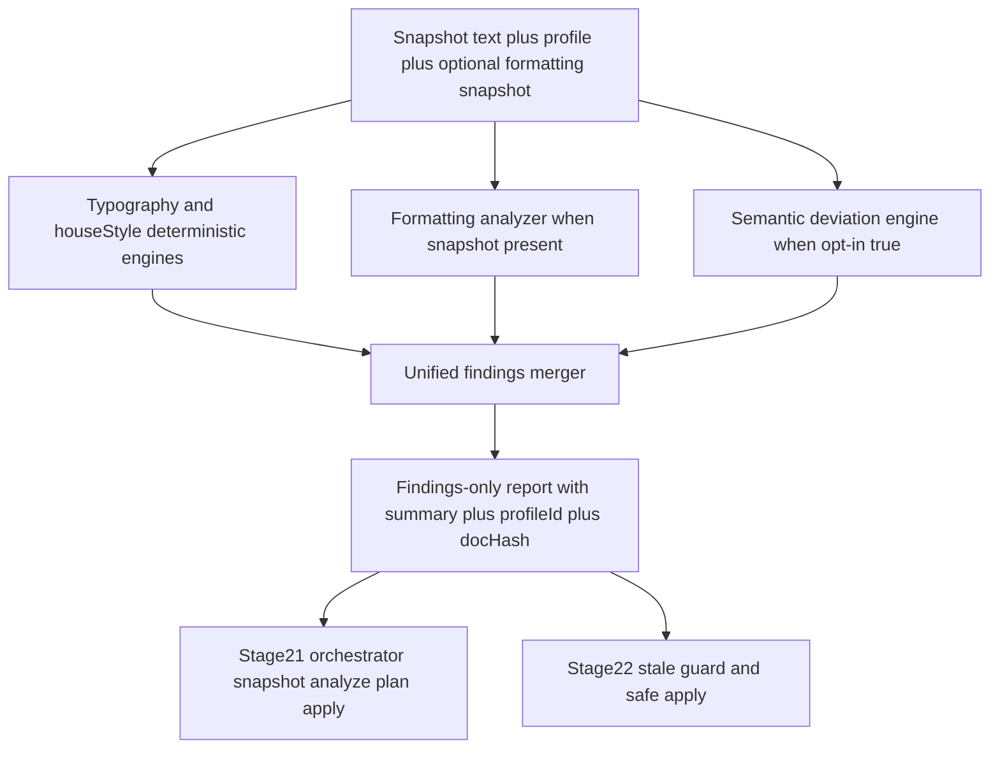

# Stage 20 — Consistency Checker — Finalized Plan

## 1. Authoritative alignment

- [`ROADMAP.md`](ROADMAP.md:45) defines Stage 20 as `feat(checker): add hybrid consistency checker` with Gate Yes, consuming the canonical [`StyleProfile`](src/core/domain/StyleProfile.ts:80) for both Reformat and Consistency Check.
- [`docs/stages/20-consistency-checker.md`](docs/stages/20-consistency-checker.md:1) scopes work to [`src/analysis/consistencyChecker.ts`](src/analysis/consistencyChecker.ts:1) plus [`tests/unit/analysis/`](tests/unit/analysis:1), verification via typecheck, test, and [`docs/project-state.md`](docs/project-state.md:1) update, status PENDING.
- [`docs/project-state.md`](docs/project-state.md:28) confirms Stages 13–19 PASS, Stage 20 PENDING, Stages 21–22 PENDING; no hard-gate blocker remains for analysis-only work.
- [`docs/architecture.md`](docs/architecture.md:45) constrains [`src/analysis/`](src/analysis/index.ts:1) to `core/domain`, `rules`, `formatting`, `ai/providers`, `shared/utils`; forbids `ui` and [`word/revisionAdapter`](src/word/revisionAdapter.ts:1). Checker performs no mutation.
- [`docs/decision-log.md`](docs/decision-log.md:157) ADRs ADR-0019 through ADR-0024 plus ADR-0006 deterministic-first, ADR-0011 retry/abort, ADR-0013 boundaries govern this stage.

## 2. Locked contract — findings-only

`checkConsistency` returns unified findings via [`unifyFindings()`](src/analysis/unifiedFindings.ts:104) together with a summary of counts by severity and kind plus `profileId` plus `docHash` with no [`ChangePlan`](src/core/domain/ChangePlan.ts:1) generation.

```ts
// Intended shape — implemented in Code mode
type ConsistencyReport = {
  findings: Finding[];
  summary: {
    total: number;
    bySeverity: { info: number; warning: number; error: number };
    byKind: { deterministic: number; formatting: number; semantic: number };
  };
  profileId: string;
  docHash: string;
};
```

- No import of [`src/changes/planner.ts`](src/changes/planner.ts:1); Stage 21 orchestrator composes checker output with planner.
- No import of [`src/word/documentReader.ts`](src/word/documentReader.ts:39) inside [`src/analysis/`](src/analysis/index.ts:1); caller supplies `text` and `docHash` computed upstream via [`hashDocument()`](src/word/documentReader.ts:21). This preserves the [`docs/architecture.md`](docs/architecture.md:45) boundary while reusing the hashing logic conceptually.
- Reuses [`findTypographyIssues()`](src/rules/typography.ts:35), house-style check from [`src/rules/houseStyle.ts`](src/rules/houseStyle.ts:1), [`findFormattingIssues()`](src/formatting/analyzer.ts:24), [`detectSemanticDeviations()`](src/analysis/deviationEngine.ts:58), [`unifyFindings()`](src/analysis/unifiedFindings.ts:104).

## 3. Prerequisites from Stages 13–19

- Stage 13 [`src/rules/typography.ts`](src/rules/typography.ts:35) pure deterministic findings with [`kind: deterministic`](src/core/domain/Finding.ts:8) and [`confidence: 1`](src/rules/typography.ts:69).
- Stage 14 [`src/rules/houseStyle.ts`](src/rules/houseStyle.ts:1) bounded terminology and [`SPELLING_VARIANT_TABLE`](src/rules/houseStyle.ts:1).
- Stage 15 [`src/formatting/analyzer.ts`](src/formatting/analyzer.ts:24) plus [`src/formatting/formattingSnapshot.ts`](src/formatting/formattingSnapshot.ts:1) DTO; live reads stay in [`src/word/formattingReader.ts`](src/word/formattingReader.ts:1).
- Stage 16 [`src/analysis/unifiedFindings.ts`](src/analysis/unifiedFindings.ts:104) merge policy: validate via [`FindingSchema`](src/core/domain/Finding.ts:27), collapse exact duplicates, preserve cross-category overlaps, longest-match-wins per category, deterministic sort.
- Stage 17 [`src/changes/planner.ts`](src/changes/planner.ts:1) is downstream-only; checker output must remain valid planner input.
- Stage 18 [`src/word/revisionAdapter.ts`](src/word/revisionAdapter.ts:1) is sole mutation path; checker must not import it per [`eslint.config.mjs`](eslint.config.mjs:132).
- Stage 19 [`src/analysis/deviationEngine.ts`](src/analysis/deviationEngine.ts:58) semantic findings with [`category: semantic-deviation`](src/analysis/deviationEngine.ts:113), full-text range, [`confidence: 0.7`](src/analysis/deviationEngine.ts:30), [`includeRawText: true`](src/analysis/deviationEngine.ts:38) gate, [`withRetry()`](src/ai/providers/retry.ts:1), [`MockAdapter`](src/ai/providers/mockAdapter.ts:1) in tests.

## 4. Inputs and behavior

Inputs to [`checkConsistency()`](src/analysis/consistencyChecker.ts:1):

- `text: string` target text; empty or whitespace-only short-circuits to empty findings with zeroed summary, no LLM call.
- `profile: StyleProfile` validated via [`StyleProfileSchema`](src/core/domain/StyleProfile.ts:80).
- `snapshot` optional [`FormattingSnapshot`](src/formatting/formattingSnapshot.ts:1); absent snapshot means deterministic plus semantic only.
- `docHash` optional caller-supplied hash; when absent compute lightweight hash inline without importing [`src/word/`](src/word/documentReader.ts:1) to keep purity.
- `includeRawText` defaults to false; when false semantic path is skipped, when true delegates to [`detectSemanticDeviations()`](src/analysis/deviationEngine.ts:58) which enforces its own gate.
- `signal: AbortSignal` passthrough; caller abort is non-retryable per ADR-0011.
- `registry: LlmSemanticProvider` injectable; tests use [`MockAdapter`](src/ai/providers/mockAdapter.ts:1) only, never live network.

## 5. Downstream compatibility for Stages 21–22

- Stage 21 [`src/reformat/orchestrator.ts`](src/reformat/orchestrator.ts:1) will call `getDocumentSnapshot` from [`src/word/documentReader.ts`](src/word/documentReader.ts:39), then [`checkConsistency()`](src/analysis/consistencyChecker.ts:1), then planner from [`src/changes/planner.ts`](src/changes/planner.ts:29), then [`applyChangePlan()`](src/word/revisionAdapter.ts:1). Findings-only keeps this composition clean.
- Stage 22 [`src/changes/staleGuard.ts`](src/changes/staleGuard.ts:1) consumes `docHash` from the report for re-hash comparison before apply.
- [`suggestedChangeId`](src/core/domain/Finding.ts:35) preserved through [`unifyFindings()`](src/analysis/unifiedFindings.ts:104) for planner traceability.



## 6. Implementation steps for Code mode

1. Create [`src/analysis/consistencyChecker.ts`](src/analysis/consistencyChecker.ts:1) with `CheckConsistencyOptions`, `ConsistencyReportSchema`, `ConsistencyReport`, `ConsistencySummary`, and async [`checkConsistency()`](src/analysis/consistencyChecker.ts:1). Honor [`tsconfig.json`](tsconfig.json:1) strict, [`exactOptionalPropertyTypes`](tsconfig.json:1), [`noUncheckedIndexedAccess`](tsconfig.json:1); no [`any`](eslint.config.mjs:40); use [`import type`](eslint.config.mjs:45).
2. Update [`src/analysis/index.ts`](src/analysis/index.ts:1) barrel to re-export checker and report types.
3. Add [`tests/unit/analysis/consistencyChecker.test.ts`](tests/unit/analysis/consistencyChecker.test.ts:1) near [`tests/unit/analysis/deviationEngine.test.ts`](tests/unit/analysis/deviationEngine.test.ts:1) and [`tests/unit/analysis/unifiedFindings.test.ts`](tests/unit/analysis/unifiedFindings.test.ts:1). Cover empty text, deterministic-only, formatting absent versus present, semantic skipped versus [`MockAdapter`](src/ai/providers/mockAdapter.ts:1) success, invalid entries skipped, opt-in refusal, abort passthrough, ordering determinism, summary counts, `profileId` and `docHash` propagation. Reuse [`tests/fixtures/sampleDocs.ts`](tests/fixtures/sampleDocs.ts:1).
4. Run [`npm run test`](package.json:22) focused on `tests/unit/analysis`, then full suite; run [`npm run lint`](package.json:25) with zero warnings; meet 80% lines, statements, functions, branches per [`vitest.config.ts`](vitest.config.ts:13).
5. Run full [`npm run verify`](package.json:30) chain: [`npm run typecheck`](package.json:29), [`npm run lint`](package.json:25), [`npm run format`](package.json:27), [`npm run test`](package.json:22), [`npm run build`](package.json:15), [`npm run validate`](package.json:20), plus [`npm run stage:verify`](package.json:31) via [`scripts/stage-verify.mjs`](scripts/stage-verify.mjs:1).
6. Update [`docs/project-state.md`](docs/project-state.md:28) to PASS, record ADR if report shape diverges, expand [`docs/stages/20-consistency-checker.md`](docs/stages/20-consistency-checker.md:1) verification checkboxes. Commit as `feat(checker): add hybrid consistency checker` per [`commitlint.config.cjs`](commitlint.config.cjs:1).

## 7. Risks and mitigations

- Vague semantic full-text ranges diluting precise deterministic offsets: rely on [`unifyFindings()`](src/analysis/unifiedFindings.ts:104) unit-aware grouping; do not invent offsets.
- Privacy leak: default `includeRawText` false, delegate gate to [`buildDeviationPrompt()`](src/ai/prompts/profilePrompts.ts:1), redact via [`src/shared/utils/logger.ts`](src/shared/utils/logger.ts:1).
- Formatting range unit mismatch character versus paragraph: preserve [`Range`](src/core/domain/Finding.ts:14) units; merger never conflates units.
- Scope creep into [`ChangePlan`](src/core/domain/ChangePlan.ts:1) or UI: explicitly out of scope; enforced by [`eslint.config.mjs`](eslint.config.mjs:132) forbidding `taskpane`, `commands`, [`word/revisionAdapter`](src/word/revisionAdapter.ts:1).

## 8. Completion criteria

- [`npm run typecheck`](package.json:29) passes.
- [`npm run lint`](package.json:25) passes with zero warnings.
- [`npm run format`](package.json:27) passes.
- [`npm run test`](package.json:22) passes including new checker tests; [`src/analysis/`](src/analysis/index.ts:1) meets 80% coverage.
- [`npm run build`](package.json:15) and [`npm run validate`](package.json:20) pass.
- [`docs/project-state.md`](docs/project-state.md:28) updated; stage gate declared PASS.
