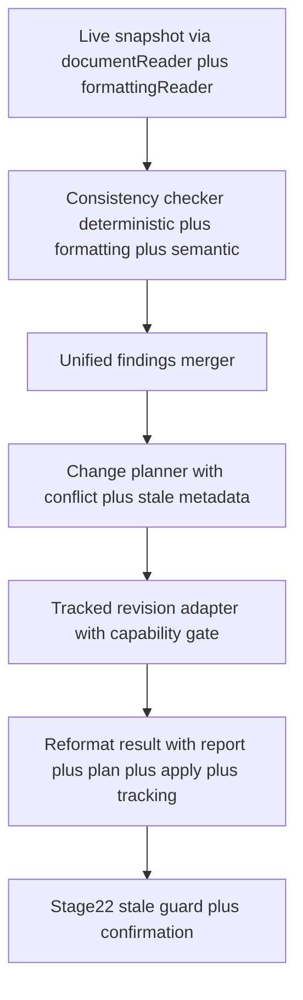

# Stage 21 — Reformat Orchestrator — Finalized Plan

> Historical execution record. The authoritative current status is in
> [`ROADMAP.md`](../../ROADMAP.md).

## 1. Authoritative alignment

- [`ROADMAP.md`](../../ROADMAP.md) is the authoritative current status and sequencing source.
- The original Stage 21 implementation remains in [`src/reformat/orchestrator.ts`](../../src/reformat/orchestrator.ts) and its integration tests; its current status is recorded in the Stage 21 row of [`ROADMAP.md`](../../ROADMAP.md).
- [`docs/architecture.md`](../architecture.md) defines the current module boundary and one mutation path.
- [decision-log.md](docs/decision-log.md) ADRs ADR-0005, ADR-0006, ADR-0011, ADR-0013, ADR-0024, ADR-0025, ADR-0026, ADR-0027, and ADR-0028 govern this stage.
- Locked user scope: full pipeline snapshot → analyze → plan → apply with tracked apply, superseding smoke scaffolding in `smokeApply.ts`.

## 2. Systematic review

### 2.1 Objectives

- Compose Stage 20 findings-only output with Stage 17 planning and Stage 18 tracked application into a single orchestrated entry point.
- Expose a taskpane-safe mutation path so `taskpane` never imports [revisionAdapter.ts](src/word/revisionAdapter.ts) directly.
- Supersede debug scaffolding in `smokeApply.ts` and `smokePlan.ts` with a production orchestrator.
- Keep findings-only contract clean for Stage 22 safe-application hardening.

### 2.2 Prerequisites — all met

- Stage 15 formatting engine PASS: [analyzer.ts](src/formatting/analyzer.ts), [formattingSnapshot.ts](src/formatting/formattingSnapshot.ts), [formattingReader.ts](src/word/formattingReader.ts).
- Stage 16 unified findings PASS: [`unifyFindings()`](src/analysis/unifiedFindings.ts).
- Stage 17 change planning PASS: [`planChanges()`](src/changes/planner.ts), [`detectConflicts()`](src/changes/conflictDetector.ts), [`markStale()`](src/changes/staleGuard.ts).
- Stage 18 revision adapter PASS WITH DOCUMENTED LIMITATION: [`applyChangePlan()`](src/word/revisionAdapter.ts), [`applyChangePlanWithTracking()`](src/word/revisionAdapter.ts), [`setStage01Passed()`](src/word/revisionAdapter.ts), [`validatePlanBeforeApply()`](src/word/revisionAdapter.ts).
- Stage 19 semantic deviation PASS: `detectSemanticDeviations()`.
- Stage 20 consistency checker PASS: `checkConsistency()`, `ConsistencyReportSchema`.
- Stage 01 hard gate partially closed: Desktop Word live smoke recorded in [manual-verification.md](docs/manual-verification.md); web plus Mac pending, deferred to Stage 27.

### 2.3 Required inputs

- `profile: StyleProfile` validated via [`StyleProfileSchema`](src/core/domain/StyleProfile.ts).
- Live text via [`getDocumentSnapshot()`](src/word/documentReader.ts) returning [DocumentSnapshot](src/word/documentReader.ts) with `text`, `id`, `hash` via [`hashDocument()`](src/word/documentReader.ts).
- Optional formatting via [`getFormattingSnapshot()`](src/word/formattingReader.ts) returning [FormattingSnapshot](src/formatting/formattingSnapshot.ts).
- `includeRawText: boolean` explicit opt-in, default false, enforced by [`buildDeviationPrompt()`](src/ai/prompts/profilePrompts.ts).
- `signal: AbortSignal` passthrough; caller abort non-retryable per ADR-0011.
- `registry: LlmSemanticProvider` injectable; tests use [`MockAdapter`](src/ai/providers/mockAdapter.ts) only.
- `currentDocHash: string` for stale refusal in [`applyChangePlan()`](src/word/revisionAdapter.ts).

### 2.4 Key activities

- Create [orchestrator.ts](src/reformat/orchestrator.ts) with `ReformatOptions`, `ReformatResult`, [`reformatDocument()`](src/reformat/orchestrator.ts).
- Create [index.ts](src/reformat/index.ts) barrel re-export.
- Add `src/reformat` ESLint scope in [eslint.config.mjs](eslint.config.mjs) mirroring [analysis](src/analysis/index.ts) plus `word/revisionAdapter` allowance.
- Add integration tests under [tests/integration/reformatOrchestrator.test.ts](tests/integration/reformatOrchestrator.test.ts) mirroring source behavior.
- Wire tracked apply via [`applyChangePlanWithTracking()`](src/word/revisionAdapter.ts); surface `tracking.managed`, `modeBefore`, `modeAfter`, `recordedCount`.
- Mark `smokeApply.ts` deprecated while retaining the historical Stage 18 live-smoke harness; Dashboard redirection remains out of scope for Stage 21.
- Update [project-state.md](docs/project-state.md), [21-reformat-orchestrator.md](docs/stages/21-reformat-orchestrator.md), and [decision-log.md](docs/decision-log.md).

### 2.5 Essential skills and resources

- Primary: `toneforge-scaffold` — stage ordering, gates, module placement in [architecture.md](docs/architecture.md), verification via [stage-verify.mjs](scripts/stage-verify.mjs).
- Supporting `toneforge-officejs` — [`runInWord()`](src/shared/office/officeHelpers.ts), [`isOfficeReady()`](src/shared/office/officeHelpers.ts), DTO boundary, capability-gated mutation.
- Supporting `toneforge-llm` — [`LlmRegistry`](src/ai/providers/registry.ts), [`withRetry()`](src/ai/providers/retry.ts), [`MockAdapter`](src/ai/providers/mockAdapter.ts), `includeRawText` gate.
- Supporting `toneforge-testing` — Vitest plus jsdom per [vitest.config.ts](vitest.config.ts), Office mock in [setup.ts](tests/setup.ts), fixtures in [sampleDocs.ts](tests/fixtures/sampleDocs.ts).
- Resources: [package.json](package.json) `verify` chain, [validate-manifest.mjs](scripts/validate-manifest.mjs), [commitlint.config.cjs](commitlint.config.cjs).

### 2.6 Dependencies

- Upstream: [documentReader.ts](src/word/documentReader.ts) → consistencyChecker.ts → [planner.ts](src/changes/planner.ts) → [revisionAdapter.ts](src/word/revisionAdapter.ts).
- Downstream: Stage 22 [staleGuard.ts](src/changes/staleGuard.ts) will harden re-hash before apply; orchestrator must expose `docHash` and `stale` without preempting Stage 22 UI confirmation.
- Boundary: `src/reformat` may import `core/domain`, `analysis`, `changes`, `word/documentReader`, `word/formattingReader`, `word/revisionAdapter`, `ai/providers`, `shared/utils`; must never import `taskpane` or `commands`; `taskpane` must never import `revisionAdapter` directly.

### 2.7 Risks

- Stale apply corrupting edited document if hash not re-checked.
- Privacy leak if raw text sent without opt-in.
- Host gaps: `supportsInsertBreak` false plus `supportsStyles` false on Desktop per [project-state.md](docs/project-state.md); per-kind refusal must surface cleanly.
- Vague semantic full-text ranges diluting precise deterministic offsets.
- Scope creep into Stage 22 confirmation UX or Stage 23 taskpane wiring.
- Test-double infidelity masking live `Word.run` versus `Office.run` differences in [officeHelpers.ts](src/shared/office/officeHelpers.ts).

### 2.8 Completion criteria

- [`typecheck`](package.json) passes.
- [`lint`](package.json) passes with zero warnings including new `reformat` scope.
- [`format`](package.json) passes.
- [`test`](package.json) passes including new orchestrator tests; `src/reformat` meets 80% lines, statements, functions, branches per [vitest.config.ts](vitest.config.ts).
- [`build`](package.json) succeeds.
- [`validate`](package.json) passes.
- [`stage:verify`](package.json) passes via [stage-verify.mjs](scripts/stage-verify.mjs).
- [project-state.md](docs/project-state.md) updated; gate declared PASS or PASS WITH DOCUMENTED LIMITATION.

## 3. Detailed implementation plan — Code-mode execution sequence

### Step 1 — Snapshot layer composition

- Call [`getDocumentSnapshot()`](src/word/documentReader.ts) for `text`, `id`, `hash`.
- Call [`getFormattingSnapshot()`](src/word/formattingReader.ts) optionally; on `id: unavailable` proceed text-only.
- Short-circuit empty text to empty ConsistencyReport plus empty [ChangePlan](src/core/domain/ChangePlan.ts); no LLM call.
- Responsibility: Code mode; capability: `toneforge-officejs`.

### Step 2 — Analyze via checker

- Delegate to `checkConsistency()` with `text`, `profile`, `snapshot`, `docHash`, `includeRawText`, `signal`, `registry`.
- Preserve `profileId` plus `docHash` plus `summary` for report traceability.
- Log and skip transient provider failures; rethrow caller abort.
- Responsibility: Code mode; capability: `toneforge-llm` plus `toneforge-testing` with [`MockAdapter`](src/ai/providers/mockAdapter.ts).

### Step 3 — Plan via planner

- Call [`planChanges()`](src/changes/planner.ts) with `findings`, `docHash`, `baseDocId`, and the caller-observed `currentDocHash` when available.
- Preserve `conflicts` plus `findings` plus `suggestedChangeId` for review.
- Populate `plan.stale` before adapter validation; do not resolve conflicts automatically; leave Stage 22 confirmation to the next stage.
- Responsibility: Code mode.

### Step 4 — Apply via tracked adapter

- Call [`applyChangePlanWithTracking()`](src/word/revisionAdapter.ts) with `plan` plus fresh `currentDocHash`; preview mode returns before this call.
- Honor `STAGE_01_PASSED` gate via [`setStage01Passed()`](src/word/revisionAdapter.ts); surface gate refusal as typed result, never throw for UI.
- Return `results` plus `tracking` plus `report` plus `plan`, `snapshot`, `stale`, and `applied` in `ReformatResult`.
- Responsibility: Code mode; capability: `toneforge-officejs`.

### Step 5 — Module scaffolding and boundaries

- Create `src/reformat/orchestrator.ts` plus `src/reformat/index.ts`.
- Extend [eslint.config.mjs](eslint.config.mjs) with `src/reformat` scope.
- Update [architecture.md](docs/architecture.md) module table if new imports introduced; record ADR in [decision-log.md](docs/decision-log.md).
- Remove or deprecate `smokeApply.ts` re-export path; keep file for history but mark superseded.
- Responsibility: Code mode; capability: `toneforge-scaffold`.

### Step 6 — Tests

- Add `tests/integration/reformatOrchestrator.test.ts` covering snapshot→analyze→plan→apply with Office mock plus [`MockAdapter`](src/ai/providers/mockAdapter.ts): deterministic tracked apply, preview/no-mutation, no-change, stale planner metadata, semantic skipped versus success, empty text, abort, hash mismatch refusal, gate refusal, provided formatting snapshot reuse, `Word.run` preference, and tracking fallback `managed: false`.
- Reuse [sampleDocs.ts](tests/fixtures/sampleDocs.ts); never hit live network.
- Run focused tests then full [`test`](package.json); enforce 80% coverage.
- Responsibility: Code mode; capability: `toneforge-testing`.

### Step 7 — Verification and docs

- Run full [`verify`](package.json) chain: [`typecheck`](package.json), [`lint`](package.json), [`format`](package.json), [`test`](package.json), [`build`](package.json), [`validate`](package.json), plus [`stage:verify`](package.json).
- Update [project-state.md](docs/project-state.md) to PASS; expand [21-reformat-orchestrator.md](docs/stages/21-reformat-orchestrator.md) verification checkboxes.
- Commit as `feat(reformat): add hybrid document reformatter` per [commitlint.config.cjs](commitlint.config.cjs).
- Responsibility: Code mode.

## 4. Data flow

```mermaid
flowchart TD
  A[Live snapshot via documentReader plus formattingReader]
  B[Consistency checker deterministic plus formatting plus semantic]
  C[Unified findings merger]
  D[Change planner with conflict plus stale metadata]
  E[Tracked revision adapter with capability gate]
  F[Reformat result with report plus plan plus apply plus tracking]
  G[Stage22 stale guard plus confirmation]
  A --> B
  B --> C
  C --> D
  D --> E
  E --> F
  F --> G
```

## 5. Risk mitigations

- Stale: require `currentDocHash` at apply entry; refuse on mismatch with per-change `applied: false`; expose `stale` flag from [`markStale()`](src/changes/staleGuard.ts).
- Privacy: default `includeRawText` false; delegate gate to [`buildDeviationPrompt()`](src/ai/prompts/profilePrompts.ts); redact via [logger.ts](src/shared/utils/logger.ts).
- Host gaps: rely on [`validatePlanBeforeApply()`](src/word/revisionAdapter.ts) per-kind checks; surface `unavailable in this host` without crashing.
- Semantic vagueness: keep full-text range; rely on [`unifyFindings()`](src/analysis/unifiedFindings.ts) unit-aware grouping; never invent offsets.
- Scope: explicitly defer UI confirmation plus re-hash UX to Stage 22 [22-safe-application.md](docs/stages/22-safe-application.md).
- Mock fidelity: assert [`runInWord()`](src/shared/office/officeHelpers.ts) prefers `Word.run`; cover `Office.run` fallback only for test doubles.

## 6. Measurable milestones and success criteria

- M1 Snapshot wired: [`getDocumentSnapshot()`](src/word/documentReader.ts) plus [`getFormattingSnapshot()`](src/word/formattingReader.ts) return DTOs; empty text short-circuits.
- M2 Analyze plus plan composed: `checkConsistency()` output feeds [`planChanges()`](src/changes/planner.ts); `profileId` plus `docHash` preserved end to end.
- M3 Tracked apply wired: [`applyChangePlanWithTracking()`](src/word/revisionAdapter.ts) returns `managed` plus counts; gate refusal tested.
- M4 Smoke superseded: production path is [reformatDocument()](src/reformat/orchestrator.ts); legacy `smokeApply.ts` helpers are deprecated and retained only for the Stage 18 live-smoke harness; Dashboard redirection is deferred by explicit scope.
- M5 Verify green: full [`verify`](package.json) plus [`stage:verify`](package.json) pass; [project-state.md](docs/project-state.md) updated; stage gate PASS.

## 7. Governance notes

- No time estimates provided per project governance; sequence above defines optimal order.
- Follow stage protocol in [ROADMAP.md](ROADMAP.md): read stage file, load only relevant skills, inspect before modifying, implement only stage scope, run targeted tests, run stage verification, update state, record ADRs, declare status, commit only after gate passes.
- Next stage: Stage 22 safe application per [22-safe-application.md](docs/stages/22-safe-application.md) will consume `docHash` for re-hash protection.

## 8. Implementation result

- The original Stage 21 pipeline remains implemented in [`src/reformat/orchestrator.ts`](../../src/reformat/orchestrator.ts), with preview, empty-text short-circuit, formatting snapshot reuse, tracked apply, and safe refusal behavior.
- The current full test run passes 68 files / 672 tests. Coverage passes the exercised-core 80% gate as recorded in [`ROADMAP.md`](../../ROADMAP.md).
- The current status and release consequences are canonical in [`ROADMAP.md`](../../ROADMAP.md).
