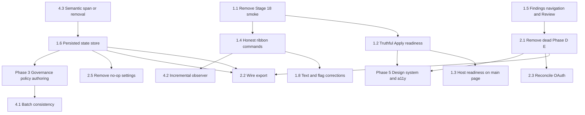

# ToneForge — Capability, UX, and Runtime Audit + Prioritized Implementation Plan

Status: proposed plan, awaiting approval
Author: Architect mode
Scope: every user-facing and underlying capability in the add-in, traced from UI
control through state, business logic, integration, persistence, error handling,
and observable result; followed by a phased implementation plan.

This document is evidence-first. Every claim cites a file (and line where the
detail is load-bearing). Where the code and the documentation disagree, the code
is treated as the source of truth and the disagreement is called out.

---

## Part 1 — Capability inventory and classification

Legend:

- **F** Functional — production-reachable, wired end to end.
- **P** Partial — reachable, but incomplete, misleading, or degraded.
- **M** Mock-only — code path exists and is tested, but only ever runs against
  `MockAdapter` or an injected `fetch` double; never proven against a live
  provider.
- **X** Inaccessible — implemented, unit-tested, but no production caller.
- **U** Unsafe/untruthful — reachable and would report a state the runtime does
  not support.
- **N** Not implemented.

### 1.1 Document reading and analysis

| Capability                                                                                                     | Class | Evidence                                                                                                                                                                                                                                                                                                                                                                                                                                                                                                                                     |
| -------------------------------------------------------------------------------------------------------------- | ----- | -------------------------------------------------------------------------------------------------------------------------------------------------------------------------------------------------------------------------------------------------------------------------------------------------------------------------------------------------------------------------------------------------------------------------------------------------------------------------------------------------------------------------------------------- |
| Structured snapshot acquisition (body, headings, styles, formatting)                                           | F     | [`analysisAcquisition.ts`](src/word/analysisAcquisition.ts), [`documentReader.ts`](src/word/documentReader.ts)                                                                                                                                                                                                                                                                                                                                                                                                                               |
| Capability-gated acquisition with text-only retry                                                              | F     | [`analysisAcquisition.ts`](src/word/analysisAcquisition.ts), ADR-0056                                                                                                                                                                                                                                                                                                                                                                                                                                                                        |
| Deterministic typography rules (em/en dash, quotes, apostrophes, decimal/thousands, ellipsis)                  | F     | [`rules/typography.ts`](src/rules/typography.ts)                                                                                                                                                                                                                                                                                                                                                                                                                                                                                             |
| Deterministic house-style rules (terminology, banned terms, sentence case, title-case words, spelling variant) | F     | [`rules/houseStyle.ts`](src/rules/houseStyle.ts)                                                                                                                                                                                                                                                                                                                                                                                                                                                                                             |
| Formatting analyzer (styles/paragraph/character/list)                                                          | F     | [`formatting/analyzer.ts`](src/formatting/analyzer.ts)                                                                                                                                                                                                                                                                                                                                                                                                                                                                                       |
| Hybrid consistency checker, findings-only                                                                      | F     | [`analysis/consistencyChecker.ts`](src/analysis/consistencyChecker.ts)                                                                                                                                                                                                                                                                                                                                                                                                                                                                       |
| Coverage report (`complete`, `unsupported`, `unprocessed`, `excluded`)                                         | F     | [`analysis/coverage.ts`](src/analysis/coverage.ts), [`CoverageBanner.tsx`](src/taskpane/components/CoverageBanner.tsx)                                                                                                                                                                                                                                                                                                                                                                                                                       |
| Node protection (quoted text, captions, tracked deletions, comments, text boxes, shapes)                       | F     | [`rules/protection.ts`](src/rules/protection.ts)                                                                                                                                                                                                                                                                                                                                                                                                                                                                                             |
| Resolved policy (`learned` vs `normative` merge)                                                               | F     | [`core/domain/ResolvedPolicy.ts`](src/core/domain/ResolvedPolicy.ts)                                                                                                                                                                                                                                                                                                                                                                                                                                                                         |
| Semantic deviation engine                                                                                      | M     | [`analysis/deviationEngine.ts`](src/analysis/deviationEngine.ts). Every finding is `source: "ai"`, `actionable: false`, `status: "deferred"`, `nodeIds: []` (lines 111-127) and is never planned into a change. It runs only when `includeRawText` is true, which the observer never sets ([`documentObserver.ts`](src/word/documentObserver.ts)) and ReformatPanel sets only from `semanticOptIn` with no registry passed ([`ReformatPanel.tsx`](src/taskpane/components/ReformatPanel.tsx), line 74 passes `registry` only when injected). |
| Document observer (debounced conservative full rescan)                                                         | P     | [`word/documentObserver.ts`](src/word/documentObserver.ts). Advertised as "incremental"; every scan examines all acquired nodes (lines 144-154). No changed-range event reaches it.                                                                                                                                                                                                                                                                                                                                                          |
| Word paragraph change events                                                                                   | P     | [`word/wordParagraphEvents.ts`](src/word/wordParagraphEvents.ts). Adapter exists; [`Dashboard.tsx`](src/taskpane/pages/Dashboard.tsx) wires it, but the handler at line 237 discards the change payload and calls `onDocumentChanged()` — a full rescan.                                                                                                                                                                                                                                                                                     |
| Source locator ("Go to text")                                                                                  | F     | [`word/sourceLocator.ts`](src/word/sourceLocator.ts), [`FindingCard.tsx`](src/taskpane/components/FindingCard.tsx)                                                                                                                                                                                                                                                                                                                                                                                                                           |
| Document hashing / stale detection                                                                             | F     | [`reformat/orchestrator.ts`](src/reformat/orchestrator.ts), [`changes/staleGuard.ts`](src/changes/staleGuard.ts)                                                                                                                                                                                                                                                                                                                                                                                                                             |

### 1.2 Change planning and Word mutation

| Capability                                                    | Class | Evidence                                                                                                                                                                                                          |
| ------------------------------------------------------------- | ----- | ----------------------------------------------------------------------------------------------------------------------------------------------------------------------------------------------------------------- |
| Change planner with preconditions, approval policy, conflicts | F     | [`changes/planner.ts`](src/changes/planner.ts), [`changes/conflictDetector.ts`](src/changes/conflictDetector.ts), [`changes/preconditions.ts`](src/changes/preconditions.ts)                                      |
| Tracked revision adapter (sole mutation path)                 | F     | [`word/revisionAdapter.ts`](src/word/revisionAdapter.ts) — refuses when `STAGE_01_PASSED` is false                                                                                                                |
| Per-Apply host preparation                                    | F     | [`reformat/trackedEditing.ts`](src/reformat/trackedEditing.ts)                                                                                                                                                    |
| Apply + post-apply readback verification                      | F     | [`reformat/orchestrator.ts`](src/reformat/orchestrator.ts), readback at line 480                                                                                                                                  |
| Non-destructive capability probe                              | F     | [`word/capabilityProbe.ts`](src/word/capabilityProbe.ts)                                                                                                                                                          |
| Live text insert/replace + tracking                           | M     | Recorded in [`manual-verification.md`](docs/manual-verification.md); break/style/list/format paths remain mock-verified only                                                                                      |
| Revisions CSV / audit JSON export                             | **X** | [`changes/exportAdapter.ts`](src/changes/exportAdapter.ts). Imported only by `tests/unit/ai/review/reviewPipeline.test.ts`. No UI surface, no ribbon command, no production import.                               |
| Stage 18 smoke panel + smoke apply                            | **X** | `taskpane/components/SmokePanel.tsx`, `word/smokeApply.ts`, `taskpane/components/smokePlan.ts`. `enableSmokeMutations()` can force-arm the Stage 01 gate, which is a live-mutation escape hatch from a component. |

### 1.3 AI review

| Capability                                                  | Class               | Evidence                                                                                                                                                                                                                                                         |
| ----------------------------------------------------------- | ------------------- | ---------------------------------------------------------------------------------------------------------------------------------------------------------------------------------------------------------------------------------------------------------------- |
| Cross-report consistency engine (C1-C10) with own consent   | F (repo) / M (live) | [`analysis/consistency/engine.ts`](src/analysis/consistency/engine.ts), [`AiReviewSection.tsx`](src/taskpane/components/AiReviewSection.tsx), [`Dashboard.tsx`](src/taskpane/pages/Dashboard.tsx). Never run against a real document or model.                   |
| Consistency preflight disclosure + progress + cancel        | F                   | [`ConsistencyReviewPreflight.tsx`](src/taskpane/components/ConsistencyReviewPreflight.tsx), [`ConsistencyReviewProgress.tsx`](src/taskpane/components/ConsistencyReviewProgress.tsx)                                                                             |
| Consistency findings bridged into the ordinary finding list | F                   | [`analysis/consistency/bridge.ts`](src/analysis/consistency/bridge.ts), [`Dashboard.tsx`](src/taskpane/pages/Dashboard.tsx)                                                                                                                                      |
| Full-document editorial review pipeline                     | **X**               | `ai/review/documentEditorialReview.ts`. Reachable only through [`reformat/index.ts`](src/reformat/index.ts) → `reviewEntireDocument`, which has no UI caller. [`Dashboard.tsx`](src/taskpane/pages/Dashboard.tsx) passes `null` for the full and spot arguments. |
| Spot / selection review                                     | **X**               | `ai/review/spotReview.ts`. Same dead path. ADR-0055 removed the entry points by design but left the engine exported.                                                                                                                                             |
| FullReview preflight/progress/results components            | **X**               | `FullReviewPreflight.tsx`, `FullReviewProgress.tsx`, `FullReviewResults.tsx` — test-only.                                                                                                                                                                        |
| `AiReviewEntry`, `AiReviewResult`, `AiUnavailable`          | **X**               | `AiReviewEntry.tsx`, `AiReviewResult.tsx`, `AiUnavailable.tsx` — test-only.                                                                                                                                                                                      |
| `ConsistencyReviewEntry`                                    | **X**               | `ConsistencyReviewEntry.tsx` — superseded by the in-section stage ladder in `AiReviewSection`.                                                                                                                                                                   |
| Rewrite prompt builder                                      | **X**               | `ai/prompts/rewritePrompts.ts` — exported from [`ai/prompts/index.ts`](src/ai/prompts/index.ts), never called.                                                                                                                                                   |
| `navigationController`                                      | **X**               | `taskpane/workflow/navigationController.ts` — test-only.                                                                                                                                                                                                         |
| `useAnnouncement`                                           | **X**               | [`taskpane/settings/useAnnouncement.ts`](src/taskpane/settings/useAnnouncement.ts) — reduced-noise announcer written for Phase 3, never adopted; every live region in the app is a raw inline `role="status"`.                                                   |

### 1.4 Providers and configuration

| Capability                                                         | Class | Evidence                                                                                                                                                                                                                                                  |
| ------------------------------------------------------------------ | ----- | --------------------------------------------------------------------------------------------------------------------------------------------------------------------------------------------------------------------------------------------------------- |
| Provider registry with fail-closed fallback to mock                | F     | [`ai/providers/registry.ts`](src/ai/providers/registry.ts)                                                                                                                                                                                                |
| OpenRouter API key → gateway, never persisted                      | F     | [`OpenRouterConnectionSettings.tsx`](src/taskpane/components/OpenRouterConnectionSettings.tsx)                                                                                                                                                            |
| Model catalog fetch with connection binding and stale/empty states | F     | [`ModelPicker.tsx`](src/taskpane/components/ModelPicker.tsx), [`ai/gateway/modelCatalog.ts`](src/ai/gateway/modelCatalog.ts)                                                                                                                              |
| Loopback-only broker URL validation                                | F     | [`settingsModel.ts`](src/taskpane/settings/settingsModel.ts)                                                                                                                                                                                              |
| Legacy credential purge on migration                               | F     | [`core/state/migration.ts`](src/core/state/migration.ts), [`persistence.ts`](src/core/state/persistence.ts)                                                                                                                                               |
| OAuth state machine (Anthropic supported, OpenAI feature-gated)    | **X** | [`ai/gateway/oauthState.ts`](src/ai/gateway/oauthState.ts). `resolveAuthMode("anthropic") === "oauth"`, but no UI ever calls it; the Provider dropdown offers Anthropic with a "deployment-managed" note instead. The two surfaces contradict each other. |
| OpenAI / Anthropic live requests                                   | M     | Adapters exist ([`openaiAdapter.ts`](src/ai/providers/openaiAdapter.ts), [`anthropicAdapter.ts`](src/ai/providers/anthropicAdapter.ts)); only exercised via `MockAdapter` and injected `fetch`.                                                           |

### 1.5 Profiles, state, settings

| Capability                                                                            | Class             | Evidence                                                                                                                                                                                                                                                                                                                                                                                                                   |
| ------------------------------------------------------------------------------------- | ----------------- | -------------------------------------------------------------------------------------------------------------------------------------------------------------------------------------------------------------------------------------------------------------------------------------------------------------------------------------------------------------------------------------------------------------------------- |
| Profile record: draft + published versions + revision trail + recall                  | F                 | [`core/domain/ProfileRecord.ts`](src/core/domain/ProfileRecord.ts), [`ProfileRecordSection.tsx`](src/taskpane/components/ProfileRecordSection.tsx)                                                                                                                                                                                                                                                                         |
| Learn Style from selection/document with quality gate and optional AI                 | F                 | [`style/learnStyle.ts`](src/style/learnStyle.ts), [`Profile.tsx`](src/taskpane/pages/Profile.tsx)                                                                                                                                                                                                                                                                                                                          |
| Profile editor with per-field validation and version diff                             | F                 | [`ProfileEditor.tsx`](src/taskpane/components/ProfileEditor.tsx), [`VersionDiff.tsx`](src/taskpane/components/VersionDiff.tsx)                                                                                                                                                                                                                                                                                             |
| Governance profile persistence + history                                              | F                 | [`persistence.ts`](src/core/state/persistence.ts)                                                                                                                                                                                                                                                                                                                                                                          |
| **Governance policy editing**                                                         | **N**             | `GovernanceProfile` carries `rules`, `terminology`, `scope`, `protection`, `editorial` ([`GovernanceProfile.ts`](src/core/domain/GovernanceProfile.ts)) but `saveProfileRecord` only ever overwrites `style` ([`persistence.ts`](src/core/state/persistence.ts)). No UI can author a `GovernanceRule`, set a protection override, or set scope. The whole normative half of `resolveResolvedPolicy` is authored by nobody. |
| `activeGovernanceProfileId`                                                           | **X**             | Persisted ([`persistence.ts`](src/core/state/persistence.ts)) and read as a fallback ([`Dashboard.tsx`](src/taskpane/pages/Dashboard.tsx), [`ReformatPanel.tsx`](src/taskpane/components/ReformatPanel.tsx)) but **never written** anywhere outside v0-v2 migration ([`migration.ts`](src/core/state/migration.ts)). Always `null` at runtime.                                                                             |
| State v9 + migration from v0-v8, legacy key purge                                     | F                 | [`core/state/migration.ts`](src/core/state/migration.ts), [`persistence.ts`](src/core/state/persistence.ts)                                                                                                                                                                                                                                                                                                                |
| Settings section isolation (Styling / Provider+privacy / Tracked editing / Telemetry) | F                 | [`SettingsForm.tsx`](src/taskpane/components/SettingsForm.tsx)                                                                                                                                                                                                                                                                                                                                                             |
| Theme preference persistence                                                          | F                 | [`theme.tsx`](src/taskpane/theme.tsx)                                                                                                                                                                                                                                                                                                                                                                                      |
| `spotReviewConsent` / `fullDocumentReviewConsent`                                     | **U**             | Persisted ([`persistence.ts`](src/core/state/persistence.ts)) and carried in the LLM draft ([`settingsModel.ts`](src/taskpane/settings/settingsModel.ts)) but **no UI control exists** and no engine reads them. Only `consistencyReviewConsent` is exposed ([`ProviderPrivacySettingsSection.tsx`](src/taskpane/components/ProviderPrivacySettingsSection.tsx)).                                                          |
| `telemetryDisabled`                                                                   | **U**             | Fully wired UI (`TelemetrySettingsSection.tsx`) that controls nothing. The MessageBar at line 47 admits no endpoint is configured.                                                                                                                                                                                                                                                                                         |
| `semanticOptIn`                                                                       | **U**             | Wired to a toggle ([`ProviderPrivacySettingsSection.tsx`](src/taskpane/components/ProviderPrivacySettingsSection.tsx)) and read by ReformatPanel line 53 — but with no registry the semantic engine falls back to `MockAdapter` ([`deviationEngine.ts`](src/analysis/deviationEngine.ts)). Enabling it can only produce mock output.                                                                                       |
| `clearPersistedCredentials` button                                                    | F but mislabelled | [`ProviderPrivacySettingsSection.tsx`](src/taskpane/components/ProviderPrivacySettingsSection.tsx) labelled "Clear legacy stored credential"; it actually resets the provider to `mock` and empties all connections ([`persistence.ts`](src/core/state/persistence.ts)).                                                                                                                                                   |

### 1.6 Navigation and commands

| Capability                                                     | Class | Evidence                                                                                                                                                                                                                                                                         |
| -------------------------------------------------------------- | ----- | -------------------------------------------------------------------------------------------------------------------------------------------------------------------------------------------------------------------------------------------------------------------------------- |
| Fluent hamburger drawer with focus trap, Escape, focus restore | F     | [`TaskPaneHeader.tsx`](src/taskpane/components/TaskPaneHeader.tsx)                                                                                                                                                                                                               |
| Ribbon → task-pane navigation bridge                           | F     | [`taskpaneNavigation.ts`](src/shared/office/taskpaneNavigation.ts), consumed once at [`Dashboard.tsx`](src/taskpane/pages/Dashboard.tsx)                                                                                                                                         |
| Typed command registry + manifest parity                       | F     | [`commandRegistry.ts`](src/commands/commandRegistry.ts), [`commandDefinitions.json`](src/commands/commandDefinitions.json)                                                                                                                                                       |
| **Ribbon "Scan Now"**                                          | **U** | [`commandHandlers.ts`](src/commands/commandHandlers.ts) only calls `showTaskpane("governance")`. It never triggers a scan. Same for `openFindings`, `openPendingChanges`. A user clicking "Scan Now" gets a pane, not a scan.                                                    |
| Ribbon "Review Selection"                                      | **U** | [`commandHandlers.ts`](src/commands/commandHandlers.ts) routes to `ai-review` — the whole-document consistency review, which explicitly ignores the selection. The label and supertip in [`manifest.json`](manifest.json) promise a selection spot review that no longer exists. |
| Ribbon "Active Profile" and "Edit Profile"                     | **U** | Both go to the same `profile` page ([`commandDefinitions.json`](src/commands/commandDefinitions.json) and `:43`). Two ribbon buttons, one destination, indistinguishable result.                                                                                                 |
| XML fallback parity                                            | P     | All XML actions use `ShowTaskpane` with `xmlNavigationTarget: "default"` ([`commandRegistry.ts`](src/commands/commandRegistry.ts)), so the XML path can never reach a specific pane section. Documented as intentional, but it means the two sideload paths are not equivalent.  |

---

## Part 2 — UI vs runtime mismatches

These are the specific places where the interface implies a capability the runtime
does not deliver.

1. **Apply looks available and is not.** [`PendingChanges.tsx`](src/taskpane/components/PendingChanges.tsx) computes `canApply` from plan-level gates only. The host-readiness prop `applyDisabledReason` exists (line 16) but **is never passed** by [`Dashboard.tsx`](src/taskpane/pages/Dashboard.tsx). Tracked editing, revision support, and per-change capability are discovered only after the click, as a failure message in `
` (line 630).

2. **Tracked editing is armed by default, silently.** [`trackedEditing.ts`](src/reformat/trackedEditing.ts) reads `localStorage.getItem(KEY) !== "false"`, so an absent key means **enabled**. But [`revisionAdapter.ts`](src/word/revisionAdapter.ts) starts `STAGE_01_PASSED = false`, and only [`prepareTrackedEditing`](src/reformat/trackedEditing.ts) arms it — which runs _during_ Apply, not before. The Settings toggle therefore shows "Enabled" before any probe has ever run, and the first Apply is where the user learns whether their host supports revisions.

3. **"Findings are stale" appears for a condition that is not staleness.** [`documentObserver.ts`](src/word/documentObserver.ts) sets `stale: true` on an Office-unavailable error. The banner ([`StaleBanner.tsx`](src/taskpane/components/StaleBanner.tsx)) then says "The document has changed since the last scan", which is false — the host went away.

4. **Semantic findings are unreachable in practice.** The observer hard-codes `includeRawText: false` ([`documentObserver.ts`](src/word/documentObserver.ts)). Only Reformat preview can set it true, and it never passes a registry ([`ReformatPanel.tsx`](src/taskpane/components/ReformatPanel.tsx)). So the `semanticOptIn` toggle governs a code path that can only ever hit the offline mock.

5. **"Allow semantic analysis" and "AI Review consent" look like one permission family but produce very different risk.** [`ProviderPrivacySettingsSection.tsx`](src/taskpane/components/ProviderPrivacySettingsSection.tsx) separates them correctly in copy, but the semantic toggle's real effect (mock output) is nowhere stated.

6. **Ribbon implies five actions; runtime provides one.** Scan Now, Findings, Pending Changes open views; Review Selection/Review Document both open the same whole-document review; Active Profile and Edit Profile open the same page. Only the drawer navigation is honest.

7. **`Review` on a finding card changes nothing durable.** [`Dashboard.tsx`](src/taskpane/pages/Dashboard.tsx) mutates a local `status` copy; the next observer emission overwrites it. The `reviewed` status never reaches persistence and never affects a count in [`GovernanceDashboard.tsx`](src/taskpane/components/GovernanceDashboard.tsx), which counts `reviewed` as open.

8. **Findings "Next / Previous" navigation updates a counter but not the view.** [`FindingsToolbar.tsx`](src/taskpane/components/FindingsToolbar.tsx) dispatches `plan/selectFinding`, but [`FindingsList.tsx`](src/taskpane/components/FindingsList.tsx) never receives `selectedFindingIndex` and renders no selection state. "Finding 4 of 12" is announced; nothing is highlighted or scrolled to.

9. **The first-run profile gate hides the whole app.** [`Dashboard.tsx`](src/taskpane/pages/Dashboard.tsx) returns a bare `<main>` with no header, no Settings, no Troubleshooting, no AI Review. A user who needs to grant consent or change the theme before creating a profile cannot.

10. **Telemetry is a full settings section for a no-op.** `TelemetrySettingsSection.tsx`.

11. **Design-system drift.** Fluent components (`Dropdown`, `Toggle`, `MessageBar`, `PrimaryButton`) sit beside raw `<button>` elements and large inline-style blocks that hardcode Fluent palette hexes: [`PendingChanges.tsx`](src/taskpane/components/PendingChanges.tsx) `#a4262c`, [`StaleBanner.tsx`](src/taskpane/components/StaleBanner.tsx) `#c00`/`#fff5f5`, [`ReformatPanel.tsx`](src/taskpane/components/ReformatPanel.tsx), [`CoverageBanner.tsx`](src/taskpane/components/CoverageBanner.tsx). These bypass the `--tf-*` tokens in [`taskpane.css`](src/taskpane/taskpane.css) and therefore do not respond to dark theme.

12. **`loadState()` is called during render in three places**, so settings changed in one pane section are not observed by another until navigation: [`Dashboard.tsx`](src/taskpane/pages/Dashboard.tsx) and `:638`, [`ReformatPanel.tsx`](src/taskpane/components/ReformatPanel.tsx). There is no store subscription anywhere in the app.

13. **Documentation contradicts the code in three places.** [`docs/ux-state-matrix.md`](docs/ux-state-matrix.md) still describes context-menu and paragraph-resolution entry states; [`README.md`](README.md) says "no Phase H engine is implemented" while [`project-state.md`](docs/project-state.md) records Phase 5 as delivered; [`docs/ux-state-matrix.md`](docs/ux-state-matrix.md) says the tracked-editing toggle lives in Troubleshooting, but ADR-0055 moved it to Settings.

---

## Part 3 — UX assessment

**Discoverability.** The hamburger drawer is the only navigation. Every other
capability — reformat preview, consistency review, findings — lives on a single
scrolling Document Governance page. `ReformatPanel` (the only mutation path) sits
below the findings and coverage banners with no indication that a plan will appear
in Pending Changes above it. A user scanning the page sees "Document Governance"
then "Findings" then "Pending changes" then "Safe reformat", in that order, with
the cause-effect inverted.

**Navigation.** Sound mechanics — modal drawer, focus trap, Escape, focus
restore, `aria-current`. Weak model: no route in the URL or Office context, so
back/forward is unavailable, and the ribbon cannot deep-link beyond six targets.

**Terminology.** The vocabulary is inconsistent across surfaces for the same
concepts: "Document Governance" (header) / "Safe reformat" (panel) / "Pending
Changes" (section) / "Plan" / "Change" / "Finding" / "Deviation". `Review
Selection` in the ribbon means whole-document consistency review. "Mandatory" and
"Advisory" in [`GovernanceDashboard.tsx`](src/taskpane/components/GovernanceDashboard.tsx) are derived, not configurable, yet read as policy.

**Feedback.** Present and generally good: `role="status"` on scan phase, one
`role="alert"` for errors, live progress for consistency review, before/after in
Pending Changes. Gaps: Apply has no in-flight state beyond the button label
changing; the observer scan produces no progress indication at all; findings
navigation announces a position that has no visual counterpart.

**Accessibility.** Above average for the codebase's maturity. Live regions,
`aria-describedby` on disabled Apply, focus trap, non-colour status text,
`prefers-reduced-motion` respected. Gaps: no `<caption>` or scope on the
Pending Changes table; `FindingCard` exposes no `aria-current`/selection state;
the findings list is not a listbox so the toolbar's position announcement is
unanchored; inline hex colours fail contrast in dark theme.

**Responsiveness.** CSS handles narrow panes (`minmax(240px, 1fr)` grids,
`min(320px, calc(100% - 48px))` drawer). But [`PendingChanges.tsx`](src/taskpane/components/PendingChanges.tsx) renders a 5-column table with inline fixed padding and no horizontal scroll container, and [`ProfileEditor.tsx`](src/taskpane/components/ProfileEditor.tsx) uses `sectionStyle`/`gridStyle` constants instead of the token classes.

**Validation.** Genuinely good: Zod at every boundary, per-field profile
validation with duplicate-terminology detection
([`ProfileEditor.tsx`](src/taskpane/components/ProfileEditor.tsx)), broker
URL loopback rule, API-key shape check, terminology `term: replacement` parser.

**Empty / loading states.** Present for findings, pending changes, coverage,
published versions, revisions, and model catalog. Missing: no empty state for
"no profile record yet but a profile is active"; `App.tsx` shows a bare
"Loading…" with no skeleton for the two seconds `initializeOffice` may wait
([`officeInit.ts`](src/taskpane/officeInit.ts)); no state for "observer has not
run yet because capabilities are unknown".

**Performance.** Debounce 300ms, 50-finding pagination, bounded consistency
statements, capability-gated acquisition. The known cost is that the observer
rescans the entire document on every keystroke burst
([`documentObserver.ts`](src/word/documentObserver.ts)) — unproven at 50k
words, and `docs/perf-baselines.md` records no live measurement.

---

## Part 4 — Prioritized implementation plan

Effort scale: **XS** (< 1 focused change) · **S** (~1 day) · **M** (~2-4 days) ·
**L** (~1-2 weeks) · **XL** (multi-week, needs external evidence).

### Phase 1 — Make the existing loop reachable and honest (S/M each)

This phase is first because it is the difference between an add-in that works and
one that appears to work. Nothing here adds a feature; everything here makes an
already-built capability actually reachable and truthful.

#### 1.1 Deprecate and remove the Stage 18 smoke path — XS

- **User value:** removes a live-mutation escape hatch from the bundle.
  `enableSmokeMutations()` (`word/smokeApply.ts`)
  calls `setStage01Passed(true, ...)` directly, bypassing
  [`prepareTrackedEditing`](src/reformat/trackedEditing.ts). If that component
  is ever re-rendered, the "Track Changes can never be bypassed" invariant in
  [`DebuggingPanel.tsx`](src/taskpane/components/DebuggingPanel.tsx) is
  false.
- **Files:** delete `SmokePanel.tsx`,
  `smokePlan.ts`,
  `word/smokeApply.ts` and their tests; remove
  `enableSmokeMutations` from [`word/index.ts`](src/word/index.ts).
- **Approach:** pure deletion. Update [`ROADMAP.md`](ROADMAP.md) (which still
  asks whether to keep it) and [`docs/project-state.md`](docs/project-state.md).
- **Risk:** low. Nothing imports them outside tests — verified by
  `search_files` across `src/`.
- **Acceptance:** `npm run verify` green; no `smoke` symbol in `src/`; ADR
  recording the deprecation and that the live evidence in
  [`manual-verification.md`](docs/manual-verification.md) is retained as a
  record, not a tool.

#### 1.2 Give Apply a truthful readiness state — S

- **User value:** removes the "clicked Apply and it failed" class of surprise,
  which is currently the most common first-run experience.
- **Files:** [`Dashboard.tsx`](src/taskpane/pages/Dashboard.tsx),
  [`PendingChanges.tsx`](src/taskpane/components/PendingChanges.tsx).
- **Approach:** `Dashboard` already holds `caps`
  ([`Dashboard.tsx`](src/taskpane/pages/Dashboard.tsx)) and the pending plan.
  Compute an `applyDisabledReason` from
  [`getUnsupportedChangeIds`](src/reformat/trackedEditing.ts) +
  `isTrackedEditingEnabled()` + `caps.supportsRevisions` and pass it. Add an
  "Open Settings" affordance on the reason.
- **Risk:** none — the prop and its `aria-describedby` wiring already exist and
  are unit-tested.
- **Acceptance:** with tracked editing off, Apply renders as "Apply unavailable"
  with a reason naming Settings; with a change type the host lacks, the reason
  names the operation. Component tests for each.

#### 1.3 Probe and report tracked-editing readiness on the main page — S

- **User value:** the user learns their host's capability before they plan, not
  after.
- **Files:** [`Dashboard.tsx`](src/taskpane/pages/Dashboard.tsx),
  new small component or a `MessageBar` in the governance section.
- **Approach:** `prepareReformatHost()` already runs on mount (line 205) and its
  result is only used for a "Host readiness is checked when a review or safe
  reformat is attempted" footnote (line 701). Replace that footnote with the
  actual readiness verdict.
- **Dependency:** 1.2.
- **Acceptance:** the main page states whether this host can apply tracked
  changes, before any preview exists.

#### 1.4 Make ribbon commands do what they say — S

- **User value:** the ribbon is the primary entry point; today four of its seven
  buttons are mislabelled or inert.
- **Files:** [`commandHandlers.ts`](src/commands/commandHandlers.ts),
  [`taskpaneNavigation.ts`](src/shared/office/taskpaneNavigation.ts),
  [`commandDefinitions.json`](src/commands/commandDefinitions.json),
  [`manifest.json`](manifest.json) and [`manifest.xml`](manifest.xml),
  [`Dashboard.tsx`](src/taskpane/pages/Dashboard.tsx).
- **Approach:**
  - `scanNow` → extend `TaskpaneTarget` with an optional action verb
    (`"governance" | "findings" | ... ` plus `scan: true`) so the pane
    triggers `observerRef.current.onDocumentChanged()` on arrival.
  - `reviewSelection` / `reviewDocument` → collapse to one `ToneForgeReview`
    control labelled **Review for consistency**, and delete the other from both
    manifests. Update supertips to match the whole-document contract.
  - `openProfile` vs `editProfile` → collapse to one **Style profile** control.
  - `openFindings` / `openPendingChanges` → keep, but make them report a count
    (or "no plan yet") rather than opening an empty section.
- **Risk:** manifest parity is validated by
  [`scripts/validate-manifest.mjs`](scripts/validate-manifest.mjs) and the
  registry test at [`tests/unit/commands/commands.test.ts`](tests/unit/commands/commands.test.ts);
  both must be updated together.
- **Acceptance:** every ribbon label matches the observable result;
  `npm run validate` and the command parity test pass.

#### 1.5 Fix findings navigation and Review — M

- **User value:** two controls currently produce no visible or durable effect.
- **Files:** [`FindingsToolbar.tsx`](src/taskpane/components/FindingsToolbar.tsx),
  [`FindingsList.tsx`](src/taskpane/components/FindingsList.tsx),
  [`FindingCard.tsx`](src/taskpane/components/FindingCard.tsx),
  [`Dashboard.tsx`](src/taskpane/pages/Dashboard.tsx),
  [`word/documentObserver.ts`](src/word/documentObserver.ts).
- **Approach:**
  - Thread `selectedFindingIndex` into `FindingsList` → `FindingCard`; render
    `aria-current="true"` and a selected class; scroll the selected card into
    view. Make the list a `role="listbox"`/`option` pair so the toolbar's position
    announcement is anchored.
  - Move finding status out of React state: add `reviewFinding(findingId,
status)` to the observer, which is the owner of `state.findings`, so `reviewed`
    survives a rescan. Reconsider whether `reviewed` should count as open in
    [`GovernanceDashboard.tsx`](src/taskpane/components/GovernanceDashboard.tsx).
- **Risk:** medium — touches the observer's emission contract. `ignoreFinding`
  already persists via fingerprint
  ([`Dashboard.tsx`](src/taskpane/pages/Dashboard.tsx)), so `review` can
  use the same `localStorage` key rather than changing the observer.
- **Acceptance:** Next/Previous visibly selects and scrolls; the selection is
  announced once, not per keystroke; a reviewed finding stays reviewed across a
  rescan.

#### 1.6 A real state store instead of `loadState()` during render — M

- **User value:** settings changes take effect immediately rather than after
  navigation; removes three render-time storage reads.
- **Files:** new `src/taskpane/state/usePersistedState.ts`; call sites at
  [`Dashboard.tsx`](src/taskpane/pages/Dashboard.tsx) and
  [`ReformatPanel.tsx`](src/taskpane/components/ReformatPanel.tsx).
- **Approach:** a `useSyncExternalStore` over `loadState`/`saveState` with a
  module-level listener set. Purely additive; `core/state` stays Office-agnostic.
- **Dependency:** unblocks 2.1 and 2.2 (settings changes must be observable).
- **Risk:** low-medium. `vitest.config.ts` sets `restoreMocks`, so the store must
  be resettable in tests.
- **Acceptance:** flipping a Settings toggle updates every mounted surface in the
  same render pass; no `loadState()` call remains in a render body.

#### 1.7 Let the first-run gate keep the app frame — S

- **User value:** a new user is not locked out of Settings/Troubleshooting while
  creating their first profile.
- **Files:** [`Dashboard.tsx`](src/taskpane/pages/Dashboard.tsx).
- **Approach:** render `TaskPaneHeader` and allow navigation to Settings and
  Troubleshooting in the no-profile branch; keep scan/apply disabled with a stated
  reason.
- **Acceptance:** Settings is reachable before a profile exists; Apply and Scan
  remain unavailable with an explanation.

#### 1.8 Correct the mislabelled and wrong control — S

- **User value:** small text fixes that remove three false statements to the user.
- **Files and specific fixes:**
  - [`trackedEditing.ts`](src/reformat/trackedEditing.ts) says "Enable it in
    Troubleshooting"; the control moved to Settings in ADR-0055. Fix the string.
  - [`documentObserver.ts`](src/word/documentObserver.ts) sets `stale: true`
    for a host outage. Introduce a distinct `hostUnavailable` flag so
    [`StaleBanner.tsx`](src/taskpane/components/StaleBanner.tsx) does not
    claim the document changed.
  - [`ProviderPrivacySettingsSection.tsx`](src/taskpane/components/ProviderPrivacySettingsSection.tsx)
    "Clear legacy stored credential" also resets the provider. Either rename to
    "Reset provider to offline stub" or split the two actions.
  - [`docs/ux-state-matrix.md`](docs/ux-state-matrix.md) rows for
    context-menu/paragraph-resolution, and [`README.md`](README.md) on Phase H,
    both contradict the code.
- **Acceptance:** no user-visible string asserts a fact the runtime contradicts;
  `npm run docs:validate` green.

**Phase 1 gate:** an end-to-end manual pass in desktop Word where a user with no
profile can reach Settings, create a profile, see a truthful Apply readiness,
preview, apply a tracked change, reject one, and read the verification result —
with no message in the UI that is untrue at the moment it is shown.

### Phase 2 — Consolidate and de-duplicate (M)

#### 2.1 Remove or re-home the dead Phase D/E surfaces — S

ADR-0055 deliberately removed the entry points. What remains is the engines plus
their orphaned components, still exported and still tested, which will read as
live capability to the next maintainer and inflates coverage with unreachable
code.

- **Delete:** `FullReviewPreflight.tsx`,
  `FullReviewProgress.tsx`,
  `FullReviewResults.tsx`,
  `AiReviewEntry.tsx`,
  `AiReviewResult.tsx`,
  `AiUnavailable.tsx`,
  `ConsistencyReviewEntry.tsx`,
  `ai/prompts/rewritePrompts.ts`, and
  `taskpane/workflow/navigationController.ts`,
  plus their tests.
- **Decide, do not delete blindly:** `ai/review/documentEditorialReview.ts`
  and `ai/review/spotReview.ts` are the only
  implementation of _bounded batching_ and _model-produced corrections_. Delete
  them, or promote them. Recommendation: **promote the batching primitive**
  (`ai/review/batcher.ts`) into the consistency engine's long-document path —
  consistency is currently unbounded below 400 statements and quadratic — and
  delete the review pipeline that wrapped it.
- **ADR:** record that Phase D/E engines are removed and why, so the ROADMAP's
  "AI only where interpretation is necessary" rule is not read as licensing a
  second review engine.

#### 2.2 Wire the export adapter — S/M

`toRevisionsCsv` ([`changes/exportAdapter.ts`](src/changes/exportAdapter.ts))
is the only implemented answer to "what will change in my document" outside the
transient Pending Changes table, and it is the natural companion to tracked
edits: a reviewer receiving a tracked-changes document needs the list.

- **User value:** lets a user hand a colleague a reviewable change list without
  granting document access.
- **Approach:** add an **Export** action to `PendingChanges`, enabled only when
  `coverage.complete`, producing a download via `Blob` + `URL.createObjectURL`.
  Reuse the existing coverage gate (it already throws `FAILED_COVERAGE`).
- **Dependencies:** 1.6 (needs current plan + findings as live state).
- **Risk:** low-medium. `toAuditJson` is unused by anything and should be deleted
  rather than wired — a generic `JSON.stringify` wrapper is not an audit format.
- **Acceptance:** CSV downloads with one row per change, refuses when coverage is
  incomplete with the reason shown in the UI, and the button is disabled with an
  `aria-describedby` reason otherwise.

#### 2.3 Reconcile the OAuth contradiction — M

[`oauthState.ts`](src/ai/gateway/oauthState.ts) resolves Anthropic to `"oauth"`
and OpenAI to `"featureGated"`, while
[`ProviderPrivacySettingsSection.tsx`](src/taskpane/components/ProviderPrivacySettingsSection.tsx)
tells the user both are "Deployment-managed. The gateway holds the credential."
One of these is wrong.

- **Approach:** pick one. Given ADR-0050 (a user key reaches the provider only
  through the gateway) and the absence of a production gateway, the honest
  answer today is: **OpenRouter only, via broker API key**. Mark Anthropic and
  OpenAI as _unavailable in this build_ in the Provider dropdown with the reason,
  and gate the OAuth reducer behind an explicit `env` flag so it ships dormant
  rather than contradicting the UI.
- **Alternative (higher value, higher cost):** implement the Anthropic OAuth
  connect flow against the gateway, replacing the state machine's test-only
  status with a real surface. This is Phase 4 below.
- **Acceptance:** every provider the dropdown offers is one the runtime can
  actually reach; no dropdown option reads as functional and is not.

#### 2.4 Adopt or delete `useAnnouncement` — XS

Eight separate inline live regions exist; the hook that was written to collapse
them is unused. Adopt it in `Dashboard` for scan/apply/observer messages, or
delete it. Do not leave it as a third live-region strategy.

#### 2.5 Remove the two no-op permissions and the telemetry section — S

`spotReviewConsent` and `fullDocumentReviewConsent` are persisted, carried in the
draft schema, and gate nothing. `telemetryDisabled` gates nothing and is exposed
as a full Settings section with a save/cancel transaction.

- **Approach:** delete both consent fields from
  [`StateSchema`](src/core/state/persistence.ts), the draft
  ([`settingsModel.ts`](src/taskpane/settings/settingsModel.ts)), the
  migration normaliser ([`migration.ts`](src/core/state/migration.ts)), and
  the fixtures. Retire `TelemetrySettingsSection.tsx`
  and [`SettingsForm.tsx`](src/taskpane/components/SettingsForm.tsx); do not
  reintroduce it until an endpoint exists.
- **Risk:** medium — state schema change. Add a v10 migration rather than editing
  v9, per ADR-0015.

**Phase 2 gate:** `src/` contains no symbol without a production caller; the
Provider dropdown lists only reachable providers; the Settings page contains only
controls that change behaviour.

### Phase 3 — Governance policy authoring (L)

The largest genuine capability gap. `GovernanceProfile`
([`GovernanceProfile.ts`](src/core/domain/GovernanceProfile.ts)) models rule
sets, terminology, scope, protection, and editorial overrides, and
`resolveResolvedPolicy` ([`ResolvedPolicy.ts`](src/core/domain/ResolvedPolicy.ts))
gives them precedence over learned evidence. Nothing can author them:
`saveProfileRecord` overwrites only `style`
([`persistence.ts`](src/core/state/persistence.ts)).

- **User value:** a governance author can say "these rules are mandatory, these
  are advisory, never auto-fix quoted text, skip headers and footers" instead of
  editing raw thresholds. It also makes "Mandatory / Advisory" in the governance
  dashboard a real policy rather than a derived label.
- **Files:** new `src/taskpane/components/GovernancePolicySection.tsx`;
  [`persistence.ts`](src/core/state/persistence.ts) gains
  `updateGovernancePolicy(id, policy)` with a version bump and history append;
  [`profileSelectors.ts`](src/core/state/profileSelectors.ts) gains projections;
  [`ProfileEditor.tsx`](src/taskpane/components/ProfileEditor.tsx) already
  renders a governance diff via [`VersionDiff.tsx`](src/taskpane/components/VersionDiff.tsx)
  once a current governance profile is passed — wire that too.
- **Approach:** surface the existing schemas. Each `GovernanceRule` needs a
  `source` finding-category selector so `autoFix` and `severity` bind to real
  rule output. Protection and scope become explicit checkbox groups that
  currently only have schema defaults.
- **Dependencies:** 1.6 (persistence reads), 2.1 (delete the orphaned
  components first so the profile page is not already crowded).
- **Risks:** making protection/scope editable means users can exclude content
  from analysis; the coverage banner and the `excluded` list must state that
  plainly, and the 80% coverage gate must not be satisfiable by widening
  exclusions. Add a test that refuses a scope policy excluding all body content.
- **Testing:** round-trip through state v10; rule edit → finding severity change;
  protection override → `isProtectedNode` true; governance revision cited in
  `ChangePlan` matches the edited policy.
- **Acceptance:** a user can change a rule from advisory to mandatory, restrict
  analysis scope, mark quoted text as never-changed, and see each take effect in
  the next scan with the change explained in Pending Changes.

### Phase 4 — Long-document and semantic depth (M/L)

#### 4.1 Batch the consistency engine (M)

The engine is quadratic and hard-bounded at 400 statements
([`contracts.ts`](src/analysis/consistency/contracts.ts),
`CONSISTENCY_DEFAULT_MAX_STATEMENTS`). A clean partial result is not a clean
document, which the preflight already admits. Reuse the batching partition from
`ai/review/batcher.ts` (salvaged in 2.1) so long
documents are processed in windows with cross-window candidate retention, and
report the true scope.

#### 4.2 Make the observer incremental where the host allows (M, host-gated)

[`documentObserver.ts`](src/word/documentObserver.ts) documents that Word
exposes no verified changed-range event, so every scan is a full rescan.
[`wordParagraphEvents.ts`](src/word/wordParagraphEvents.ts) already normalises
`uniqueLocalIds` and computes `requiresFullRescan`; the Dashboard throws that
payload away ([`Dashboard.tsx`](src/taskpane/pages/Dashboard.tsx)). Wire it:
pass the change through, rescan only the named nodes when the ids are local and
complete, and fall back to a full rescan otherwise. This is a performance
improvement with a correctness fallback, and it needs the host evidence in
[`manual-verification.md`](docs/manual-verification.md) before it can be
claimed.

#### 4.3 Give semantic deviations a target span, or stop offering them (L)

[`deviationEngine.ts`](src/analysis/deviationEngine.ts) marks every semantic
finding `nodeIds: []`, `actionable: false`, and `status: "deferred"` with the
reason "no locally verified target span". The planner therefore cannot produce a
change. Either resolve the span (search the returned suggestion's anchor text
against acquired nodes, and refuse when ambiguous) or remove the
`semanticOptIn` toggle and stop presenting semantic analysis as a capability.
Shipping a toggle that can only produce unfixable deferred findings is the same
class of dishonesty as 1.8.

### Phase 5 — Design-system and accessibility consolidation (M)

- Replace the inline hex blocks in [`PendingChanges.tsx`](src/taskpane/components/PendingChanges.tsx),
  [`StaleBanner.tsx`](src/taskpane/components/StaleBanner.tsx),
  [`CoverageBanner.tsx`](src/taskpane/components/CoverageBanner.tsx),
  [`ReformatPanel.tsx`](src/taskpane/components/ReformatPanel.tsx), and
  [`GovernanceDashboard.tsx`](src/taskpane/components/GovernanceDashboard.tsx)
  with the `--tf-*` tokens in [`taskpane.css`](src/taskpane/taskpane.css) and
  Fluent v8 components. Dark theme currently fails for all of them.
- Reorder Document Governance: Safe reformat above Findings and Pending Changes,
  or move Pending Changes directly under its trigger. The current order shows the
  effect before the cause.
- Add `<caption>` and `scope` to the Pending Changes table; wrap it in a
  horizontally scrollable container for narrow panes.
- Adopt [`useAnnouncement`](src/taskpane/settings/useAnnouncement.ts) or
  delete it (2.4).
- Record live keyboard and screen-reader evidence for: drawer, Apply refusal
  reasons, findings navigation, and the consistency preflight. All are
  documented-but-unverified in [`docs/accessibility.md`](docs/accessibility.md).

### Phase 6 — Explicitly out of scope

- **Production credential custody.** Requires a gateway architecture decision and
  a threat model; blocked on human authority per
  [`ROADMAP.md`](ROADMAP.md), not a code task.
- **Web Chrome / Edge / Mac host matrix.** External evidence; unchanged.
- **Semantic LLM in the typing path.** Prohibited by the deterministic-first rule
  unless a new ADR is accepted; ADR-0052 is a single named exception for
  consistency only.
- **Multiple active profiles, document-scoped profiles, or a profile picker in
  the header.** The one-canonical-profile rule in [`ROADMAP.md`](ROADMAP.md)
  forbids it; the picker inside `ProfileEditor` is the supported path.

---

## Part 5 — Dependency order and definition of done

**Definition of done for the whole plan**

1. `npm run verify` (typecheck → lint → format → test → build → manifest validate)
   passes with no skipped step, per `.roo/rules/zoo-rules-build-manifest.md`.
2. Every symbol exported from `src/` has a production caller, or is documented as
   deliberately reserved with a named ADR and a date.
3. No control in the UI asserts a capability the runtime does not have. This is
   checkable by a manual desktop-Word pass and by a component test per
   user-visible string that names a capability.
4. The ribbon, the drawer, and the task pane offer the same set of destinations,
   and every label matches the observable result of clicking it.
5. `docs/ux-state-matrix.md`, [`README.md`](README.md), and
   [`docs/project-state.md`](docs/project-state.md) agree with the code. Gated by
   `npm run docs:validate` plus one human read.
6. New ADRs recorded in [`docs/decision-log.md`](docs/decision-log.md) for: smoke
   deprecation, Phase D/E removal, the provider-availability decision, the
   telemetry/consent schema change, and governance policy authoring.

**Explicitly not claimed by this plan:** live provider integration, live
accessibility evidence, live 50k-word performance, production credential custody,
or release acceptance. Those remain the human gates already listed in
[`docs/project-state.md`](docs/project-state.md).
