# Current findings pipeline — deterministic, semantic, consistency

**As it exists on this branch, not as the plan proposes it.** Every box is a module
that exists today. The point of the diagram is the _merge point_: the three
pipelines are separate for almost their whole length and converge in exactly one
place, inside the mutation adapter — and that is where the `Finding` coupling
lives.

## The three pipelines

```mermaid
flowchart TD
    subgraph DET["1. Deterministic — continuous, no LLM"]
        direction TB
        d1[Word document]
        d2[documentObserver<br/>auto-scan plus debounce]
        d3[acquireAnalysisContext<br/>capability-gated single read]
        d4[runDeterministicReview<br/>refuses a semantic profile]
        d5[rules and formatting<br/>pure functions]
        d6[DeterministicFinding<br/>carries profilePath]
        d7[buildCoverage<br/>honest partial reporting]
        d1 --> d2 --> d3 --> d4 --> d5 --> d6 --> d7
    end

    subgraph SEM["2. Semantic — explicit click, LLM"]
        direction TB
        s1[User selects text in Word]
        s2[Semantic tab<br/>Read current selection]
        s3[getStructuredSnapshot<br/>WHOLE-DOCUMENT read, pre-call]
        s4[proposeSemanticRewrite<br/>rewriteEngine]
        s5[buildRewritePrompt<br/>consent gate]
        s6[LLM rewrite<br/>confidence plus anchor]
        s7[resolveAnchor<br/>quote verified against nodes]
        s8[Finding kind semantic<br/>category semantic.rewrite]
        s1 --> s2 --> s3 --> s4 --> s5 --> s6 --> s7 --> s8
    end

    subgraph CON["3. Consistency — own consent, LLM, not wired to apply"]
        direction TB
        c1[Whole-document snapshot]
        c2[runConsistencyReview<br/>own consent flag]
        c3[C1 to C10 checks<br/>deterministic first]
        c4[Adjudication]
        c5[ConsistencyReport<br/>with its own coverage]
        c1 --> c2 --> c3 --> c4 --> c5
    end

    c6[bridge toFinding<br/>TESTED, NO CALLER]
    c5 -.-> c6

    d8[planChanges<br/>conflict and stale checks]
    d7 --> d8
    d9[ChangePlan v2<br/>preconditions plus approval]
    d8 --> d9

    d10[reviewGate<br/>user reviews each occurrence]
    d11[ReviewSession<br/>bound to document and profile]
    d9 --> d10 --> d11
    d12[reviewedPlan projection<br/>reviewed findings only]
    d11 --> d12

    d13[applyReviewedPlan<br/>re-hash, coverage, tracked editing]
    d12 --> d13

    s9[buildSemanticRewriteChange<br/>derives findingId and nodeIds from Finding]
    s8 --> s9
    s10[ChangePlan v2<br/>findings array carries the one Finding]
    s9 --> s10
    s11[applySemanticRewrite<br/>NOT the review gate, NOT Pending Changes]
    s10 --> s11

    d13 --> M1
    s11 --> M1

    M1["MERGE POINT<br/>applyChangePlanWithTracking<br/>word/revisionAdapter"]
    M1 --> M2{validatePlanBeforeApply}
    M2 --> M3[1. schemaVersion is 2]
    M3 --> M4[2. precondition and approval present]
    M4 --> M5["3. PROTECTION<br/>reads finding.nodeIds<br/>via plan.findings"]
    M5 --> M6["4. PRESERVATION<br/>preservationLiterals regex<br/>reads finding.actual and finding.expected"]
    M6 --> M7[live precondition preflight<br/>verifyLivePrecondition]
    M7 --> M8[getRangeByChange<br/>Range.set is Desktop 1.4 only]
    M8 --> M9[Word tracked revision]
    M9 --> M10[verifyPlanReadback<br/>hash moved or formatting matched]
    M10 --> M11[ApplyOutcome<br/>per change, with counts]

    M11 --> P1
    M11 --> P2

    P1["PRESENTATION A<br/>Deterministic Review<br/>FindingsList, FindingCard, FindingDetail<br/>CoverageBanner, PendingChanges, ApplyResultBlock"]
    P2["PRESENTATION B<br/>Semantic tab<br/>FindingDetail reused verbatim<br/>plus side-by-side EvidenceSplit<br/>Apply revision and Regenerate review"]

    c7["PRESENTATION C<br/>Consistency Review tab<br/>AiReviewSection and results<br/>reports only, applies nothing"]
    c5 --> c7
```

## Where each pipeline diverges, and where it converges

|                            | Deterministic               | Semantic                            | Consistency                      |
| -------------------------- | --------------------------- | ----------------------------------- | -------------------------------- |
| Trigger                    | document change, automatic  | one explicit click                  | one explicit click + own consent |
| LLM calls                  | none                        | `rewrite()`, retried                | adjudication, retried            |
| Word reads                 | whole doc, on every scan    | **whole doc, per proposal**         | whole doc, per run               |
| Result type                | `DeterministicFinding`      | **`Finding`**                       | `ConsistencyReport`              |
| Own coverage report        | yes                         | no                                  | yes                              |
| Reaches the review gate    | yes                         | **no**                              | no (bridge unwired)              |
| Appears in Pending Changes | yes                         | **no**                              | no                               |
| Rendered by                | `FindingDetail` + card list | **`FindingDetail`, same component** | its own results component        |
| Survives navigation        | report held in `Dashboard`  | proposal in page state              | report held in `Dashboard`       |

## The three facts that matter for the D4 decision

**1. The pipelines are already separate — except at one line.**
Deterministic goes through `planChanges`, the review gate, `ReviewSession`, and the reviewed-only projection. Semantic skips all four: it builds its own single-change plan and calls `applyReviewedPlan` directly. That is the separation the spec asks for, already in place since ADR-0078. The two only meet inside the adapter.

**2. The merge point reads `Finding` for two safety checks.**
[`revisionAdapter.ts:882`](src/word/revisionAdapter.ts:882) resolves protection from `plan.findings[].nodeIds`; [`:897`](src/word/revisionAdapter.ts:897) resolves preservation from `finding.actual` / `finding.expected`. Both resolve the finding through `change.findingId`. So a pipeline that stops producing `Finding` objects does not merely change its presentation — **it silently loses both checks.** That is the whole of D4.

**3. The preservation check is real, regex-based, and half-blind.**
[`preservationLiterals()`](src/word/revisionAdapter.ts:84) matches URLs, ISO dates (`\d{4}-\d{2}-\d{2}`), bare numbers, and `[A-Z]{2,}` runs. Run against the P0 corpus:

| Fixture case                                     | Caught today | Why                                                                |
| ------------------------------------------------ | ------------ | ------------------------------------------------------------------ |
| date `30 June 2025` → `18 July 2025`             | yes          | incidentally — the bare-number rule splits it into `30` and `2025` |
| duration `42 days` → `24 days`                   | yes          | bare number `42`                                                   |
| percentage `4.2 %` → `6.8 %`                     | yes          | bare number `4.2`                                                  |
| currency `£1,240,000` → `£1,940,000`             | yes          | fragments `1`, `240`, `000`                                        |
| activity id `ACT-0142` → `ACT-0197`              | yes          | `ACT` survives, `0142` does not                                    |
| event id `EVT-0087` → `EVT-0091`                 | yes          | same, on `0087`                                                    |
| clause `12.4.3` → `12.4.8`                       | yes          | fragments `12.4` and `3`                                           |
| party `Ardmore Construction Group` → `…Holdings` | **no**       | no `[A-Z]{2,}` run survives the split                              |
| qualifier `in my opinion` deleted                | **no**       | not a protected class                                              |
| negation inserted (`is not recoverable`)         | **no**       | not a protected class                                              |

And one false positive in the other direction: rewriting `30 June 2025` to
`June 2025` is refused, because the literal `30` went missing — the check cannot
tell a moved date from a shortened one.

**This corrects my plan.** I wrote that "nothing between the model's JSON and the
Apply button inspects whether a protected token moved." That is false. The
statement I should have made is narrower: the check exists, it is enforced only at
write time as a whole-plan refusal, it is regex-based rather than token-based, it
is blind to party names and to every semantic class, and it produces false
positives. P3's validator does not replace it — it becomes the _pre-write_ layer,
and the adapter's becomes the independent _at-write_ backstop.
