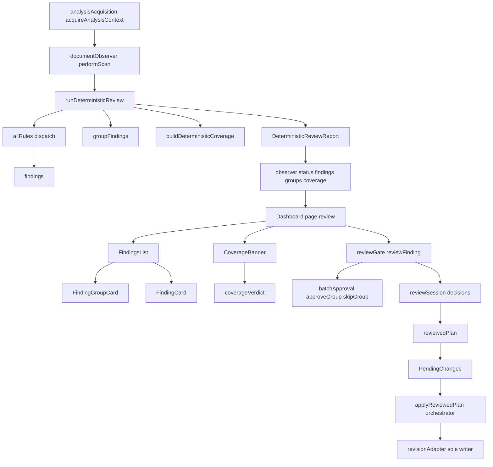
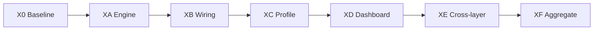

# Deterministic Review — End-to-End Review Plan

**Date:** 2026-10-08
**Author:** Architect mode
**Status:** Proposed — awaiting owner approval before any corrective action
**Method:** Independent, evidence-first review run as a fleet of specialized reviewers
(`review-team` skill), aggregated and deduplicated by the architect.

## Authoritative inputs

This plan does not invent intent. Intended purpose, consistency expectations,
deviation-verification methodology, and remediation standards are taken from:

- [`deterministic-profile-page-consistency-plan.md`](deterministic-profile-page-consistency-plan.md)
  — the profile page target structure, the app-wide heading ramp, the
  one-owner-per-field invariant, D-1…D-6, S1–S13, and the "three places the plan
  was wrong" record.
- [`deterministic-review-deviation-verification-and-remediation.md`](deterministic-review-deviation-verification-and-remediation.md)
  — the audit verdict table, owner decisions D1–D6, newly discovered defects
  ND-1…ND-13, the UX/wiring audit, UX-1…UX-4a, the target architecture, the
  phase sequencing, and the execution log through Phase 6b.

The two plans are treated as **claims to verify**, not as ground truth. Where the
working tree disagrees with a plan, the working tree is the finding.

## 1. Objectives

1. Verify each named component **individually**: the deterministic engine, its
   wiring and integration points, the deterministic profile implementation, and
   the dashboard layer.
2. Verify the components **as a cohesive system**: the end-to-end path from
   acquisition to findings to groups to review to apply, with no dropped,
   duplicated, mis-attributed, or unreachable data.
3. Verify the product's honesty: coverage verdicts, refusal reasons, and
   "cannot correct" states must match what the code can actually prove.
4. Detect **deviations** between actual behaviour and the two authoritative
   plans' stated intent, classify each by severity, and trace it to a root cause
   across layers.
5. Produce a prioritized remediation backlog with per-item evidence, and
   explicitly separate repository-side evidence from the human Word-host gate.

## 2. Scope boundaries

### In scope

- `src/analysis/deterministic/` — engine, registry, contracts, coverage.
- `src/rules/` — `language.ts`, `typography.ts`, `houseStyle.ts`, `registry.ts`.
- `src/formatting/` — `analyzer.ts`, `structuralStandards.ts`.
- `src/changes/` — `deterministicChanges.ts`, `planner.ts`, `approvalPolicy.ts`,
  `conflictDetector.ts`.
- `src/core/domain/` — `StyleProfile.ts`, `Finding.ts`, `ResolvedPolicy.ts`,
  `GovernanceProfile.ts`.
- `src/word/` — `documentObserver.ts`, `analysisAcquisition.ts`.
- `src/analysis/` — `incrementalCoordinator.ts`, `coverage.ts`.
- `src/taskpane/` — `pages/Dashboard.tsx`, `findingGroups.ts`,
  `coverageVerdict.ts`, `reviewGate.ts`, `batchApproval.ts`,
  `occurrenceIdentity.ts`, `approvalControls.ts`, and the deterministic
  dashboard components (`FindingsList`, `FindingCard`, `FindingGroupCard`,
  `CoverageBanner`, `DeterministicStyleSections`, `ProfileEditor`,
  `ProfileSection`, `ProfileSubsection`).
- Deterministic tests under `tests/unit/analysis/deterministic/`,
  `tests/unit/rules/`, `tests/unit/changes/`, `tests/unit/taskpane/`,
  `tests/fixtures/deterministicReview.ts`.

### Out of scope (explicitly)

- Semantic Review, the consistency engine (`src/analysis/consistency/`), and the
  LLM/provider layer, except where a boundary rule forbids their import into
  deterministic code — that boundary **is** in scope and is a static check.
- Word-host certification. No automated run closes it; it stays recorded as
  `pending` in `docs/manual-verification.md` (ADR-0051).
- Visual/theme rendering outcomes that jsdom cannot compute. The theme **rule**
  is in scope; the rendered pixel result is a human gate.
- Any product-intent change. Where the plan's intent is contradicted by live
  code, this review records the contradiction and recommends, it does not decide.

## 3. System map

**The invariants under test** (from both plans):

- **One owner per behaviour.** For any document behaviour exactly one profile
  section owns it, and the registry proves it behaviourally, not by declaration.
- **One mutation path.** Findings → gate → plan → orchestrator → revisionAdapter.
  No UI or rule mutates Word.
- **No dropped finding.** Every finding reaches a rendered unit; no bookkeeping
  field may silently delete one.
- **One identity.** Approval, skip, ignore, grouping, and the plan's change all
  resolve through the same occurrence identity; no id-to-id join across runs.
- **Honest coverage.** A compliance claim requires complete coverage **and** no
  open findings; "Compliant within checked scope" is bounded.
- **A refusal states its reason.** No disabled control without the engine's own
  why.

## 4. Success criteria

A layer **passes** only when all of the following hold. Anything short is a
finding, not a pass.

### 4.A Engine determinism

- A1. No `ai`, `Office`, `word`, `taskpane`, or `commands` import anywhere under
  `src/analysis/deterministic/`, `src/rules/`, or `src/formatting/`
  (lint-boundary check).
- A2. `runDeterministicReview` is a pure function of its `AnalysisContext`: same
  input yields identical findings, groups, coverage fingerprint, and summary.
- A3. `asDeterministicFinding` drops any non-deterministic/formatting kind, so a
  leaked semantic/consistency finding cannot enter a report.
- A4. Every dispatched rule has an `analyze` body; `registrySummary().implemented`
  is true for every rule the engine dispatches.
- A5. `unwiredProfilePaths()` is empty (with
  `houseStyle.spellingVariant` the sole excused entry), **and** the broader claim
  in `profileBehaviour.test.ts` — that every profile field is either read by a
  rule with a body or explicitly excused — still holds.
- A6. No two rules emit overlapping findings over one character under default
  settings (ND-2/ND-4 class).
- A7. Every `correctable: true` category is in
  `DETERMINISTIC_CORRECTABLE_CATEGORIES`; every report-only category is in
  `DETERMINISTIC_REPORTED_ONLY_CATEGORIES`; the two sets are disjoint and their
  union covers every emitted category.

### 4.B Wiring correctness

- B1. `report.groups` produced by the engine is consumed by the pane and joins
  the **same run's** findings (`status.groups`), never the preview run's.
- B2. `batchApproval` functions are imported by a live component and reachable by
  a user action (ND-7 closed).
- B3. The preview plan, the review gate, and Apply all read the same
  `reviewedPlan` projection; unreviewed changes cannot be applied.
- B4. `markDirtyNodes` treats every non-character unit as whole-document
  (no silent zero-dirty).
- B5. Incremental/narrowed runs never claim whole-document coverage
  (`incremental`, `incrementalReason` carried through empty and non-empty paths).
- B6. Session identity invalidation fires on document, profile, governance, or
  scope-fingerprint change, and expired decisions are counted and stated.
- B7. The observer stamps `groups`, `findings`, `coverage`,
  `deterministicCoverage`, and `reviewSessionIdentity` from one accepted run.

### 4.C Profile accuracy and consistency

- C1. Every field in `PROFILE_FIELD_PATHS` maps to a rule `profilePaths` claim
  that reads it (no declaration-only coverage — the ND-13 class).
- C2. Every language/typography/house-style field a rule reads has a control in
  the deterministic editor that writes that exact field (the ADR-0112 class).
- C3. No field is edited from two places for the same behaviour (D-2 / one owner).
- C4. Schema defaults and persisted round-trips preserve authored values;
  retired fields are stripped, not honoured.
- C5. Locale, units symbols, heading case, preferred expanded, negative numbers,
  currency magnitude are enforced (Phase 3 claims), each with a rule body.
- C6. The editor's section structure matches the target in the profile page plan
  (Language sub-sections, Typography owning its controls, House style capital
  case defaults), with no empty heading leading nowhere (D-1).

### 4.D Dashboard fidelity

- D1. Every engine field the UI needs is rendered: findings, groups,
  `safeBatchApproval`, `batchRefusalReason`, occurrence counts, missing counts.
- D2. The findings header count and the coverage verdict's `openFindings` come
  from the same ignore-filtered list.
- D3. Coverage verdict uses the four states and the bounded "Compliant within
  checked scope" label, and `incomplete` outranks `findings-open`.
- D4. Manual-correction (non-correctable) findings omit Approve and state why;
  Approve is never merely disabled-without-reason on a plannable finding (ADR-0069).
- D5. `FindingDetail` `variant` is a required prop passed by the caller and never
  inferred from `finding.source`.
- D6. Group rendering never drops a finding; contested occurrences fall back to
  singletons; stale groups are reported rather than deleting findings.
- D7. Accessibility: listbox/option/aria-current wiring, group headers labelled,
  refusal text reachable by `aria-describedby`, one live region for the pane.
- D8. Theme guard: no bare-element rule may reach a Fluent component; our own
  controls carry `.tf-native` / `.tf-native-button`; the selector list is exactly
  `.tf-native` (no dangling `button,` — the Phase 6a verification defect).

## 5. Sequential examination approach

Each step produces evidence and a go/no-go before the next.

- **X0 — Baseline.** Confirm `typecheck`, `lint` (0 warnings), and the
  deterministic test suites are green **before** judging anything, so every later
  failure is attributable. Record the exact test/file counts.
- **XA — Engine determinism.** Static boundary inspection + pure-function
  determinism + registry/planner/category agreement (checks A1–A7).
- **XB — Wiring.** Trace acquisition → observer → engine → status → dashboard →
  gate → batch → projection → apply, at each hop asserting the identity and the
  data actually match (checks B1–B7).
- **XC — Profile.** Schema walk vs `PROFILE_FIELD_PATHS` vs rule `profilePaths`
  vs editor controls vs persisted round-trip (checks C1–C6).
- **XD — Dashboard.** Rendering logic, verdict logic, group join, accessibility,
  theme-guard selectors (checks D1–D8).
- **XE — Cross-layer deviations.** Re-run the ND-1…ND-13 and D-1…D-6 and
  UX-1…UX-4a catalogues against the tree; trace each surviving deviation to its
  root layer.
- **XF — Aggregate.** Deduplicate, rank, attach evidence, and record the honest
  repository-versus-host boundary.

## 6. Functional validation checks

### 6.A Engine determinism

- Run the deterministic suites and `profileBehaviour.test.ts`; assert
  `unwiredProfilePaths()` is empty **and** read the guard to confirm it counts a
  field as wired only when a rule with a body claims it.
- Grep the deterministic boundary for forbidden imports; confirm ESLint
  `no-restricted-imports` scopes cover `src/analysis/deterministic/**`.
- Feed one `AnalysisContext` twice and diff the two reports (findings ids differ;
  coverage fingerprint, summary, group structure, and finding bodies must not).
- Audit `DETERMINISTIC_CORRECTABLE_CATEGORIES` / `_REPORTED_ONLY_` against every
  rule's `emits`.

### 6.B Wiring correctness

- Confirm `FindingsList` receives `status?.groups` and that those groups come
  from the same `runDeterministicReview` call as `status.findings`.
- Confirm a component imports `approveGroup`/`skipGroup`/`batchApprovalLabel`
  and that `FindingGroupCard` renders them.
- Confirm `reviewedPlan` is the single projection feeding both the Pending list
  and `applyPendingPlan`.
- Confirm `markDirtyNodes` has no fall-through for `table`/`header`/`footer`.
- Confirm the narrowed-scan path sets both `incremental` and `incrementalReason`
  on the engine call and on `buildCoverage`.
- Confirm session invalidation compares document identity, profile revision,
  governance revision, and coverage fingerprint.

### 6.C Profile accuracy and consistency

- Derive the editor's writable field set from the component and diff it against
  the schema paths and rule claims.
- For each language sub-section, assert one control per rule-read field.
- Confirm no field has two editors for one behaviour.
- Confirm retired fields (`houseStyle.preferredTerminology`,
  `houseStyle.bannedTerms`, `houseStyle.capitalization.sentenceCase`,
  `currency.*Separator`, `emDashSpacing`) are stripped by Zod and unread.
- Confirm the profile page structure: Typography owns its eight controls; House
  style is capital-case-defaults only; heading ramp is app-wide.

### 6.D Dashboard fidelity

- Read `Dashboard.tsx` end-to-end for the two `runDeterministicReview` consumers
  (observer scan vs preview) and confirm no cross-run id join remains.
- Confirm `CoverageBanner` receives `openFindings` from `openSummary.total`.
- Confirm `coverageVerdict` precedence and label.
- Confirm `FindingDetail`/`FindingCard` manual-correction behaviour and the
  required `variant` prop.
- Read `taskpane.css` selectors with comments stripped; assert the native-control
  rule's selector list is exactly `.tf-native` and the button rules are scoped to
  `button.tf-native-button`.

## 7. Deviation detection procedures

Method borrowed from the remediation plan: **re-verify every stated claim against
the working tree; do not adopt conclusions.**

1. **Catalogue the claims.** Extract every declarative claim from both plans:
   audit §3–§28 verdicts, ND-1…ND-13, D1–D6, UX-1…UX-4a, D-1…D-6, S1–S13, and
   the Phase 1–6 execution log.
2. **Locate the evidence.** For each claim, find the code, test, or schema that
   would make it true, and the code that would make it false.
3. **Classify each claim** as one of: Confirmed / Confirmed-and-worse /
   Obsolete / Inaccurate / Already-implemented / Unverifiable-here.
4. **Detect new deviations** by the defect classes the plans name, not by their
   specific instances: (a) a field read by no rule; (b) a field claimed by a
   rule that does not read it; (c) a rule with no body covering a field; (d) a
   field with no control; (e) two owners for one behaviour; (f) two rules over
   one character; (g) a computed value consumed by nothing; (h) dead pure module
   never imported; (i) cross-run id join; (j) a label that over-claims.
5. **Trace to root cause.** For each surviving deviation, name the layer where
   the defect originates and the layers it propagates to.
6. **State residual limits.** Anything resting on a real Word host is recorded as
   open, never as passed.

## 8. Evidence collection methods

Every finding must carry at least one of:

- A **file and line reference** (`path:line`) to the code that behaves as
  observed.
- A **test result** (name and outcome), or the name of the missing test that
  would have caught it.
- A **schema/registry fact** — e.g. the diff between `PROFILE_FIELD_PATHS`,
  a rule's `profilePaths`, and the editor's writable fields.
- A **selector fact** — the comment-stripped selector list from `taskpane.css`.
- A **reproduction path** — the exact call sequence that exhibits the deviation.

Evidence is stored as a table of {claim, verdict, evidence ref, severity, root
layer} in the final report. Automated evidence and host evidence are labelled
separately.

## 9. Reviewer fleet

Run as independent reviewers per the `review-team` skill (single mode by
default). Each reviewer receives the reviewer prompt from its Markdown file, the
task context, the files in scope, and the fleet wrapper. Mapping to this task:

- `correctness-reviewer` — engine determinism, finding/group correctness (A, C).
- `architecture-reviewer` — wiring, boundaries, one mutation path, one identity
  (B).
- `code-quality-conventions-reviewer` — lint contracts, dead code, duplicated
  logic.
- `simplicity-scope-reviewer` — unreachable modules, overbuilt surfaces,
  declared-but-unused data.
- `product-ux-accessibility-reviewer` — dashboard fidelity, verdict honesty,
  accessibility (D).
- `performance-reliability-reviewer` — debounce/race conditions, incremental
  scans, stale-run cancellation.
- `telemetry-observability-reviewer` — logging, coverage/verdict truthfulness.
- `testing-strategy-reviewer` — weak assertions, missing behavioural tests.
- `api-compatibility-reviewer` — schema compatibility, persistence/migration.
- `documentation-dx-reviewer` — plan/doc/log fidelity to the tree.

The exact reviewer prompt files are read at execution time from the skill's
`reviewers/` directory; only the relevant reviewers are launched.

## 10. Remediation prioritization logic

- **P0** — a wrong mutation, a false compliance claim, data loss, or a
  user-facing control that cannot be trusted. Fix before any release.
- **P1** — a real deviation with user impact, or a declared capability that does
  not exist (a field/toggle that governs nothing, a module built and unreachable,
  a computed value consumed by nothing).
- **P2** — correctness-preserving quality: dead code, duplicated logic, stale
  comments/docs, weak assertions, accessibility polish.
- **P3** — cosmetic or documentation-only.

Ownership classification follows the verification graph's convention:
`repository-code` is ours to fix; `dependency-install` means the lockfile/registry
moved; `build-package` points at `dist/` or the staged release; `word-host-evidence`
is the human gate and is never reported as passed.

Ordering within a priority: a defect that can block an unrelated correction
(overlapping ranges, conflicting plan) outranks one that only misdescribes state.

## 11. Deliverables

1. This plan (approved before execution).
2. A findings report: actual vs expected, per finding, with file/line evidence,
   severity, root layer, and disposition (fix now / defer / out of scope / false
   positive).
3. A prioritized remediation backlog aligned to the plans' phase structure.
4. An explicit open-items section naming the Word-host gate and anything else
   not verifiable in-repository.
5. An updated status line for `ROADMAP.md` / `docs/project-state.md` only if the
   owner approves a code change; otherwise the report stands alone.

## 12. Explicit non-claims

- No automated run establishes how anything looks in Word, both themes, at 329px.
- A green suite is not a release claim; `word-host-evidence` stays `pending`.
- This review re-verifies the plans; it does not adopt their conclusions.
