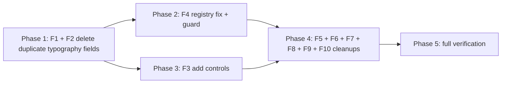

# Deterministic Review — F1–F10 Remediation Plan

**Date:** 2026-10-08
**Source:** [`plans/deterministic-review-end-to-end-review-findings.md`](deterministic-review-end-to-end-review-findings.md)
**Design constraint:** Ponytail — deletion over addition, reuse existing components, shortest correct diff once the flow is understood. No new dependencies, no new abstractions unless a finding forces one.

## Objective

Close all ten findings with the smallest diffs that make the underlying claims true, each leaving one runnable check behind. Every change keeps `npm run typecheck`, `npm run lint` (0 warnings) and the deterministic suites green.

## Findings → fix map

| ID  | Defect                                                                                                                            | Chosen fix                                                                                                                                                                            | Why this and not the alternative                                                                                                                       |
| --- | --------------------------------------------------------------------------------------------------------------------------------- | ------------------------------------------------------------------------------------------------------------------------------------------------------------------------------------- | ------------------------------------------------------------------------------------------------------------------------------------------------------ |
| F1  | `typography.currencySpacing` vs `language.currency.symbolSpacing`, two owners                                                     | **Delete** the typography field, its check, its control, its declarations                                                                                                             | Matches the D2 separator precedent; the UI already says Language → Currency is normative. Implementing a deference is more code that keeps two owners. |
| F2  | `typography.percentageSpacing` vs `language.numbers.percentageSpacing`, false comments                                            | **Delete** the typography field, its check, its declarations, the false comments                                                                                                      | Same precedent. The editor already omits the control; the field is only reachable via a persisted profile.                                             |
| F3  | Rule-read fields with no control (`structure.maxHeadingLevel`, `formatting.titleStyle`/`subtitleStyle`/`captions`/`headings.1–9`) | **Add** the missing controls using existing `NumberField`/`StyleTextField`                                                                                                            | The rules legitimately read them; removing the fields would lose capability. F3 also closes C2-1 and XE-NEW-1.                                         |
| F4  | `emits` ≠ analyze filter; no guard                                                                                                | **Remove** the stale `language.currency.separator` filter entry; **hoist** each rule's filter list to a named constant; **add** a guard test asserting `emits == filter ∪ {category}` | Makes the registry's own comment true. A static guard is the only way to catch the class.                                                              |
| F5  | Dead modules `rules/registry.ts`, `shared/utils/result.ts`                                                                        | **Delete** the modules, their barrel re-exports, and the dead test                                                                                                                    | Zero production importers, verified against barrels.                                                                                                   |
| F6  | Correctable/reported-only partition unpinned                                                                                      | **Add** one assertion to `deterministicChanges.test.ts`                                                                                                                               | Pure test addition; the union already holds.                                                                                                           |
| F7  | `undoGroup` production-dead                                                                                                       | **Delete** `undoGroup` and its tests                                                                                                                                                  | Per-occurrence Undo already exists on the group card; group-level undo was never surfaced.                                                             |
| F8  | `WORD_STYLE_MAPPING` re-export unconsumed                                                                                         | **Remove** the one re-export line                                                                                                                                                     | The constant is used internally by `lookupWordStyle`; only the export is dead.                                                                         |
| F9  | `ProfileEditor.buildCandidate` latent terminology two-owner                                                                       | **Remove** the vestigial `preferredTerminology`/`bannedTerms` form fields and writes                                                                                                  | The row editor is the single owner; the merge path only exists to keep the deleted textarea in step.                                                   |
| F10 | Bulk-add colon asymmetry                                                                                                          | **State** the colon restriction in the bulk-add hint                                                                                                                                  | Simplest honest fix; the parser already refuses a malformed line.                                                                                      |

## Order and dependencies

F2 must land before F4 (it removes the `typography.percentageSpacing` profile-path claim that F4's guard would flag). Everything else is independent.

## Phase 1 — F1 + F2: one owner for currency and percentage spacing

**Delete the two typography fields and their checks; the language section is the sole owner.**

1. [`src/core/domain/StyleProfile.ts`](../src/core/domain/StyleProfile.ts) — in `TypographyRulesSchema`, delete `percentageSpacing` and `currencySpacing` (and their comments claiming a deference that never existed).
2. [`src/rules/typography.ts`](../src/rules/typography.ts) — delete `checkPercentageSpacing` and `checkCurrencySpacing` and their `findTypographyIssues` call sites. Keep `spacingFindings` (still used by `checkSlashSpacing`).
3. [`src/analysis/deterministic/ruleRegistry.ts`](../src/analysis/deterministic/ruleRegistry.ts) — remove `"typography.percentageSpacing"` from `typography/numbers`' `profilePaths`, and `"typography.currencySpacing"` from `typography/punctuation`'s `profilePaths`; remove both from `PROFILE_FIELD_PATHS`.
4. [`src/taskpane/components/DeterministicStyleSections.tsx`](../src/taskpane/components/DeterministicStyleSections.tsx) — delete the "Before a currency symbol" `EnumSelect`; keep the "percent sign is set under Language → Numbers" note (now unconditionally true).
5. Update the fixtures and tests that carry the deleted fields: `tests/fixtures/deterministicReview.ts`, `tests/unit/rules/typography.test.ts`, and any `ProfileEditor`/profile literal. Zod strips unknown keys, so remove them deliberately rather than relying on the strip.
6. `DETERMINISTIC_CORRECTABLE_CATEGORIES` keeps `"typography.punctuation"` — it still carries slash, bracket and hyphen findings.

**Check:** `tests/unit/rules/typography.test.ts` asserts a profile with `currencySpacing`/`percentageSpacing` fails `safeParse` (the field is gone), and no two rules report the same currency/percent gap.

## Phase 2 — F4: registry declaration fidelity

1. [`src/analysis/deterministic/ruleRegistry.ts`](../src/analysis/deterministic/ruleRegistry.ts) — remove `"language.currency.separator"` from `language/currency`'s `analyze` filter (no rule emits it).
2. Hoist each rule's inline `analyze`-filter array to a named constant (e.g. `CURRENCY_CATEGORIES`, `ABBREVIATION_CATEGORIES`, `DATE_CATEGORIES`, `UNIT_CATEGORIES`, `TERMINOLOGY_CATEGORIES`, `CAPITALISATION_CATEGORIES`, `NUMBER_LANGUAGE_CATEGORIES`), so the declaration and the filter are the same value.
3. Add to [`tests/unit/analysis/deterministic/ruleRegistry.test.ts`](../tests/unit/analysis/deterministic/ruleRegistry.test.ts): for every rule, `new Set(emits ?? [category])` equals `new Set([category, ...filterCategories])`. This is the assertion the registry's own comment claims exists.

**Check:** the new guard passes for all 24 rules; deleting a category from a filter without updating `emits` (or vice versa) fails it.

## Phase 3 — F3: author the rule-read fields that have no control

1. [`src/taskpane/components/DeterministicStyleSections.tsx`](../src/taskpane/components/DeterministicStyleSections.tsx) Structure section — add a `NumberField` for `structure.maxHeadingLevel` (`min 1`, `max 9`, `numberOrUndefined`), matching the existing `lists.level` control.
2. Formatting section — add a `styleName` control (`StyleTextField`) for `titleStyle`, `subtitleStyle` and `captions`, and one per heading level 1–9 in a "Headings" `fieldset`. Read the analyzer first to confirm which properties `checkNamedStyles`/`checkHeadingStyle` compare; if they compare more than `styleName`, keep the added control to `styleName` (the property the rule's `profilePaths` names) and record any deeper gap as a follow-up rather than building a full standard editor.
3. Extend `tests/unit/taskpane/components/DeterministicStyleSections.test.tsx` with the existing pattern — assert each newly added control exists, is labelled, and writes its field.

**Check:** the new component assertions pass; the Structure summary ("how deep the document may nest") and the Formatting summary ("each paragraph kind") now describe reachable controls.

## Phase 4 — cleanups

- **F5** — delete `src/rules/registry.ts`, its re-export block in [`src/rules/index.ts`](../src/rules/index.ts), and `tests/unit/rules/registry.test.ts`; delete `src/shared/utils/result.ts` and its `export *` in [`src/shared/utils/index.ts`](../src/shared/utils/index.ts).
- **F6** — add to [`tests/unit/changes/deterministicChanges.test.ts`](../tests/unit/changes/deterministicChanges.test.ts): every category a `correctable: false` rule emits is in `DETERMINISTIC_REPORTED_ONLY_CATEGORIES`. If it surfaces a genuine omission, add that category to the set and cite the rule.
- **F7** — delete `undoGroup` from [`src/taskpane/batchApproval.ts`](../src/taskpane/batchApproval.ts) and its cases in `tests/unit/taskpane/batchApproval.test.ts`.
- **F8** — remove the `WORD_STYLE_MAPPING` line from [`src/formatting/index.ts`](../src/formatting/index.ts).
- **F9** — in [`src/taskpane/components/ProfileEditor.tsx`](../src/taskpane/components/ProfileEditor.tsx), remove the vestigial `preferredTerminology`/`bannedTerms` fields from `ProfileFormValues`, `profileToValues` and `buildCandidate`. First confirm no control still renders them; if `foldTerminology` becomes unused, delete it too.
- **F10** — update the bulk-add hint in [`src/taskpane/components/TerminologyBulkAdd.tsx`](../src/taskpane/components/TerminologyBulkAdd.tsx) to state that a term containing a colon must be added as a row.

## Phase 5 — verification

After each phase, then once at the end:

- `npm run typecheck`, `npm run lint` (0 warnings), `npx vitest run tests/unit/analysis/deterministic tests/unit/rules tests/unit/changes tests/unit/formatting tests/unit/taskpane`.
- `npm run verify` at the end (the full chain: typecheck → lint → format → secret-scan → docs → skills → test → coverage → build → manifest → package).
- Update `docs/decision-log.md` with one ADR recording the two-owner resolution for currency/percentage spacing (the D2 precedent extended) and the registry `emits` guard.
- Update the findings report statuses.

## Non-goals

- No full Fluent migration of the editor (`UX-4`'s remainder) — separate work.
- No Word-host verification: the host gate stays open and is never reported as passed.
- No change to the language-section rules themselves; they keep ownership of the two behaviours.

## Risks

- **Deleting a schema field touches persisted profiles.** Safe by the standing no-users constraint and Zod's strip behaviour, but every fixture carrying the field must be updated in the same change (Phase 1 step 5) or the suites will look green while the field lingers.
- **Adding heading controls** touches a large component; keep each `StyleTextField` a plain reuse and lean on the component test rather than introducing a loop abstraction unless it reads cleanly.
- **The F4 guard** requires hoisting filter arrays; a missed rule that does not use the hoisted constant is caught immediately by the new assertion.

## Todo checklist

- [ ] Phase 1: delete `typography.percentageSpacing` + `checkPercentageSpacing`; delete `typography.currencySpacing` + `checkCurrencySpacing`; update registry, editor, fixtures, tests
- [ ] Phase 2: remove `language.currency.separator` filter entry; hoist filter constants; add `emits == filter ∪ {category}` guard
- [ ] Phase 3: add `maxHeadingLevel` NumberField and named-style/heading StyleTextFields; extend component test
- [ ] Phase 4: F5 delete dead modules; F6 partition assertion; F7 delete `undoGroup`; F8 drop re-export; F9 remove vestigial form fields; F10 hint
- [ ] Phase 5: run typecheck, lint, deterministic suites, then `npm run verify`; write ADR; update findings report
