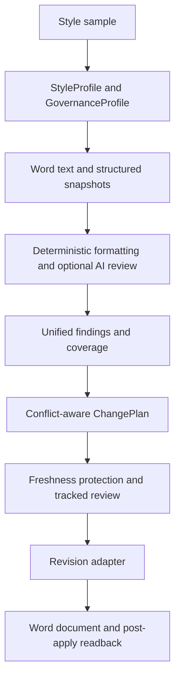
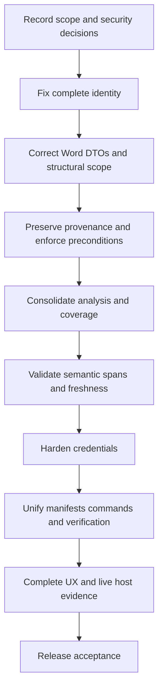

# Historical Review Revalidation and Prioritized Implementation Plan

**Audit basis:** the current working tree as revalidated on 2026-09-24. The
original static audit baseline was commit `d32f8e6`; later sections preserve that
audit-time reasoning unless the final disposition register below explicitly
supersedes it.

**Historical inputs:** [`ToneForge_REPOSITORY_REVIEW_FINDINGS_AND_PROPOSED_CHANGES.md`](../ToneForge_Refactor_Implementation/ToneForge_REPOSITORY_REVIEW_FINDINGS_AND_PROPOSED_CHANGES.md), [`ToneForge_STAGE_BY_STAGE_FILE_BY_FILE_REVIEW.md`](../ToneForge_Refactor_Implementation/ToneForge_STAGE_BY_STAGE_FILE_BY_FILE_REVIEW.md), and [`ToneForge_LATEST_COMMIT_THOROUGH_REVIEW.md`](../ToneForge_Refactor_Implementation/ToneForge_LATEST_COMMIT_THOROUGH_REVIEW.md). All three are treated as sets of hypotheses and design history, not as current status.

**Current authority:** [`ROADMAP.md`](../ROADMAP.md) is the canonical status and
sequencing record. [`docs/architecture.md`](../docs/architecture.md) describes
current boundaries. [`docs/decision-log.md`](../docs/decision-log.md) records
accepted architectural decisions, especially ADR-0031 through ADR-0041.

**Method limitation:** this pass re-reads the current worktree and governance
records. Repository checks are cited only when the current documentation or a
recorded verification run provides evidence. No live Word, browser
accessibility, live-provider, production-broker, or large-document host evidence
is collected or implied by this documentation pass.

## 1. Executive conclusion

The historical review's architecture assessment remains directionally correct, but
its audit-time defect list is no longer current. Repository-side integration and
safety work has now been completed for identity and DTO contracts, planner
lineage and approval, change preconditions, single-pass analysis and coverage,
semantic targeting, selected-text refusal, Apply readiness, credential removal
from browser bundles and ordinary state, command/manifest parity, and the named
verification graph.

The current release position is narrower and external: live Word behavior across
the supported host matrix, live formatting and large-document performance,
accessibility, live-provider behavior, and production broker authentication and
credential custody remain unverified gates. The XML manifest is an intentional
navigation-only fallback, not an execute-function equivalent of the JSON
manifest; both real sideload paths still require human evidence.

**Disposition authority:** the final disposition register in Section 12 is the
single authoritative outcome for every confirmed finding in this plan. Sections
2–11 are retained as the audit trail and implementation plan; any earlier
classification, objective, or “required scope” is historical when it conflicts
with Section 12 or [`ROADMAP.md`](../ROADMAP.md).

## 2. Current architecture and data-flow baseline

The current documented path is:

The actual code retains two document representations:

- [`getDocumentSnapshot()`](../src/word/documentReader.ts:46) returns text, paragraphs, sentences, word count, and a hash.
- [`getStructuredSnapshot()`](../src/word/documentReader.ts:129) returns the host-neutral `DocumentSnapshot` schema, but currently derives nodes from the already-read text snapshot rather than from the Word paragraph collection.

The current production mutation boundary is [`applyChangePlan()`](../src/word/revisionAdapter.ts:107) and its tracked wrapper [`applyChangePlanWithTracking()`](../src/word/revisionAdapter.ts:201). UI code does not import that adapter directly; [`ReformatPanel`](../src/taskpane/components/ReformatPanel.tsx:46) and [`Dashboard`](../src/taskpane/pages/Dashboard.tsx:67) call the reformat service.

The current host probe is read-only: [`probeWordCapabilities()`](../src/word/capabilityProbe.ts:60) inspects methods, collections, enums, and tracking properties without calling insertion or mutation methods.

## 3. Evidence matrix: every historical finding and recommendation

| Historical section                                                | Current classification                                               | Evidence and conclusion                                                                                                                                                                                                                                                                                                                                                                                                                                                                                                                                                                                                                                                                                                                                                                                                                                                     | Current action                                                                                                                                                                                                            |
| ----------------------------------------------------------------- | -------------------------------------------------------------------- | --------------------------------------------------------------------------------------------------------------------------------------------------------------------------------------------------------------------------------------------------------------------------------------------------------------------------------------------------------------------------------------------------------------------------------------------------------------------------------------------------------------------------------------------------------------------------------------------------------------------------------------------------------------------------------------------------------------------------------------------------------------------------------------------------------------------------------------------------------------------------- | ------------------------------------------------------------------------------------------------------------------------------------------------------------------------------------------------------------------------- |
| 2.1 Domain architecture                                           | **Resolved / aligned**                                               | [`StyleProfile`](../src/core/domain/StyleProfile.ts:1), [`Finding`](../src/core/domain/Finding.ts:36), [`Change`](../src/core/domain/Change.ts:120), and [`ChangePlan`](../src/core/domain/ChangePlan.ts:27) are Zod-validated contracts. The planner produces plans and the adapter is the mutation boundary.                                                                                                                                                                                                                                                                                                                                                                                                                                                                                                                                                              | Preserve. Add contract tests around provenance and preconditions when those contracts are corrected.                                                                                                                      |
| 2.2 Canonical `StyleProfile` and profile-version provenance       | **Partially addressed**                                              | `StyleProfile` remains the style contract, but the current `ConsistencyReport` has only `profileId` and `docHash` at [`consistencyChecker.ts:62`](../src/analysis/consistencyChecker.ts:62). The reformat planner is called with only `findings`, `docHash`, and `baseDocId` at [`planner.ts:283`](../src/changes/planner.ts:283), so the resulting reformat plan does not capture `profileVersion`. AI review plans do capture profile metadata at [`spotReview.ts:80`](../src/ai/review/spotReview.ts:80).                                                                                                                                                                                                                                                                                                                                                                | Add profile ID/version and document version to every reformat plan, not only AI-review plans.                                                                                                                             |
| 2.3 Hybrid checker, shared context, authoritative analysis result | **Partially addressed**                                              | [`checkConsistency()`](../src/analysis/consistencyChecker.ts:172) composes deterministic, formatting, optional semantic, and optional coverage. However, reformat calls it without `nodes`, so `coverage` is normally absent; there is no session-scoped `AnalysisContext`; each analyzer receives independent inputs.                                                                                                                                                                                                                                                                                                                                                                                                                                                                                                                                                      | First-class context is still a valid target, but it should be introduced after identity and Word DTO contracts are corrected.                                                                                             |
| 3.1 Word structural representation                                | **Confirmed and actionable**                                         | [`DocumentNodeSchema`](../src/core/domain/DocumentSnapshot.ts:24) names many structures, but [`getStructuredSnapshot()`](../src/word/documentReader.ts:136) creates only body plus paragraph/heading nodes. It identifies headings from text matching `Heading N:` at [`documentReader.ts:137`](../src/word/documentReader.ts:137), not from the Word paragraph style. Tables, headers, footers, sections, lists, fields, controls, shapes, comments, protection, and revision state are not extracted. [`docs/architecture.md:128`](../docs/architecture.md:128) explicitly documents this limitation.                                                                                                                                                                                                                                                                     | Rebuild the structural reader around real Word collections and explicitly model supported versus excluded structures.                                                                                                     |
| 3.2 Large-document truncation and document identity               | **Confirmed high-priority issue**                                    | [`getDocumentSnapshot()`](../src/word/documentReader.ts:46) truncates `fullText` at `maxChars` and hashes the truncated `text` at [`documentReader.ts:52`](../src/word/documentReader.ts:52) and [`documentReader.ts:69`](../src/word/documentReader.ts:69). The orchestrator uses that hash for the plan at [`orchestrator.ts:121`](../src/reformat/orchestrator.ts:121) and [`orchestrator.ts:148`](../src/reformat/orchestrator.ts:148). [`getStructuredSnapshot()`](../src/word/documentReader.ts:132) then derives `contentHash` from the same truncated text. The default limit is 500,000 characters.                                                                                                                                                                                                                                                                | Separate complete-document identity from analyzed text. A change after the limit must invalidate a plan.                                                                                                                  |
| 4.1 Capability probing must not mutate                            | **Resolved**                                                         | [`capabilityProbe.ts:5`](../src/word/capabilityProbe.ts:5) documents non-destructive behavior. The probe only inspects ranges, methods, styles, and tracking properties at [`capabilityProbe.ts:85`](../src/word/capabilityProbe.ts:85) through [`capabilityProbe.ts:272`](../src/word/capabilityProbe.ts:272). Recent integration tests cover refusal and capability preparation.                                                                                                                                                                                                                                                                                                                                                                                                                                                                                          | Preserve the non-mutating contract. Add a regression test that asserts no mutation methods are invoked by the probe.                                                                                                      |
| 4.2 Change-level preconditions                                    | **Confirmed and actionable**                                         | [`ChangeSchema`](../src/core/domain/Change.ts:120) has range, payload, risk, dependencies, and source, but no expected text, expected formatting, node identity, or local document version. [`applyChangePlan()`](../src/word/revisionAdapter.ts:107) compares only the plan-level hash at [`revisionAdapter.ts:146`](../src/word/revisionAdapter.ts:146). Validation checks range shape, payload, dependencies, protection, and preservation at [`revisionAdapter.ts:575`](../src/word/revisionAdapter.ts:575), but not target text or formatting before mutation.                                                                                                                                                                                                                                                                                                         | Add local target preconditions and verify them immediately before each mutation or in a preflight phase.                                                                                                                  |
| 5.1 Finding provenance through planning                           | **Confirmed regression / unresolved issue**                          | The semantic deviation engine creates semantic findings with `source: "deterministic"` at [`deviationEngine.ts:110`](../src/analysis/deviationEngine.ts:110). [`makeChange()`](../src/changes/planner.ts:49) hard-codes `source: "deterministic"`, `risk: "none"`, and `approvalRequired: false` at [`planner.ts:57`](../src/changes/planner.ts:57), and does not copy `finding.id` into `findingId`. The newer AI review validator does preserve AI source, risk, approval, and `findingId` at [`responseValidator.ts:43`](../src/ai/review/responseValidator.ts:43). The inconsistency is real.                                                                                                                                                                                                                                                                           | Make provenance a required planning operation. Add source, risk, approval, reversible, actual, expected, and `findingId` propagation tests.                                                                               |
| 5.2 Semantic findings need precise ranges                         | **Partially addressed, still actionable**                            | The Stage 19 deviation engine deliberately emits full-text ranges at [`deviationEngine.ts:53`](../src/analysis/deviationEngine.ts:53) and [`deviationEngine.ts:114`](../src/analysis/deviationEngine.ts:114). The newer spot/full review path accepts model offsets and translates them at [`responseValidator.ts:25`](../src/ai/review/responseValidator.ts:25), but it does not verify that `actual` equals the supplied source slice; it only checks that `actual` occurs somewhere in context. There is no local deterministic span resolver.                                                                                                                                                                                                                                                                                                                           | Keep the newer exact-offset capability, but validate slice identity and resolve quoted spans locally. Mark unresolved semantic findings non-actionable.                                                                   |
| 6.1 Authoritative coverage                                        | **Partially addressed, not authoritative**                           | `CoverageReport` exists in [`DocumentSnapshot.ts:77`](../src/core/domain/DocumentSnapshot.ts:77), but [`buildCoverage()`](../src/analysis/coverage.ts:26) counts supplied nodes and does not derive exclusions from the real reader, changed nodes, or final planned changes. `getStructuredSnapshot()` leaves `coverage` unset. Reformat does not pass nodes to the checker at [`orchestrator.ts:127`](../src/reformat/orchestrator.ts:127).                                                                                                                                                                                                                                                                                                                                                                                                                               | Make coverage part of the common analysis context and distinguish examined, excluded, unsupported, and changed scope.                                                                                                     |
| 7.1 Shared reformat orchestration and analysis context            | **Architecture aligned, integration incomplete**                     | The sequence is present in [`reformatDocument()`](../src/reformat/orchestrator.ts:107), and reviewed-plan apply exists at [`applyReviewedPlan()`](../src/reformat/orchestrator.ts:433). But the orchestrator independently reads text, formatting, live text, structured text, and verification text; `getStructuredSnapshot()` itself reads text again.                                                                                                                                                                                                                                                                                                                                                                                                                                                                                                                    | Consolidate acquisition and pass an immutable context. Do not duplicate analyzer-specific Word reads.                                                                                                                     |
| 7.2 Office.js round trips and large-document performance          | **Confirmed performance risk**                                       | Reformat reads at [`orchestrator.ts:121`](../src/reformat/orchestrator.ts:121), [`orchestrator.ts:140`](../src/reformat/orchestrator.ts:140), [`orchestrator.ts:209`](../src/reformat/orchestrator.ts:209), [`orchestrator.ts:243`](../src/reformat/orchestrator.ts:243), and [`orchestrator.ts:250`](../src/reformat/orchestrator.ts:250). Structured acquisition re-reads through [`documentReader.ts:132`](../src/word/documentReader.ts:132). The observer reads text, structured text, and formatting at [`documentObserver.ts:125`](../src/word/documentObserver.ts:125).                                                                                                                                                                                                                                                                                             | Instrument sync/read counts and establish a single acquisition phase plus focused freshness and readback passes.                                                                                                          |
| 8.1 Formatting reader and index completeness                      | **Confirmed and high-risk**                                          | [`getFormattingSnapshot()`](../src/word/formattingReader.ts:25) reads text, paragraph style, `format`, and font fields, but hard-codes `listLevel: null` at [`formattingReader.ts:109`](../src/word/formattingReader.ts:109). It does not read indentation, heading outline, sections, tables, list metadata, or direct-versus-style provenance. More importantly, the implementation loads `para.load("format")` and reads `para.format`, while the official Word Paragraph API documents paragraph properties such as `alignment`, `lineSpacing`, `spaceAfter`, `spaceBefore`, `leftIndent`, `firstLineIndent`, `outlineLevel`, `font`, and `style`; the current local declaration invents `Paragraph.format` at [`office.d.ts:99`](../src/types/office.d.ts:99). This is a likely live-host contract defect and must be corrected before relying on formatting findings. | Replace the fabricated `format` shape with verified Office.js property loads and add host-backed fixture tests or controlled manual verification.                                                                         |
| 9.1 Provider credentials in browser bundles                       | **Partially resolved; security decision still open**                 | Production Webpack no longer uses `DefinePlugin` in [`webpack.prod.js:10`](../webpack.prod.js:10), so the historical production-build exposure is not present in the current production config. Development still loads `.env` and embeds the complete environment object with `DefinePlugin` at [`webpack.dev.js:17`](../webpack.dev.js:17) and [`webpack.dev.js:86`](../webpack.dev.js:86). The runtime adapter also accepts a browser-held key and sends it directly in the `Authorization` header at [`openaiAdapter.ts:140`](../src/ai/providers/openaiAdapter.ts:140). State storage documents plaintext persistence at [`persistence.ts:8`](../src/core/state/persistence.ts:8).                                                                                                                                                                                     | Remove API keys from browser bundles and choose a supported credential boundary. Treat user-supplied browser credentials as a separate explicit threat-model decision, not as a silent substitute for a service boundary. |
| 9.2 Provider abstraction independent of semantic logic            | **Largely resolved / future-compatible gap**                         | [`LlmProvider`](../src/ai/providers/LlmProvider.ts:1), [`LlmRegistry`](../src/ai/providers/registry.ts:19), OpenAI, and Mock adapters are separated from analysis. The deviation engine accepts a registry at [`deviationEngine.ts:38`](../src/analysis/deviationEngine.ts:38), and spot review accepts a provider at [`spotReview.ts:13`](../src/ai/review/spotReview.ts:13). Azure, proxy, and local adapters are not implemented, but that is a future extension rather than a current coupling defect.                                                                                                                                                                                                                                                                                                                                                                  | Preserve the interface. Add adapter contract tests before adding providers.                                                                                                                                               |
| 10.1 Manifest and validator inconsistency                         | **Historical recommendation superseded; current validation partial** | The project intentionally uses unified JSON plus XML fallback, recorded at [`decision-log.md:14`](../docs/decision-log.md:14) and [`ROADMAP.md:331`](../ROADMAP.md:331). The validator checks both files and command IDs at [`validate-manifest.mjs:105`](../scripts/validate-manifest.mjs:105) through [`validate-manifest.mjs:223`](../scripts/validate-manifest.mjs:223). However, official `office-addin-manifest` validation is skipped on Windows at [`validate-manifest.mjs:226`](../scripts/validate-manifest.mjs:226), and XML command parity is not checked against the JSON execute-function action set.                                                                                                                                                                                                                                                         | Do not force a single format. Make the dual-format contract authoritative and test parity, packaging, and deployment selection.                                                                                           |
| 10.2 Command registry and manifest/UX alignment                   | **Partially addressed**                                              | [`commands.ts:86`](../src/commands/commands.ts:86) has a handler map for the seven JSON execute-function actions and associates them at [`commands.ts:97`](../src/commands/commands.ts:97). JSON controls and runtime actions are aligned at [`manifest.json:50`](../manifest.json:50) and [`manifest.json:142`](../manifest.json:142). XML controls use `ShowTaskpane` navigation rather than execute-function actions at [`manifest.xml:84`](../manifest.xml:84), and the validator does not prove the two command models are equivalent.                                                                                                                                                                                                                                                                                                                                 | Introduce one typed command definition source for IDs, destinations, manifest representations, and handlers, or explicitly document and test the XML navigation parity model.                                             |
| 11.1 Full task-pane workflow                                      | **Partially integrated**                                             | Scan, findings, profile, settings, AI review, preview, pending changes, safe apply, stale refusal, and troubleshooting surfaces exist. [`Dashboard`](../src/taskpane/pages/Dashboard.tsx:392) composes the workflow and [`PendingChanges`](../src/taskpane/components/PendingChanges.tsx:17) displays plan changes. However, [`ReformatPanel`](../src/taskpane/components/ReformatPanel.tsx:180) computes `hostSupportsPlan` but [`canApply`](../src/taskpane/components/ReformatPanel.tsx:182) does not include it, so an unsupported host can still present an enabled Apply button until the service refuses it. Finding-level Apply is also only a review-state action at [`Dashboard.tsx:344`](../src/taskpane/pages/Dashboard.tsx:344), not a separately previewed change.                                                                                            | Fix readiness semantics and make the visible plan explainable per change.                                                                                                                                                 |
| 12.1 CI/scripts/release consistency                               | **Substantially improved, still not one graph**                      | [`package.json:34`](../package.json:34) defines an ordered verification chain including secret/docs scans and artifact checks. CI adds coverage and release staging at [`ci.yml:45`](../.github/workflows/ci.yml:45) through [`ci.yml:55`](../.github/workflows/ci.yml:55). [`stage-verify.mjs:7`](../scripts/stage-verify.mjs:7) omits `test:coverage` and runs a different sequence; release uses [`release-check.mjs:3`](../scripts/release-check.mjs:3) plus separate build/package steps.                                                                                                                                                                                                                                                                                                                                                                              | Define one authoritative graph with named gates, then make local, stage, CI, and release invoke it. Keep human host evidence separate and explicit.                                                                       |
| 13.1 README/onboarding                                            | **Resolved substantially**                                           | [`README.md:22`](../README.md:22) points to the roadmap and onboarding, and [`onboarding.md:13`](../docs/onboarding.md:13) documents setup, sideload, verification, and troubleshooting. The historical “insufficient top-level README” concern no longer matches the current repository.                                                                                                                                                                                                                                                                                                                                                                                                                                                                                                                                                                                   | Keep documentation synchronized with the new identity, coverage, and credential decisions.                                                                                                                                |
| 14 P0–P3 implementation list                                      | **Partially superseded**                                             | Manifest, capability, CI, and onboarding items have moved substantially. Identity, structural fidelity, preconditions, provenance, coverage, performance, and formatting remain. Security is not fully resolved because the browser credential model remains.                                                                                                                                                                                                                                                                                                                                                                                                                                                                                                                                                                                                               | Use the prioritized plan below rather than reproducing the historical priority labels.                                                                                                                                    |
| 15 Target architecture                                            | **Directionally current, not fully implemented**                     | One profile, findings, plan, adapter, and provider abstraction exist. The missing pieces are a common analysis context, complete document identity, full structural scope, change preconditions, and trustworthy coverage.                                                                                                                                                                                                                                                                                                                                                                                                                                                                                                                                                                                                                                                  | Evolve toward the target rather than replacing the current architecture.                                                                                                                                                  |
| 16 Roadmap placement                                              | **Superseded by current roadmap**                                    | The current [`ROADMAP.md:166`](../ROADMAP.md:166) maps the incoming proposal to Phases A-H and explicitly says the original roadmap remains intact. The historical stage map is not authoritative.                                                                                                                                                                                                                                                                                                                                                                                                                                                                                                                                                                                                                                                                          | Record new work against the current phase ledger and add ADR entries for identity, DTO, provenance, and privacy decisions.                                                                                                |
| 17 Definition of done                                             | **Partially met**                                                    | One profile, one mutation path, consent gates, non-mutating capability probing, preview-before-apply, manifest validation, and automated gates exist. The complete host matrix, full structural coverage, complete identity, change-level preconditions, and formal security evidence remain open.                                                                                                                                                                                                                                                                                                                                                                                                                                                                                                                                                                          | Use the verification criteria in this plan as the implementation gate.                                                                                                                                                    |
| 18 Immediate next actions                                         | **Superseded and reordered**                                         | The current roadmap marks automated P0/P1 work complete and leaves external host/release work open at [`ROADMAP.md:270`](../ROADMAP.md:270) through [`ROADMAP.md:303`](../ROADMAP.md:303). The new audit finds integration defects that should be scheduled before Phase H.                                                                                                                                                                                                                                                                                                                                                                                                                                                                                                                                                                                                 | Freeze Phase H, remediate the P0/P1 integration defects below, then complete host evidence and release gates.                                                                                                             |

## 4. Integration of the stage-by-stage and file-by-file review

The second historical document is based on an uploaded archive around [`551667d`](../ROADMAP.md:9), not the current working tree. Its findings were revalidated against the current tree and history through [`d32f8e6`](../ROADMAP.md:9). The archive-only claims about a missing `manifest.xml`, missing Vitest, and missing test dependencies are stale: [`manifest.xml`](../manifest.xml:1) was added by [`74ddc7c`](../docs/decision-log.md:14), and [`package.json`](../package.json:39) plus [`package-lock.json`](../package-lock.json:1) declare the current test toolchain. The archive also predates the fail-closed tracked-apply and production-taskpane changes in [`d32f8e6`](../docs/decision-log.md:128), so its claims about unmanaged apply, the old conflict acknowledgement, and smoke controls in the main pane are not current findings.

### 4.1 Stage-by-stage disposition

| Stage / phase | Historical finding                                                               | Current disposition                                                                                                                                                                                                                                                            | Plan consequence                                                                                                   |
| ------------- | -------------------------------------------------------------------------------- | ------------------------------------------------------------------------------------------------------------------------------------------------------------------------------------------------------------------------------------------------------------------------------ | ------------------------------------------------------------------------------------------------------------------ |
| Stage 00      | README must point to the canonical roadmap and distinguish historical plans.     | **Resolved in substance:** [`README.md`](../README.md:8) and [`docs/onboarding.md`](../docs/onboarding.md:1) identify [`ROADMAP.md`](../ROADMAP.md:1) as authoritative.                                                                                                        | Keep documentation synchronized; no architecture change.                                                           |
| Stage 01      | Separate non-mutating discovery from live revision certification.                | **Partially resolved:** [`probeWordCapabilities()`](../src/word/capabilityProbe.ts:60) is non-mutating and [`docs/manual-verification.md`](../docs/manual-verification.md:20) records the host evidence boundary. Behaviour certification remains open by design.              | Keep per-Apply non-mutating preparation from ADR-0038; add a certified host matrix and no-mutation regression.     |
| Stage 02      | `manifest.xml` absent.                                                           | **Superseded by current history:** [`74ddc7c`](../docs/decision-log.md:14) added the XML fallback, and [`validate-manifest.mjs`](../scripts/validate-manifest.mjs:205) checks it.                                                                                              | Remove as an implementation defect; retain XML/JSON parity as a P1 validation objective.                           |
| Stage 03      | Add explicit architecture boundaries.                                            | **Mostly resolved:** ESLint and architecture rules cover the principal seams, including the UI-to-adapter restriction.                                                                                                                                                         | Add targeted tests for provenance, DTO, and secret-boundary regressions rather than another boundary rewrite.      |
| Stage 04      | Domain node union is broader than Word acquisition.                              | **Confirmed and retained:** [`DocumentNodeSchema`](../src/core/domain/DocumentSnapshot.ts:24) declares structures that [`getStructuredSnapshot()`](../src/word/documentReader.ts:136) does not acquire.                                                                        | P1 structural scope and explicit support status.                                                                   |
| Stage 05      | Ordinary state contains reusable credentials.                                    | **Confirmed open security issue:** [`persistence.ts`](../src/core/state/persistence.ts:8) documents plaintext API-key storage and [`StateSchema`](../src/core/state/persistence.ts:24) stores `openAiApiKey`.                                                                  | Credential migration/removal and privacy acceptance are required before release.                                   |
| Stage 06      | Provider credentials can be exposed in a browser bundle.                         | **Production exposure resolved; development exposure confirmed:** [`webpack.prod.js`](../webpack.prod.js:10) has no `DefinePlugin`, while [`webpack.dev.js`](../webpack.dev.js:86) defines the complete environment object.                                                    | Remove all secret injection and decide the user-credential/proxy model.                                            |
| Stage 07      | Settings should not turn UI settings into a secret vault.                        | **Partially resolved:** [`SettingsForm.tsx`](../src/taskpane/components/SettingsForm.tsx:1) now separates Styling, LLM, and Telemetry sections, but still stores the LLM key in ordinary state.                                                                                | Preserve section isolation; migrate sensitive key storage after the credential decision.                           |
| Stage 08      | Sample capture is tied to Word acquisition.                                      | **Partially addressed:** [`sampleCapture.ts`](../src/style/sampleCapture.ts:4) is runtime-pure, but its type-only import from [`documentReader.ts`](../src/word/documentReader.ts:17) still couples the style DTO layer to the Word boundary.                                  | Move the capture input DTO to a host-neutral contract or document the accepted type-only compatibility dependency. |
| Stage 09      | No material deviation.                                                           | **Resolved / aligned:** [`metrics.ts`](../src/style/metrics.ts:1) is pure and fixture-driven.                                                                                                                                                                                  | Retain purity tests.                                                                                               |
| Stage 10      | AI enrichment must remain optional and return `StyleProfile`.                    | **Resolved / aligned:** [`profiler.ts`](../src/style/profiler.ts:1) returns the canonical profile and the prompt gates raw text.                                                                                                                                               | Retain disabled-AI regression coverage.                                                                            |
| Stage 11      | Governance envelope should become user-visible without replacing `StyleProfile`. | **Partially addressed:** [`GovernanceProfile`](../src/core/domain/GovernanceProfile.ts:79) exists and [`ProfileEditor.tsx`](../src/taskpane/components/ProfileEditor.tsx:1) remains the style editor; the newer governance policy is not yet a complete editing surface.       | Add a post-core-release UX increment, not a replacement of the canonical style contract.                           |
| Stage 12      | Governance changes need first-class versions and diffs.                          | **Confirmed gap:** [`versioning.ts`](../src/style/versioning.ts:92) diffs `StyleProfile` fields only; it has no `GovernanceProfile` diff path.                                                                                                                                 | Version governance policy separately with migration and UI diff tests.                                             |
| Stage 13 / 14 | Rules must retain deterministic source, node, range, and rule identity.          | **Partially addressed:** rules create precise ranges and deterministic findings, but [`makeFinding()`](../src/rules/typography.ts:35) and the planner do not carry a stable rule ID beyond category, and provenance is lost downstream.                                        | Carry a typed rule identity and preserve it through planning.                                                      |
| Stage 15      | Formatting DTO and list acquisition are incomplete.                              | **Confirmed:** [`formattingReader.ts`](../src/word/formattingReader.ts:28) truncates text, loads a fabricated `format` property, and hard-codes `listLevel: null` at line 109.                                                                                                 | P0/P1 Word DTO correction and host verification.                                                                   |
| Stage 16      | Unified findings must preserve provenance through dedupe.                        | **Partially addressed:** [`unifiedFindings.ts`](../src/analysis/unifiedFindings.ts:1) validates and merges findings, but upstream source defects remain.                                                                                                                       | Add immutable provenance invariants and dedupe tests.                                                              |
| Stage 17      | Planner defaults changes to deterministic and needs preconditions.               | **Confirmed:** [`planner.ts`](../src/changes/planner.ts:49) hard-codes provenance and [`Change`](../src/core/domain/Change.ts:120) has no local precondition.                                                                                                                  | P0 provenance/policy/precondition objective.                                                                       |
| Stage 18      | Code-supported mutations are not host-certified.                                 | **Correct and still open:** [`manual-verification.md`](../docs/manual-verification.md:17) explicitly limits live evidence to text paths.                                                                                                                                       | Retain Stage 18 limitation; do not promote from mocks.                                                             |
| Stage 19      | Semantic findings are broad and labeled deterministic.                           | **Confirmed:** [`deviationEngine.ts`](../src/analysis/deviationEngine.ts:110) sets `source: "deterministic"` and the full range at line 114.                                                                                                                                   | Correct source, exact local range resolution, and approval policy.                                                 |
| Stage 20      | Phase H is reserved; coverage must not claim complete.                           | **Partially resolved:** the checker has hybrid composition and optional coverage, but the reader is incomplete and reformat does not pass nodes.                                                                                                                               | Keep Phase H reserved; make current coverage truthful first.                                                       |
| Stage 21      | Complete identity and shared analysis context are missing.                       | **Confirmed:** [`orchestrator.ts`](../src/reformat/orchestrator.ts:120) uses bounded text and multiple acquisitions.                                                                                                                                                           | P0 identity, then P1 context consolidation.                                                                        |
| Stage 22      | UI conflict acknowledgement may override safety.                                 | **Superseded/resolved in current path:** [`ReformatPanel.tsx`](../src/taskpane/components/ReformatPanel.tsx:182) blocks conflicting plans and the current orchestration path always passes `false` to the adapter at [`orchestrator.ts`](../src/reformat/orchestrator.ts:470). | Preserve hard blocks; do not restore the old acknowledgement path. Add readiness and hard-block tests.             |
| Stage 23      | Host accessibility and ribbon evidence is incomplete.                            | **Confirmed open:** [`docs/manual-verification.md`](../docs/manual-verification.md:22) leaves web, Mac, ribbon, and accessibility evidence open.                                                                                                                               | Keep as external release gate; add component coverage for the new UX contract.                                     |
| Stage 24      | Performance and genuine incremental change ranges are unproven.                  | **Confirmed open:** [`documentObserver.ts`](../src/word/documentObserver.ts:133) deliberately marks all nodes dirty and rescans.                                                                                                                                               | Call this debounce plus conservative rescan, not true incremental analysis, until host evidence exists.            |
| Stage 25      | Browser credential custody is not secure.                                        | **Confirmed open:** [`openaiAdapter.ts`](../src/ai/providers/openaiAdapter.ts:140) sends a browser-held key and [`persistence.ts`](../src/core/state/persistence.ts:26) stores it.                                                                                             | Formal security review and bundle/storage migration required.                                                      |
| Stage 26      | Supplied archive could not run tests or typecheck.                               | **Superseded by current tree evidence:** [`package.json`](../package.json:39) declares Vitest, Testing Library, and TypeScript dependencies; the recent roadmap records a passing 59-file/603-test run at [`ROADMAP.md`](../ROADMAP.md:254).                                   | Do not treat archive environment failure as a current defect; retain a clean-install reproducibility gate.         |
| Stage 27      | Host matrix and Phase C/E live paths incomplete.                                 | **Confirmed open:** [`manual-verification.md`](../docs/manual-verification.md:24) still has pending web/Mac and newer-path evidence.                                                                                                                                           | Release remains blocked until the matrix is complete.                                                              |
| Stage 28      | Release check and package should agree with artifacts.                           | **Partially resolved:** [`package-release.mjs`](../scripts/package-release.mjs:15) stages both manifests and assets, while [`release-check.mjs`](../scripts/release-check.mjs:3) correctly blocks on host evidence.                                                            | Unify command graphs and test the actual package contents.                                                         |
| Phase A       | Structural index and coverage incomplete.                                        | **Confirmed:** domain/state foundation is present, but Word acquisition and coverage are not complete.                                                                                                                                                                         | Retain P0/P1 work before Phase H.                                                                                  |
| Phase B       | Observer needs genuine changed-range mapping.                                    | **Confirmed open and explicitly documented:** [`documentObserver.ts`](../src/word/documentObserver.ts:133) rescans all nodes.                                                                                                                                                  | Verify Word event support or document conservative full rescan as the supported behavior.                          |
| Phase C       | Source command parity is not host proof.                                         | **Partially resolved:** [`commands.ts`](../src/commands/commands.ts:86) registers handlers and manifests list actions, but live ribbon behavior is open.                                                                                                                       | Add registry parity tests and host evidence.                                                                       |
| Phase D       | Spot review needs exact target and credential custody.                           | **Partially resolved:** [`responseValidator.ts`](../src/ai/review/responseValidator.ts:25) translates offsets, but the credential boundary remains open.                                                                                                                       | Validate exact slices and keep raw-text consent scope-specific.                                                    |
| Phase E       | Full review depends on complete structural coverage and freshness.               | **Partially resolved:** batching and freshness hooks exist, but coverage depends on an incomplete node graph.                                                                                                                                                                  | Block complete claims and add complete-identity freshness tests.                                                   |
| Phase F       | Safety mechanisms are layered but external evidence is open.                     | **Correct and current:** adapter, protection, preservation, tracking, and readback paths exist; host/security/performance evidence remains open.                                                                                                                               | Preserve the current boundaries and close external evidence.                                                       |
| Phase G       | Verification/release toolchain must be reproducible and coherent.                | **Partially resolved:** scripts and workflows exist, but graphs differ.                                                                                                                                                                                                        | Establish one named graph and clean-install test.                                                                  |
| Phase H       | Content-consistency expansion must remain reserved.                              | **Correct current decision:** [`consistency/README.md`](../src/analysis/consistency/README.md:1) is documentation-only.                                                                                                                                                        | Do not implement or import it before release acceptance.                                                           |

### 4.2 File-by-file disposition

The file review contains many “keep” assessments. The following table consolidates every actionable file finding and explicitly records the no-change groups rather than duplicating the historical document.

| File or group                                                                                                                                                                                                                                                             | Disposition                                                 | Concrete plan objective                                                                                                                                                                                    |
| ------------------------------------------------------------------------------------------------------------------------------------------------------------------------------------------------------------------------------------------------------------------------- | ----------------------------------------------------------- | ---------------------------------------------------------------------------------------------------------------------------------------------------------------------------------------------------------- |
| [`src/ai/prompts/profilePrompts.ts`](../src/ai/prompts/profilePrompts.ts:1)                                                                                                                                                                                               | **Keep with a schema-contract test.**                       | Preserve `includeRawText` and Zod output validation; no broad prompt redesign.                                                                                                                             |
| [`src/ai/prompts/rewritePrompts.ts`](../src/ai/prompts/rewritePrompts.ts:1)                                                                                                                                                                                               | **Keep.**                                                   | Add a regression assertion that rewrite prompts never authorize direct mutation.                                                                                                                           |
| [`src/ai/prompts/spotPrompts.ts`](../src/ai/prompts/spotPrompts.ts:1)                                                                                                                                                                                                     | **Keep; strengthen target contract.**                       | Require exact source-slice evidence and preserve consent upstream.                                                                                                                                         |
| [`src/ai/providers/LlmProvider.ts`](../src/ai/providers/LlmProvider.ts:1)                                                                                                                                                                                                 | **Keep boundary; change credential contract.**              | Add a provider credential/broker interface without coupling analyzers to transport details.                                                                                                                |
| [`src/ai/providers/openaiAdapter.ts`](../src/ai/providers/openaiAdapter.ts:1)                                                                                                                                                                                             | **Change security boundary.**                               | Stop accepting environment secrets in browser code; preserve retry, abort, and redaction behavior with tests.                                                                                              |
| [`src/ai/providers/registry.ts`](../src/ai/providers/registry.ts:1)                                                                                                                                                                                                       | **Keep/strengthen.**                                        | Preserve provider-neutral selection and add policy-driven configuration tests.                                                                                                                             |
| [`src/ai/providers/retry.ts`](../src/ai/providers/retry.ts:1)                                                                                                                                                                                                             | **Keep.**                                                   | Preserve cancellation semantics and add retry observability without logging prompts or secrets.                                                                                                            |
| [`src/ai/review/batcher.ts`](../src/ai/review/batcher.ts:1)                                                                                                                                                                                                               | **Keep; bind to complete identity.**                        | Every batch carries snapshot/version identity and a stable node-range mapping.                                                                                                                             |
| [`src/ai/review/consolidator.ts`](../src/ai/review/consolidator.ts:1)                                                                                                                                                                                                     | **Keep/strengthen.**                                        | Preserve source, node IDs, confidence, and range metadata when findings are deduplicated.                                                                                                                  |
| [`src/ai/review/contextMinimizer.ts`](../src/ai/review/contextMinimizer.ts:1)                                                                                                                                                                                             | **Keep/strengthen policy.**                                 | Exclude protected nodes and make truncation/exclusion visible in review metadata.                                                                                                                          |
| [`src/ai/review/documentEditorialReview.ts`](../src/ai/review/documentEditorialReview.ts:1)                                                                                                                                                                               | **Change freshness and coverage contract.**                 | Use complete-document identity and refuse to label incomplete structural scope as full-document complete.                                                                                                  |
| [`src/ai/review/responseValidator.ts`](../src/ai/review/responseValidator.ts:1)                                                                                                                                                                                           | **Change span validation.**                                 | Verify `actual` against the exact offsets and return a non-actionable result when it cannot be resolved.                                                                                                   |
| [`src/ai/review/spotReview.ts`](../src/ai/review/spotReview.ts:1)                                                                                                                                                                                                         | **Keep flow; change target resolution.**                    | Preserve consent and plan output; attach node/range preconditions and exact source metadata.                                                                                                               |
| [`src/analysis/consistencyChecker.ts`](../src/analysis/consistencyChecker.ts:1)                                                                                                                                                                                           | **Keep/strengthen.**                                        | Accept the shared context and make coverage/version status first-class.                                                                                                                                    |
| [`src/analysis/coverage.ts`](../src/analysis/coverage.ts:1)                                                                                                                                                                                                               | **Change.**                                                 | Derive coverage from acquisition scope, exclusions, unsupported nodes, and actual planned/applied changes.                                                                                                 |
| [`src/analysis/deviationEngine.ts`](../src/analysis/deviationEngine.ts:1)                                                                                                                                                                                                 | **Change P0/P1.**                                           | Set semantic source to `ai`; resolve precise spans or mark findings advisory.                                                                                                                              |
| [`src/analysis/incrementalCoordinator.ts`](../src/analysis/incrementalCoordinator.ts:1)                                                                                                                                                                                   | **Change terminology and scope.**                           | Keep debounce and stale-run identity; do not claim true incremental behavior without changed-range evidence.                                                                                               |
| [`src/analysis/unifiedFindings.ts`](../src/analysis/unifiedFindings.ts:1)                                                                                                                                                                                                 | **Keep/strengthen.**                                        | Deduplicate without collapsing source, node identity, confidence, or approval metadata.                                                                                                                    |
| [`src/analysis/consistency/README.md`](../src/analysis/consistency/README.md:1)                                                                                                                                                                                           | **Keep reserved.**                                          | No live import or implementation before release acceptance.                                                                                                                                                |
| [`src/changes/conflictDetector.ts`](../src/changes/conflictDetector.ts:1)                                                                                                                                                                                                 | **Keep; classify conflicts.**                               | Add hard-blocked versus review-required classes; stale, protection, invalid range, and missing capability remain non-overridable.                                                                          |
| [`src/changes/exportAdapter.ts`](../src/changes/exportAdapter.ts:1)                                                                                                                                                                                                       | **Keep/strengthen.**                                        | Export source, risk, node IDs, and precondition data.                                                                                                                                                      |
| [`src/changes/planner.ts`](../src/changes/planner.ts:1)                                                                                                                                                                                                                   | **Change P0.**                                              | Remove deterministic defaults for classified findings; preserve lineage and add preconditions.                                                                                                             |
| [`src/changes/staleGuard.ts`](../src/changes/staleGuard.ts:1)                                                                                                                                                                                                             | **Change P0/P1.**                                           | Compare complete identity and local preconditions rather than only a bounded hash.                                                                                                                         |
| [`src/commands/commands.ts`](../src/commands/commands.ts:1)                                                                                                                                                                                                               | **Keep/strengthen.**                                        | Use a typed command registry and test handler completion and navigation targets.                                                                                                                           |
| [`src/core/config/env.ts`](../src/core/config/env.ts:1)                                                                                                                                                                                                                   | **Change security contract.**                               | Expose safe client configuration only; do not make secrets required in browser runtime.                                                                                                                    |
| [`src/core/domain/DocumentSnapshot.ts`](../src/core/domain/DocumentSnapshot.ts:1)                                                                                                                                                                                         | **Change P0/P1.**                                           | Add complete identity, support status, explicit exclusions, and actual structural scope.                                                                                                                   |
| [`src/core/domain/Finding.ts`](../src/core/domain/Finding.ts:1)                                                                                                                                                                                                           | **Keep/strengthen.**                                        | Add stable rule identity and require provenance for actionable findings.                                                                                                                                   |
| [`src/core/domain/Change.ts`](../src/core/domain/Change.ts:1)                                                                                                                                                                                                             | **Change P0.**                                              | Add typed target preconditions and preserve source, node identity, risk, and approval.                                                                                                                     |
| [`src/core/domain/ChangePlan.ts`](../src/core/domain/ChangePlan.ts:1)                                                                                                                                                                                                     | **Keep/strengthen.**                                        | Add complete version, profile version, hard-block metadata, and precondition status.                                                                                                                       |
| [`src/core/state/persistence.ts`](../src/core/state/persistence.ts:1)                                                                                                                                                                                                     | **Change security/migration work.**                         | Separate ordinary settings from credentials; add versioned migration and credential removal behavior.                                                                                                      |
| [`src/formatting/analyzer.ts`](../src/formatting/analyzer.ts:1)                                                                                                                                                                                                           | **Keep pure; expand only after DTO correction.**            | Add support-aware formatting rules without importing Word.                                                                                                                                                 |
| [`src/formatting/formattingSnapshot.ts`](../src/formatting/formattingSnapshot.ts:1)                                                                                                                                                                                       | **Change DTO.**                                             | Represent supported, unsupported, absent, direct, and style-derived formatting fields explicitly.                                                                                                          |
| [`src/formatting/normalizer.ts`](../src/formatting/normalizer.ts:1)                                                                                                                                                                                                       | **Keep only if wired into the canonical planner.**          | Avoid duplicate formatting-to-change logic; either use it from [`planner.ts`](../src/changes/planner.ts:1) or remove/deprecate it with tests.                                                              |
| [`src/formatting/wordStyles.ts`](../src/formatting/wordStyles.ts:1)                                                                                                                                                                                                       | **Keep; verify host styles.**                               | Compare recognized style names with actual Word style collection during certification.                                                                                                                     |
| [`src/reformat/orchestrator.ts`](../src/reformat/orchestrator.ts:1)                                                                                                                                                                                                       | **Change P0/P1.**                                           | Own acquisition context, complete identity, plan metadata, capability preparation, apply, and readback.                                                                                                    |
| [`src/reformat/trackedEditing.ts`](../src/reformat/trackedEditing.ts:1)                                                                                                                                                                                                   | **Keep ADR-0038; add capability tests.**                    | Preserve fresh non-mutating per-Apply preparation and map every operation.                                                                                                                                 |
| [`src/rules/typography.ts`](../src/rules/typography.ts:1)                                                                                                                                                                                                                 | **Keep pure; add rule ID/provenance tests.**                | Preserve precise ranges and source identity.                                                                                                                                                               |
| [`src/rules/houseStyle.ts`](../src/rules/houseStyle.ts:1)                                                                                                                                                                                                                 | **Keep pure; add lineage tests.**                           | Preserve source and rule identity through planning.                                                                                                                                                        |
| [`src/rules/protection.ts`](../src/rules/protection.ts:1)                                                                                                                                                                                                                 | **Keep/align with actual nodes.**                           | Protection must correspond to structures actually acquired by the Word reader.                                                                                                                             |
| [`src/rules/registry.ts`](../src/rules/registry.ts:1)                                                                                                                                                                                                                     | **Keep.**                                                   | Make governance enablement explicit without adding Office dependencies.                                                                                                                                    |
| [`src/shared/office/officeHelpers.ts`](../src/shared/office/officeHelpers.ts:1)                                                                                                                                                                                           | **Keep boundary; clarify test fallback.**                   | Production uses [`Word.run`](../src/shared/office/officeHelpers.ts:50); test-only `Office.run` fallback must remain visibly compatibility-only.                                                            |
| [`src/shared/office/hostInfo.ts`](../src/shared/office/hostInfo.ts:1)                                                                                                                                                                                                     | **Keep; make cache invalidatable.**                         | Add host/version-scoped cache invalidation without weakening fresh Apply checks.                                                                                                                           |
| [`src/shared/office/taskpaneNavigation.ts`](../src/shared/office/taskpaneNavigation.ts:1)                                                                                                                                                                                 | **Keep; verify live bridge.**                               | Retain typed targets and add real command-to-task-pane evidence.                                                                                                                                           |
| [`src/shared/utils/text.ts`](../src/shared/utils/text.ts:1)                                                                                                                                                                                                               | **Change hashing contract.**                                | Separate complete identity hashing from analysis text/chunk hashing.                                                                                                                                       |
| [`src/shared/utils/logger.ts`](../src/shared/utils/logger.ts:1)                                                                                                                                                                                                           | **Keep/harden.**                                            | Ensure no raw document text, complete prompts, or secrets enter logs.                                                                                                                                      |
| [`src/style/sampleCapture.ts`](../src/style/sampleCapture.ts:1)                                                                                                                                                                                                           | **Boundary refinement.**                                    | Remove the type-only dependency on [`word/documentReader.ts`](../src/word/documentReader.ts:17) by moving the capture input DTO to a host-neutral contract or documenting the accepted compatibility edge. |
| [`src/style/metrics.ts`](../src/style/metrics.ts:1), [`src/style/profiler.ts`](../src/style/profiler.ts:1)                                                                                                                                                                | **Keep pure/provider-agnostic.**                            | Retain deterministic-first and disabled-AI tests.                                                                                                                                                          |
| [`src/style/versioning.ts`](../src/style/versioning.ts:1)                                                                                                                                                                                                                 | **Change.**                                                 | Add `GovernanceProfile` versioning and policy-aware diff output.                                                                                                                                           |
| [`src/taskpane/App.tsx`](../src/taskpane/App.tsx:1), [`src/taskpane/officeInit.ts`](../src/taskpane/officeInit.ts:1)                                                                                                                                                      | **Keep; add host startup tests.**                           | Preserve explicit initialization failures and prove startup in supported hosts.                                                                                                                            |
| [`src/taskpane/pages/Dashboard.tsx`](../src/taskpane/pages/Dashboard.tsx:1)                                                                                                                                                                                               | **Keep workflow; change state integration.**                | Centralize current plan/findings/reformat state and prevent old observer and preview results from being presented as one current scan.                                                                     |
| [`src/taskpane/pages/Profile.tsx`](../src/taskpane/pages/Profile.tsx:1)                                                                                                                                                                                                   | **Keep; expand governance editing later.**                  | Do not replace the canonical style editor with a new model.                                                                                                                                                |
| [`src/taskpane/pages/Settings.tsx`](../src/taskpane/pages/Settings.tsx:1)                                                                                                                                                                                                 | **Keep; change secret custody.**                            | Present provider/consent/privacy state without treating ordinary settings as a secret vault.                                                                                                               |
| [`src/taskpane/components/AiReviewEntry.tsx`](../src/taskpane/components/AiReviewEntry.tsx:1)                                                                                                                                                                             | **Keep consent UX; add scope/coverage status.**             | The current separate selection/paragraph/full-document consent checks at lines 35–38 are correct; add target, coverage, and privacy details without making review automatic.                               |
| [`src/taskpane/components/AiReviewResult.tsx`](../src/taskpane/components/AiReviewResult.tsx:1)                                                                                                                                                                           | **Change presentation.**                                    | Show exact target, source, confidence, approval, and partial-resolution state.                                                                                                                             |
| [`src/taskpane/components/FullReviewPreflight.tsx`](../src/taskpane/components/FullReviewPreflight.tsx:1), [`FullReviewProgress.tsx`](../src/taskpane/components/FullReviewProgress.tsx:1), [`FullReviewResults.tsx`](../src/taskpane/components/FullReviewResults.tsx:1) | **Keep; strengthen complete/partial/cancelled states.**     | Bind displayed status to authoritative coverage and complete-document identity.                                                                                                                            |
| [`src/taskpane/components/ReformatPanel.tsx`](../src/taskpane/components/ReformatPanel.tsx:1)                                                                                                                                                                             | **Change P1.**                                              | Include `hostSupportsPlan` in `canApply`; show source/risk/approval/precondition/coverage state and never re-enable hard-blocked actions.                                                                  |
| [`src/taskpane/components/PendingChanges.tsx`](../src/taskpane/components/PendingChanges.tsx:1)                                                                                                                                                                           | **Change P1.**                                              | Show lineage, approval state, target identity, and hard-block reasons.                                                                                                                                     |
| [`src/taskpane/components/FindingCard.tsx`](../src/taskpane/components/FindingCard.tsx:1)                                                                                                                                                                                 | **Change P1.**                                              | Display source, confidence, exact target, non-actionable state, and actual/expected values.                                                                                                                |
| [`src/taskpane/components/FindingsList.tsx`](../src/taskpane/components/FindingsList.tsx:1)                                                                                                                                                                               | **Keep/refine.**                                            | Filter or paginate by source and severity without changing the pure finding model.                                                                                                                         |
| [`src/taskpane/components/GovernanceDashboard.tsx`](../src/taskpane/components/GovernanceDashboard.tsx:1)                                                                                                                                                                 | **Keep/strengthen.**                                        | Show coverage, policy state, and hard-blocked apply state consistently with the current plan.                                                                                                              |
| [`src/taskpane/components/CoverageBanner.tsx`](../src/taskpane/components/CoverageBanner.tsx:1)                                                                                                                                                                           | **Keep/strengthen.**                                        | Never label incomplete structural coverage as complete review.                                                                                                                                             |
| [`src/taskpane/components/StaleBanner.tsx`](../src/taskpane/components/StaleBanner.tsx:1)                                                                                                                                                                                 | **Keep.**                                                   | Use complete identity and preserve hard stale refusal.                                                                                                                                                     |
| [`src/taskpane/components/SettingsForm.tsx`](../src/taskpane/components/SettingsForm.tsx:1)                                                                                                                                                                               | **Keep sections; change credential model.**                 | Preserve independent saves, remove ordinary-state secret persistence, and provide migration/clear-secret UX.                                                                                               |
| [`src/taskpane/components/SmokePanel.tsx`](../src/taskpane/components/SmokePanel.tsx:1), [`src/word/smokeApply.ts`](../src/word/smokeApply.ts:1)                                                                                                                          | **Keep historical only; deprecate/remove from release UI.** | Preserve controlled evidence tooling, but ensure no release path presents it as production workflow.                                                                                                       |
| [`src/word/capabilityProbe.ts`](../src/word/capabilityProbe.ts:1)                                                                                                                                                                                                         | **Keep non-mutating; certify behavior separately.**         | Add host cache invalidation and a stronger no-mutation test.                                                                                                                                               |
| [`src/word/documentReader.ts`](../src/word/documentReader.ts:1)                                                                                                                                                                                                           | **Change P0/P1.**                                           | Replace text-derived structure and truncated identity with complete identity plus Word collection acquisition.                                                                                             |
| [`src/word/documentObserver.ts`](../src/word/documentObserver.ts:1)                                                                                                                                                                                                       | **Keep conservative rescan; rename claims.**                | Verify changed-range events or document full rescan as current behavior.                                                                                                                                   |
| [`src/word/formattingReader.ts`](../src/word/formattingReader.ts:1)                                                                                                                                                                                                       | **Change P0.**                                              | Correct real Paragraph property loads, list metadata, unsupported fields, and coverage.                                                                                                                    |
| [`src/word/revisionAdapter.ts`](../src/word/revisionAdapter.ts:1)                                                                                                                                                                                                         | **Keep sole mutation owner; harden.**                       | Add local preconditions, hard-block conflict classes, and host-certified operation evidence.                                                                                                               |
| [`src/word/sourceLocator.ts`](../src/word/sourceLocator.ts:1)                                                                                                                                                                                                             | **Keep offset fallback; plan node-aware path.**             | Do not claim node navigation until stable node resolution is proven.                                                                                                                                       |
| [`src/types/office.d.ts`](../src/types/office.d.ts:1)                                                                                                                                                                                                                     | **Change P0.**                                              | Replace fabricated Paragraph/Range shapes with verified local Office.js declarations and requirement-set notes.                                                                                            |
| [`webpack.common.js`](../webpack.common.js:1), [`webpack.prod.js`](../webpack.prod.js:1)                                                                                                                                                                                  | **Keep production split/budget; add secret scan.**          | Verify no secret injection path and generated-artifact sentinel test.                                                                                                                                      |
| [`webpack.dev.js`](../webpack.dev.js:1)                                                                                                                                                                                                                                   | **Change P0 security.**                                     | Replace full `.env` injection with safe client variables only.                                                                                                                                             |
| [`package.json`](../package.json:1), [`package-lock.json`](../package-lock.json:1), [`vitest.config.ts`](../vitest.config.ts:1)                                                                                                                                           | **Keep current dependencies; strengthen clean install.**    | The archive failure is stale, but reproducibility and strict test typing remain acceptance gates.                                                                                                          |
| [`scripts/validate-manifest.mjs`](../scripts/validate-manifest.mjs:1), [`scripts/stage-verify.mjs`](../scripts/stage-verify.mjs:1), [`scripts/release-check.mjs`](../scripts/release-check.mjs:1), [`scripts/package-release.mjs`](../scripts/package-release.mjs:1)      | **Change graph and parity validation.**                     | One named verification graph; package and manifest behavior must be tested together.                                                                                                                       |
| [`scripts/check-secrets.mjs`](../scripts/check-secrets.mjs:1)                                                                                                                                                                                                             | **Keep; extend.**                                           | Scan generated bundles and sentinel values, not only source extensions.                                                                                                                                    |
| [`manifest.json`](../manifest.json:1), [`manifest.xml`](../manifest.xml:1)                                                                                                                                                                                                | **Keep dual-format decision; change parity validation.**    | Do not delete the fallback; validate equivalent command destinations and actual deployment selection.                                                                                                      |
| [`.env.example`](../.env.example:1)                                                                                                                                                                                                                                       | **Change documentation.**                                   | Separate client-safe configuration from server-only secrets and clearly label browser credential behavior.                                                                                                 |
| [`README.md`](../README.md:1), [`docs/onboarding.md`](../docs/onboarding.md:1)                                                                                                                                                                                            | **Keep and update.**                                        | Document complete identity, coverage, credential boundary, and host certification.                                                                                                                         |

### 4.3 Latest thorough-review reconciliation

| Latest finding                                            | Current classification                                  | Evidence and disposition                                                                                                                                                                                                                                                                                            | Implementation objective                                                                                                                                                                                               |
| --------------------------------------------------------- | ------------------------------------------------------- | ------------------------------------------------------------------------------------------------------------------------------------------------------------------------------------------------------------------------------------------------------------------------------------------------------------------- | ---------------------------------------------------------------------------------------------------------------------------------------------------------------------------------------------------------------------- |
| F-01 Formatting paragraph ranges become character ranges  | **Confirmed P0**                                        | [`analyzer.ts`](../src/formatting/analyzer.ts:61) emits paragraph-unit ranges; [`normalizer.ts`](../src/formatting/normalizer.ts:28) and [`planner.ts`](../src/changes/planner.ts:45) copy only numeric start/end; [`revisionAdapter.ts`](../src/word/revisionAdapter.ts:557) interprets them as character offsets. | Make range unit/target identity explicit in `Change`, make conflict detection unit-aware, resolve paragraph/node targets through the acquisition index, and add a 20-paragraph non-zero-offset mutation/readback test. |
| F-02 Planner destroys provenance/approval                 | **Confirmed P0; already represented but strengthened**  | [`planner.ts`](../src/changes/planner.ts:49) hard-codes deterministic source/risk/approval; [`responseValidator.ts`](../src/ai/review/responseValidator.ts:57) shows the intended AI lineage.                                                                                                                       | Preserve the existing provenance objective and add the exact `source = ai`, `approvalRequired = true`, risk, and `findingId` assertions from the latest review.                                                        |
| F-03 Direct formatting inferred from effective formatting | **Confirmed P0/P1**                                     | [`formattingReader.ts`](../src/word/formattingReader.ts:95) reads effective font values; [`analyzer.ts`](../src/formatting/analyzer.ts:139) treats any non-null property as direct and [`planner.ts`](../src/changes/planner.ts:124) proposes `font.reset()`.                                                       | Require direct/style provenance or a style-versus-effective comparison before proposing reset; add inherited-bold, intentional-direct-bold, mixed-direct, and style-only cases.                                        |
| F-04 Formatting changes lack protection identity          | **Confirmed P0/P1**                                     | [`analyzer.ts`](../src/formatting/analyzer.ts:43) creates formatting findings with `nodeIds: []`; [`revisionAdapter.ts`](../src/word/revisionAdapter.ts:620) protects only changes whose finding resolves to a protected node.                                                                                      | Attach node identity from the structural acquisition path and reject node-unresolvable formatting changes when the source is node-aware.                                                                               |
| F-05 Bounded hash stale risk                              | **Confirmed P0/P1; already represented**                | [`documentReader.ts`](../src/word/documentReader.ts:52) hashes truncated text and [`orchestrator.ts`](../src/reformat/orchestrator.ts:209) uses it for revalidation.                                                                                                                                                | Retain the complete-identity objective and add the latest suffix-after-500k test gate.                                                                                                                                 |
| F-06 Text-derived structural graph                        | **Confirmed P1; already represented**                   | [`documentReader.ts`](../src/word/documentReader.ts:136) uses blank-line splitting and regex headings.                                                                                                                                                                                                              | Retain Word-native structural acquisition and explicit support/exclusion status.                                                                                                                                       |
| F-07 Case conversion logic                                | **Confirmed P1**                                        | [`planner.ts`](../src/changes/planner.ts:213) uppercases full evidence for sentence case and only the first cased character for title case.                                                                                                                                                                         | Replace prose-message parsing with structured case transformation metadata and pure case converters; add representative transformation tests.                                                                          |
| F-08 Observer is full scan                                | **Confirmed open P1; already represented**              | [`documentObserver.ts`](../src/word/documentObserver.ts:133) marks every node dirty and calls the full checker.                                                                                                                                                                                                     | Preserve the current conservative-rescan wording; implement true changed-range caching only when host evidence supports it.                                                                                            |
| F-09 API surface is not behavior certification            | **Confirmed open P1; already represented**              | [`capabilityProbe.ts`](../src/word/capabilityProbe.ts:85) checks methods/properties, while [`manual-verification.md`](../docs/manual-verification.md:24) leaves operation behavior incomplete.                                                                                                                      | Keep separate non-destructive discovery and host behavior certification.                                                                                                                                               |
| F-10 `String(profile.version)` serialization              | **Completed**                                           | [`formatProfileVersion()`](../src/core/domain/StyleProfile.ts:23) provides canonical serialization and review/reformat metadata uses it.                                                                                                                                                                            | Complete.                                                                                                                                                                                                              |
| F-11 `ChangePlan.docHash` receives a version token        | **Completed**                                           | Review plans use the complete content hash for `docHash`, retain `documentVersion`, and carry `structuralHash` separately.                                                                                                                                                                                          | Complete for repository-side contracts; live host freshness evidence remains external.                                                                                                                                 |
| F-12 Semantic `actual` is found elsewhere                 | **Completed**                                           | [`validateReviewResponse()`](../src/ai/review/responseValidator.ts:25) requires `actual` to equal the exact offset slice; unresolved suggestions become advisory/non-actionable.                                                                                                                                    | Complete.                                                                                                                                                                                                              |
| F-13 Navigation labels nodeId while using offsets         | **Handled by parent task**                              | Existing modified [`navigateToFinding()`](../src/word/sourceLocator.ts:40) and [`sourceLocator.test.ts`](../tests/unit/word/sourceLocator.test.ts:80) changes are preserved.                                                                                                                                        | Do not overwrite in this task.                                                                                                                                                                                         |
| F-14 `Change` payload compile-time weakness               | **Confirmed P1/P2; parent disposition retained**        | Parent task already modified the runtime payload discriminator and compatibility contract.                                                                                                                                                                                                                          | Retained as parent scope.                                                                                                                                                                                              |
| F-15 Context minimizer overstates included nodes          | **Completed**                                           | [`buildMinimalContext()`](../src/ai/review/contextMinimizer.ts:33) reports requested, included, truncated, excluded, and unresolved node IDs independently.                                                                                                                                                         | Complete.                                                                                                                                                                                                              |
| F-16 Selected text protection/privacy gate                | **Completed**                                           | Selected text must resolve to one editable, AI-reviewable, in-scope node before prompt/provider access; protected, out-of-scope, missing, and repeated ambiguous targets fail closed.                                                                                                                               | Complete.                                                                                                                                                                                                              |
| `requiredCapability()` defensive branch                   | **Investigation/conditional**                           | [`trackedEditing.ts`](../src/reformat/trackedEditing.ts:35) exhaustively switches the current `ChangeType` union but has no `never` guard. The historical TS2366 claim is not independently reproduced by the current static inspection.                                                                            | Add an exhaustive `never` assertion or compile-time exhaustiveness test when the range/change union changes; do not call the archive's TS2366 a current failure.                                                       |
| `.roo/mcp.json` missing                                   | **Rejected/stale**                                      | The current repository contains [`.roo/mcp.json`](../.roo/mcp.json:1); the historical archive's missing-file result is not a current defect.                                                                                                                                                                        | Keep the existing skills validation gate and include it in the clean-install graph.                                                                                                                                    |
| `dist/` absent and release/package blocked in archive     | **Conditional environment result, not a source defect** | [`package-release.mjs`](../scripts/package-release.mjs:9) requires `dist/`; current package scripts and recent history show build-before-package ordering.                                                                                                                                                          | Reproduce from a clean install and document that package/release require a successful build; do not classify absent generated output as a source defect.                                                               |

### 4.4 Material changes to the existing plan

The stage review does not overturn the existing P0/P1/P2 priorities. It adds the following required work and corrections:

- the archive-only P0 manifest and test-toolchain failures are removed as current defects, while XML/JSON parity and clean-install reproducibility remain;
- the old Stage 22 conflict-acknowledgement recommendation is marked superseded by the current fail-closed implementation; only hard-block classification and readiness tests remain;
- the old smoke-UI removal recommendation is narrowed to deprecation/cleanup because [`Dashboard.tsx`](../src/taskpane/pages/Dashboard.tsx:67) already excludes the smoke panel from the production workflow;
- `sampleCapture.ts` type-only coupling and governance-profile versioning are added as concrete P2 compatibility/product work;
- profile/rule/lineage invariants are made explicit in the P0 planner objective;
- all current [`Office.run`](../src/shared/office/officeHelpers.ts:50), [`Word.run`](../src/shared/office/officeHelpers.ts:50), [`applyChangePlan`](../src/word/revisionAdapter.ts:107), [`applyChangePlanWithTracking`](../src/word/revisionAdapter.ts:201), [`getDocumentSnapshot`](../src/word/documentReader.ts:46), [`getStructuredSnapshot`](../src/word/documentReader.ts:129), and [`getFormattingSnapshot`](../src/word/formattingReader.ts:25) call sites are assigned to the acquisition/mutation stages rather than treated as isolated file findings.

## 5. Confirmed issues requiring changes

### P0-1 — Truncated document identity can accept stale plans

**Affected code:** [`getDocumentSnapshot()`](../src/word/documentReader.ts:46), [`getStructuredSnapshot()`](../src/word/documentReader.ts:129), [`checkConsistency()`](../src/analysis/consistencyChecker.ts:172), [`reformatDocument()`](../src/reformat/orchestrator.ts:107), and [`reviewEntireDocument()`](../src/reformat/orchestrator.ts:537).

**Evidence:** the reader slices `fullText` before calculating `hash`; the reformat plan uses that hash. A document edit after character 500,000 can leave the analyzed text and hash unchanged. The current test [`documentReader.test.ts:91`](../tests/unit/word/documentReader.test.ts:91) confirms truncation but does not test the stale-plan consequence.

**Impact:** correctness and safety. A plan can apply against a changed document when the change is outside the analyzed window. This directly violates the historical stale-protection gate and makes document identity dependent on analysis truncation.

**Required scope:**

- introduce a complete-document identity contract separate from `analysisText`;
- hash or otherwise fingerprint the complete loaded body independently of `maxChars`;
- retain the complete identity in `ChangePlan`, `DocumentSnapshot`, and the revalidation result;
- make analyzed text/chunks explicit metadata;
- add a test where the analyzed prefix is unchanged but a suffix changes.

**Design decision:** decide whether the host must load the complete body once or whether a separate complete-body identity read is acceptable. Do not solve this by removing the limit; the limit is a performance control, not an identity mechanism.

### P0-2 — Word formatting DTO likely does not match the live Paragraph API

**Affected code:** [`getFormattingSnapshot()`](../src/word/formattingReader.ts:25), local declarations at [`office.d.ts:99`](../src/types/office.d.ts:99), formatting analysis at [`analyzer.ts:22`](../src/formatting/analyzer.ts:22), and formatting verification at [`orchestrator.ts:326`](../src/reformat/orchestrator.ts:326).

**Evidence:** the reader calls `para.load("format")` and reads `para.format`, but official Word API documentation describes paragraph properties directly on `Word.Paragraph`, including `alignment`, `lineSpacing`, `spaceAfter`, `spaceBefore`, `leftIndent`, `firstLineIndent`, `outlineLevel`, `font`, and `style`. The current implementation also hard-codes `listLevel: null`.

**Impact:** formatting coverage may silently be empty or incomplete; formatting mutations may be planned without trustworthy source state; post-apply verification can reject a successful mutation or accept the wrong target. This is a correctness and reliability issue, not merely incomplete functionality.

**Required scope:**

- verify and encode the actual supported requirement set for every loaded property;
- load paragraph properties through the real API shape;
- capture list information from the supported list model rather than `null`;
- record direct versus style-based formatting provenance if the host exposes it;
- make unsupported properties explicit in the DTO and coverage report;
- add a real-host verification row and fixture tests that distinguish unsupported from missing.

### P0-3 — Planner drops provenance and approval policy

**Affected code:** [`detectSemanticDeviations()`](../src/analysis/deviationEngine.ts:58), [`makeChange()`](../src/changes/planner.ts:49), [`planChanges()`](../src/changes/planner.ts:283), and [`ChangeSchema`](../src/core/domain/Change.ts:120).

**Evidence:** Stage 19 semantic findings are labeled `kind: "semantic"` but `source: "deterministic"` at [`deviationEngine.ts:110`](../src/analysis/deviationEngine.ts:110). Every planner-created change is hard-coded as deterministic, risk-free, and not approval-required. `findingId` is not copied. AI review's newer validator does preserve these fields, proving that the intended contract exists elsewhere.

**Impact:** auditability, trust, approval policy, and UI labeling. An AI finding can become a mutation that appears deterministic and automatically eligible. The current `approvalRequired` field is not enforced by the reviewed-plan service; it is merely carried by AI review changes.

**Required scope:**

- make `Finding.source`, `kind`, `risk`, `reversible`, `actual`, `expected`, and `findingId` authoritative inputs to planning;
- define source-to-approval policy in one policy module;
- refuse or mark non-approved changes as non-actionable;
- add planner tests for deterministic, formatting, AI, profile, and user sources;
- update Pending Changes to show approval state and source from the actual plan.

### P0-4 — No change-level target preconditions

**Affected code:** [`ChangeSchema`](../src/core/domain/Change.ts:120), [`validatePlanBeforeApply()`](../src/word/revisionAdapter.ts:575), and [`applySingleChange()`](../src/word/revisionAdapter.ts:356).

**Evidence:** the only identity check is plan-level `currentDocHash !== plan.docHash` at [`revisionAdapter.ts:146`](../src/word/revisionAdapter.ts:146). There is no expected target text, node identity, source range identity, or expected formatting fingerprint in [`Change`](../src/core/domain/Change.ts:120). Range validation only checks numeric shape.

**Impact:** stale or moved targets can be modified silently when the plan-level hash has not detected a relevant change, when a target is represented by a compatibility offset, or when a future node-based path is introduced. The historical “no stale, moved, deleted, or materially altered target” gate remains open.

**Required scope:**

- add a typed precondition to every actionable change;
- store expected text for text changes and expected formatting for formatting changes;
- use node IDs and stable local identities where the host supports them;
- retain character offsets only as a compatibility fallback;
- validate all preconditions before the first mutation and recheck any target that cannot be batch-validated;
- refuse the complete plan when a local precondition fails.

### P0-5 — Development browser bundle embeds environment values

**Affected code:** [`webpack.dev.js:17`](../webpack.dev.js:17), [`webpack.dev.js:86`](../webpack.dev.js:86), [`env.ts:28`](../src/core/config/env.ts:28), and [`openaiAdapter.ts:72`](../src/ai/providers/openaiAdapter.ts:72).

**Evidence:** development loads `.env` and defines the entire environment object as `process.env` in the browser bundle. Production does not contain that plugin in [`webpack.prod.js`](../webpack.prod.js:10), so the historical production exposure is not confirmed there. The development behavior still exposes any key present in `.env` to browser code and static development assets.

**Impact:** security and privacy. A developer key can be recovered by anyone able to inspect the development task pane or bundle. The current direct browser fetch also means the architectural credential boundary remains a user-supplied browser credential model, not a service boundary.

**Required scope:**

- never inject `OPENAI_API_KEY` or other secrets into any Webpack bundle;
- use a development-only local proxy or explicit local secret broker if live provider testing is required;
- decide whether browser-stored user credentials are supported for the release, and document the threat model if they remain;
- add a build artifact scan that fails on secret-shaped values, not only source-tree scans;
- add a test that inspects development output with a sentinel key.

### P1-1 — Structured snapshot is text-derived rather than Word-derived

**Affected code:** [`getStructuredSnapshot()`](../src/word/documentReader.ts:129), [`splitParagraphRanges()`](../src/word/documentReader.ts:190), and [`DocumentSnapshotSchema`](../src/core/domain/DocumentSnapshot.ts:98).

**Evidence:** the reader calls the text snapshot and splits on blank lines; it does not load `body.paragraphs.items`, styles, tables, sections, headers, footers, or other collections. Heading detection is text-regex based. The official API exposes paragraph collections and paragraph style/properties.

**Impact:** false structural coverage, incorrect node identities, missed findings, and inability to safely target Word-native structures. The current schema's long node-type enum creates an impression of support that the reader does not provide.

**Required scope:**

- acquire paragraph items and actual style metadata first;
- build stable node IDs from Word paragraph local IDs where available, with a documented fallback;
- model body, paragraph, heading, list item, table/cell, section, header/footer, field/control, and unsupported placeholders according to the selected release scope;
- include explicit coverage exclusions and unsupported counts;
- keep the current text snapshot as a compatibility path until the new path is proven.

### P1-2 — Coverage is optional and not based on the real scope

**Affected code:** [`buildCoverage()`](../src/analysis/coverage.ts:26), [`checkConsistency()`](../src/analysis/consistencyChecker.ts:219), and [`reformatDocument()`](../src/reformat/orchestrator.ts:127).

**Evidence:** reformat does not pass structured nodes to the checker, so coverage is generally absent. `buildCoverage()` treats a supplied node list as complete if required node types are present, even though the reader may not have enumerated all Word structures. It does not calculate changed characters or changed nodes from the final plan.

**Impact:** transparency and correctness. The UI can present a clean result without proving that the intended content was examined, and a user cannot explain why coverage is less than complete.

**Required scope:**

- include coverage in the common analysis result;
- calculate it from the acquired structural scope, not a caller-supplied partial list;
- report examined, excluded, unsupported, and unprocessed nodes;
- derive planned/applied changed counts from `ChangePlan` and verified results;
- block full-document AI review and export when required scope is incomplete.

### P1-3 — Repeated Word acquisition and synchronization

**Affected code:** [`reformatDocument()`](../src/reformat/orchestrator.ts:120), [`applyReviewedPlan()`](../src/reformat/orchestrator.ts:432), [`documentObserver.ts:124`](../src/word/documentObserver.ts:124), and [`getStructuredSnapshot()`](../src/word/documentReader.ts:129).

**Evidence:** the main path performs separate text, formatting, live text, structured, and verification reads. Structured acquisition calls `getDocumentSnapshot()` internally. The observer performs text, structured, and formatting reads for every scan and currently marks every node dirty.

**Impact:** performance, host load, race windows, and developer confidence. More reads increase the chance that different parts of the UI see different document states.

**Required scope:**

- create one acquisition result containing full identity, analyzed text, nodes, formatting, and capabilities;
- pass that immutable result to all deterministic analyzers;
- perform one focused freshness read immediately before apply;
- perform one focused readback after apply;
- instrument `runInWord` and `sync` counts in tests and add a 50k-word performance scenario.

### P1-4 — Apply readiness UI is inconsistent with host capabilities

**Affected code:** [`ReformatPanel.tsx:148`](../src/taskpane/components/ReformatPanel.tsx:148) and [`ReformatPanel.tsx:177`](../src/taskpane/components/ReformatPanel.tsx:177).

**Evidence:** `hostSupportsPlan` is calculated and displayed, but `canApply` is defined without `hostSupportsPlan`. The button therefore remains enabled for an unsupported plan, although the service later refuses it. The comments and warning state claim the host blocks or disables the action.

**Impact:** user experience and perceived safety. Users can initiate an action that is known to be unsupported and receive a late service refusal instead of a truthful disabled state.

**Required scope:**

- include `hostSupportsPlan` in `canApply`;
- show the exact missing capability and the action needed to resolve it;
- retain the service-side fail-closed check as defense in depth;
- add a component test for unsupported capability, missing capability snapshot, stale plan, and conflict.

### P1-5 — XML fallback command behavior is not equivalent to unified JSON actions

**Affected code:** [`manifest.json:39`](../manifest.json:39), [`manifest.json:118`](../manifest.json:118), [`manifest.xml:76`](../manifest.xml:76), and [`validate-manifest.mjs:216`](../scripts/validate-manifest.mjs:216).

**Evidence:** JSON ribbon controls use execute-function actions routed through [`commands.ts:86`](../src/commands/commands.ts:86). XML controls use `ShowTaskpane` actions and navigation targets. The validator checks that JSON action IDs occur in the command source, but does not verify equivalent XML destinations, labels, or action coverage.

**Impact:** developer experience and release reliability. The product may behave differently depending on which manifest is used for sideloading or deployment.

**Required scope:**

- choose whether XML is a navigation-only fallback or a full execute-function fallback;
- validate action IDs, destinations, and labels across both formats;
- test the actual packaged manifest selected by each deployment path;
- remove the current assumption that “kept in sync” means only matching document ID and resources.

## 5. Items resolved, superseded, or no longer relevant

### Resolved

- **Destructive capability probing:** the current probe is read-only. Keep the existing non-destructive tests and add a stronger no-mutation assertion.
- **Manifest missing:** the XML fallback exists at [`manifest.xml`](../manifest.xml:1), and the validator checks it.
- **State migration and corrupt-state startup crash:** [`loadState()`](../src/core/state/persistence.ts:170) migrates before parsing and falls back on corruption.
- **Basic manifest/validator mismatch:** the project has an intentional unified JSON plus XML fallback strategy. The old proposal to force one format is superseded by [`ADR-0031`](../docs/decision-log.md:28) and current roadmap guidance.
- **Basic verification command absence:** `npm run verify`, CI coverage/build checks, artifact checks, secret/docs scans, and release staging now exist. The remaining problem is graph drift, not absent scripts.
- **Onboarding deficiency:** [`docs/onboarding.md`](../docs/onboarding.md:1) now covers setup, sideloading, verification, troubleshooting, and the stage protocol.
- **Direct UI mutation regression:** current production UI does not import `revisionAdapter`; the old smoke path is explicitly historical and not rendered in the main view.

### Superseded by a different architectural decision

- **“Choose one manifest strategy”:** superseded by the accepted dual-format strategy. Replace this with parity and packaging validation.
- **“Add a new analysis context as a wholesale replacement”:** retain the current additive architecture and introduce a context as a consolidation layer, not a rewrite.
- **“Make capability probing a cached startup-only gate”:** the current per-Apply non-mutating preparation is intentional under ADR-0038. Optimize through plan-specific caching or a single acquisition pass without weakening the fresh host check.
- **“AI deviation full-document ranges should be resolved immediately”:** the newer AI review path has an exact-offset model. Correct and validate that path first; do not redesign the older deviation path in isolation.
- **“One-click AI reformat”:** remains rejected by current UI and architecture. Preview, approval, and verified apply remain the correct direction.

### No longer relevant as a defect in the current tree

- The historical concern that the repository has no `StyleProfile`, no `Finding`, no `ChangePlan`, or no revision adapter is false for the current tree.
- The historical concern that capability discovery is performed by inserting text, paragraphs, or breaks is false for [`probeWordCapabilities()`](../src/word/capabilityProbe.ts:60).
- The historical concern that the manifest files do not both exist is false.
- The historical concern that there is no onboarding guide is false.

## 6. External evidence still required

The repository-side findings from this audit are disposed of in Section 12. The
items below are not open implementation classifications; they are the external
checks that qualify completed repository work.

### Office.js requirement sets and formatting behavior

The reader no longer loads the fabricated `Paragraph.format` property. Exact
Office.js requirement sets, optional-property behavior, formatting provenance,
and revision/list/break application still require a disposable Word document on
each supported host. Do not mark live formatting coverage as complete until those
results are recorded in [`docs/manual-verification.md`](../docs/manual-verification.md).

### Complete-document identity on very large bodies

The repository now hashes the complete body text separately from the bounded
analysis window. Whether Word bounds `body.text`, exposes a stronger revision
identifier, or supports a different streaming strategy remains a host-scale
question. Large-body host behavior and performance remain external evidence.

### XML fallback semantics

The action-mechanism difference is now an accepted design: JSON uses
`executeFunction`; XML uses `ShowTaskpane` navigation. Repository validation
checks shared identities, labels, and destinations. Sideloading both manifests
in Word remains external deployment evidence.

### Production credential custody

Browser bundles and ordinary state are credential-free, and the local broker is
development-only. Production broker authentication/authorization, identity,
formal threat modeling, and live browser credential-flow evidence remain
unresolved under ADR-0039. Browser-held production keys are not a supported
release decision.

### Revision, accessibility, provider, and performance behavior

Repository mocks and component tests do not prove live revisions, Word/web
navigation, keyboard or screen-reader behavior, provider/network behavior,
comments/captions/locked ranges, or large-document performance. These remain
release gates in [`ROADMAP.md`](../ROADMAP.md).

## 7. Specific code sections affected by the plan

| Area                   | Files/modules to change                                                                                                                                                                                                                                    | Reason                                                                                                     |
| ---------------------- | ---------------------------------------------------------------------------------------------------------------------------------------------------------------------------------------------------------------------------------------------------------- | ---------------------------------------------------------------------------------------------------------- |
| Complete identity      | [`documentReader.ts`](../src/word/documentReader.ts:1), [`DocumentSnapshot.ts`](../src/core/domain/DocumentSnapshot.ts:1), [`staleGuard.ts`](../src/changes/staleGuard.ts:1), [`orchestrator.ts`](../src/reformat/orchestrator.ts:1)                       | Separate complete identity from analyzed text and carry it through planning.                               |
| Structural acquisition | [`documentReader.ts`](../src/word/documentReader.ts:125), [`formattingReader.ts`](../src/word/formattingReader.ts:20), [`office.d.ts`](../src/types/office.d.ts:39)                                                                                        | Replace text-derived nodes and fabricated paragraph formatting assumptions with verified Word collections. |
| Coverage               | [`coverage.ts`](../src/analysis/coverage.ts:17), [`consistencyChecker.ts`](../src/analysis/consistencyChecker.ts:62), [`Dashboard.tsx`](../src/taskpane/pages/Dashboard.tsx:539)                                                                           | Make coverage authoritative and explainable.                                                               |
| Provenance and policy  | [`Finding.ts`](../src/core/domain/Finding.ts:36), [`Change.ts`](../src/core/domain/Change.ts:120), [`planner.ts`](../src/changes/planner.ts:36), [`trackedEditing.ts`](../src/reformat/trackedEditing.ts:69)                                               | Preserve source, approval, risk, and finding linkage through mutation.                                     |
| Preconditions          | [`Change.ts`](../src/core/domain/Change.ts:31), [`revisionAdapter.ts`](../src/word/revisionAdapter.ts:575), [`staleGuard.ts`](../src/changes/staleGuard.ts:10)                                                                                             | Reject moved or materially altered targets.                                                                |
| Semantic targeting     | [`deviationEngine.ts`](../src/analysis/deviationEngine.ts:53), [`responseValidator.ts`](../src/ai/review/responseValidator.ts:25), [`contextMinimizer.ts`](../src/ai/review/contextMinimizer.ts:25)                                                        | Validate exact local spans and mark unresolved findings non-actionable.                                    |
| Performance            | [`orchestrator.ts`](../src/reformat/orchestrator.ts:120), [`documentObserver.ts`](../src/word/documentObserver.ts:102), [`incrementalCoordinator.ts`](../src/analysis/incrementalCoordinator.ts:14)                                                        | Acquire once, analyze locally, and instrument round trips.                                                 |
| UX safety              | [`ReformatPanel.tsx`](../src/taskpane/components/ReformatPanel.tsx:148), [`PendingChanges.tsx`](../src/taskpane/components/PendingChanges.tsx:17), [`FindingCard.tsx`](../src/taskpane/components/FindingCard.tsx:44)                                      | Make readiness, provenance, approval, and preview truthful.                                                |
| Privacy                | [`webpack.dev.js`](../webpack.dev.js:17), [`env.ts`](../src/core/config/env.ts:13), [`persistence.ts`](../src/core/state/persistence.ts:8), [`openaiAdapter.ts`](../src/ai/providers/openaiAdapter.ts:63)                                                  | Remove bundle exposure and document the selected credential boundary.                                      |
| Manifest/release       | [`validate-manifest.mjs`](../scripts/validate-manifest.mjs:1), [`package.json`](../package.json:13), [`ci.yml`](../.github/workflows/ci.yml:30), [`stage-verify.mjs`](../scripts/stage-verify.mjs:7), [`release.yml`](../.github/workflows/release.yml:23) | Establish one graph and validate both manifest deployment paths.                                           |

## 8. Historical implementation plan

The steps in this section record the remediation sequence used by the audit. They
are not a second current backlog: repository-side completion and external gates
are consolidated in Section 12.

### Stage 0 — Freeze scope and record decisions

**Decision items:**

- supported Word host matrix and minimum requirement sets;
- supported Word structures for the first release;
- complete-document identity strategy and canonical version/hash fields;
- whether user-supplied browser credentials are allowed;
- whether approval is per finding, per change, or per plan;
- whether selection text is subject to the same protection policy as node text;
- whether Phase H remains deferred.

**Outputs:**

- ADR for document identity versus analysis window;
- ADR for Word structural scope and unsupported structures;
- ADR for provenance and approval policy;
- ADR for provider credential boundary;
- update [`ROADMAP.md`](../ROADMAP.md:166) with an integration-hardening phase before Phase H.

**Verification:** documentation validation and ADR review. No feature expansion should begin until these decisions are recorded.

### Stage 1 — Correct identity and structural DTO contracts

**Implementation:**

1. Extend the text snapshot contract with `fullDocumentHash`, `analysisText`, `analysisStart`, `analysisEnd`, and explicit truncation metadata.
2. Make the structured reader acquire Word paragraph items and their verified properties.
3. Replace the fabricated `Paragraph.format` contract with a verified `FormattingSnapshot` mapping.
4. Derive heading type from the actual style, not a text prefix.
5. Populate structural and formatting coverage, including unsupported fields.
6. Add canonical profile-version formatting and separate `documentVersion`, complete `contentHash`, and `structuralHash` semantics to every plan/review metadata path.

**Tests:**

- [`documentReader.test.ts`](../tests/unit/word/documentReader.test.ts:1): suffix-only edit changes the complete identity;
- [`structuredSnapshot.test.ts`](../tests/unit/word/structuredSnapshot.test.ts:1): Word paragraph collection drives node count and heading type;
- [`formattingReader.test.ts`](../tests/unit/word/formattingReader.test.ts:1): verified properties, list metadata, direct-versus-style provenance, and unsupported-property behavior;
- new integration test with a mocked paragraph collection using the real API property names;
- metadata tests proving canonical profile-version serialization and distinct document-version/content-hash/structural-hash fields in full-review results and plans.

**Verification gate:** no plan can be created from a truncated identity; all loaded Word properties are either mapped or explicitly marked unsupported.

**Implementation disposition (2026-09-24):** Completed the repository-side identity and DTO contract work: `DocumentSnapshot` now distinguishes complete identity from the analysis window, structured acquisition uses Word paragraph items and style metadata with a documented text fallback, formatting snapshots carry support/provenance metadata, and plan/review metadata uses canonical profile-version formatting. Review plans use complete content hashes separately from document version and structural hash. Real Word-host certification, complete structural coverage for tables/headers/footers/sections/fields, and large-document host behavior remain unresolved external evidence.

### Stage 2 — Make provenance, approval, and preconditions authoritative

**Implementation:**

1. Add a pure policy function mapping finding source/risk to change approval state.
2. Copy immutable provenance and `findingId` in every planner path.
3. Make `Change.range` unit- and target-aware, preserving character, paragraph, and node semantics until Word-boundary resolution.
4. Add change-level target preconditions and a pure validator.
5. Enforce approval requirements in `applyReviewedPlan()` and the adapter.
6. Reject missing or unverifiable preconditions for actionable changes.
7. Reject node-unresolvable formatting changes when source analysis is node-aware, so protection cannot be bypassed.
8. Replace prose-parsed capitalization transformations with structured case metadata and pure converters.
9. Preserve source in Pending Changes and finding cards.

**Tests:**

- [`planner.test.ts`](../tests/unit/changes/planner.test.ts:74): source, risk, approval, `findingId`, actual, expected, rule identity, and range-unit propagation;
- [`safeApply.test.ts`](../tests/integration/safeApply.test.ts:1): unapproved AI change refusal and protected-node refusal;
- [`revisionAdapter.test.ts`](../tests/unit/word/revisionAdapter.test.ts:1): stale target text and formatting precondition refusal;
- new moved-node, deleted-node, changed-formatting, unit-conflict, non-zero paragraph-target, and protected-formatting-node tests;
- capitalization tests for sentence case, title case, acronyms, and small words;
- UI test for approval state and source labels.

**Verification gate:** no AI-origin change can become deterministic, risk-free, or automatically applicable by passing through the planner.

**Implementation disposition (2026-09-24):** Completed the repository-side provenance, approval, unit/target-aware range, precondition, capitalization, stable-node identity, and direct-versus-style formatting work. Planner paths preserve source/risk/approval/finding/rule/actual/expected metadata; schema-version-2 plans require preconditions and approved changes are enforced by the adapter; paragraph and character ranges remain distinct through conflict detection and Word-boundary resolution; case conversion is pure and structured; formatting findings carry stable node identity and provenance-aware reset eligibility. Legacy compatibility paths remain intentionally permissive. Live host certification, direct-formatting provenance on each supported host, moved/deleted-node evidence, and UI/host approval evidence remain unresolved for the parent task.

### Stage 3 — Consolidate analysis and coverage

**Implementation:**

1. Define a host-neutral `AnalysisContext` containing complete identity, analyzed text, structured nodes, formatting snapshot, profile, capabilities, and policy.
2. Acquire Word state once per analysis session and pass immutable DTOs to all engines.
3. Make `ConsistencyReport` include a required coverage result when structural data is available.
4. Calculate planned and verified changed counts from the plan and application results.
5. Update observer and reformat to share the same acquisition service.

**Tests:**

- [`consistencyChecker.test.ts`](../tests/unit/analysis/consistencyChecker.test.ts:1): same context produces identical findings across analyzer order;
- [`coverage.test.ts`](../tests/unit/analysis/coverage.test.ts:1): excluded and unsupported structures prevent complete scope claims;
- new acquisition-count tests using instrumented `runInWord`/`sync` doubles;
- long-document test that verifies no duplicate full-body reads.

**Verification gate:** one analysis run has one identity and one structural scope; all analyzers consume that same result.

**Implementation disposition (2026-09-24):** Completed the repository-side consolidation work: [`analysisContext.ts`](../src/analysis/analysisContext.ts:1) defines a host-neutral immutable context carrying complete identity, analysis text, structured nodes, formatting, profile, capabilities, policy, and acquisition diagnostics. [`analysisAcquisition.ts`](../src/word/analysisAcquisition.ts:1) performs one Word acquisition transaction for analysis and exposes read/sync/full-body diagnostics; reformat and observer consume that shared acquisition service. Coverage now reports examined, excluded, unsupported, and unprocessed nodes plus planned/applied change counts, and reformat updates the report with verified application counts. The observer remains an explicitly documented conservative full rescan; true incremental behavior is intentionally unsupported without host evidence. Focused tests cover single-pass acquisition, a 50,000-word synthetic input, authoritative coverage accounting, and existing reformat/observer regressions. Live Word-host identity limits, structural coverage for tables/headers/footers/sections/fields/controls/shapes, true changed-range events, and 50k-word host performance certification remain unresolved external evidence.

### Stage 4 — Correct semantic targeting and review safety

**Implementation:**

1. Validate that an AI response's `actual` text equals the exact source slice identified by its offsets.
2. Add deterministic quoted-span resolution for suggestions that do not provide trustworthy offsets.
3. Mark unresolved semantic findings as advisory/non-actionable.
4. Keep protected nodes and truncated context out of prompt construction.
5. Apply the same protection/privacy gate to selected text, not only node text.
6. Track requested, included, truncated, and excluded node IDs separately when context is budget-truncated.
7. Ensure full-document review uses complete-document freshness, not only analyzed-text freshness.

**Tests:**

- [`responseValidator.test.ts`](../tests/unit/ai/review/reviewPipeline.test.ts:1): valid exact offsets, out-of-context text, wrong slice, repeated text elsewhere, and unresolved span;
- [`deviationEngine.test.ts`](../tests/unit/analysis/deviationEngine.test.ts:24): semantic source and non-actionable full-range behavior;
- full-review batch tests for offset translation after oversized node splitting;
- new `contextMinimizer.test.ts`: requested, included, truncated, and excluded node sets remain truthful at the text budget;
- selected-text tests for editable, protected, out-of-scope, and unresolved targets;
- navigation tests proving the reported method matches the actual node-versus-offset strategy;
- consent tests for spot and full-document review independently.

**Implementation disposition (2026-09-24):** Completed exact source-slice validation, repeated/wrong-slice refusal, advisory handling for unresolved AI findings, truthful node accounting at truncation boundaries, selected-text protection/out-of-scope refusal, scope-specific raw-text consent assertions, complete-hash freshness metadata, and AI provenance/non-actionability for Stage 19 full-range deviations. Live Word selection behavior, provider credentials, external network behavior, and host certification remain unresolved.

**Verification gate:** every actionable AI finding has a locally verified target; every unresolved finding is visibly non-actionable.

### Stage 5 — Harden the credential boundary

**Implementation:**

1. Remove all secret values from Webpack development and production definitions.
2. Add a development proxy or local broker for provider testing.
3. Decide whether browser-stored user credentials remain supported; if yes, document exposure, storage, logout, and threat-model limitations.
4. Scan generated development and production assets for sentinel secrets.
5. Remove plaintext-key logging assumptions from all diagnostics.
6. Keep the existing selected-text protection decision explicit: selected text is not automatically privileged merely because it is not represented by a node.

**Tests:**

- build test with `OPENAI_API_KEY=TONE_FORGE_SENTINEL_SECRET` that fails if the sentinel appears in emitted assets;
- adapter tests for user-supplied, proxy, and mock configurations without network calls;
- storage tests for key removal, migration, consent reset, and rollback to safe defaults;
- selected-text protection tests covering editable, protected, out-of-scope, and unresolved selections;
- manual privacy checklist covering Settings, logs, task pane source, and developer tools.

**Verification gate:** no shared or environment-provided secret appears in any static bundle; the selected browser credential model is documented and reviewed.

### Stage 6 — Align commands, manifests, and verification

**Repository disposition (2026-09-24):** Implemented. The typed command
registry now owns command IDs, labels, JSON/XML action metadata, navigation
targets, and handlers. Manifest validation checks equivalent JSON/XML command
identity, labels, and task-pane destinations while preserving the intentional
`executeFunction` versus `ShowTaskpane` distinction. The named
`toneforge-repository-v1` graph is shared by local verification, stage
verification, CI, and release; clean-install and human host evidence remain
explicit gates. Live sideload of both manifest strategies is still external
evidence.

**Implementation:**

1. Define one typed command registry containing ID, label, JSON action, XML action, navigation target, and handler.
2. Validate both manifests against that registry.
3. Test both sideload paths and the release staging package.
4. Define one ordered verification graph with named stages, including coverage and release staging.
5. Make `verify`, `stage:verify`, CI, and release call the same graph or documented subsets.

**Tests:**

- manifest parity tests for all commands and labels;
- command handler tests for completion events and navigation targets;
- [`validate-manifest.mjs`](../scripts/validate-manifest.mjs:1) regression tests for missing action, mismatched destination, and missing XML resource;
- verification-script tests that assert the same stage order and prove `validate-skills` is part of the graph;
- clean-install test that runs the documented install and verification path without a pre-existing `dist/` directory;
- release package test proving the selected manifest and assets are present.

**Verification gate:** local, CI, and release automation cannot silently execute different primary checks; the packaged manifest is validated in the format used for deployment.

### Stage 7 — Complete UX and live host evidence

**Repository disposition (2026-09-24):** The repository-side UX contract is
now implemented: Apply readiness is fail-closed for unsupported hosts, stale or
conflicting plans, unapproved changes, missing preconditions, unmanaged tracking,
and incomplete coverage. Safe reformat and pending-change surfaces expose source,
approval, precondition, policy revision, coverage status, and per-change preview
availability. Component tests cover blocked reasons and status announcements.
Live Word, screen-reader/browser, ribbon, and host-matrix evidence remain open
release gates.

**Implementation:**

1. Disable Apply when `hostSupportsPlan` is false.
2. Show exact plan provenance, approval, preconditions, and coverage exclusions.
3. Add per-change before/after preview data or explicitly label unavailable data.
4. Complete keyboard, screen-reader, ribbon, navigation, and provider failure verification.
5. Complete the host matrix in [`manual-verification.md`](../docs/manual-verification.md:20).
6. Run live performance and security evidence before release.

**Tests:**

- component tests for all readiness states;
- accessibility tests for focus trap, Escape, labels, status announcements, and disabled reasons;
- live Word evidence for text, formatting, style, list, break, tracking, stale refusal, protection, and readback paths;
- 50k-word performance record with read/sync counts and elapsed time;
- formal security/privacy review record.

**Verification gate:** release remains blocked until the external host matrix and security/performance evidence are complete, as required by [`ROADMAP.md`](../ROADMAP.md:291).

### Stage 8 — Migration, rollout, observability, and cleanup

**Repository disposition (2026-09-24):** State v5 preserves v0-v4 style and
settings compatibility while adding governance-policy history and storage-key
migration. Plans carry governance policy revision, and structured diagnostics
classify stale identity, precondition, conflict, and approval refusals without
logging document text, prompts, or secrets. The unused smoke paths were retained
as controlled historical tools because live host evidence is still open. Phase H
remains reserved.

These activities are part of the implementation objectives rather than optional follow-up work.

**Domain and state migration:**

- version the expanded `DocumentSnapshot` identity and support-status fields without making old persisted plans appear fresh;
- add a migration or normalization path for `Change`/`ChangePlan` objects created by the compatibility text/planner path;
- add a migration for governance-profile versioning and policy diff metadata;
- add a state migration for removal or relocation of `openAiApiKey` from ordinary state after the credential decision;
- preserve v0/v1/v2/v3 profile and settings compatibility until the release migration is complete;
- persist the active `GovernanceProfile` policy revision with each persisted profile and reject stale governance plans through a version/precondition check;
- preserve legacy `StyleProfile` history while adding governance-policy snapshots, so a profile restore cannot silently restore an older protection or scope policy.

**Compatibility and rollout:**

- keep the current text snapshot and character-offset adapter as a compatibility path until the new structural identity and precondition path is proven;
- feature-gate or internally version the new complete identity so old plans fail closed rather than being reinterpreted under new semantics;
- retain the current non-mutating probe and fail-closed tracked editing while the new capability cache is introduced;
- do not enable browser credential migration until the credential custody ADR is accepted;
- do not enable Phase H content consistency during this rollout.

**Observability:**

- emit structured, non-sensitive diagnostics for analysis run ID, complete-document identity class, analyzed character count, coverage completeness, acquisition/read count, sync count, plan change count, refusal category, and verification result;
- include the active governance-policy revision in run, plan, and review diagnostics without logging policy secrets or raw text;
- log refusal categories such as `stale_complete_identity`, `local_precondition_failed`, `protected_node`, `unsupported_capability`, `unresolved_semantic_span`, and `partial_coverage` without logging document text, prompts, or credentials;
- expose read/sync counts in the troubleshooting surface, not the normal governance surface;
- retain provider retry, abort, redaction, and failure observability while making provider identity safe to log.

**Cleanup:**

- deprecate or remove the unused `Office.run` test fallback only after all tests and host adapters use the documented [`Word.run`](../src/shared/office/officeHelpers.ts:50) path and an explicit compatibility test proves the fallback is not used in production;
- deprecate [`src/formatting/normalizer.ts`](../src/formatting/normalizer.ts:1) if the canonical planner remains the only live formatting-to-change path, preventing duplicate planning logic;
- keep [`src/word/smokeApply.ts`](../src/word/smokeApply.ts:1) and [`src/taskpane/components/SmokePanel.tsx`](../src/taskpane/components/SmokePanel.tsx:1) only as controlled historical verification tools until the host matrix is complete;
- remove stale archive assumptions from current status documents while preserving the historical review files as design/history inputs.

**Migration and rollout validation:**

- add schema and migration unit tests for every new persisted or plan field;
- add an old-plan/new-runtime refusal test proving incompatible plans cannot apply;
- add a clean-install and release-staging test proving the packaged artifacts and selected manifest are coherent;
- add a release checklist entry for identity semantics, credential custody, coverage semantics, and host evidence.

## 9. Quick fixes versus larger refactors

### Completed repository hardening

- Fail-closed host readiness, canonical profile metadata, semantic AI
  provenance, planner lineage/approval, unit-aware ranges, target preconditions,
  case conversion, formatting provenance/node protection, single-pass acquisition,
  exact semantic slices, selected-text refusal, credential-free browser assets,
  command parity, and the shared verification graph are implemented with focused
  automated evidence.

### Intentionally deferred

- Complete Word-container extraction, true changed-range observer events, Phase H
  content consistency, browser-held production keys, and a production broker are
  not required for the current repository remediation and are not claimed as
  complete. External release evidence remains mandatory as recorded in Section 12.

## 10. Required test and verification matrix

| Area             | Minimum automated evidence                                                                                                         | External evidence                                          |
| ---------------- | ---------------------------------------------------------------------------------------------------------------------------------- | ---------------------------------------------------------- |
| Identity         | Suffix-only edit invalidates a plan; analyzed window remains explicit; old-plan/new-runtime refusal; version/hash remain distinct  | Large Word document and host body-load behavior            |
| Word DTOs        | Paragraph/style/list/table property fixtures, direct/style provenance, unsupported behavior, and correct non-zero paragraph target | Disposable Word document with real Office.js               |
| Provenance       | Source, risk, approval, `findingId`, actual, expected, rule identity, and range unit survive planning                              | UI review of AI versus deterministic changes               |
| Preconditions    | Text, formatting, node, moved-target, protected formatting, and unit-conflict refusal tests                                        | Live stale and moved-range refusal                         |
| Coverage         | Excluded, unsupported, changed nodes/characters, and complete/partial status                                                       | Real document with tables, headers, fields, and protection |
| Performance      | Read/sync count bounds, per-change round-trip measurement, and large synthetic input                                               | 50k-word edit-to-finding measurement                       |
| Privacy          | No sentinel secret in source or emitted assets; selected text follows protection policy                                            | Settings, logs, developer tools, storage review            |
| Commands         | JSON/XML parity and handler completion tests                                                                                       | Sideload both manifest strategies                          |
| Verification     | One named graph asserted by scripts, including skills validation and clean install                                                 | CI and release workflow execution                          |
| UX/accessibility | Component states, keyboard, labels, status text, blocked Apply states, and truthful navigation method                              | Keyboard, screen reader, ribbon, and host navigation       |
| Revisions        | Managed tracking refusal, direct-format safety, list readback, and tracked mutation tests                                          | Text, style, list, break, and tracking certification       |
| Release          | Staging, manifest, artifact, secret, coverage, skills, and clean-install graph gates                                               | Complete host matrix and formal security review            |

The final repository gate must include the ordered chain in [`package.json:34`](../package.json:34), `npm run test:coverage`, `npm run stage:verify`, and `npm run release:check`, with the release check intentionally remaining blocked until human host evidence is complete.

## 11. Historical execution order

Do not begin Phase H content-consistency work before the external release gates
close. The current reserved seam at
[`src/analysis/consistency/README.md`](../src/analysis/consistency/README.md:1)
remains documentation-only.

## 12. Final disposition register — authoritative

This register is the final disposition for every confirmed finding carried by
this plan. Each row has exactly one disposition. “Completed with evidence” means
repository implementation and automated evidence are present; it does not imply
live-host certification. External evidence gaps are named in the same row so they
are not converted into repository PASS claims.

| Finding                                                                                                                                  | Final disposition            | Evidence and remaining qualification                                                                                                                                                                                                                                            |
| ---------------------------------------------------------------------------------------------------------------------------------------- | ---------------------------- | ------------------------------------------------------------------------------------------------------------------------------------------------------------------------------------------------------------------------------------------------------------------------------- |
| Paragraph ranges flattened to character offsets                                                                                          | **Completed with evidence**  | Planner and conflict contracts preserve paragraph/character units; adapter tests cover non-zero paragraph targets. Live Word mutation/readback remains an external host gate.                                                                                                   |
| Truncated analysis text used as document identity                                                                                        | **Completed with evidence**  | Snapshot and plan contracts retain complete `fullDocumentHash` separately from bounded analysis text; suffix-only and plan-refusal tests exist. Host limits for very large bodies remain an external gate.                                                                      |
| Text-derived structured snapshot                                                                                                         | **Completed with evidence**  | Single-pass acquisition uses Word paragraph items and style metadata, with an explicit compatibility fallback and partial/unsupported coverage. Tables, headers, footers, sections, fields, controls, and shapes remain intentionally unresolved for the current release scope. |
| Fabricated paragraph-format API and missing list metadata                                                                                | **Completed with evidence**  | Formatting acquisition loads documented paragraph properties directly, treats optional properties honestly, and records support/provenance metadata. Exact requirement-set and formatting behavior on each live host remains an external gate.                                  |
| Planner provenance, approval, and finding linkage loss                                                                                   | **Completed with evidence**  | Planner preserves source, risk, approval, finding/rule identity, actual/expected values, and unit-aware ranges; adapter and UI enforce approval. Host UX evidence remains external.                                                                                             |
| Direct-formatting inference lacked provenance                                                                                            | **Completed with evidence**  | Style-effective provenance is compared without treating unknown values as direct; reset eligibility is fail-closed. Host-specific direct-format provenance remains an external gate.                                                                                            |
| Formatting findings lacked stable protection identity                                                                                    | **Completed with evidence**  | Formatting findings carry node identity and node preconditions. Live comments, captions, locked ranges, moved/deleted nodes, and host protection behavior remain external.                                                                                                      |
| Sentence/title case transformation parsed prose                                                                                          | **Completed with evidence**  | Case conversion is pure and structured with focused tests.                                                                                                                                                                                                                      |
| Missing change-level preconditions                                                                                                       | **Completed with evidence**  | Schema-v2 actionable changes carry preconditions; adapter/UI reject stale, unapproved, unresolved, protected, or missing-precondition changes. Live moved-range and host readback checks remain external.                                                                       |
| Coverage was optional and not authoritative                                                                                              | **Completed with evidence**  | Shared analysis context and acquisition diagnostics report examined, excluded, unsupported, unprocessed, planned, and applied scope. Unsupported Word structures remain intentionally unresolved and keep coverage qualified.                                                   |
| Repeated independent Word reads                                                                                                          | **Completed with evidence**  | Reformat and observer use the shared single-pass acquisition service; synthetic long-document and acquisition-count tests exist. Live 50k-word read/sync performance remains an external gate.                                                                                  |
| Semantic exact-slice, truncation, and selected-text gaps                                                                                 | **Completed with evidence**  | Actionable AI output requires exact source slices; unresolved full-document deviations are advisory. Truncation accounting and selected-text protection/out-of-scope refusal have focused tests. Live selection, network, and provider evidence remains external.               |
| Apply remained enabled for unsupported hosts                                                                                             | **Completed with evidence**  | Apply readiness fails closed for host, stale, conflict, approval, precondition, tracking, and coverage blockers; component tests cover blocked states. Live keyboard/screen-reader/ribbon behavior remains an external gate.                                                    |
| Development bundle and ordinary state exposed credentials                                                                                | **Completed with evidence**  | Browser builds receive only a non-secret allowlist; state v5 purges legacy API-key fields; Settings no longer accepts a key; artifact sentinel scans and redaction tests exist.                                                                                                 |
| Production credential custody                                                                                                            | **External host gate**       | The local same-origin/session-nonce broker is development-only. Production broker authentication/authorization, identity, formal threat model, and live browser credential-flow evidence remain unresolved under ADR-0039.                                                      |
| JSON/XML command and verification graph drift                                                                                            | **Completed with evidence**  | `toneforge-repository-v1` is shared by local, stage, CI, and release automation; manifest validation checks JSON execute-function and XML navigation-only parity. Sideloading both manifests in Word remains an external gate.                                                  |
| State version and governance-policy history                                                                                              | **Completed with evidence**  | State v5 migrates v0-v4 data, removes legacy credentials, seeds governance history, and refuses stale policy revisions. Migration and policy tests exist.                                                                                                                       |
| Navigation method/label mismatch                                                                                                         | **Completed with evidence**  | `navigateToFinding()` and its tests report the actual offset or node-aware strategy consistently. Live Word selection/highlight remains external.                                                                                                                               |
| Historical capability probe mutation, manifest absence, onboarding absence, direct UI adapter regression, and archive toolchain failures | **No change**                | Current source retains a non-destructive probe, both manifests, onboarding, one mutation boundary, Vitest, `.roo/mcp.json`, and the named verification graph. Historical claims remain provenance only.                                                                         |
| Full live revision, host, accessibility, provider, performance, security, and release evidence                                           | **Intentionally unresolved** | These require human external evidence and remain explicit release gates in [`ROADMAP.md`](../ROADMAP.md) and [`docs/manual-verification.md`](../docs/manual-verification.md). Phase H remains reserved.                                                                         |

The repository does not need another wholesale architectural rewrite. Phase H
remains reserved until core release acceptance. No live evidence is claimed by
this documentation pass, and no commit is created by it.
