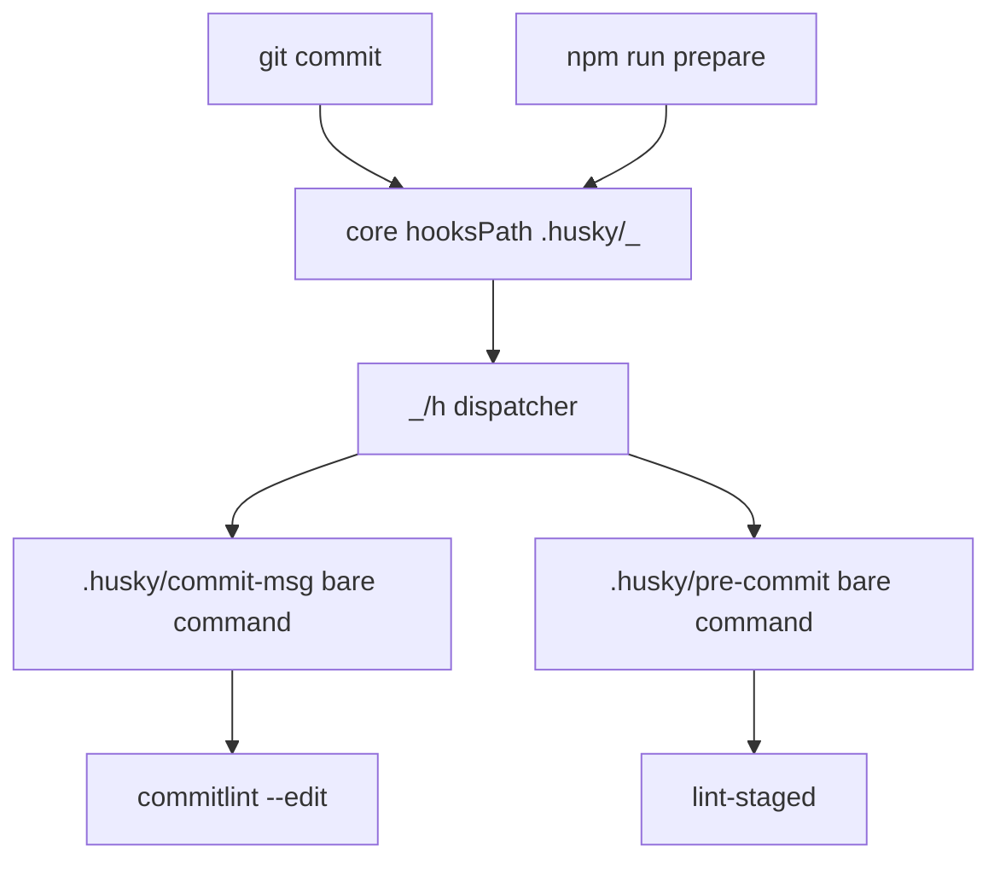

# Husky Hook Plan — Pin v9.1.7, Remove Deprecated Sourcing, Be v10-Ready

## 1. Root Cause of the Warning

Installed [`husky 9.1.7`](package.json:65) replaced [`husky.sh`](.husky/_/husky.sh:1) with a deprecation stub that only echoes:

> husky - DEPRECATED / Please remove the following two lines / They WILL FAIL in v10.0.0

The tracked user hooks previously sourced that stub:

- [`commit-msg`](.husky/commit-msg:1) lines 1-2: shebang + `. "$(dirname "$0")/_/husky.sh"`
- [`pre-commit`](.husky/pre-commit:1) lines 1-2: same header

Every `git commit` therefore:

1. Git uses `core.hooksPath` from [`.git/config`](.git/config:7) pointing at [`_`](.husky/_/h:1).
2. Dispatcher [`h`](.husky/_/h:1) runs `sh -e` on the user hook.
3. The user hook sourced [`husky.sh`](.husky/_/husky.sh:1), which prints the warning.
4. In v10 that file is deleted, so `sh -e` aborts and all commits fail.

New v9/v10 architecture confirmed in [`index.js`](node_modules/husky/index.js:8):

- `git config core.hooksPath` set to `.husky/_`
- `_/.gitignore` contains `*`, so `_` is generated and never committed
- `_` holds dispatcher [`h`](node_modules/husky/husky:1) plus per-hook shims sourcing `h`
- User hooks in [`.husky/`](.husky/commit-msg:1) must be bare commands with no sourcing

## 2. Decision: Stay on v9.1.7

`npm view husky` reports `latest: 9.1.7` — no v10 release exists in the registry, so `husky@^10.0.0` is unresolvable (`ETARGET`). The plan pins [`package.json`](package.json:65) and [`package-lock.json`](package-lock.json:41) to `husky: ^9.1.7` and makes the hooks v10-ready now, so a future v10 bump is a version-only change.

## 3. What Will Be Deprecated / Removed at v10

| #   | v9 status (evidence)                                                                                                 | v10 consequence                                                            | Replacement (proposed)                                                                                                                                                                                                  |
| --- | -------------------------------------------------------------------------------------------------------------------- | -------------------------------------------------------------------------- | ----------------------------------------------------------------------------------------------------------------------------------------------------------------------------------------------------------------------- |
| 1   | User hooks sourcing `_/husky.sh` trigger the stub in [`husky.sh`](.husky/_/husky.sh:1)                               | File deleted; `sh -e` aborts every hook, all commits fail                  | Bare user hooks: [`commit-msg`](.husky/commit-msg:1) contains only `npx --no -- commitlint --edit "$1"`; [`pre-commit`](.husky/pre-commit:1) contains only `npx lint-staged`; no shebang, no sourcing (already applied) |
| 2   | `husky install` prints DEPRECATED but still runs ([`bin.js`](node_modules/husky/bin.js:24))                          | Expected removal; `npm run prepare` would fail if it calls `husky install` | Keep `prepare: husky` (bare command) in [`package.json`](package.json:32); never use `husky install`                                                                                                                    |
| 3   | `husky add`, `husky set`, `husky uninstall` already hard-fail with exit 1 ([`bin.js`](node_modules/husky/bin.js:23)) | Remain removed                                                             | Create/edit hook files directly; use `husky init` only for first-time setup                                                                                                                                             |
| 4   | `~/.huskyrc` prints DEPRECATED ([`husky`](node_modules/husky/husky:8))                                               | Expected removal                                                           | Per-user init code goes in `~/.config/husky/init.sh` (or `$XDG_CONFIG_HOME/husky/init.sh`)                                                                                                                              |
| 5   | `HUSKY=0` skip and `HUSKY=2` debug handling in dispatcher [`h`](node_modules/husky/husky:14)                         | No change announced; keep relying on it                                    | No action; document `HUSKY=0` as the supported bypass                                                                                                                                                                   |

## 4. Target State

- [`commit-msg`](.husky/commit-msg:1) contains only: `npx --no -- commitlint --edit "$1"` with trailing newline
- [`pre-commit`](.husky/pre-commit:1) contains only: `npx lint-staged` with trailing newline
- No `#!/usr/bin/env sh`, no `_/husky.sh` sourcing in either file
- [`package.json`](package.json:32) keeps `prepare: husky`; `devDependencies.husky` pinned to `^9.1.7`
- [`package-lock.json`](package-lock.json:41) regenerated; dispatcher [`_`](.husky/_/h:1) regenerated via `prepare`
- [`commitlint.config.cjs`](commitlint.config.cjs:1) and [`.lintstagedrc.cjs`](.lintstagedrc.cjs:1) unchanged — behavior identical, only the wrapper changes

## 5. Completed Verification

1. **Trailing newlines:** both hooks now end with a newline.
2. **Regenerate:** `npm run prepare` completed successfully; [`.git/config`](.git/config:7) remains `core.hooksPath = .husky/_`, and [`_/.gitignore`](.husky/_/.gitignore:1) remains `*`.
3. **Verify commit-msg gate:** a valid `chore: verify husky hooks` message exited 0; an invalid `bad commit message` exited 1; no `husky - DEPRECATED` output appeared.
4. **Verify pre-commit gate:** a staged TypeScript file with an ESLint warning exited 1 through lint-staged; a clean staged TypeScript file exited 0; the clean run reported zero `husky - DEPRECATED` occurrences.
5. **Full verification per build-manifest rule:** `npm run verify` passed typecheck, lint, format, test (149 tests), build, and manifest validation.

## 6. Guardrails

- Do not edit generated [`_`](.husky/_/h:1) files by hand — always regenerate via `prepare`.
- Do not re-add shebang or sourcing lines — the dispatcher runs hooks via `sh -e`, so they are redundant and will break at v10.
- Do not change [`commitlint.config.cjs`](commitlint.config.cjs:1) scopes or [`.lintstagedrc.cjs`](.lintstagedrc.cjs:1) commands in this task.
- Do not bump to v10 until the registry publishes it; re-run `npm view husky version` at that time — the hooks will need no changes.

## 7. Acceptance Criteria

- `git commit` shows zero `husky - DEPRECATED` lines.
- `git config core.hooksPath` returns `.husky/_`.
- Both hooks are 1-line bare commands with trailing newlines.
- Invalid conventional-commit message still rejected; lint-staged still blocks on lint error.
- `npm run verify` chain passes.
