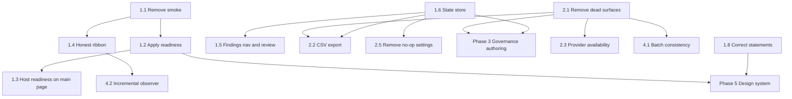

# ToneForge — Implementation Plan

Derived from [`plans/capability-ux-audit-and-implementation-plan.md`](capability-ux-audit-and-implementation-plan.md).
This file is the executable task list: ordered work items, each independently
implementable by Code mode, with exact files, tests, risks, acceptance criteria,
and a conventional-commit scope.

Status: proposed, awaiting approval
Canonical status remains [`ROADMAP.md`](../ROADMAP.md); this plan does not replace it.

## How to execute

1. Work items are ordered. Do not start a later item before its stated
   dependency is merged.
2. Each item ends with `npm run verify` (typecheck → lint → format → test → build
   → manifest validate), per `.roo/rules/zoo-rules-build-manifest.md`. No partial
   runs, no skipped step.
3. Each item names its commit scope. Commit type must be one of the types in
   `commitlint.config.cjs`; scope must match the stage or phase named
   (`.roo/rules/zoo-rules-commit-docs.md`).
4. Architectural decisions are recorded as ADRs in
   [`docs/decision-log.md`](../docs/decision-log.md). The next ADR number is
   **0058**; take 0058, 0059, … in order and do not renumber.
5. After any item that changes a stage's status, update
   [`docs/project-state.md`](../docs/project-state.md).

## Constraints that apply to every item

- `src/core/domain/**` may import only `zod` and `shared/utils`
  ([`eslint.config.mjs`](../eslint.config.mjs:60)).
- `src/rules/**` may import only `core/domain` and `shared/utils`
  ([`eslint.config.mjs`](../eslint.config.mjs:108)).
- `src/changes/**` may import only `core/domain` and `shared/utils`
  ([`eslint.config.mjs`](../eslint.config.mjs:228)).
- `src/reformat/**` must not import `taskpane` or `commands`
  ([`eslint.config.mjs`](../eslint.config.mjs:258)).
- `src/analysis/consistency/**` must not import `word`, `taskpane`, `commands`,
  `reformat`, or `changes` — ADR-0052's single exception
  ([`eslint.config.mjs`](../eslint.config.mjs:194)).
- No `any`. `import type` for type-only imports. No `for` statements. No
  `console.log`. Coverage gate is 80% lines/statements/functions/branches across
  the `include` list in [`vitest.config.ts`](../vitest.config.ts:16) — note that
  `src/taskpane/**` is **not** in that list, so taskpane changes are gated by
  component tests, not by the coverage number.
- Tests mirror `src/`: `src/word/x.ts` → `tests/unit/word/x.test.ts`.

---

# Phase 1 — Make the existing loop reachable and honest

Nothing in this phase adds a feature. Everything in it makes an already-built
capability reachable, and removes statements the runtime cannot back.

## Item 1.1 — Deprecate and remove the Stage 18 smoke path

**Goal.** Remove the only code path that can arm the mutation gate without going
through `prepareTrackedEditing`.

**Why first.** [`src/word/smokeApply.ts:35`](../src/word/smokeApply.ts:35)
exports `enableSmokeMutations()`, which calls `setStage01Passed(true, caps)`
directly. The user-visible invariant "Track Changes can never be bypassed" is
stated at [`DebuggingPanel.tsx:114`](../src/taskpane/components/DebuggingPanel.tsx:114)
and [`TrackedEditingSettingsSection.tsx:90`](../src/taskpane/components/TrackedEditingSettingsSection.tsx:90).
As long as that function ships, neither statement is true.

**Files to delete.**

- `src/taskpane/components/SmokePanel.tsx`
- `src/taskpane/components/smokePlan.ts`
- `src/word/smokeApply.ts`
- `tests/unit/taskpane/components/smokePlan.test.ts`
- `tests/unit/word/smokeApply.test.ts`

**Files to edit.**

- `src/word/index.ts` — remove the `smokeApply` re-exports.
- `src/reformat/orchestrator.ts` — the doc comment at line 127 references
  "Stage 01 capability gate"; rewrite to cite ADR-0058 instead of the stage.
- `docs/project-state.md:54` — the "Deprecated smoke helpers remain for
  historical reproduction only" note becomes "removed in Phase 1; the live
  evidence record in `manual-verification.md` is retained as evidence, not as a
  tool."
- `ROADMAP.md:364` — the open question "Whether to retain the deprecated smoke
  panel in the release candidate UI" is answered: removed.
- `docs/decision-log.md` — new ADR-0058.

**Verification steps.**

1. `search_files` for `smoke` across `src/` returns nothing.
2. `npm run verify`.
3. `npm run test:coverage` — the 80% gate must still pass. Removing tested code
   lowers the denominator, so this can only improve; confirm it did not drop.

**Risk.** None. Verified: nothing under `src/` imports these three modules.

**Acceptance.** No `smoke` symbol exists in `src/`. The Stage 01 gate is
reachable only through `prepareTrackedEditing`. ADR-0058 recorded.

**Commit.** `refactor(word): remove deprecated Stage 18 smoke mutation path`

---

## Item 1.2 — Pass a truthful apply-readiness reason

**Goal.** Make Apply fail-closed in the UI rather than at click time.

**Current defect.** [`PendingChanges.tsx:16`](../src/taskpane/components/PendingChanges.tsx:16)
declares `applyDisabledReason`, and lines 58-65 already gate `canApply` and wire
`aria-describedby` on it. [`Dashboard.tsx:619-629`](../src/taskpane/pages/Dashboard.tsx:619)
never passes it. A user on a host without revision support sees an enabled
Apply, clicks, and only then reads "This Word host does not expose the revision
capability."

**Files to edit.**

- `src/taskpane/pages/Dashboard.tsx` — add a `useMemo` computing the reason from
  state already held: `caps` (line 159), `pendingPlan` (line 520), and
  `isTrackedEditingEnabled()` imported from `src/reformat`. Pass it to
  `PendingChanges` at line 619.
- `src/taskpane/components/PendingChanges.tsx` — add an optional
  `onOpenSettings?: () => void` so a readiness reason can offer the resolving
  action, matching the pattern already used in
  [`AiReviewSection.tsx:119`](../src/taskpane/components/AiReviewSection.tsx:119).

**New pure helper.** `src/taskpane/settings/applyReadiness.ts`

```ts
export function applyReadinessReason(input: {
  enabled: boolean;
  supportsRevisions: boolean | null;
  changeTypes: readonly string[];
  capabilities: WordCapabilities | null;
}): string | null;
```

It must stay free of Office, LLM, and React imports so it is unit-testable
directly, matching the pattern in
[`src/taskpane/settings/settingsModel.ts`](../src/taskpane/settings/settingsModel.ts:1).
Reuse [`getUnsupportedChangeIds`](../src/reformat/trackedEditing.ts:69) rather
than reimplementing the capability map — but note `getUnsupportedChangeIds`
takes `Change[]`, so pass the plan's changes straight through.

**Precedence of reasons** (most specific first, and only one is shown):

1. Plan-level blocks already handled inside `PendingChanges` (schema, stale,
   conflicts, approval, precondition, coverage) — these stay local.
2. Tracked editing disabled → name Settings.
3. `supportsRevisions === false` → name the host limitation.
4. A change type the host lacks → name the operation, e.g. "This host cannot
   apply paragraph-format changes."

**Tests.**

- `tests/unit/taskpane/settings/applyReadiness.test.ts` — all four branches plus
  `null` when ready.
- Extend `tests/unit/taskpane/components/PhaseCComponents.test.tsx` (or add
  `PendingChanges.test.tsx`): with `applyDisabledReason` set, the button label is
  "Apply unavailable", `aria-describedby` resolves to the reason element, and
  clicking does not call `onApply`.

**Risk.** Low. The prop and its a11y wiring already exist and are exercised.

**Acceptance.** With tracked editing off, Apply renders disabled with a reason
naming Settings. With an unsupported change type, the reason names the
operation. With a ready host, Apply is enabled and unchanged.

**Commit.** `fix(taskpane): gate Apply on host readiness before the click`

---

## Item 1.3 — Show host readiness on the Document Governance page

**Goal.** The user learns what their host can do before planning, not after
applying.

**Current defect.** [`Dashboard.tsx:701`](../src/taskpane/pages/Dashboard.tsx:701)
renders "Host readiness is checked when a review or safe reformat is attempted"
whenever `caps === null` — and never renders the verdict when it is not null.
The probe result from line 205 is used for the observer and nothing else.

**Files to edit.**

- `src/taskpane/pages/Dashboard.tsx` — replace the footnote with a
  `MessageBar` (Fluent, matching the design-system work in Phase 5, or
  `tf-debug-warning` if the Phase 5 work has not landed) stating one of:
  ready / no revision support / probe failed.
- `src/taskpane/components/DebuggingPanel.tsx` — keep the raw JSON, but have it
  link here rather than repeat the verdict.

**Dependency.** 1.2, so the wording is shared rather than duplicated. Put the
verdict string in the same pure helper as `applyReadinessReason` so the two
surfaces cannot disagree.

**Tests.** Component test asserting the three verdicts render, driven from the
pure helper, not from a mocked probe.

**Acceptance.** The main page states this host's apply capability before any
preview exists. The Troubleshooting panel and the main page use one wording.

**Commit.** `feat(taskpane): report host apply readiness on the governance page`

---

## Item 1.4 — Make ribbon commands do what their labels say

**Goal.** Four of seven ribbon buttons currently do not do what they claim.

**Defects to fix, each with evidence.**

| Button                                                                                                        | Current behaviour                                                     | Required behaviour                                                      |
| ------------------------------------------------------------------------------------------------------------- | --------------------------------------------------------------------- | ----------------------------------------------------------------------- |
| Scan Now ([`commandHandlers.ts:57`](../src/commands/commandHandlers.ts:57))                                   | opens the pane, no scan                                               | open the pane **and** trigger `observerRef.current.onDocumentChanged()` |
| Review Selection ([`commandHandlers.ts:37`](../src/commands/commandHandlers.ts:37))                           | routes to whole-document consistency review; the selection is ignored | remove; the capability does not exist                                   |
| Review Document ([`commandHandlers.ts:41`](../src/commands/commandHandlers.ts:41))                            | same target                                                           | rename to **Review for consistency**, single control                    |
| Active Profile / Edit Profile ([`commandDefinitions.json:35,43`](../src/commands/commandDefinitions.json:35)) | identical destination                                                 | collapse to one **Style profile** control                               |
| Findings / Pending Changes                                                                                    | open a section that may be empty                                      | report the current count, or say there is nothing yet                   |

**Files to edit.**

- `src/shared/office/taskpaneNavigation.ts` — change `TaskpaneTarget` from a
  bare string union to a discriminated object or add a second key
  (`ToneForge.ScanRequest`) so the pane can distinguish "open governance" from
  "open governance and scan". Keep `consumeTaskpaneTarget` single-consumption.
- `src/commands/commandHandlers.ts` — rewrite `scanNow` to set the scan request;
  delete `reviewSelection`; rename `reviewDocument`; collapse the profile pair.
- `src/commands/commandRegistry.ts` — the `handlers` record at line 41 is typed
  against the ids in `commandDefinitions.json`, so it fails typecheck until both
  are updated together. This is the intended coupling.
- `src/commands/commandDefinitions.json` — four entries after the collapse.
- `manifest.json` and `manifest.xml` — ribbon controls must match; validated by
  [`scripts/validate-manifest.mjs`](../scripts/validate-manifest.mjs).
- `src/taskpane/pages/Dashboard.tsx` — the target consumer at line 247.

**Tests.**

- `tests/unit/commands/commands.test.ts` — every registry id has a handler;
  every handler sets exactly one navigation target.
- `tests/unit/commands/commandContracts.test.ts` — a new test asserting **no two
  registry entries share a navigation target**, which is what makes the
  Active/Edit Profile duplication detectable in future.
- A Dashboard test asserting that a scan request produces an `onDocumentChanged`
  call and a plain governance target does not.

**Risk.** Medium. Manifest parity is machine-checked; the XML fallback already
uses `ShowTaskpane` with `xmlNavigationTarget: "default"` by design, so the XML
path still cannot deep-link. Do not change that — it is a recorded decision, not
a bug to fix here.

**Acceptance.** Every ribbon label matches the observable result of clicking it.
`npm run validate` and the command contract tests pass.

**Commit.** `fix(commands): make every ribbon action match its label`

---

## Item 1.5 — Make findings navigation and Review real

**Goal.** Two controls produce no visible or durable effect today.

**Defect A — navigation.** [`FindingsToolbar.tsx:33`](../src/taskpane/components/FindingsToolbar.tsx:33)
dispatches `plan/selectFinding`; [`FindingsList.tsx:16`](../src/taskpane/components/FindingsList.tsx:16)
never receives `selectedFindingIndex`. The toolbar announces "Finding 4 of 12"
and nothing is highlighted, scrolled to, or announced as selected.

**Defect B — Review.** [`Dashboard.tsx:454`](../src/taskpane/pages/Dashboard.tsx:454)
`markForReview` mutates a React copy of `status.findings`. The next observer
emission overwrites it. Worse, [`GovernanceDashboard.tsx:58`](../src/taskpane/components/GovernanceDashboard.tsx:58)
counts `reviewed` as **open**, so a reviewed finding still inflates the
mandatory count.

**Files to edit.**

- `src/taskpane/components/FindingsToolbar.tsx` — add `aria-controls` pointing at
  the list, and label the buttons with the destination position
  ("Next finding, currently 3 of 12").
- `src/taskpane/components/FindingsList.tsx` — accept `selectedIndex`, render as
  `role="listbox"` with `role="option"` cards, and expose
  `id="tf-findings-list"` for `aria-controls`.
- `src/taskpane/components/FindingCard.tsx` — accept `selected`, render
  `aria-current="true"` and a `.tf-finding-card-selected` class; scroll into
  view on selection change via a `ref` + `scrollIntoView({ block: "nearest" })`
  guarded so it does not fire during initial render.
- `src/taskpane/taskpane.css` — one new rule for the selected state using the
  existing `--tf-accent` token (line 8), not a literal.
- `src/taskpane/pages/Dashboard.tsx` — pass `selectedIndex` through; replace
  `markForReview` with a persisted call.
- `src/word/documentObserver.ts` — add `reviewFinding(fingerprint, status)` to the
  returned object so the owner of `state.findings` mutates its own state, and
  include reviewed findings in the emitted list.
- `src/taskpane/findingFingerprint.ts` — reuse; the ignore path already persists
  fingerprints to `localStorage` under
  `ToneForge.IgnoredFindingFingerprints.v1`
  ([`Dashboard.tsx:54`](../src/taskpane/pages/Dashboard.tsx:54)). Add a parallel
  reviewed store rather than a new persistence mechanism, so a reviewed finding
  survives a rescan without a state-schema change.
- `src/taskpane/components/GovernanceDashboard.tsx` — decide and document
  whether `reviewed` counts as open. Recommendation: count separately, e.g.
  "Mandatory 2 · Advisory 5 · Reviewed 3", because "reviewed" means _seen_, not
  _fixed_, and folding it into "open" is what makes the number feel wrong.

**Boundary note.** `word/` must not import `taskpane/`, and `findingFingerprint`
lives in `taskpane/`. The observer therefore takes a plain string fingerprint,
not the helper — the Dashboard computes it and passes it in. Check
[`eslint.config.mjs`](../eslint.config.mjs:258) before adding any import.

**Tests.**

- `tests/unit/taskpane/components/FindingsToolbar.test.tsx` — extend: the
  position text, `aria-controls`, and that Next/Previous dispatch.
- New `tests/unit/taskpane/components/FindingsList.test.tsx` — selected card
  carries `aria-current`; listbox roles present.
- `tests/unit/word/documentObserver.test.ts` — extend: a reviewed finding is
  still emitted as `reviewed` after a subsequent scan.
- `tests/unit/taskpane/pages/DashboardNoProfile.test.tsx` style render test for
  the reviewed counts.

**Risk.** Medium. The observer's emission contract changes, and several
components consume it.

**Acceptance.** Next/Previous visibly selects, scrolls, and is announced once.
A reviewed finding stays reviewed across a rescan. The governance counts name
reviewed separately.

**Commit.** `feat(taskpane): make finding navigation and review state real`

---

## Item 1.6 — Replace render-time `loadState()` with a store

**Goal.** Settings changes take effect immediately, and no storage read happens
during render.

**Current defect.** `loadState()` is called in three render bodies:
[`Dashboard.tsx:521`](../src/taskpane/pages/Dashboard.tsx:521),
[`Dashboard.tsx:638`](../src/taskpane/pages/Dashboard.tsx:638), and
[`ReformatPanel.tsx:52`](../src/taskpane/components/ReformatPanel.tsx:52).
Nothing re-renders when a Settings section saves, so a consent or provider change
made in Settings is not visible until the user navigates away and back. The
OpenRouter component already documents the same trap it hit
([`OpenRouterConnectionSettings.tsx:38`](../src/taskpane/components/OpenRouterConnectionSettings.tsx:38)).

**New file.** `src/taskpane/state/usePersistedState.ts`

- Module-level `Set<() => void>` of subscribers.
- `subscribe(listener)` / `notify()` exported from a thin wrapper that
  `src/core/state` calls after a successful `saveState`. Prefer wrapping the
  existing `saveState` export in a taskpane-side module rather than editing
  `core/state`, so `core/state` stays Office-agnostic and its tests are
  unaffected.
- `usePersistedState(): PersistedState` using `useSyncExternalStore`, with
  `getSnapshot` returning a stable reference — memoize on a change counter, not
  on object identity, or React will loop.
- Export a `__resetPersistedStore()` for tests; `vitest.config.ts:36-38` sets
  `restoreMocks`/`clearMocks`, so module state must be resettable.

**Files to edit.** The three call sites above, plus
`src/taskpane/components/ProviderPrivacySettingsSection.tsx` and
`src/taskpane/components/TelemetrySettingsSection.tsx` can drop their
`loadState()`-then-`useState` pattern (lines 51-53 and 13-15 respectively).

**Tests.** `tests/unit/taskpane/state/usePersistedState.test.tsx`: mount two
consumers, save, both re-render; a save that throws leaves subscribers
consistent; `__resetPersistedStore` clears between tests. Add a lint-style guard
test or a grep-based script check that no `src/taskpane/**/*.tsx` file contains
`loadState()` inside a render body.

**Risk.** Medium. `useSyncExternalStore` reference stability is the classic
failure here; get it wrong and the pane render-loops. Prototype the snapshot
identity first.

**Acceptance.** Flipping a Settings toggle updates every mounted surface in the
same render pass. No `loadState()` remains in a render body anywhere under
`src/taskpane/`.

**Commit.** `refactor(taskpane): read persisted state through a store`

**Blocks.** 2.2 (export needs live plan state), 3 (governance authoring needs
observable policy state).

---

## Item 1.7 — Keep the app frame on the first-run profile gate

**Goal.** A user with no profile is not locked out of Settings.

**Current defect.** [`Dashboard.tsx:141-153`](../src/taskpane/pages/Dashboard.tsx:141)
returns a bare `<main className="tf-card">` with no `TaskPaneHeader`. Settings,
Troubleshooting, and the theme control are unreachable until a profile exists —
including the consent toggle the user may need before trusting any AI feature.

**Files to edit.** `src/taskpane/pages/Dashboard.tsx` — render
`TaskPaneHeader` in the no-profile branch; allow navigation to `settings` and
`troubleshooting`; keep `home` and `ai-review` disabled with the existing
"needs a style profile" reason.

**Tests.** `tests/unit/taskpane/pages/DashboardNoProfile.test.tsx` — extend:
with no profile, the header renders and Settings is reachable; Scan and Apply
remain unavailable with an explanation.

**Risk.** Low.

**Acceptance.** Settings is reachable before a profile exists. The header shows
the correct active page. No governance action is enabled without a profile.

**Commit.** `feat(taskpane): keep navigation available before the first profile`

---

## Item 1.8 — Correct four untrue statements

**Goal.** Remove specific places where the interface asserts something false.

**Four fixes, each with evidence.**

1. **Wrong location in an error string.**
   [`trackedEditing.ts:88`](../src/reformat/trackedEditing.ts:88) returns
   "Enable it in Troubleshooting before applying." ADR-0055 moved the toggle to
   Settings ([`TrackedEditingSettingsSection.tsx`](../src/taskpane/components/TrackedEditingSettingsSection.tsx)).
   Fix the string. Add a test asserting the message names Settings.

2. **A host outage reported as document staleness.**
   [`documentObserver.ts:184-190`](../src/word/documentObserver.ts:184) sets
   `phase: "failed"` **and** `stale: true` when the error mentions Office. The
   banner at
   [`StaleBanner.tsx:40`](../src/taskpane/components/StaleBanner.tsx:40) then
   says "The document has changed since the last scan", which is false.
   Add a `hostUnavailable: boolean` to `DocumentObserverStatus`; when true,
   render a host-outage message with the Re-scan action and do not render the
   stale banner. `stale` keeps its meaning.

3. **A mislabelled destructive action.**
   [`ProviderPrivacySettingsSection.tsx:154`](../src/taskpane/components/ProviderPrivacySettingsSection.tsx:154)
   is labelled "Clear legacy stored credential", but
   [`persistence.ts:280`](../src/core/state/persistence.ts:280) also resets the
   provider to `mock` and empties every connection. Either rename to "Reset
   provider to offline stub" or split into two buttons. Recommend the rename,
   with a confirmation `MessageBar` stating the consequence.

4. **Documentation that contradicts the code.**
   - [`docs/ux-state-matrix.md:42-44`](../docs/ux-state-matrix.md:42) lists
     selection/paragraph/context-menu states that no component implements.
   - [`docs/ux-state-matrix.md:126`](../docs/ux-state-matrix.md:126) says the
     tracked-editing toggle lives in Troubleshooting.
   - [`README.md:85`](../README.md:85) says no Phase H engine is implemented;
     [`project-state.md:37`](../docs/project-state.md:37) records Phase 5 as
     delivered.

**Tests.** One component test per user-visible string that names a capability
or a location. This is the pattern that stops the class of defect recurring.

**Gate.** `npm run docs:validate` plus one human read of the three docs.

**Acceptance.** No user-visible string asserts a fact the runtime contradicts.

**Commit.** `fix(taskpane): correct four untrue user-facing statements`

---

**Phase 1 gate.** An end-to-end manual pass in desktop Word: a user with no
profile reaches Settings, creates a profile, sees a truthful apply readiness
before previewing, previews, applies a tracked change, rejects one, and reads the
verification result — with no message untrue at the moment it is shown. Record
the result in [`docs/manual-verification.md`](../docs/manual-verification.md).

---

# Phase 2 — Consolidate and de-duplicate

## Item 2.1 — Remove the dead Phase D/E surfaces

**Goal.** No symbol in `src/` without a production caller.

ADR-0055 removed the entry points by design. What remains is the engines, their
orphaned components, and their tests — which read as live capability to the next
maintainer and inflate coverage with unreachable code.

**Delete outright** (verified: imported only by tests).

- `src/taskpane/components/FullReviewPreflight.tsx`
- `src/taskpane/components/FullReviewProgress.tsx`
- `src/taskpane/components/FullReviewResults.tsx`
- `src/taskpane/components/AiReviewEntry.tsx`
- `src/taskpane/components/AiReviewResult.tsx`
- `src/taskpane/components/AiUnavailable.tsx`
- `src/taskpane/components/ConsistencyReviewEntry.tsx`
- `src/taskpane/components/navigationController.ts` → actually
  `src/taskpane/workflow/navigationController.ts`
- `src/ai/prompts/rewritePrompts.ts` and its export in
  `src/ai/prompts/index.ts:9`
- `tests/unit/taskpane/components/FullReviewUi.test.tsx` (minus the
  `ConsistencyReview*` cases, which move to
  `consistencyReview.test.tsx` where they already partly live)
- `tests/unit/taskpane/workflow/navigationController.test.ts`
- `tests/unit/ai/prompts/rewritePrompts.test.ts`

**Decide, do not delete blindly.**

- `src/ai/review/documentEditorialReview.ts` and `src/ai/review/spotReview.ts`
  are the only implementations of bounded batching and model-produced
  corrections. The engines themselves are genuinely useful, but the review
  pipeline that wrapped them is retired.
- `src/ai/review/batcher.ts` (`partitionReviewBatches`) is a **good** primitive
  and the consistency engine needs it — see 4.1. **Salvage it** into
  `src/analysis/consistency/batching.ts` before deleting its siblings.
- `src/ai/review/consolidator.ts`, `contextMinimizer.ts`, and
  `responseValidator.ts` — check each for a live caller; the last two may be
  useful to 4.3.

**Clean up the re-export that made the dead path reachable.**
[`src/reformat/index.ts:13`](../src/reformat/index.ts:13) exports
`reviewEntireDocument` and line 1 exports `FullReviewResult`, and
[`Dashboard.tsx:520`](../src/taskpane/pages/Dashboard.tsx:520) passes `null` for
both the full and spot arguments to `resolvePendingPlan` while line 5 imports
`SpotReviewResult`. Collapse `resolvePendingPlan` to take the reformat result
only, and delete the two dead parameters. Its test is
[`Dashboard.test.ts:34`](../tests/unit/taskpane/pages/Dashboard.test.ts:34).

**ADR.** 0059: "Phase D/E review surfaces are removed; their engines are
retained or deleted per item, and the deterministic-first rule is unchanged."

**Acceptance.** Every export in `src/` has a production caller, or is named in a
dated ADR as deliberately reserved. `npm run verify` green and
`npm run test:coverage` still at or above 80%.

**Commit.** `refactor(ai): remove retired review surfaces and orphaned components`

---

## Item 2.2 — Wire the revisions CSV export

**Goal.** Give the user a durable answer to "what will change in this document".

**Why worth wiring.** [`toRevisionsCsv`](../src/changes/exportAdapter.ts:14) is
implemented, tested, coverage-gated, and unreachable. It is the natural companion
to tracked edits: a reviewer receiving a tracked-changes document needs the
list, and most reviewers will not open the add-in.

**Files.**

- `src/changes/exportAdapter.ts` — keep `toRevisionsCsv`. **Delete
  `toAuditJson`**: a generic `JSON.stringify` wrapper over an unknown value is
  not an audit format, and nothing calls it.
- `src/changes/index.ts` — export `toRevisionsCsv`. Note the boundary at
  [`eslint.config.mjs:228`](../eslint.config.mjs:228): `changes/` may import only
  `core/domain` and `shared/utils`. The download plumbing must therefore live in
  the UI, not here.
- New `src/taskpane/components/ExportChangesButton.tsx` — the only place that
  creates a `Blob` and an object URL, revokes it on completion, and triggers the
  download. Keeps the boundary intact.
- `src/taskpane/components/PendingChanges.tsx` — render the button only when
  `coverage?.complete === true`. When incomplete, the button is disabled with
  the existing coverage reason already rendered at line 121.
- `src/taskpane/pages/Dashboard.tsx` — pass the current plan and findings.

**Tests.**

- `tests/unit/changes/` — extend for the CSV content: quoting, the 240-char
  split behaviour (line 10), and the `FAILED_COVERAGE` throw.
- `tests/unit/taskpane/components/` — new test: the button is disabled with
  incomplete coverage; clicking with complete coverage creates and revokes an
  object URL.

**Risk.** Low-medium. `changes/` cannot import the browser APIs, so the split
between the pure serialiser and the download is load-bearing, not stylistic.

**Acceptance.** CSV downloads one row per change; the button is disabled with an
`aria-describedby` reason when coverage is incomplete; no object URL leaks.

**Commit.** `feat(changes): expose the revisions CSV export from pending changes`

---

## Item 2.3 — Reconcile the OAuth contradiction

**Goal.** Stop shipping two sources of truth about provider authentication.

**The contradiction.** [`oauthState.ts:80`](../src/ai/gateway/oauthState.ts:80)
`resolveAuthMode("anthropic") === "oauth"` and OpenAI is `"featureGated"`. The
Provider dropdown at
[`ProviderPrivacySettingsSection.tsx:37`](../src/taskpane/components/ProviderPrivacySettingsSection.tsx:37)
tells the user both are "Deployment-managed. The gateway holds the credential;
the add-in never sees it." One is wrong.

**Decision (recommended, ship now).** Given ADR-0050 and the absence of a
production gateway, the honest answer today is **OpenRouter via broker API key
only**. Mark Anthropic and OpenAI as unavailable in this build, with the reason
shown, and gate the OAuth reducer behind an explicit env flag so it ships
dormant rather than contradicting the UI.

**Files.**

- `src/taskpane/settings/settingsModel.ts` — add an `availability` field to
  `ProviderOption` and render unavailable options disabled with a reason, using
  the existing `authNote` pattern.
- `src/taskpane/settings/providerComposition.ts` — refuse to construct a
  connection for an unavailable provider; return `undefined` so the registry
  falls back to mock (the existing fail-closed path at line 50).
- `src/core/config/env.ts` — add the explicit flag, validated by Zod per the
  existing pattern.
- ADR-0060 recording the availability decision and its expiry condition.

**Alternative (higher value, later).** Implement the Anthropic OAuth connect
flow against the gateway, turning the state machine from test-only into a real
surface. Defer until a production gateway exists — that is a credential-custody
decision, not a UI one.

**Acceptance.** Every provider the dropdown offers is one the runtime can reach.
No option reads as functional and is not. Selecting an unavailable provider
explains why in one sentence.

**Commit.** `fix(ai): make provider availability match runtime reachability`

---

## Item 2.4 — Adopt or delete `useAnnouncement`

**Goal.** One live-region strategy, not three.

[`useAnnouncement`](../src/taskpane/settings/useAnnouncement.ts:20) was written
to collapse bursts of status updates into one announcement after a quiet period.
It is not used. Meanwhile
[`GovernanceDashboard.tsx:71`](../src/taskpane/components/GovernanceDashboard.tsx:71),
[`PendingChanges.tsx:112`](../src/taskpane/components/PendingChanges.tsx:112),
[`FindingCard.tsx:112`](../src/taskpane/components/FindingCard.tsx:112),
[`ProfileRecordSection.tsx:215`](../src/taskpane/components/ProfileRecordSection.tsx:215),
and the Dashboard's apply message all declare their own live regions.

**Decision.** Adopt it in the Dashboard for the observer/apply message stream,
where bursts actually occur (scan phase changes, apply result, navigation
feedback). Keep the single-purpose regions in the leaf components: a finding
card's navigation result is not a burst and collapsing it would delay a
per-card message the user is waiting on.

**Files.** `src/taskpane/pages/Dashboard.tsx`; delete
`tests/unit/taskpane/settings/useAnnouncement.test.tsx` only if the hook is
deleted — it is not, so the test stays.

**Acceptance.** Scan-phase and apply messages go through one debounced region.
Leaf components keep their own. No component declares two live regions for the
same content.

**Commit.** `refactor(taskpane): adopt the announcement queue for status bursts`

---

## Item 2.5 — Remove the two no-op consents and the telemetry section

**Goal.** No Settings control that changes nothing.

**Targets.**

- `settings.spotReviewConsent` and `settings.fullDocumentReviewConsent` —
  persisted at [`persistence.ts:48`](../src/core/state/persistence.ts:48), carried
  in the draft at
  [`settingsModel.ts:84`](../src/taskpane/settings/settingsModel.ts:84),
  normalised at [`migration.ts:452`](../src/core/state/migration.ts:452). No UI
  control, no engine reads them. Only `consistencyReviewConsent` is exposed.
- `telemetryDisabled` — a full section with save/cancel at
  [`TelemetrySettingsSection.tsx`](../src/taskpane/components/TelemetrySettingsSection.tsx);
  the MessageBar at line 47 admits no endpoint exists.

**Files.** `src/core/state/persistence.ts`, `src/core/config/env.ts` if it is
referenced, `src/taskpane/settings/settingsModel.ts`,
`src/core/state/migration.ts`, `src/taskpane/components/TelemetrySettingsSection.tsx`
(delete), `src/taskpane/components/SettingsForm.tsx:25` (remove the import), plus
every state fixture under `tests/fixtures/` and the state tests.

**Migration.** Per ADR-0015 and the rule in
`.roo/rules/zoo-rules-persistence-state.md`, do **not** edit v9. Add **v10**:
bump `CURRENT_STATE_VERSION`, add a step that drops the three fields, keep the
consent that matters, and bump `STORAGE_KEY` to `ToneForge.State.v10` while
`LEGACY_STORAGE_KEYS` gains `ToneForge.State.v9`.

**Tests.**

- New `tests/unit/core/state/migration-v10.test.ts` mirroring
  `migration-v9.test.ts`: a v9 record migrates, loses the dead fields, keeps
  `consistencyReviewConsent` exactly, and does not inherit it from either removed
  field.
- Update `profileStateBudget.test.ts` for the new payload size.

**Risk.** Medium. This is a state-schema change with a live migration path.

**Acceptance.** The Settings page contains only controls that change behaviour.
A v9 user migrates without losing their provider connection or AI Review
consent.

**Commit.** `refactor(state): drop permissions and telemetry that gate nothing`

---

**Phase 2 gate.** `src/` contains no symbol without a production caller. The
Provider dropdown lists only reachable providers. The Settings page contains
only controls that change behaviour.

---

# Phase 3 — Governance policy authoring

The one genuinely missing capability, and the largest single item.

**The gap.** [`GovernanceProfileSchema`](../src/core/domain/GovernanceProfile.ts:108)
models `rules`, `terminology`, `scope`, `protection`, and `editorial`, and
[`resolveResolvedPolicy`](../src/core/domain/ResolvedPolicy.ts:131) gives them
precedence over learned evidence. But
[`saveProfileRecord`](../src/core/state/persistence.ts:325) overwrites only
`style` (lines 331-338). No UI can author a `GovernanceRule`, set a protection
override, or change scope. The entire normative half of the policy contract is
written by nobody, so it is always the schema defaults.

**User value.** A governance author can say "these rules are mandatory, these
are advisory, never auto-fix quoted text, skip headers and footers" instead of
editing numeric thresholds. It also makes "Mandatory / Advisory" in the
governance dashboard a real policy rather than a label derived from
`severity === "error"`.

**Files.**

- `src/core/state/persistence.ts` — add
  `updateGovernancePolicy(id, policy): GovernanceProfile` that bumps `version`,
  appends to `governanceHistory`, and calls `saveState`. Reuse the existing
  `appendGovernanceSnapshot` at line 306.
- `src/core/state/profileSelectors.ts` — add
  `selectGovernancePolicy(state, styleProfileId)`.
- `src/core/domain/GovernanceProfile.ts` — add a `source` discriminator to
  `GovernanceRuleSchema` binding a rule to a real finding category, so
  `autoFix` and `severity` mean something at plan time. This is a schema
  addition; bump to v10 alongside 2.5 or coordinate the two migrations.
- New `src/taskpane/components/GovernancePolicySection.tsx` — rule list with
  per-rule severity, auto-fix, and protected-behaviour controls; protection
  checkbox groups; scope checkbox groups; terminology editor reusing the
  `term: replacement` parser already proven in
  [`ProfileEditor.tsx:159`](../src/taskpane/components/ProfileEditor.tsx:159).
- `src/taskpane/pages/Profile.tsx` — render it alongside
  `ProfileRecordSection`.
- `src/taskpane/components/ProfileEditor.tsx:33` — pass a current governance
  profile to `VersionDiff`, whose governance branch at
  [`VersionDiff.tsx:32`](../src/taskpane/components/VersionDiff.tsx:32) already
  exists and has never been rendered with both arguments.

**Planner work.** A rule with `autoFix: true` and `severity: "mandatory"` must
actually drive [`changes/planner.ts:73`](../src/changes/planner.ts:73), which
currently derives the policy from the finding alone via
`approvalPolicyForFinding`. Bind the governance rule first, then the finding.
`changes/` may import only `core/domain` and `shared/utils`
([`eslint.config.mjs:228`](../eslint.config.mjs:228)), and `GovernanceProfile`
is in `core/domain`, so this is allowed.

**Risks and mitigations.**

- _Widening exclusions could game the coverage gate._ Mitigation: a test that
  refuses a scope policy with `includeBody: false` **and** all content categories
  false. The coverage banner must name the excluded set (it already does, at
  [`CoverageBanner.tsx:54`](../src/taskpane/components/CoverageBanner.tsx:54)).
- _Making protection editable turns a safety default into a preference._
  Mitigation: `protectQuotedText`, `protectCaptions`, and
  `protectTrackedDeletions` are shown as on-by-default with an explicit
  confirmation when turning one off. Never silently permissive.
- _Every governance change is a policy change._ Mitigation: version bump plus
  history append, and `ChangePlan` already cites
  `governancePolicyRevision`
  ([`orchestrator.ts:170`](../src/reformat/orchestrator.ts:170)) so a plan built
  under an older policy is refused.

**Tests.**

- Round-trip through state v10: edit policy → reload → identical.
- Rule edit → the corresponding finding's severity in the next scan.
- Protection override → `isProtectedNode` returns true for the configured node.
- `autoFix: false` on a rule → the planner produces no change for it.
- Scope edit → the coverage report's `excluded` list changes accordingly and
  `complete` reflects it.
- Governance version cited in `ChangePlan` matches the edited policy, and an
  apply against a stale revision is refused.

**Acceptance.** A user can change a rule from advisory to mandatory, restrict
analysis scope, mark quoted text as never changed, and see each take effect in
the next scan with the change explained in Pending Changes. The governance
dashboard's mandatory/advisory split reflects authored policy.

**ADR.** 0061: "Governance policy is authorable, versioned, and takes
precedence over learned evidence."

**Dependency.** 1.6 (observable policy state), 2.1 (profile page not crowded
with orphans).

**Commit.** `feat(profile): add governance policy authoring`

---

# Phase 4 — Long-document depth and semantic honesty

## Item 4.1 — Batch the consistency engine

**Goal.** Handle documents beyond 400 statements honestly.

**Current state.** The engine is quadratic and hard-bounded at
`CONSISTENCY_DEFAULT_MAX_STATEMENTS`; the preflight already admits that "a clean
partial result is not a clean document." Meanwhile
[`src/ai/review/batcher.ts`](../src/ai/review/batcher.ts) contains a working
partitioning primitive that is about to be deleted in 2.1.

**Files.**

- New `src/analysis/consistency/batching.ts` — salvage
  `partitionReviewBatches` here in 2.1 rather than deleting it.
- `src/analysis/consistency/engine.ts` — process in windows, retain candidates
  that span a window boundary, report the true examined scope.
- `src/analysis/consistency/contracts.ts` — extend `ConsistencyCoverage` with
  `windowsExamined` and `crossWindowCandidates`.
- `src/taskpane/components/ConsistencyReviewPreflight.tsx` — state the window
  count and the cross-window handling.

**Boundary.** `analysis/consistency/**` may not import `changes`, `reformat`,
`word`, `taskpane`, or `commands`
([`eslint.config.mjs:194`](../eslint.config.mjs:194)). The batching primitive
must not drag `ai/review` imports with it — copy the partitioning logic, not the
module.

**Acceptance.** A document over the statement bound is processed in full or
reports precisely what was not examined. The preflight states the real scope
before the run.

**Commit.** `feat(analysis): batch the consistency engine across long documents`

---

## Item 4.2 — Use the paragraph change events the adapter already produces

**Goal.** Stop rescanning the whole document on every keystroke burst.

**Current state.** [`wordParagraphEvents.ts:62`](../src/word/wordParagraphEvents.ts:62)
normalises `uniqueLocalIds` and computes `requiresFullRescan`.
[`Dashboard.tsx:236`](../src/taskpane/pages/Dashboard.tsx:236) wires the adapter
and line 237 discards the change payload entirely, calling `onDocumentChanged()`.
The observer then examines every acquired node
([`documentObserver.ts:144`](../src/word/documentObserver.ts:144)).

**Files.**

- `src/word/documentObserver.ts` — accept an optional
  `changedNodeIds: readonly string[]`; rescan only those when
  `requiresFullRescan === false`; retain findings from unscanned nodes; fall back
  to a full rescan otherwise. Retention must not resurrect findings for nodes
  that were deleted, which is the conservative-full-rescan bug already fixed in
  Phase 0.
- `src/taskpane/pages/Dashboard.tsx` — pass the change payload through instead of
  discarding it.
- `src/word/documentObserver.ts` — emit the scope actually examined so the
  coverage banner stays truthful.

**Risk.** High, and correctness-critical: a wrong incremental scope means stale
findings presented as current. Mitigation: run both paths and compare in a test
over a fixture document with edits, insertions, and deletions.

**Gate.** This is host-dependent. It cannot be claimed as an improvement without
live evidence in [`docs/manual-verification.md`](../docs/manual-verification.md).
Until then, document it as "incremental where the host reports complete local
ids, conservative full rescan otherwise" — the same wording discipline already
used in [`docs/project-state.md:32`](../docs/project-state.md:32).

**Acceptance.** A paragraph change with complete local ids rescans only those
nodes; an incomplete id set triggers a full rescan; findings for unchanged nodes
are retained; coverage reports the examined scope.

**Commit.** `perf(word): scan only changed paragraphs when the host reports them`

---

## Item 4.3 — Give semantic findings a target span, or withdraw the toggle

**Goal.** Stop shipping a toggle that can only produce unfixable output.

**Current state.** [`deviationEngine.ts:111`](../src/analysis/deviationEngine.ts:111)
marks every semantic finding `nodeIds: []`, `actionable: false`,
`status: "deferred"`, `advisoryReason: "Full-document semantic deviation has no
locally verified target span"`. The planner therefore cannot produce a change.
The observer hard-codes `includeRawText: false`
([`documentObserver.ts:157`](../src/word/documentObserver.ts:157)), and
ReformatPanel sets it from `semanticOptIn` with no registry
([`ReformatPanel.tsx:53`](../src/taskpane/components/ReformatPanel.tsx:53),
line 74 passes a registry only when injected), so the semantic engine falls back
to [`MockAdapter`](../src/analysis/deviationEngine.ts:72). Enabling
`semanticOptIn` today can only produce mock output.

**Two acceptable outcomes. Pick one explicitly; do not leave it as is.**

**Outcome A — resolve the span (preferred).** Require the model to return a
verbatim anchor substring. Search acquired nodes for it; accept only on a unique
match; refuse when ambiguous and say so. Only an anchored finding may be
`actionable`. This reuses the range-translation approach already proven in
[`src/ai/review/responseValidator.ts`](../src/ai/review/responseValidator.ts:25).

**Outcome B — withdraw.** Remove the `semanticOptIn` toggle from
[`ProviderPrivacySettingsSection.tsx:171`](../src/taskpane/components/ProviderPrivacySettingsSection.tsx:171),
remove the semantic branch from the checker, and document that ToneForge's
governance path is deterministic with AI reserved for the opt-in consistency
review — which is exactly what the product's own positioning says.

**Recommendation.** A, because the deterministic-first rule permits semantic
analysis where interpretation is necessary, and style deviation is precisely
that. But B is the correct answer if A cannot be done without a verified
selection-resolution contract in the host, which is currently the open Stage 23
question.

**Tests** (A only). Ambiguous anchor → `actionable: false` with the reason.
Unique anchor → `nodeIds` populated and the range within the node. A model
response with no anchor → refused, not guessed. Non-deterministic engines must
never be called from the observer (ADR-0052).

**Acceptance.** Either semantic findings carry a verified target span and can be
planned, or the toggle is gone and the docs say so.

**Commit.** `fix(analysis): anchor semantic findings to a verified span`

---

# Phase 5 — Design system and accessibility consolidation

**Goal.** One visual language, and evidence for the accessibility claims.

## 5.1 — Replace hardcoded palette literals with tokens

Five components inline Fluent hex values and therefore ignore the dark theme
defined in [`taskpane.css:24`](../src/taskpane/taskpane.css:24):

- [`PendingChanges.tsx:101`](../src/taskpane/components/PendingChanges.tsx:101) —
  `#a4262c`, `#ccc`, `#eee`
- [`StaleBanner.tsx:28`](../src/taskpane/components/StaleBanner.tsx:28) — `#c00`,
  `#fff5f5`
- [`CoverageBanner.tsx:27`](../src/taskpane/components/CoverageBanner.tsx:27) —
  `#a4262c`, `#0b6a0b`, `#fff5f5`, `#f5fff5`
- [`ReformatPanel.tsx:39`](../src/taskpane/components/ReformatPanel.tsx:39)
- [`GovernanceDashboard.tsx:69`](../src/taskpane/components/GovernanceDashboard.tsx:69)

Replace with `--tf-danger`, `--tf-success`, `--tf-warning-bg`,
`--tf-warning-border`, `--tf-border` (lines 10-14) and Fluent v8 components
where one already fits. Add a `prefers-color-scheme` check to the visual
regression notes in [`docs/perf-baselines.md`](../docs/perf-baselines.md).

**Acceptance.** No hex literal remains in a `src/taskpane/components/*.tsx`
style prop. Both themes render every surface.

## 5.2 — Reorder Document Governance

The current order is Findings → Pending Changes → Governance → Stale → Coverage
→ Safe reformat, so the effect appears before the cause. Move Safe reformat above
Findings, and place Pending Changes directly under its trigger.

**Acceptance.** Reading order matches cause and effect.

## 5.3 — Fix the Pending Changes table

No `<caption>`, no `scope` on `<th>`, and no horizontal scroll container for a
five-column table in a pane that can be 320px wide
([`PendingChanges.tsx:129`](../src/taskpane/components/PendingChanges.tsx:129)).
Add all three; move the inline styles to the stylesheet.

**Acceptance.** The table is navigable by screen reader and usable at the
narrowest supported width.

## 5.4 — Record live accessibility evidence

The claims in [`docs/accessibility.md`](../docs/accessibility.md) are
component-test-backed but not host-verified, and the file says so at line 41.
Record real evidence for: the drawer focus trap, Apply refusal reasons, findings
navigation, and the consistency preflight — in
[`docs/manual-verification.md`](../docs/manual-verification.md).

This item requires a human with a screen reader. It cannot be completed by
repository automation, exactly as
[`docs/project-state.md:190`](../docs/project-state.md:190) already states for
the other external gates.

**Commits.** `style(taskpane): adopt design tokens across task pane surfaces`,
`fix(taskpane): reorder governance workflow and fix pending-changes table`.

---

# Explicitly out of scope

| Item                                                                      | Why                                                                                                                                         |
| ------------------------------------------------------------------------- | ------------------------------------------------------------------------------------------------------------------------------------------- |
| Production credential custody                                             | Needs a gateway architecture decision and a threat model; a human-authority gate per [`ROADMAP.md:348`](../ROADMAP.md:348), not a code task |
| Web Chrome / Edge / Mac host matrix                                       | External evidence; unchanged by this plan                                                                                                   |
| Semantic LLM in the typing path                                           | Prohibited by deterministic-first unless a new ADR is accepted; ADR-0052 is a single named exception for the consistency engine only        |
| Multiple active profiles, document-scoped profiles, header profile picker | The one-canonical-profile rule at [`ROADMAP.md:40`](../ROADMAP.md:40) forbids it; the picker inside `ProfileEditor` is the supported path   |
| A public `src/ui/` directory                                              | UI lives in `src/taskpane/`; the scaffold skill's placement guide is explicit                                                               |

---

# Effort summary and dependency order

Effort: **XS** one focused change · **S** ~1 day · **M** ~2-4 days · **L** ~1-2
weeks. No time estimates, per the mode constraint.

| ID      | Item                                | Effort | Depends on                    |
| ------- | ----------------------------------- | ------ | ----------------------------- |
| 1.1     | Remove Stage 18 smoke               | XS     | —                             |
| 1.2     | Truthful apply readiness            | S      | —                             |
| 1.3     | Host readiness on main page         | S      | 1.2                           |
| 1.4     | Honest ribbon commands              | S      | —                             |
| 1.5     | Findings navigation and review      | M      | 1.6 (for the reviewed store)  |
| 1.6     | Persisted state store               | M      | —                             |
| 1.7     | First-run keeps the app frame       | S      | —                             |
| 1.8     | Correct four untrue statements      | S      | —                             |
| 2.1     | Remove dead Phase D/E surfaces      | S      | 1.1                           |
| 2.2     | Wire CSV export                     | M      | 1.6                           |
| 2.3     | Reconcile provider availability     | M      | 2.1                           |
| 2.4     | Adopt or delete `useAnnouncement`   | XS     | 1.6                           |
| 2.5     | Remove no-op consents and telemetry | S      | —                             |
| 3       | Governance policy authoring         | L      | 1.6, 2.1, 2.5 (v10 migration) |
| 4.1     | Batch the consistency engine        | M      | 2.1 (salvage the primitive)   |
| 4.2     | Incremental observer                | M      | 1.4, host evidence            |
| 4.3     | Semantic span or withdrawal         | L      | —                             |
| 5.1-5.3 | Design system and table             | M      | 1.8                           |
| 5.4     | Live accessibility evidence         | S      | human, 1.2, 1.5               |



# Definition of done

1. `npm run verify` passes with no skipped step.
2. Every export under `src/` has a production caller, or is named in a dated ADR
   as deliberately reserved.
3. No control in the UI asserts a capability the runtime does not have —
   checkable by the Phase 1 manual pass and by a component test per
   capability-naming string.
4. The ribbon, the drawer, and the task pane offer the same destination set, and
   every label matches the observable result of clicking it.
5. `docs/ux-state-matrix.md`, `README.md`, and `docs/project-state.md` agree with
   the code — gated by `npm run docs:validate` plus a human read.
6. ADRs 0058-0061 recorded in `docs/decision-log.md`, each with context,
   decision, consequences, and status.
7. `docs/project-state.md` updated with the new status and limitations after each
   phase.

**Not claimed by this plan:** live provider integration, live accessibility
evidence, live 50k-word performance, production credential custody, or release
acceptance. Those remain the human gates already recorded in
[`docs/project-state.md:190`](../docs/project-state.md:190).
