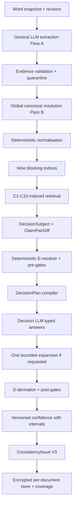
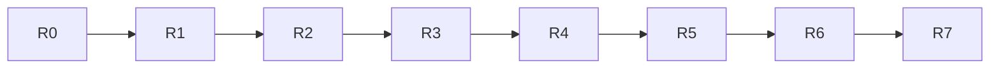

# Indexed Consistency — Authoritative Plan v2 (Owner-Revised)

> **Authority:** This v2 supersedes both [`ToneForge_INDEXED_CONSISTENCY_SYSTEM_ONE_REVISED_IMPLEMENTATION.md`](systematic%20review/ToneForge_INDEXED_CONSISTENCY_SYSTEM_ONE_REVISED_IMPLEMENTATION.md:1) and v1 of this plan.
> Owner decisions 2026-10-05 incorporated. Senior decision: best final product is a full delay-expert-report consistency engine with complete claim schema, encrypted per-document store, and token-efficient decision LLM — built as a clean replacement with no migration burden.
> Standing constraint: there are no users. No migration code is written. Old engine, old state keys, and old fixtures may be deleted outright.

## 0. Owner constraints accepted

- No users, still in development, functional upgrade, no migration requirements. [`loadState()`](src/core/state/persistence.ts:384) fallback and `LEGACY_STORAGE_KEYS` handling are deleted with the old engine, not extended.
- D1 accepted: full `ExpertReportClaim` schema as specified, all facets. No minimal general schema.
- D2 accepted with answer below: encrypted per-document store is mandatory because content is confidential and document-specific. JSON can handle the complex schema via IndexedDB object stores plus WebCrypto, without native SQLite.
- D3 accepted: separate decision LLM role is key to low token rate — only a typed decision is requested once the document is parsed.
- D4 agreed: General-model fallback never consumes a DecisionPlan.
- D5 accepted: existing engine is replaced, not strangled. Delete [`engine.ts`](src/analysis/consistency/engine.ts:418), [`contracts.ts`](src/analysis/consistency/contracts.ts:44), [`batching.ts`](src/analysis/consistency/batching.ts:47), [`grouping.ts`](src/analysis/consistency/grouping.ts:1) pair logic and sentence-pair checks outright.
- D6: indexed retrieval replaces windowing entirely. No windows, no `crossWindowPairsSkipped`. Blocking keys plus per-block caps bound the work; overflow is counted as `blockOverflowSkipped`.
- D7 agreed: versioned confidence with explicit intervals derived from the pipeline.
- D8 accepted: all 16 D-outcomes retained. A single delay-expert claim has many facets and must be cross-checked on every axis.
- D9 resolved below: all ten C-profiles defined, reflecting the deterministic realignment already in [`contracts.ts`](src/analysis/consistency/contracts.ts:82) and [`semantic.ts`](src/analysis/consistency/checks/semantic.ts:1).
- D10 agreed: budget caps stay. No double search.
- D11: preflight shows measured counts from the snapshot, never illustrative numbers.
- D12 agreed: concrete `DecisionSubject` union with Zod schemas.
- D13 agreed plus redaction opt-out toggle and explicit redaction list.
- D14 accepted: consolidation refactor in place under `src/analysis/consistency/`, no parallel `indexed/` duplication.

## 1. D2 answer — can JSON handle complex schema, lookups, and encryption

Yes, with IndexedDB as the physical layer, not roamingSettings JSON text.

- roamingSettings and localStorage JSON text cannot hold a 1,248-claim graph with nine indices and audit trail within quota and sync limits. That is why the original proposed SQLite.
- Native SQLite does not exist in the Office add-in sandbox. SQL.js plus WASM plus IndexedDB persistence adds ~2MB, async checkpoint complexity, and a second query language for no gain: all required lookups are key-based — by claim, entity, event, programme, metric, term, reference, section — which IndexedDB object stores plus in-memory maps serve directly.
- Decision: logical tables from the original §30 become IndexedDB object stores with the same names and keys. In-memory `ClaimIndex`, `EntityIndex`, `EventIndex`, `TemporalIndex`, `QuantityIndex`, `TerminologyIndex`, `ReferenceIndex`, `ProgrammeIndex`, `SectionIndex` are built on load and support add, remove, and replace for future incremental use. No SQL parser ships.
- Encryption: AES-GCM via WebCrypto. Per-document data key generated per `reviewSessionId`, wrapped by a device key in IndexedDB, never persisted alongside ciphertext in plaintext. Evidence text, claim text, and decision prompts encrypted at field level; hashes, IDs, versions, and counts stay plaintext for indexing. `ephemeral_local` default with 7-day TTL and explicit wipe; `document_associated` only on explicit opt-in. No credential ever stored — [`ProviderConnection.ts`](src/core/domain/ProviderConnection.ts:128) rule unchanged and reflection-tested.

## 2. D3 decision — token-efficient decision LLM

- Logical role `consistency_decision` exists as a prompt contract and calibration identity, not as a second credential or second settings surface.
- Physical path reuses the configured provider via [`LlmProvider.complete()`](src/ai/providers/LlmProvider.ts:24) and the gateway, which remains the only module talking to a credential service per [`architecture.md`](docs/architecture.md:121). No BYOK field in consistency persistence; only provider, model, and provenance IDs persisted.
- Token efficiency comes from the DecisionPlan compiler: only unresolved typed E-questions plus C-relevant projected state plus exact evidence for those claims. No report chunks, no re-extraction, no arithmetic or date work sent. Single pass plus at most one bounded expansion rerunning only unanswered questions, both under `maxAdjudications` 60 and `maxExpansions` 20.

## 3. D9 — all ten C-profiles with deterministic realignment

Current code already realigned checks via `deterministicFirst` in [`contracts.ts`](src/analysis/consistency/contracts.ts:82) and ambiguous-only output in [`semantic.ts`](src/analysis/consistency/checks/semantic.ts:99). The indexed engine keeps that split and makes it explicit per check:

- C1 terminology drift: deterministic alias and normalisation match first; ambiguous residue goes to decision LLM on `E-ENTITY-SAME` and `E-DEFINITION-INCOMPATIBLE`.
- C2 numeric contradiction: deterministic first. Normalised value, unit, scope, scenario, period, programme, basis, attribution gates decide most pairs. Only genuine semantic scope or basis ambiguity escalates.
- C3 temporal conflict: deterministic first. Date-type-aware comparison decides; coarse versus precise dates are `incomparable`, never conflict, per [`compareDates()`](src/analysis/consistency/checks/primitives.ts:359).
- C4 entity attribute conflict: decision-led after deterministic entity and attribute blocking. Requires shared entity anchor plus overlapping subject vocabulary.
- C5 definitional conflict: decision-led. Term canonicalisation deterministic; incompatibility judgement by decision LLM.
- C6 unit inconsistency: deterministic first. Convert then compare; unknown units stay unknown, never guessed.
- C7 status contradiction: decision-led after deterministic exclusive-state shortlist from [`EXCLUSIVE_STATES`](src/analysis/consistency/checks/primitives.ts:384).
- C8 reference conflict: decision-led on `ClaimReferenceSubject`. Citation presence deterministic; support versus contradiction by decision LLM.
- C9 section promise mismatch: deterministic first. Heading-promise versus section-content matching deterministic; semantic fulfilment judgement escalates.
- C10 scope contradiction: decision-led. Universal detection deterministic; exception reconciliation by decision LLM.

Each profile defines required facts, relevant E-questions, hard gates, D-derivation rules, allowed `CTX-*` requests, and confidence profile. No check sends every pair; each retrieves only plausible subjects via its index.

## 4. D8 — 16 D-outcomes retained for multi-facet claims

Retained in full: `D-CONSISTENT`, `D-CONFLICT`, `D-NOT-COMPARABLE`, `D-UPDATED-POSITION`, `D-DIFFERENT-SCOPE`, `D-DIFFERENT-SCENARIO`, `D-DIFFERENT-BASIS`, `D-DIFFERENT-PERIOD`, `D-DIFFERENT-ATTRIBUTION`, `D-QUALIFIED-POSITION`, `D-DIFFERENT-PROGRAMME-BASIS`, `D-FORECAST-VS-ACTUAL`, `D-DIFFERENT-VALUATION-BASIS`, `D-DIFFERENT-MEASUREMENT-BASIS`, `D-INSUFFICIENT-EVIDENCE`, `D-AMBIGUOUS`. Derivation is mechanical from the E-vector wherever possible; direct D-choice question only when the E-vector cannot determine the relationship. Gate reasons stay in `reasonCodes` alongside the D-outcome, not instead of it.

## 5. D13 — redaction with explicit opt-out

- Default: redact before any model call via shared [`redaction.ts`](src/shared/utils/redaction.ts:1) plus adapter `redact()`. Redacted classes explicitly listed in Settings and preflight: emails, card numbers, API-key shapes, bearer tokens, long hex and base64 secrets, prompt-content fields, document-content fields beyond the two statements in scope.
- Toggle: `Allow unredacted evidence for consistency review` default off, with plain-language warning that exact statement text is sent to the configured provider. Opt-out is per-run, logged in session provenance, revocable. Every prompt builder requires `includeRawText: true` and throws otherwise; redaction applies first, then the toggle permits exact text only for the claims in the DecisionPlan.

## 6. Replacement architecture — consolidated, not duplicated

Consolidation map, all under `src/analysis/consistency/` reusing [`text.ts`](src/shared/utils/text.ts:1) and [`primitives.ts`](src/analysis/consistency/checks/primitives.ts:1) logic where still valid:

- `contracts/` — full claim, entity, event, programme, quantum, delay, evidence, candidate, subject, evaluation, plan, report schemas. Replaces old [`contracts.ts`](src/analysis/consistency/contracts.ts:1).
- `extraction/` — prompt, schema, batch extractor, global resolver, evidence validator. New.
- `normalisation/` — dates, quantities, currencies, durations, units, terminology, aliases. Consolidates numeric and date logic from primitives.
- `index/` — nine indices with add, remove, replace. New.
- `candidates/` — `c1` through `c10` plus registry. Consolidates `terminology`, `numeric`, `structural`, `semantic` modules into per-check files.
- `comparison/` — diff, deterministic resolver, profiles, derivation with 16 outcomes, hard gates, confidence engine with intervals. New.
- `decision/` — provider interface, plan compiler, context expansion, question registry with all ten profiles, `systemOne/` adapter triple, no `fallback/` General-model path. New.
- `persistence/` — `ConsistencyStore` interface, `IndexedDbStore`, `MemoryStore`, schema versioning, WebCrypto field encryption, TTL wipe. No SQL.js, no `crypto.ts` beyond WebCrypto wrapper.
- `indexedEngine.ts` — orchestration per original §36. Replaces old [`engine.ts`](src/analysis/consistency/engine.ts:418). Old `bridge.ts` mapping updated to V3 issue shape; `kind: consistency` preserved.

Lint scope in [`eslint.config.mjs`](eslint.config.mjs:349) unchanged: `ai/providers` allowed, `word`, `taskpane`, `commands`, `reformat`, `changes` forbidden.

## 7. Phased replacement plan

### R0. Demolition and skeleton

- Objective: clear ground for full-schema build with no legacy weight.
- Tasks: delete old engine, pair checks, batching windows, grouping, legacy tests and fixtures; create new directory skeleton with Zod schemas for full claim, subject union, E-registry, D-outcomes, confidence profile, store interface.
- Dependencies: none.
- Risks: none — no users, no migration.
- Acceptance: `npm run typecheck` clean on skeleton; old paths gone.
- Validation: `npm run verify` green on skeleton.

### R1. Full claim schema plus evidence validation

- Objective: implement original §5–§6 in full.
- Tasks: all claim classes, adoption states, temporal, programme, delay, quantum, scenario, causation, responsibility, contractual basis, evidence anchor with hashes; validator quarantines unresolved evidence; canonical ID assignment after validation.
- Acceptance: every claim has provenance; unknown stays unknown; fixtures for attribution, scenario, delay, quantum, definition, reference, scope cases.
- Validation: schema tests including corrupt offsets and hash mismatch; quarantine counted in coverage.

### R2. Extraction plus canonical resolution

- Objective: General LLM structures the report in two passes, batched by document structure.
- Tasks: section-hierarchy batching with stable paragraph IDs, strict schema prompts, ten prompt rules from original §7, Pass A local extraction, Pass B global resolution, retry with [`retry.ts`](src/ai/providers/retry.ts:1) semantics, `AbortSignal` throughout.
- Acceptance: no unsupported facts; exact evidence returned; canonical IDs stable within session.
- Validation: MockAdapter tests; malformed-output rejection; cancellation tests.

### R3. Normalisation plus indices plus C1–C10 retrieval

- Objective: deterministic data prep and plausible-subject retrieval with no windows.
- Tasks: dates, ranges, percentages, decimals, currencies, durations, compatible units, programme identifiers, alias resolution; nine indices; per-check retrieval per original §9 with blocking caps and `blockOverflowSkipped`.
- Acceptance: C8 and C9 use reference and section subjects, not forced pairs.
- Validation: equivalence property tests; retrieval recall on fixtures.

### R4. Diff plus deterministic E-resolver plus pre-gates

- Objective: prove everything provable before any decision call.
- Tasks: `ClaimPairDiff`, all ten C-profiles from §3, deterministic resolver, comparability gates, classification into consistent, conflict, unresolved, not-comparable.
- Acceptance: arithmetic, unit, scenario, period, forecast-versus-actual, attribution cases never reach the decision model — pinned by tests.
- Validation: gate truth tables; no-model-call assertions.

### R5. DecisionPlan plus decision adapter plus bounded expansion

- Objective: token-efficient typed decisions.
- Tasks: plan compiler with per-check projection, question registry versioning, binary, choice, and score compilation, probability mapping, typed `CTX-*` expansion one pass index-first, rerun of unanswered questions only, budget enforcement.
- Acceptance: only unresolved questions sent; only relevant state sent; malformed output is `unclear` at 0; redaction toggle honoured.
- Validation: adapter tests; prompt snapshots proving no deterministic fields leak; budget tests.

### R6. D-derivation plus post-gates plus confidence with intervals

- Objective: ToneForge derives, gates, and scores with uncertainty shown.
- Tasks: 16-outcome derivation, post-model gates, weighted calibrated scoring with per-check `reviewThreshold` and `presentationThreshold`, confidence intervals from E-vector dispersion plus model calibration, provenance on every answer.
- Acceptance: conclusive vectors derive deterministically; ambiguous stays ambiguous; gates precede scoring; no independence multiplication; interval rendered in Why-confidence UI.
- Validation: derivation tables; gate tests; calibration version stored.

### R7. Encrypted store plus coverage plus UI plus benchmark

- Objective: ship confidential, auditable, explainable review with measured model choice.
- Tasks: IndexedDB stores matching logical tables, WebCrypto field encryption, TTL wipe, session provenance, coverage V3, preflight with measured counts and redaction list, progress per original §32, results and Why-confidence UI per original §33, expert-labelled corpus, identical-DecisionPlan benchmark across candidate decision models selecting on precision above presentation threshold.
- Acceptance: full audit reproduction from store; stale evidence invalidates exceptions; cancellation across both model stages; benchmark report checked in.
- Validation: end-to-end corpus run measuring per-check precision and recall, E-calibration, D-accuracy, context quality, false rates, stability, latency, cost; `npm run verify` green; Word-host verification recorded separately.

## 8. Sequencing

Strict order. No phase starts with the prior acceptance failing. No shadow running; replacement is direct.

## 9. Risks

| Risk                                        | Mitigation                                                                 |
| ------------------------------------------- | -------------------------------------------------------------------------- |
| Full schema over-models ordinary prose      | Unknown-stays-unknown rule plus quarantine, not forced inference           |
| IndexedDB quota on large reports            | Per-document TTL, evidence-text compression, overflow counted not silent   |
| Decision-model cost                         | Hard caps, projection minimisation, benchmark on cost as well as precision |
| False positives on delay and quantum facets | 16-outcome derivation plus review band defaulting to suppress on doubt     |
| Redaction opt-out leaks confidential text   | Per-run explicit consent, provenance logging, default redacted             |
| Key loss strands encrypted sessions         | Ephemeral default means loss equals wipe, which is the safe failure        |

## 10. Acceptance for production cutover

1. Full claim schema implemented with all classes, contexts, and adoption states.
2. Every claim has evidence provenance; quarantined claims counted.
3. Nine indices serve all ten C-checks; no windows remain.
4. Deterministic resolver answers every provable E-item before any decision call.
5. Only unresolved typed questions reach the decision adapter with minimal projected state.
6. Expansion typed, bounded, index-first, single pass.
7. Sixteen D-outcomes derived mechanically where possible.
8. Hard gates run before and after the decision model.
9. Confidence versioned with intervals; no independence assumption; model-specific calibration supported.
10. Only above-threshold candidates become issues; review band suppresses on doubt.
11. Decision failure leaves candidates unresolved with limitations entry.
12. Issues never auto-enter ChangePlan.
13. Store encrypted per-document with TTL; no secrets persisted; reflection test green.
14. Redaction list explicit; opt-out toggle per-run and logged.
15. Cancellation and staleness refusal across both model stages.
16. Coverage separates deterministic, decision, unresolved, gated, review-band, and budget-exceeded work.
17. Why-compared and Why-confidence render from provenance.
18. Production decision model chosen by benchmark on ToneForge data for precision above presentation threshold.

## 11. Validation per phase

`npm run typecheck`, `npm run lint` with zero warnings, `npm run format`, `npm run test`, `npm run test:coverage` at 80 percent floor, `npm run build`, `npm run validate`. Word-host evidence recorded separately and never closed by automated green.
