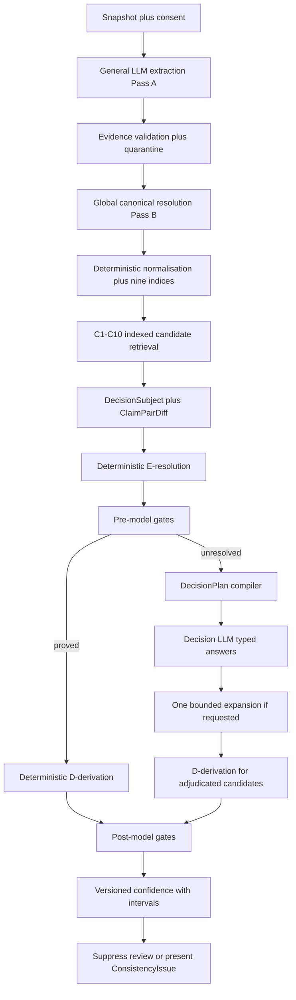
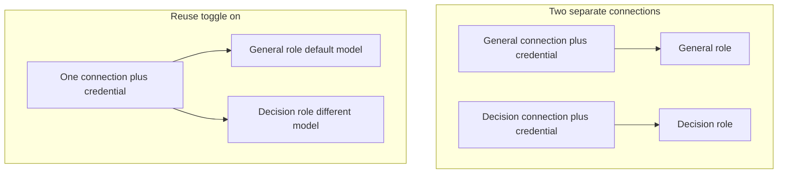
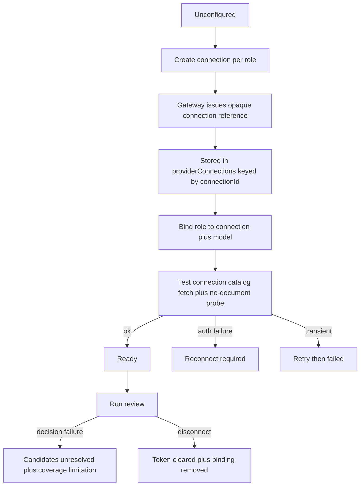
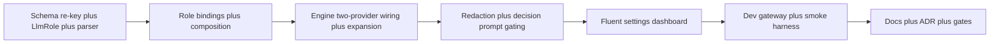

# Revised LLM Connector — Implementation Plan (Codebase-Authoritative)

> **Method.** Reconciled `ToneForge_INDEXED_CONSISTENCY_SYSTEM_ONE_REVISED_IMPLEMENTATION.md` (in the untracked `systematic review/` folder)
> and [`plans/llm-settings-due-diligence-plan.md`](llm-settings-due-diligence-plan.md:1)
> against the current source. Where they disagree, the source wins. The
> superseding owner plan is [`plans/indexed-consistency-authoritative-plan.md`](indexed-consistency-authoritative-plan.md:1).
>
> **Owner decisions (2026-10-08).**
>
> 1. The default is **two separate connections with separate credentials** — one
>    general, one decision.
> 2. A **toggle** may instead reuse the general connection point with a
>    different model from the same provider.
> 3. Review the pipeline order against the original plan.
> 4. Ship a **modern Fluent settings dashboard** for all user and interaction
>    settings.
>
> **Posture.** Per authoritative plan §0 there are no users and no migration
> burden. Prefer **full replacement** over incremental patches.

---

## 1. Verdict

The connector is **structurally present, single-role, and never proven live.**

- One `LlmProvider` is wired end to end: [`createRegistryFromSettings()`](src/taskpane/settings/providerComposition.ts:118)
  → `activeProvider` → [`runConsistencyReview()`](src/analysis/consistency/indexedEngine.ts:256)
  and [`reviewSemanticSelection()`](src/analysis/semantic/semanticReviewEngine.ts:74).
- The decision LLM is the **same provider and model** as extraction:
  [`indexedEngine.ts:483`](src/analysis/consistency/indexedEngine.ts:483) wraps `options.provider`
  in `SystemOneDecisionProvider`. This matches authoritative plan v2 §2 (logical role,
  no second credential) and **contradicts the revised spec §21** (separate BYOK
  decision role) — and the owner decision above resolves it in favour of the spec.
- No run has reached a real model ([`manual-verification.md`](docs/manual-verification.md:332));
  every test is `MockAdapter`.

---

## 2. Current-state audit — findings with evidence

### F1 — Decision LLM reuses the general provider (no separation)

[`indexedEngine.ts:295`](src/analysis/consistency/indexedEngine.ts:295) gates extraction on one
`options.provider`; [`indexedEngine.ts:483`](src/analysis/consistency/indexedEngine.ts:483) wraps the
**same** object. Provenance ([`indexedEngine.ts:690`](src/analysis/consistency/indexedEngine.ts:690))
records one model for both roles. No role binding exists in [`StateSchema.settings`](src/core/state/persistence.ts:144).

### F2 — One connection slot per provider blocks two credentials

[`providerConnections`](src/core/state/persistence.ts:184) is
`z.record(ProviderIdSchema, ProviderConnectionSchema)` — **one slot per provider**.
Two separate connections/credentials for the same provider cannot be stored.
This is the true blocker behind "two separate connections", not the auth mode.

### F3 — Live connectivity only exists for OpenRouter, only via the dev gateway

- [`env.ts:15`](src/core/config/env.ts:15) restricts `LLM_BROKER_URL` to loopback/same-origin.
- [`scripts/dev-gateway.mjs:146`](scripts/dev-gateway.mjs:146) implements only OpenRouter `api-key`,
  `models`, `chat/completions`, `DELETE`; no `authorize`/`callback`, no
  `deploymentManaged` connection.
- [`connectionFromSettings()`](src/taskpane/settings/providerComposition.ts:47) synthesises
  `local:<provider>:<origin>` ids the gateway never issued → `404 Unknown connection`.

### F4 — Redaction is all-or-nothing; no redacted LLM path

[`indexedEngine.ts:299`](src/analysis/consistency/indexedEngine.ts:299) skips all model use unless
`allowUnredacted === true`. The two-stage model (redact, then opt-out) of
authoritative plan §5 / D13 is not implemented.

### F5 — Decision prompt leaks exact evidence unconditionally

[`SystemOneCompiler.ts:79`](src/analysis/consistency/decision/systemOne/SystemOneCompiler.ts:79) emits
`evidence.exactText` regardless of `plan.allowUnredacted`; the decision path never
calls `redact()`.

### F6 — Model output parsing is fragile and duplicated

[`SystemOneResponseMapper.ts:44`](src/analysis/consistency/decision/systemOne/SystemOneResponseMapper.ts:44)
and [`batchExtractor.ts:82`](src/analysis/consistency/extraction/batchExtractor.ts:82) use raw
`JSON.parse` with no fence tolerance, while [`semanticReviewEngine.ts:201`](src/analysis/semantic/semanticReviewEngine.ts:201)
already strips fences. Fenced output degrades every answer to `unclear` or
quarantines a whole batch.

### F7 — Bounded context expansion is built but never wired

[`contextExpansion.ts:46`](src/analysis/consistency/decision/contextExpansion.ts:46) and its test exist;
nothing calls it (definition-only search). `maxExpansions` is passed and unused;
`requestedContext` is never mapped. Spec §23 is unimplemented.

### F8 — Env timeout/retries ignored; provenance cannot separate roles

[`env.ts:44`](src/core/config/env.ts:44) defines `OPENAI_TIMEOUT_MS`/`OPENAI_MAX_RETRIES`; the
adapters hardcode 30 s / 2 and [`createRegistryFromSettings`](src/taskpane/settings/providerComposition.ts:118)
passes neither. `generalModel` and `decisionModel` are always identical.

### Confirmed correct (do not rebuild)

Consent fails closed ([`request.ts:36`](src/analysis/consistency/contracts/request.ts:36)); evidence is
proven not trusted ([`batchExtractor.locateEvidence()`](src/analysis/consistency/extraction/batchExtractor.ts:119));
the decision seam never owns confidence ([`ConsistencyDecisionProvider.ts:27`](src/analysis/consistency/decision/ConsistencyDecisionProvider.ts:27));
prompt builders keep the `includeRawText` throw gate; credentials are non-secret by
construction ([`ProviderConnection.ts:128`](src/core/domain/ProviderConnection.ts:128)).

---

## 3. Pipeline order — reconciled against the original plan

The owner's proposed flow is **correct in sequence**, with two clarifications.
Gates are **ToneForge-deterministic**, not produced by the general LLM, and
D-derivation happens **twice**: once for candidates the resolver proves (no model
call) and once for the residue the decision LLM adjudicates. This is exactly
authoritative plan §36 steps 14–16 and 21–23.



Mapping to the owner's phrasing:

- "general LLM creates consistency extraction" → **B** (extraction). Correct.
- "and gates" → **I/O** are ToneForge-deterministic gates, not LLM output. Correction.
- "deterministic D-derivation" → **J** settles provable candidates before any model call.
- "decision LLM" → **K–M**, fed only the compiled plan.
- "confidence" → **P**, applied to both the deterministic and adjudicated paths.

The current engine already implements **B–J** and **K–P** in this order
([`indexedEngine.ts:409`](src/analysis/consistency/indexedEngine.ts:409) pre-model derivation,
[`indexedEngine.ts:602`](src/analysis/consistency/indexedEngine.ts:602) post-model derivation). The plan
completes the missing middle (**M**) and the role separation (**K**).

---

## 4. Connection topology and the "OAuth only" premise

**Correction.** Reuse-with-a-different-model does **not** require OAuth. A model
is a **per-request parameter**: [`OpenAiAdapter.buildRequestBody()`](src/ai/providers/openaiAdapter.ts:31)
and its siblings send `model: this.connection.selectedModel` on every call, and the
gateway holds one credential per opaque `connectionId`. Reusing one connection with a
different model therefore works for **every** auth mode — `brokerApiKey`,
`deploymentManaged`, `oauth`, and `none`.

There is another way to get two separate credentials too, without OAuth: a second
`brokerApiKey` connection (submit a second key) or a deployment-minted
`deploymentManaged` connection. OAuth is simply one route to a second account. The
real blocker is storage keying (F2), which this plan fixes.

### 4.1 Two roles, three topologies



- **Default:** general and decision each bind their own connection (own credential).
- **Reuse toggle:** decision binds the general connection id but its own
  `selectedModel`. Same provider, different model.
- **Fallback policy:** `unresolved` (default) or explicit `general_model` opt-in.

---

## 5. Unified configuration schema

### 5.1 Connection catalogue (re-keyed)

```text
core/state/persistence.ts
  providerConnections: z.record(z.string().min(1), ProviderConnectionSchema)   // keyed by connectionId
```

Re-keying from `ProviderId` to `connectionId` is what makes two credentials for one
provider storable. Call sites to replace: [`connectionFromSettings()`](src/taskpane/settings/providerComposition.ts:47),
[`OpenRouterConnectionSettings.persistConnection()`](src/taskpane/components/OpenRouterConnectionSettings.tsx:101),
[`RedactionSettingsSection`](src/taskpane/components/RedactionSettingsSection.tsx),
`isRemoteProviderConfigured`, and their tests.

### 5.2 Role bindings

```text
core/domain/LlmRole.ts   (new)
  LlmRole             = "general" | "consistency_decision"
  LlmPurpose          = "semantic_review" | "consistency_extraction" | "consistency_decision"
  LlmRoleBinding      = { role, provider, connectionId, selectedModel?, purpose?, reuseGeneral: boolean }
  LlmRoleBindings     = { general?: binding, consistency_decision?: binding }
  DecisionFallbackPolicy = "unresolved" | "general_model"   (default "unresolved")
  reflection test: no field capable of holding a secret
```

`settings` gains `llmRoleBindings` and `decisionFallbackPolicy`. `providerConnections`
holds credentials; `llmRoleBindings` holds which connection/model each role uses. The
binding schema carries **no secret field** — pinned by a reflection test mirroring
[`ProviderConnection`](src/core/domain/ProviderConnection.ts:128).

### 5.3 Connection lifecycle



---

## 6. Files to create or overwrite (full replacement)

### Create

| File                                                                                                                                               | Responsibility                                                                                            |
| -------------------------------------------------------------------------------------------------------------------------------------------------- | --------------------------------------------------------------------------------------------------------- |
| [`src/core/domain/LlmRole.ts`](src/core/domain/LlmRole.ts:1)                                                                                       | Role, purpose, binding, fallback-policy Zod schemas; secret-free reflection invariant                     |
| [`src/ai/providers/modelJson.ts`](src/ai/providers/modelJson.ts:1)                                                                                 | Shared fence/prose-tolerant, Zod-validated model-JSON parser                                              |
| [`src/taskpane/settings/llmRoles.ts`](src/taskpane/settings/llmRoles.ts:1)                                                                         | `resolveRoleBinding()`, `isRoleConfigured()`, `setRoleBinding()`, `setReuseGeneral()`, purpose validation |
| [`src/taskpane/components/SettingsDashboard.tsx`](src/taskpane/components/SettingsDashboard.tsx:1)                                                 | Fluent v8 dashboard shell for all settings                                                                |
| [`src/taskpane/components/RoleConnectionCard.tsx`](src/taskpane/components/RoleConnectionCard.tsx:1)                                               | One role: provider, model, auth, test, disconnect, reuse toggle                                           |
| [`src/taskpane/components/ConnectionTestButton.tsx`](src/taskpane/components/ConnectionTestButton.tsx:1)                                           | Test connection: catalog fetch + no-document probe, icon+text health                                      |
| [`src/taskpane/components/DecisionFallbackPolicyControl.tsx`](src/taskpane/components/DecisionFallbackPolicyControl.tsx:1)                         | Fallback policy with plain-language warning                                                               |
| [`src/taskpane/components/RedactionSettingsSection.tsx`](src/taskpane/components/RedactionSettingsSection.tsx:1)                                   | Default-redaction toggle and explicit redaction list                                                      |
| [`src/analysis/consistency/decision/systemOne/SystemOneContextPolicy.ts`](src/analysis/consistency/decision/systemOne/SystemOneContextPolicy.ts:1) | Map `requestedContext` to typed `CTX-*`, one-pass guard                                                   |
| [`scripts/llm-smoke.mjs`](scripts/llm-smoke.mjs:1)                                                                                                 | Node live connector smoke harness (dev gateway + gitignored `.env` key)                                   |
| [`tests/unit/ai/providers/modelJson.test.ts`](tests/unit/ai/providers/modelJson.test.ts:1)                                                         | Fenced/prose/malformed parsing matrix                                                                     |
| [`tests/unit/taskpane/settings/llmRoles.test.ts`](tests/unit/taskpane/settings/llmRoles.test.ts:1)                                                 | Two-registry end-to-end consistency run                                                                   |
| [`tests/unit/core/domain/LlmRole.test.ts`](tests/unit/core/domain/LlmRole.test.ts:1)                                                               | Binding round-trip + secret-free reflection                                                               |

### Overwrite (full replacement)

| File                                                                                                                                                   | Change                                                                                                                                |
| ------------------------------------------------------------------------------------------------------------------------------------------------------ | ------------------------------------------------------------------------------------------------------------------------------------- |
| [`src/core/state/persistence.ts`](src/core/state/persistence.ts:144)                                                                                   | Re-key `providerConnections` by `connectionId`; add `llmRoleBindings` + `decisionFallbackPolicy`                                      |
| [`src/taskpane/settings/providerComposition.ts`](src/taskpane/settings/providerComposition.ts:118)                                                     | `createRegistryForRole(role)`; `connectionForRole()`; env timeout/retries passthrough                                                 |
| [`src/ai/providers/registry.ts`](src/ai/providers/registry.ts:38)                                                                                      | Accept `timeoutMs`/`maxRetries`; expose `configured`; no silent cross-role fallback                                                   |
| [`src/ai/providers/gatewayAdapter.ts`](src/ai/providers/gatewayAdapter.ts:40)                                                                          | Honour timeout/retries from options; shared error mapping                                                                             |
| [`src/analysis/consistency/indexedEngine.ts`](src/analysis/consistency/indexedEngine.ts:256)                                                           | Accept `decisionProvider?` distinct from `provider`; honour `decisionFallbackPolicy`; wire one bounded expansion; separate provenance |
| [`src/analysis/consistency/extraction/batchExtractor.ts`](src/analysis/consistency/extraction/batchExtractor.ts:82)                                    | Use shared `modelJson` parser                                                                                                         |
| [`src/analysis/consistency/decision/systemOne/SystemOneCompiler.ts`](src/analysis/consistency/decision/systemOne/SystemOneCompiler.ts:26)              | Gate evidence on `plan.allowUnredacted`; redact otherwise; align prompt with mapper                                                   |
| [`src/analysis/consistency/decision/systemOne/SystemOneResponseMapper.ts`](src/analysis/consistency/decision/systemOne/SystemOneResponseMapper.ts:24)  | Shared parser; map `requestedContext`; keep `unclear`-at-0                                                                            |
| [`src/taskpane/pages/Settings.tsx`](src/taskpane/pages/Settings.tsx:8)                                                                                 | Render the Fluent dashboard                                                                                                           |
| [`src/taskpane/components/SettingsDashboard.tsx`](src/taskpane/components/SettingsDashboard.tsx)                                                       | Compose dashboard sections; retire the four flat cards                                                                                |
| [`src/taskpane/components/RedactionSettingsSection.tsx`](src/taskpane/components/RedactionSettingsSection.tsx)                                         | Split into role connection cards + consent + redaction                                                                                |
| [`src/taskpane/components/OpenRouterConnectionSettings.tsx`](src/taskpane/components/OpenRouterConnectionSettings.tsx:54)                              | Persist by `connectionId`; reusable per role                                                                                          |
| [`src/taskpane/settings/settingsModel.ts`](src/taskpane/settings/settingsModel.ts:98)                                                                  | Draft includes role bindings; provider options updated                                                                                |
| [`src/taskpane/pages/ConsistencyReview.tsx`](src/taskpane/pages/ConsistencyReview.tsx:158)                                                             | Build general and decision registries; pass both                                                                                      |
| [`src/taskpane/pages/SemanticReview.tsx`](src/taskpane/pages/SemanticReview.tsx:341) / [`SemanticStyle.tsx`](src/taskpane/pages/SemanticStyle.tsx:188) | Use the general-role registry                                                                                                         |
| [`src/taskpane/troubleshooting/checks.ts`](src/taskpane/troubleshooting/checks.ts:331)                                                                 | Checks: decision role unconfigured, fallback active, parse-failure rate, provider unreachable                                         |
| [`src/ai/gateway/gatewayClient.ts`](src/ai/gateway/gatewayClient.ts:200)                                                                               | Add `testConnection()`; role-aware catalog; map `GatewayErrorKind`                                                                    |
| [`scripts/dev-gateway.mjs`](scripts/dev-gateway.mjs:115)                                                                                               | Add `deploymentManaged` stub + `authorize`/`callback` stubs + test route                                                              |
| [`.env.example`](.env.example:1)                                                                                                                       | Document loopback `LLM_BROKER_URL` and optional decision-model variables (no secrets)                                                 |

---

## 7. Modern Fluent settings dashboard

Target stack: **Fluent UI v8** (`@fluentui/react` ^8.120.0) with the existing
[`createDefaultTheme()`](src/taskpane/fluentTheme.ts:21) inverted/light themes. Reuse
[`SettingsSectionCard`](src/taskpane/components/SettingsSectionCard.tsx:1) rather than inventing
a card primitive.

Layout: a `Pivot`-based dashboard (Overview, Connections, Privacy, Behaviour,
Diagnostics) with stacked cards on a narrow pane. Every card keeps the existing
per-section draft/baseline/save isolation so one failed save never discards another
section's edits.

| Card                | Contents                                                                                                                                         |
| ------------------- | ------------------------------------------------------------------------------------------------------------------------------------------------ |
| Overview            | General and Decision role health as icon + text (never colour alone); active provider/model; fallback policy                                     |
| General connection  | Provider, model picker, auth flow, Test, Disconnect                                                                                              |
| Decision connection | Provider, model picker, auth flow, Test, Disconnect, **Reuse general connection** toggle                                                         |
| Privacy and consent | `semanticOptIn`, `consistencyReviewConsent` in separate blocks with their own explanations; default-redaction toggle and explicit redaction list |
| Behaviour           | Scanning, tracked editing, styling (existing sections, moved under the dashboard)                                                                |
| Diagnostics         | Troubleshooting link, redacted Copy diagnostics via [`redaction.ts`](src/shared/utils/redaction.ts:1)                                            |

Accessibility and interaction requirements (already the repo's standard, ADR-0069/0077):
keyboard reachable, focus visible, icon **plus** text for status, works in dark and
high-contrast, and readable in a narrow task pane. Covered by axe-based component tests.

---

## 8. Verification tests that prove live functionality

1. **Parser matrix** — fenced, prose-wrapped, trailing-commentary, wrong-type, missing-field
   outputs: valid parse; malformed become `unclear`/quarantine and are **counted**.
2. **Role separation integration** — a stub `fetchImpl` emulates the gateway for two distinct
   connections; assert the decision provider receives only the compiled `DecisionPlan`,
   the general provider never serves a decision, and provenance records two distinct models.
3. **Reuse toggle** — with `reuseGeneral: true`, the decision registry uses the general
   connection id with a different model; with `false`, a distinct connection id.
4. **Redaction gate** — `allowUnredacted: false` yields a redacted path and prompt snapshots
   with no `exactText`; `true` includes exact text only for the plan's claims.
5. **Context expansion** — a `CTX-*` request triggers exactly one bounded expansion and reruns
   only unanswered questions; no loop.
6. **Lifecycle** — configure → bind → test → disconnect clears token and binding; key absent
   from persistence, logs, bundle ([`verify-bundle-secrets.mjs`](scripts/verify-bundle-secrets.mjs:1)).
7. **Dashboard** — component tests for collapsed health, reuse toggle, fallback warning, and
   axe/keyboard/dark/high-contrast/narrow-pane behaviour.
8. **Live smoke** — `node scripts/llm-smoke.mjs` against the dev gateway with a real gitignored
   key: submit key, fetch catalog, probe, extract a fixture, adjudicate a plan, assert typed
   answers. Excluded from `npm test`; recorded in [`docs/manual-verification.md`](docs/manual-verification.md:1).
9. **Boundary** — [`tests/unit/architecture/moduleBoundaries.test.ts`](tests/unit/architecture/moduleBoundaries.test.ts:1)
   still passes.
10. **Full gate** — [`npm run verify`](scripts/verification-graph.mjs:1) green.

---

## 9. Sequencing



Strict order; no phase starts until the prior gate is green.

---

## 10. Risks

| Risk                                          | Mitigation                                                                            |
| --------------------------------------------- | ------------------------------------------------------------------------------------- |
| Re-keying connections breaks call sites/tests | Full replacement; no users, no migration; sweep every `providerConnections[...]` read |
| Dual-role UX confusion                        | One shared `RoleConnectionCard`; distinct "Used for" copy; reuse toggle default off   |
| Decision BYOK adoption low                    | Fallback defaults to `unresolved`; deterministic review still delivers value          |
| Redaction change widens egress                | Two-stage model, per-run toggle, provenance logging, default redacted                 |
| Silent cross-role fallback                    | Only via explicit `decisionFallbackPolicy`                                            |
| Fluent v8 vs v9 drift                         | Stay on the pinned v8 and the existing theme                                          |
| Dev gateway diverges from production          | Contract is the single seam; server track is out of repo scope with its own ADR       |
