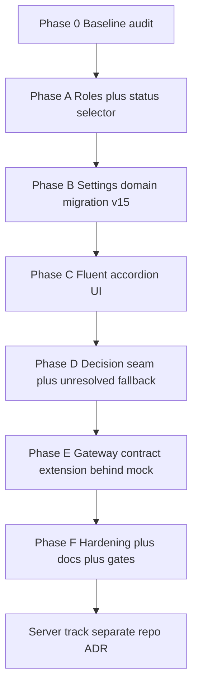

# LLM Settings — Pre-Implementation Due Diligence Plan

Source: `ToneForge_LLM_SETTINGS_SYSTEMATIC_IMPLEMENTATION.md` (systematic review/ToneForge_LLM_SETTINGS_SYSTEMATIC_IMPLEMENTATION.md:1) — 2202 lines, §§0–59, sequence L0–L16, 33 completion gates.
Method: read end to end, cross-referenced every file, type, endpoint, and assumption against live code cited below.

## 0. Verdict

Adopt the security and UX intent. Reject the sequence and the server scope as written. Implement client-first vertical slices in this repo; track broker, vault, Entra, and tenant policy as a separate deployable with its own ADR.

Governing rules preserved:

- Word task pane is a public client; it never owns long-lived credentials — see [`gatewayClient.ts`](src/ai/gateway/gatewayClient.ts:1).
- Collapsed settings show health; expanded settings explain and offer controls — proposal §0 mandate, compatible with [`Settings.tsx`](src/taskpane/pages/Settings.tsx:1) and [`SettingsDashboard.tsx`](src/taskpane/components/SettingsDashboard.tsx:1).
- Deterministic work never requires AI — see [`setupStatus.ts`](src/taskpane/setupStatus.ts:18).
- Consent is separate per feature — see [`persistence.ts`](src/core/state/persistence.ts:162).

## 1. What the proposal gets right — adopt without change

- Public-client custody: no raw key in [`ProviderConnection.ts`](src/core/domain/ProviderConnection.ts:4), no secret in [`persistence.ts`](src/core/state/persistence.ts:176), transient submit in [`gatewayClient.ts`](src/ai/gateway/gatewayClient.ts:316), in-memory [`SessionTokenStore`](src/ai/gateway/gatewayClient.ts:120).
- BYOK once over loopback same-origin nonce channel — see [`settingsModel.ts`](src/taskpane/settings/settingsModel.ts:49) and [`providerComposition.ts`](src/taskpane/settings/providerComposition.ts:9).
- No arbitrary endpoint: [`normalizeGatewayOrigin()`](src/ai/gateway/gatewayClient.ts:106) plus [`isValidGatewayOrigin()`](src/ai/gateway/gatewayClient.ts:85) plus [`isBaseOriginUsable()`](src/core/domain/ProviderConnection.ts:231).
- Consent separation: [`semanticOptIn`](src/core/state/persistence.ts:173) vs [`consistencyReviewConsent`](src/core/state/persistence.ts:172), never derived — see [`migration.ts`](src/core/state/migration.ts:33).
- Test connection sends no document text; replace-key atomic; disconnect revokes; provenance without key; failure leaves candidate unresolved; status by icon plus text, never colour alone.
- Shared status selector consumed by Home, Settings, Setup Status, Troubleshooting — replaces divergent derivation in [`setupStatus.ts`](src/taskpane/setupStatus.ts:83) and [`checks.ts`](src/taskpane/troubleshooting/checks.ts:401).
- Build secret scans already exist: [`check-secrets.mjs`](scripts/check-secrets.mjs:1) and [`verify-bundle-secrets.mjs`](scripts/verify-bundle-secrets.mjs:1). Proposal §53 duplicates; extend, do not reinvent.

## 2. Disagreements with superior alternatives

### D1 — No existing ConsistencyDecisionProvider seam

- Proposal says: connect through the existing `ConsistencyDecisionProvider` (systematic review/ToneForge_LLM_SETTINGS_SYSTEMATIC_IMPLEMENTATION.md:18) seam, §§0, 8, 22, 55, 57.
- Repo shows: search for [`ConsistencyDecisionProvider`](src/analysis/consistency/indexedEngine.ts) returns zero hits. Engine takes [`ConsistencyRunOptions.provider`](src/analysis/consistency/indexedEngine.ts) typed as [`LlmProvider`](src/ai/providers/LlmProvider.ts:24) optional. Caller in [`ConsistencyReview.tsx`](src/taskpane/pages/ConsistencyReview.tsx:148) builds [`createRegistryFromSettings()`](src/taskpane/settings/providerComposition.ts:118) then calls [`runConsistencyReview()`](src/analysis/consistency/indexedEngine.ts) with [`activeProvider`](src/ai/providers/registry.ts:92).
- Alternative: create the seam first as a thin interface in [`contracts.ts`](src/analysis/consistency/contracts/) wrapping [`LlmProvider.complete()`](src/ai/providers/LlmProvider.ts:26), e.g. [`evaluate()`](src/analysis/consistency/indexedEngine.ts) delegating to adjudication prompt. Then add [`BrokerDecisionProvider`](src/analysis/consistency/indexedEngine.ts) behind it. Justification: avoids building broker adapter against a non-existent contract; keeps ADR-0052 single-exception boundary intact per [`architecture.md`](docs/architecture.md:140).

### D2 — Proposed indexed decision path does not exist

- Proposal says: create `BrokerDecisionProvider.ts` at `src/analysis/consistency/decision/BrokerDecisionProvider.ts` (planned, R0 skeleton).
- Repo shows: [`src`](src:1) contains [`analysis/consistency/engine.ts`](src/analysis/consistency/indexedEngine.ts), [`contracts.ts`](src/analysis/consistency/contracts/), [`bridge.ts`](src/analysis/consistency/bridge.ts:21), [`checks/primitives.ts`](src/analysis/consistency/checks/primitives.ts:1), [`batching.ts`](src/analysis/consistency/indices/). No [`indexed`](src/analysis/consistency/indexedEngine.ts) directory.
- Alternative: place seam in [`analysis/consistency/decision.ts`](src/analysis/consistency/contracts/) or [`analysis/consistency/adjudicator.ts`](src/analysis/consistency/indexedEngine.ts). Justification: minimal diff per Ponytail; respects [`architecture.md`](docs/architecture.md:89) allowed imports for [`analysis/consistency`](docs/architecture.md:89).

### D3 — Status enum collides with shipped lifecycle

- Proposal says: new `ProviderConnectionStatus` (systematic review/ToneForge_LLM_SETTINGS_SYSTEMATIC_IMPLEMENTATION.md:205) with six values including `not_configured` (systematic review/ToneForge_LLM_SETTINGS_SYSTEMATIC_IMPLEMENTATION.md:218) and `checking` (systematic review/ToneForge_LLM_SETTINGS_SYSTEMATIC_IMPLEMENTATION.md:228).
- Repo shows: [`ConnectionStatusSchema`](src/core/domain/ProviderConnection.ts:64) has eight values: [`startAuthorization`](src/core/domain/ProviderConnection.ts:65), [`callback`](src/core/domain/ProviderConnection.ts:66), [`connected`](src/core/domain/ProviderConnection.ts:67), [`reconnectRequired`](src/core/domain/ProviderConnection.ts:68), [`expired`](src/core/domain/ProviderConnection.ts:69), [`revoked`](src/core/domain/ProviderConnection.ts:70), [`disconnected`](src/core/domain/ProviderConnection.ts:71), [`failed`](src/core/domain/ProviderConnection.ts:72), plus [`READY_CONNECTION_STATUSES`](src/core/domain/ProviderConnection.ts:77) and [`TERMINAL_CONNECTION_STATUSES`](src/core/domain/ProviderConnection.ts:80).
- Alternative: extend, do not replace. Add `disabled_by_policy` (systematic review/ToneForge_LLM_SETTINGS_SYSTEMATIC_IMPLEMENTATION.md:266) to schema; derive `not_configured` (systematic review/ToneForge_LLM_SETTINGS_SYSTEMATIC_IMPLEMENTATION.md:218) from absent connection; treat `checking` (systematic review/ToneForge_LLM_SETTINGS_SYSTEMATIC_IMPLEMENTATION.md:228) as transient UI state, never persisted. Justification: preserves migration v7–v14 history in [`migration.ts`](src/core/state/migration.ts:70) and reflection test that forbids secret fields.

### D4 — Auth type collides with shipped modes

- Proposal says: `authType` (systematic review/ToneForge_LLM_SETTINGS_SYSTEMATIC_IMPLEMENTATION.md:149) as `api_key` (systematic review/ToneForge_LLM_SETTINGS_SYSTEMATIC_IMPLEMENTATION.md:150) vs `oauth` (systematic review/ToneForge_LLM_SETTINGS_SYSTEMATIC_IMPLEMENTATION.md:151) vs `managed` (systematic review/ToneForge_LLM_SETTINGS_SYSTEMATIC_IMPLEMENTATION.md:152).
- Repo shows: [`ConnectionAuthModeSchema`](src/core/domain/ProviderConnection.ts:50) is [`oauth`](src/core/domain/ProviderConnection.ts:51), [`deploymentManaged`](src/core/domain/ProviderConnection.ts:43), [`brokerApiKey`](src/core/domain/ProviderConnection.ts:46), [`none`](src/core/domain/ProviderConnection.ts:48).
- Alternative: keep shipped enum. Map proposal `api_key` (systematic review/ToneForge_LLM_SETTINGS_SYSTEMATIC_IMPLEMENTATION.md:150) to [`brokerApiKey`](src/core/domain/ProviderConnection.ts:46), `managed` (systematic review/ToneForge_LLM_SETTINGS_SYSTEMATIC_IMPLEMENTATION.md:152) to [`deploymentManaged`](src/core/domain/ProviderConnection.ts:43). Justification: [`openaiAdapter.ts`](src/ai/providers/openaiAdapter.ts:1) and [`gatewayAdapter.ts`](src/ai/providers/gatewayAdapter.ts:21) already branch on shipped values; rename churns persisted [`providerConnections`](src/core/state/persistence.ts:184) for no behaviour gain.

### D5 — Model-role contracts duplicate existing catalog

- Proposal says: new `LlmModelRole` (systematic review/ToneForge_LLM_SETTINGS_SYSTEMATIC_IMPLEMENTATION.md:107), `LlmPurpose` (systematic review/ToneForge_LLM_SETTINGS_SYSTEMATIC_IMPLEMENTATION.md:115), `ModelRoleConfiguration` (systematic review/ToneForge_LLM_SETTINGS_SYSTEMATIC_IMPLEMENTATION.md:284), `ProviderDefinition` (systematic review/ToneForge_LLM_SETTINGS_SYSTEMATIC_IMPLEMENTATION.md:737), `ProviderCapabilities` (systematic review/ToneForge_LLM_SETTINGS_SYSTEMATIC_IMPLEMENTATION.md:773), `BrokerLlmRequest` (systematic review/ToneForge_LLM_SETTINGS_SYSTEMATIC_IMPLEMENTATION.md:862), `DecisionModelProvenance` (systematic review/ToneForge_LLM_SETTINGS_SYSTEMATIC_IMPLEMENTATION.md:1705).
- Repo shows: [`ModelDescriptorSchema`](src/core/domain/ProviderConnection.ts:154), [`ModelCatalogSchema`](src/core/domain/ProviderConnection.ts:176), [`ProviderConnectionSchema`](src/core/domain/ProviderConnection.ts:128), [`isModelSelectable()`](src/core/domain/ProviderConnection.ts:214), [`buildModelOptions()`](src/taskpane/settings/settingsModel.ts:199) already implement discovery, binding, and policy exception via [`allowCustomModel`](src/core/domain/ProviderConnection.ts:144).
- Alternative: add minimal role binding — two connection slots [`generalConnectionId`](src/core/state/persistence.ts:184) and [`decisionConnectionId`](src/core/state/persistence.ts:184) plus `decisionFallbackPolicy` (systematic review/ToneForge_LLM_SETTINGS_SYSTEMATIC_IMPLEMENTATION.md:412) — validate purpose at call site in [`providerComposition.ts`](src/taskpane/settings/providerComposition.ts:47). Defer full catalogue to broker track. Justification: YAGNI; avoids seven new Zod schemas before any consumer exists.

### D6 — Broker plus vault plus server routes are out of repo scope

- Proposal says: L4 broker skeleton, L5 `SecretStore` (systematic review/ToneForge_LLM_SETTINGS_SYSTEMATIC_IMPLEMENTATION.md:546), L6 BYOK endpoints, L9 OAuth seam, L14 tenant policy, plus `server/auth/*` (systematic review/ToneForge_LLM_SETTINGS_SYSTEMATIC_IMPLEMENTATION.md:1946), `server/routes/*` (systematic review/ToneForge_LLM_SETTINGS_SYSTEMATIC_IMPLEMENTATION.md:1947), `server/providers/*` (systematic review/ToneForge_LLM_SETTINGS_SYSTEMATIC_IMPLEMENTATION.md:1948), `server/secrets/*` (systematic review/ToneForge_LLM_SETTINGS_SYSTEMATIC_IMPLEMENTATION.md:1949).
- Repo shows: no [`server`](package.json:1) directory; [`src`](src:1) has no [`auth`](src:1) and no [`api`](src:1); [`gatewayClient.ts`](src/ai/gateway/gatewayClient.ts:4) states no server code lives in this repository; [`env.ts`](src/core/config/env.ts:37) allowlists only loopback or same-origin; [`privacy-security.md`](docs/privacy-security.md:21) marks production custody as open release decision; [`package.json`](package.json:46) has no msal, no express, no vault SDK.
- Alternative: client-only first. Extend [`HttpProviderGatewayClient`](src/ai/gateway/gatewayClient.ts:262) contract with [`testConnection()`](src/ai/gateway/gatewayClient.ts:282) and role-aware [`fetchModelCatalog()`](src/ai/gateway/gatewayClient.ts:335) behind stub; extend [`dev-gateway.mjs`](scripts/dev-gateway.mjs:1) for local validation. Server becomes separate deployable with its own ADR, threat model, and audit. Justification: keeps [`verification-graph.mjs`](scripts/verification-graph.mjs:1) green without inventing a backend in an Office add-in repo; preserves [`env.ts`](src/core/config/env.ts:1) non-secret guarantee.

### D7 — Entra NAA plus src auth abstraction is premature

- Proposal says: §10 MSAL Nested App Authentication with `acquireTokenSilent` (systematic review/ToneForge_LLM_SETTINGS_SYSTEMATIC_IMPLEMENTATION.md:440) fallback to dialog, plus `src/auth/authContracts.ts` (systematic review/ToneForge_LLM_SETTINGS_SYSTEMATIC_IMPLEMENTATION.md:475), `AuthProvider.ts` (systematic review/ToneForge_LLM_SETTINGS_SYSTEMATIC_IMPLEMENTATION.md:476), `MicrosoftNaaAuthProvider.ts` (systematic review/ToneForge_LLM_SETTINGS_SYSTEMATIC_IMPLEMENTATION.md:477), `authManager.ts` (systematic review/ToneForge_LLM_SETTINGS_SYSTEMATIC_IMPLEMENTATION.md:480).
- Repo shows: no MSAL dependency in [`package.json`](package.json:46); [`manifest.json`](manifest.json:1) v1.30 plus [`manifest.xml`](manifest.xml:1) fallback have no SSO registration; [`officeHelpers.ts`](src/shared/office/officeHelpers.ts:1) is the sole host entry via [`runInWord()`](src/shared/office/officeHelpers.ts:37).
- Alternative: defer. If broker needs a token, add narrow `AuthProvider` (systematic review/ToneForge_LLM_SETTINGS_SYSTEMATIC_IMPLEMENTATION.md:485) interface consuming existing [`SessionTokenStore`](src/ai/gateway/gatewayClient.ts:120); do not add MSAL until server track defines audience and consent. Justification: adding an auth SDK without a broker to authenticate against creates untestable code and manifest scope creep.

### D8 — Settings IA invents storage that does not exist

- Proposal says: §26 IA with STORAGE Consistency analysis storage plus §58 7-day device TTL.
- Repo shows: [`Settings.tsx`](src/taskpane/pages/Settings.tsx:1) composes [`RedactionSettingsSection.tsx`](src/taskpane/components/RedactionSettingsSection.tsx), [`ScanningSettingsSection.tsx`](src/taskpane/components/ScanningSettingsSection.tsx:1), [`TrackedEditingSettingsSection.tsx`](src/taskpane/components/TrackedEditingSettingsSection.tsx:1), diagnostics; [`persistence.ts`](src/core/state/persistence.ts:46) has no consistency DB and no TTL.
- Alternative: incremental IA. Keep existing sections; add two accordions under Provider and privacy. Do not add STORAGE section until consistency persistence exists. Justification: avoids shipping UI that describes behaviour the engine does not implement.

### D9 — General-model fallback violates purpose separation

- Proposal says: §9 fallback `general_model` (systematic review/ToneForge_LLM_SETTINGS_SYSTEMATIC_IMPLEMENTATION.md:420) routes decision candidates through general adapter.
- Repo shows: [`ConsistencyRunOptions`](src/analysis/consistency/indexedEngine.ts) degrades with [`usedModel`](src/taskpane/troubleshooting/checks.ts:357) false; deterministic comparisons still run; [`bridge.ts`](src/analysis/consistency/bridge.ts:21) emits ordinary [`Finding`](src/analysis/consistency/bridge.ts:21); [`architecture.md`](docs/architecture.md:140) forbids second non-deterministic engine without ADR.
- Alternative: default `unresolved` (systematic review/ToneForge_LLM_SETTINGS_SYSTEMATIC_IMPLEMENTATION.md:416); allow `general_model` (systematic review/ToneForge_LLM_SETTINGS_SYSTEMATIC_IMPLEMENTATION.md:420) only as explicit tenant policy with purpose validation in both client and broker. Justification: silent fallback mixes `semantic_review` (systematic review/ToneForge_LLM_SETTINGS_SYSTEMATIC_IMPLEMENTATION.md:117) and `consistency_candidate_decision` (systematic review/ToneForge_LLM_SETTINGS_SYSTEMATIC_IMPLEMENTATION.md:119) purposes the proposal itself separates in §3.

### D10 — Hard ban on custom model plus endpoint contradicts shipped policy

- Proposal says: §§41–42 no free-text model, no arbitrary base URL; BYOK means credential only.
- Repo shows: [`OPENROUTER_DEFAULT_BASE_URL`](src/taskpane/settings/settingsModel.ts:22), [`validateOpenRouterBaseUrl()`](src/taskpane/settings/settingsModel.ts:151) HTTPS-only, [`allowCustomModel`](src/core/domain/ProviderConnection.ts:144) default false, [`BaseOriginClassSchema`](src/core/domain/ProviderConnection.ts:100) with [`userApprovedSelfHosted`](src/core/domain/ProviderConnection.ts:106) and [`policyRejected`](src/core/domain/ProviderConnection.ts:110), enforced by [`isBaseOriginUsable()`](src/core/domain/ProviderConnection.ts:231).
- Alternative: retain allowlist plus explicit self-hosted exception; enforce [`policyRejected`](src/core/domain/ProviderConnection.ts:110) on read. Add server catalogue later. Justification: hard ban removes the only self-host path without replacing it; current design already prevents SSRF via [`normalizeGatewayOrigin()`](src/ai/gateway/gatewayClient.ts:106).

### D11 — L0–L16 order inverts dependencies

- Proposal says: L3 auth before L4 broker, L7 OpenRouter server move before L8 provider, L11 migration before L12 UI, L14 policy before L15 diagnostics.
- Evidence: no broker exists to test NAA against; local dev loop depends on [`dev-gateway.mjs`](scripts/dev-gateway.mjs:1) plus [`connectionFromSettings()`](src/taskpane/settings/providerComposition.ts:47); migration v14→v15 cannot be exercised without UI in [`OpenRouterConnectionSettings.tsx`](src/taskpane/components/OpenRouterConnectionSettings.tsx:85).
- Alternative: resequence below as vertical slices P0→F, each green on [`verification-graph.mjs`](scripts/verification-graph.mjs:1). Justification: each phase remains shippable and testable without stubbing a future server.

### D12 — Test plus purpose endpoints assume a server API

- Proposal says: `POST /api/provider-connections/:id/test` (systematic review/ToneForge_LLM_SETTINGS_SYSTEMATIC_IMPLEMENTATION.md:1294) and `POST /api/llm/complete` (systematic review/ToneForge_LLM_SETTINGS_SYSTEMATIC_IMPLEMENTATION.md:515) with `purpose` (systematic review/ToneForge_LLM_SETTINGS_SYSTEMATIC_IMPLEMENTATION.md:863) validation.
- Repo shows: [`ProviderGatewayClient`](src/ai/gateway/gatewayClient.ts:200) offers [`startAuthorization()`](src/ai/gateway/gatewayClient.ts:282), [`completeAuthorization()`](src/ai/gateway/gatewayClient.ts:295), [`submitBrokerApiKey()`](src/ai/gateway/gatewayClient.ts:316), [`fetchModelCatalog()`](src/ai/gateway/gatewayClient.ts:335), [`disconnect()`](src/ai/gateway/gatewayClient.ts:388); errors are [`GatewayError`](src/ai/gateway/gatewayClient.ts:45) with [`GatewayErrorKind`](src/ai/gateway/gatewayClient.ts:57).
- Alternative: implement test as [`fetchModelCatalog()`](src/ai/gateway/gatewayClient.ts:335) plus minimal [`complete()`](src/ai/providers/LlmProvider.ts:26) probe with no document text; map to existing [`GatewayErrorKind`](src/ai/gateway/gatewayClient.ts:57) then to proposal `ProviderFailureCode` (systematic review/ToneForge_LLM_SETTINGS_SYSTEMATIC_IMPLEMENTATION.md:1598) only when broker exists. Justification: reuses tested retry, timeout, and redaction in [`gatewayClient.ts`](src/ai/gateway/gatewayClient.ts:411) and [`redaction.ts`](src/shared/utils/redaction.ts:1).

## 3. Phased implementation plan — client-first

### P0 — Baseline audit — prerequisite for all

- Inventory via [`check-secrets.mjs`](scripts/check-secrets.mjs:1), [`verify-bundle-secrets.mjs`](scripts/verify-bundle-secrets.mjs:1), [`env.ts`](src/core/config/env.ts:1), [`persistence.ts`](src/core/state/persistence.ts:384), [`settingsModel.ts`](src/taskpane/settings/settingsModel.ts:98), [`providerComposition.ts`](src/taskpane/settings/providerComposition.ts:47), [`gatewayClient.ts`](src/ai/gateway/gatewayClient.ts:200), [`registry.ts`](src/ai/providers/registry.ts:38).
- Modify none. Output: list of raw-key fields, broker URL usages, provider selectors, consent reads.
- Gate: audit note in [`project-state.md`](docs/project-state.md:1) referencing this plan.

### Phase A — Roles plus shared status — no UI change

- Create [`src/taskpane/settings/modelRoles.ts`](src/taskpane/settings/settingsModel.ts:69): `LlmModelRole` (systematic review/ToneForge_LLM_SETTINGS_SYSTEMATIC_IMPLEMENTATION.md:107) as `general` (systematic review/ToneForge_LLM_SETTINGS_SYSTEMATIC_IMPLEMENTATION.md:125) vs `consistency_decision` (systematic review/ToneForge_LLM_SETTINGS_SYSTEMATIC_IMPLEMENTATION.md:130), `LlmPurpose` (systematic review/ToneForge_LLM_SETTINGS_SYSTEMATIC_IMPLEMENTATION.md:115) union, [`isPurposeAllowedForRole()`](src/taskpane/settings/providerComposition.ts:47).
- Create [`src/taskpane/settings/modelStatus.ts`](src/taskpane/settings/providerComposition.ts:133): `deriveModelConfigurationSummary()` (systematic review/ToneForge_LLM_SETTINGS_SYSTEMATIC_IMPLEMENTATION.md:932) returning `ModelConfigurationSummary` (systematic review/ToneForge_LLM_SETTINGS_SYSTEMATIC_IMPLEMENTATION.md:938) with [`status`](src/core/domain/ProviderConnection.ts:64), [`providerName`](src/taskpane/settings/settingsModel.ts:24), [`modelName`](src/core/domain/ProviderConnection.ts:138), [`authType`](src/core/domain/ProviderConnection.ts:50), `maskedCredential` (systematic review/ToneForge_LLM_SETTINGS_SYSTEMATIC_IMPLEMENTATION.md:947) from [`accountLabel`](src/core/domain/ProviderConnection.ts:135), `lastCheckedAt` (systematic review/ToneForge_LLM_SETTINGS_SYSTEMATIC_IMPLEMENTATION.md:949) from [`lastVerifiedAt`](src/core/domain/ProviderConnection.ts:141).
- Modify [`setupStatus.ts`](src/taskpane/setupStatus.ts:83) and [`checks.ts`](src/taskpane/troubleshooting/checks.ts:401) to consume the selector; keep signatures, change internals.
- Tests: [`tests/unit/taskpane/settings/modelRoles.test.ts`](tests/unit/taskpane/workflow/workflowState.test.ts:1) for cross-role rejection; [`tests/unit/taskpane/settings/modelStatus.test.ts`](tests/unit/taskpane/workflow/workflowState.test.ts:1) for six states.
- Depends on: P0. Gates: [`typecheck`](package.json:40), [`lint`](package.json:36), [`test`](package.json:33).

### Phase B — Settings domain migration v15 — no UI yet

- Modify [`persistence.ts`](src/core/state/persistence.ts:144): add [`generalConnectionId`](src/core/state/persistence.ts:184), [`decisionConnectionId`](src/core/state/persistence.ts:184), `decisionFallbackPolicy` (systematic review/ToneForge_LLM_SETTINGS_SYSTEMATIC_IMPLEMENTATION.md:900) default `unresolved` (systematic review/ToneForge_LLM_SETTINGS_SYSTEMATIC_IMPLEMENTATION.md:416); bump [`STORAGE_KEY`](src/core/state/persistence.ts:189) to v15; extend [`LEGACY_STORAGE_KEYS`](src/core/state/persistence.ts:190).
- Modify [`migration.ts`](src/core/state/migration.ts:70): add [`migrateV14ToV15()`](src/core/state/migration.ts:70) deriving single [`llmProvider`](src/core/state/persistence.ts:151) into general slot; leave decision empty; preserve [`semanticOptIn`](src/core/state/persistence.ts:173) and [`consistencyReviewConsent`](src/core/state/persistence.ts:172) as strict booleans.
- Modify [`providerComposition.ts`](src/taskpane/settings/providerComposition.ts:47): add [`connectionForRole()`](src/taskpane/settings/providerComposition.ts:47) and extend [`createRegistryFromSettings()`](src/taskpane/settings/providerComposition.ts:118) with optional role param defaulting to general.
- Tests: migration round-trip, legacy key purge, strict-boolean consent, dual-slot isolation.
- Depends on: Phase A. Gates: state reflection tests plus coverage 80 percent per [`vitest.config.ts`](vitest.config.ts:1).

### Phase C — Fluent accordion UI — shared component only

- Create [`src/taskpane/components/settings/ModelSettingsAccordion.tsx`](src/taskpane/components/SettingsDashboard.tsx:1), [`ModelConnectionStatus.tsx`](src/taskpane/components/SettingsDashboard.tsx:1), [`ProviderSelector.tsx`](src/taskpane/components/ModelPicker.tsx:1), [`ModelSelector.tsx`](src/taskpane/components/ModelPicker.tsx:1), [`ApiKeyConnectionForm.tsx`](src/taskpane/components/OpenRouterConnectionSettings.tsx:85), [`OAuthConnectionPanel.tsx`](src/taskpane/components/RedactionSettingsSection.tsx).
- Modify [`RedactionSettingsSection.tsx`](src/taskpane/components/RedactionSettingsSection.tsx) to render two accordions; modify [`OpenRouterConnectionSettings.tsx`](src/taskpane/components/OpenRouterConnectionSettings.tsx:85) to use transient submit via [`submitBrokerApiKey()`](src/ai/gateway/gatewayClient.ts:316) then clear; modify [`Settings.tsx`](src/taskpane/pages/Settings.tsx:1) IA minimally.
- Behaviour: collapsed shows [`Connected`](src/core/domain/ProviderConnection.ts:67) plus model; `not_configured` (systematic review/ToneForge_LLM_SETTINGS_SYSTEMATIC_IMPLEMENTATION.md:218) neutral; `connection_failed` (systematic review/ToneForge_LLM_SETTINGS_SYSTEMATIC_IMPLEMENTATION.md:248) red with `Test again` (systematic review/ToneForge_LLM_SETTINGS_SYSTEMATIC_IMPLEMENTATION.md:1330); no show-key control; `Replace key` (systematic review/ToneForge_LLM_SETTINGS_SYSTEMATIC_IMPLEMENTATION.md:1368) validates before swapping; `Disconnect` (systematic review/ToneForge_LLM_SETTINGS_SYSTEMATIC_IMPLEMENTATION.md:1389) confirms then calls [`disconnect()`](src/ai/gateway/gatewayClient.ts:388) plus [`clear()`](src/ai/gateway/gatewayClient.ts:136).
- Tests: [`SettingsDashboard.test.tsx`](tests/unit/taskpane/components/SettingsDashboard.test.tsx:1), [`OpenRouterConnectionSettings.test.tsx`](tests/unit/taskpane/components/OpenRouterConnectionSettings.test.tsx:1), axe keyboard, dark plus high-contrast, narrow pane.
- Depends on: Phase B. Gates: Fluent v8 theme via [`fluentTheme.ts`](src/taskpane/fluentTheme.ts:1).

### Phase D — Decision seam plus unresolved fallback

- Create [`src/analysis/consistency/decision.ts`](src/analysis/consistency/contracts/): `ConsistencyDecisionProvider` (systematic review/ToneForge_LLM_SETTINGS_SYSTEMATIC_IMPLEMENTATION.md:18) interface with `evaluate()` (systematic review/ToneForge_LLM_SETTINGS_SYSTEMATIC_IMPLEMENTATION.md:837) taking `ConsistencyDecisionRequest` (systematic review/ToneForge_LLM_SETTINGS_SYSTEMATIC_IMPLEMENTATION.md:838) and [`AbortSignal`](src/ai/providers/LlmProvider.ts:12).
- Modify [`engine.ts`](src/analysis/consistency/indexedEngine.ts): accept optional decision provider; on failure leave candidate unresolved, set coverage limitation, do not emit [`Finding`](src/analysis/consistency/bridge.ts:21); honour `decisionFallbackPolicy` (systematic review/ToneForge_LLM_SETTINGS_SYSTEMATIC_IMPLEMENTATION.md:900).
- Modify [`ConsistencyReview.tsx`](src/taskpane/pages/ConsistencyReview.tsx:148) to construct decision registry from decision slot; record `DecisionModelProvenance` (systematic review/ToneForge_LLM_SETTINGS_SYSTEMATIC_IMPLEMENTATION.md:1705) without key.
- Tests: BYOK-only enforcement, no OAuth UI, fallback both modes, provenance has no secret, failure creates no issue.
- Depends on: Phases A–C. Gates: [`architecture.md`](docs/architecture.md:140) boundary test plus [`moduleBoundaries.test.ts`](tests/unit/architecture/moduleBoundaries.test.ts:1).

### Phase E — Gateway extension behind mock — no server

- Extend [`ProviderGatewayClient`](src/ai/gateway/gatewayClient.ts:200) with [`testConnection()`](src/ai/gateway/gatewayClient.ts:282) implemented as catalog fetch plus minimal probe; extend [`dev-gateway.mjs`](scripts/dev-gateway.mjs:1) to stub it.
- Modify [`gatewayAdapter.ts`](src/ai/providers/gatewayAdapter.ts:21) to surface [`GatewayErrorKind`](src/ai/gateway/gatewayClient.ts:57) mapped to `ProviderFailureCode` (systematic review/ToneForge_LLM_SETTINGS_SYSTEMATIC_IMPLEMENTATION.md:1598); keep [`withRetry()`](src/ai/providers/retry.ts:1) and [`AbortSignal`](src/ai/providers/LlmProvider.ts:12) behaviour.
- Do not create [`BrokerLlmProvider.ts`](src/ai/providers/registry.ts:38) as a second registry; extend [`registry.ts`](src/ai/providers/registry.ts:38) to accept role-bound connection.
- Tests: valid key, invalid key, replacement, disconnect, key absent from persistence, logs, bundle.
- Depends on: Phase D. Gates: [`secrets:scan`](package.json:27) and [`secrets:verify-build`](package.json:28).

### Phase F — Hardening plus docs plus gates

- Wire shared selector into [`Home.tsx`](src/taskpane/pages/Home.tsx:1), [`setupStatus.ts`](src/taskpane/setupStatus.ts:131), [`checks.ts`](src/taskpane/troubleshooting/checks.ts:256); add AI Providers section with `Test General AI` (systematic review/ToneForge_LLM_SETTINGS_SYSTEMATIC_IMPLEMENTATION.md:1586) and `Test Decision Model` (systematic review/ToneForge_LLM_SETTINGS_SYSTEMATIC_IMPLEMENTATION.md:1587) plus `Copy diagnostics` (systematic review/ToneForge_LLM_SETTINGS_SYSTEMATIC_IMPLEMENTATION.md:1588) redacted via [`redaction.ts`](src/shared/utils/redaction.ts:1).
- Update [`architecture.md`](docs/architecture.md:121), [`privacy-security.md`](docs/privacy-security.md:78), [`decision-log.md`](docs/decision-log.md:1) with ADR for dual roles and unresolved default; update [`ROADMAP.md`](ROADMAP.md:1) status, not a second plan.
- Validate all 33 gates in §57 as client gates; mark broker-dependent gates as pending server track with explicit owner.
- Gate: full [`verify`](package.json:41) graph: [`typecheck`](package.json:40) then [`lint`](package.json:36) then [`format`](package.json:38) then [`test`](package.json:33) then [`build`](package.json:18) then [`validate`](package.json:24).

### Server track — separate deployable, not in this repo

- Requires: Entra app, broker API §§12, 15, 17, vault `SecretStore` (systematic review/ToneForge_LLM_SETTINGS_SYSTEMATIC_IMPLEMENTATION.md:546), provider catalogue §§19–20, tenant policy §18, audit §48, rate controls §49, OAuth PKCE, CORS plus CSP.
- Prerequisite ADR: audience, token lifetime, connection ownership, purpose enforcement, log redaction, key rotation.
- Client integration point remains [`HttpProviderGatewayClient`](src/ai/gateway/gatewayClient.ts:262) origin plus [`SessionTokenStore`](src/ai/gateway/gatewayClient.ts:120). No [`process.env`](webpack.common.js:1) secret in bundle; [`DefinePlugin`](webpack.common.js:1) allowlist unchanged.

## 4. Testing and validation criteria

- Unit: role-purpose matrix, status derivation, migration v14→v15, strict-boolean consents, [`isModelSelectable()`](src/core/domain/ProviderConnection.ts:214), [`isBaseOriginUsable()`](src/core/domain/ProviderConnection.ts:231), [`normalizeGatewayOrigin()`](src/ai/gateway/gatewayClient.ts:106), [`validateApiKeyInput()`](src/taskpane/settings/settingsModel.ts:176), [`validateOpenRouterBaseUrl()`](src/taskpane/settings/settingsModel.ts:151).
- Integration: [`createRegistryFromSettings()`](src/taskpane/settings/providerComposition.ts:118) per role, [`submitBrokerApiKey()`](src/ai/gateway/gatewayClient.ts:316) then [`fetchModelCatalog()`](src/ai/gateway/gatewayClient.ts:335) then [`complete()`](src/ai/providers/LlmProvider.ts:26) via [`MockAdapter`](src/ai/providers/mockAdapter.ts:1), disconnect clears [`SessionTokenStore`](src/ai/gateway/gatewayClient.ts:120).
- UI: collapsed health visible, icon plus text, neutral not-configured, success vs error vs warning semantics, no OAuth on decision panel, no show-key, atomic replace, confirm disconnect, narrow pane, keyboard, dark, high contrast.
- Security: raw key absent from [`persistence.ts`](src/core/state/persistence.ts:184), logs via [`redaction.ts`](src/shared/utils/redaction.ts:1), bundle via [`verify-bundle-secrets.mjs`](scripts/verify-bundle-secrets.mjs:1); refresh token never reaches client; test sends no document text.
- Authorisation when server exists: ownership check, tenant policy enforcement, disabled connection refused.
- Coverage: 80 percent global per [`vitest.config.ts`](vitest.config.ts:1); deterministic engines without Office or LLM mocks per [`text.test.ts`](tests/unit/shared/utils/text.test.ts:1) pattern.

## 5. Risks with mitigations

- Dual-provider UX confusion: mitigate with shared [`ModelSettingsAccordion.tsx`](src/taskpane/components/SettingsDashboard.tsx:1) and distinct Used-for copy; gate on usability review.
- Migration stranding single-provider users: mitigate with v15 derivation preserving model choice; test fixtures for v7–v14.
- Decision BYOK adoption low: mitigate with `unresolved` (systematic review/ToneForge_LLM_SETTINGS_SYSTEMATIC_IMPLEMENTATION.md:416) default so consistency still delivers deterministic value with [`usedModel`](src/taskpane/troubleshooting/checks.ts:357) false.
- OAuth expectation without broker: mitigate by gating provider options via [`isProviderAvailable()`](src/taskpane/settings/settingsModel.ts:69) and [`unavailableReason`](src/taskpane/settings/settingsModel.ts:36) per ADR-0060.
- Scope creep into server: mitigate by hard boundary — no [`server`](package.json:1) directory in this repo; server work requires new ADR and repo.
- MSAL plus manifest scope creep: mitigate by deferring D7 until broker defines audience.
- Colour-alone status: mitigate with icon plus text plus [`MessageBar`](src/taskpane/components/RedactionSettingsSection.tsx) semantics and axe checks.

## 6. Scope notes — no time estimates per policy

- Largest scope: Phase C UI plus Phase B migration, due to two accordions, transient key handling, and v15 fixtures.
- Smallest scope: Phase A pure functions, fully unit-testable without Office or network.
- Highest uncertainty: Server track, requiring identity, vault, and policy decisions outside this codebase.
- Sequencing constraint: A then B then C then D then E then F; Server track parallel only after ADR.

## 7. Definition of done — client

- General and decision slots separate; decision BYOK-only with no OAuth controls.
- Raw keys absent from persistence, bundle, logs, consistency storage.
- Collapsed health correct; not-configured neutral; failed red; reconnect amber; disabled neutral with lock.
- Shared selector consumed by Home, Settings, Setup Status, Troubleshooting.
- Replace atomic; disconnect revokes; legacy migration explicit; test sends no document text.
- Consent independent; deterministic review independent; decision failure leaves unresolved with counted coverage.
- Full [`verify`](package.json:41) green; Word-host evidence remains human gate per [`manual-verification.md`](docs/manual-verification.md:1).
