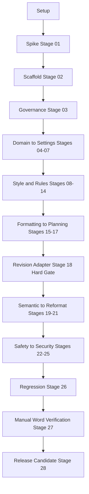

# ToneForge — Production Repository Plan

> Decisions locked: TypeScript + React + Fluent UI v9 + Webpack + npm, Unified JSON manifest. LLM: provider-agnostic interface + OpenAI + mock. Tests: Vitest + Testing Library.
> Roadmap source: [`ROADMAP.md`](ROADMAP.md:1). Current baseline: [`README.md`](README.md:1), [`.gitignore`](.gitignore:1), [`.roo/mcp.json`](.roo/mcp.json:1).

## 1. Vision Summary

Production Word Web Add-in with editable style learning, deterministic-first checks, semantic AI only where interpretation required, unified `Findings[]` → `ChangePlan` → single Word Mutation Adapter → native revisions. Hard gates: Stage 01 Office.js spike, Stage 18 revision adapter, Stage 27 manual Word verification, Stage 28 release candidate. Critical rule: do not build full reformatter before proving native revision behavior.

## 2. Target Directory Layout

```text
ToneForge/
  manifest.json                 # unified manifest for Microsoft 365, Word only
  assets/                       # icons 16/32/80
  src/
    taskpane/                   # taskpane.html, index.tsx, App.tsx, components/
    commands/                   # commands.html + commands.ts, ribbon handlers
    core/
      domain/                   # StyleProfile.ts, Finding.ts, ChangePlan.ts, interfaces
      state/                    # store.ts, persistence.ts, migration.ts
      config/                   # env.ts, constants.ts
    style/                      # sampleCapture.ts, sampleQuality.ts, metrics.ts, profiler.ts, versioning.ts
    rules/                      # typography.ts, houseStyle.ts, ruleTypes.ts
    formatting/                 # analyzer.ts, normalizer.ts, wordStyles.ts
    analysis/                   # unifiedFindings.ts, deviationEngine.ts, consistencyChecker.ts
    changes/                    # planner.ts, conflictDetector.ts, staleGuard.ts
    word/                       # revisionAdapter.ts, documentReader.ts, capabilityProbe.ts
    ai/
      providers/                # LlmProvider.ts, openaiAdapter.ts, mockAdapter.ts, registry.ts, retry.ts
      prompts/                  # profilePrompts.ts, deviationPrompts.ts, rewritePrompts.ts
    ui/
      settings/                 # ProviderSettings.tsx, ApiKeyFields.tsx
      profile/                  # ProfileEditor.tsx, VersionDiff.tsx
      findings/                 # FindingsList.tsx, ChangePreview.tsx
      shared/                   # ErrorBoundary.tsx, Loading.tsx
    shared/
      utils/                    # text.ts, debounce.ts, result.ts, logger.ts
      office/                   # officeHelpers.ts
  tests/
    unit/                       # mirrors src: metrics.test.ts, typography.test.ts, planner.test.ts
    integration/                # provider.registry.test.ts, changeplan-to-adapter.test.ts
    fixtures/                   # sampleDocs.ts, profiles.ts
    setup.ts
  docs/
    project-state.md            # per-stage status PASS/BLOCKED per Stage protocol
    decision-log.md             # ADRs
    architecture.md             # product architecture + module boundaries
    onboarding.md               # setup → sideload → dev loop
    privacy-security.md         # key handling, no doc exfiltration without consent
    accessibility.md            # Fluent + keyboard + screen reader checklist
    manual-verification.md      # Stage 27 host matrix results
    stages/                     # 00-28 stage files if not present
  configs/  # OR root-level: tsconfig.json, webpack configs, eslint, prettier, vitest
  scripts/                      # validate-manifest.mjs, check-office-version.mjs, stage-verify.mjs
  .github/workflows/            # ci.yml, release.yml
  .husky/                       # pre-commit, commit-msg
  .cline/rules/ + .roo/skills/  # Stage 03 governance
  .env.example
  .nvmrc + .editorconfig
```

Module boundaries:

- `core/domain` owns canonical types. No imports from `word`, `ai`, `ui`.
- `rules`, `formatting`, `style` are pure deterministic. No `Office.*` imports except via `word/documentReader` DTOs.
- `analysis` merges deterministic + semantic into `Findings[]`. No direct Word mutation.
- `changes` owns `ChangePlan` + conflict/stale logic. Sole caller of `word/revisionAdapter`.
- `word` is only Office.js boundary. Must expose `CapabilityProbe` for Stage 01 hard gate.
- `ai/providers` behind `LlmProvider` interface. UI never calls fetch directly.

Core interfaces to scaffold in Stage 04:

- [`StyleProfile`](src/core/domain/StyleProfile.ts:1): measured + semantic + typography + houseStyle + version
- [`Finding`](src/core/domain/Finding.ts:1): id, kind deterministic/semantic/formatting, range, message, severity, suggestedChangeId
- [`ChangePlan`](src/core/domain/ChangePlan.ts:1): changes[], conflicts[], baseDocHash, createdAt
- [`LlmProvider`](src/ai/providers/LlmProvider.ts:1): `profile()`, `deviations()`, `rewrite()` with `AbortSignal`, retry, redaction hooks

## 3. Tooling Chain

Dependencies via npm. Node LTS pinned in `.nvmrc`. Replace dotnet [`.gitignore`](.gitignore:1) with Node+Office add-in ignore.

`package.json` scripts:

- `dev`: `webpack serve --config webpack.dev.js`
- `build`: `webpack --config webpack.prod.js`
- `build:dev`: webpack dev build
- `sideload`: `office-addin-debugging start manifest.json`
- `stop`: `office-addin-debugging stop manifest.json`
- `validate`: `office-addin-manifest validate manifest.json` + `scripts/validate-manifest.mjs`
- `test`: `vitest run`
- `test:watch`: `vitest`
- `test:coverage`: `vitest run --coverage`
- `lint`: `eslint src tests --max-warnings 0`
- `lint:fix`: eslint fix
- `format`: `prettier --check .`
- `format:write`: `prettier --write .`
- `typecheck`: `tsc --noEmit`
- `verify`: `npm run typecheck && npm run lint && npm run format && npm run test && npm run build && npm run validate`
- `stage:verify`: `node scripts/stage-verify.mjs`

Build: Webpack 5 + ts-loader/babel, HtmlWebpackPlugin for `taskpane.html` + `commands.html`, dev-server HTTPS localhost:3000 as required by Office. Prod: content-hash, source-maps, bundle size guard.

Tests: Vitest + jsdom + Testing Library. `tests/setup.ts` mocks `Office.*`. Coverage thresholds 80% for `rules`, `formatting`, `changes`. Mock LLM adapter for all unit tests; live OpenAI only in manual opt-in integration.

Lint/format/types: ESLint flat + typescript-eslint + react + react-hooks + jsx-a11y. Prettier + EditorConfig. `tsconfig.json` strict, `noUncheckedIndexedAccess`, `exactOptionalPropertyTypes`, path alias `@/*` → `src/*`. Husky + lint-staged + commitlint conventional-commits enforcing roadmap prefixes like `feat(word):`, `spike:`, `chore:`.

CI `.github/workflows/ci.yml`: matrix Node LTS on push/PR — install → typecheck → lint → format check → test with coverage → build → manifest validate → upload artifacts. `release.yml`: tag `v*` → build → zip sideload bundle → GitHub Release draft, gate on Stage 28 checklist.

## 4. Environment + Config

- `.env.example`: `OPENAI_API_KEY=`, `OPENAI_BASE_URL=https://api.openai.com/v1`, `OPENAI_MODEL=gpt-4o-mini`, `TELEMETRY_DISABLED=1`. Never commit `.env`. Runtime config via taskpane settings pane persisted to `Office.roamingSettings` + localStorage fallback in `core/state/persistence.ts`.
- `src/core/config/env.ts` validates env, exposes typed getters, redacts keys in logs.

## 5. MCP Integration Map

Available per [`.roo/mcp.json`](.roo/mcp.json:1):

- `filesystem`: scaffold/list/verify structure, manage `docs/stages`.
- `git`: branch per stage, commit only after gate passes, e.g. `spike: verify Word revision`.
- `microsoft-learn`: ground every Office.js + manifest + Fluent usage; must cite before implementing `word/` or manifest changes.
- `context7`: React + Fluent UI v9 + Vitest + Webpack patterns.
- `sequentialthinking`: use for ChangePlan conflict logic, deviation engine, large-doc perf design.

Missing but needed later: no DB MCP required — storage is local/roaming, migrations in code. If sideload helper or Playwright MCP becomes available, use for Stage 27 host matrix.

Workflow per stage:

1. `microsoft-learn` search → fetch full page for Office APIs.
2. `filesystem` inspect before modify.
3. Implement scope only.
4. `vitest` targeted + `typecheck` + `lint`.
5. Update `docs/project-state.md` + `docs/decision-log.md`.
6. `git` commit after gate.

## 6. Development Workflow



- Setup: `nvm use`, `npm ci`, `npm run validate`, `npm run dev`, sideload in Word on the web.
- Dev loop: branch `stage/NN-short-name`, implement, `npm run verify`.
- Staging: `release.yml` artifact sideloaded to Word desktop + web for Stage 27 matrix: Word web Chrome/Edge, Word Windows current, Word Mac if available. Record in `manual-verification.md`.
- Prod: version bump, `CHANGELOG.md`, tag, GitHub Release. Store listing notes separate.

Onboarding in `docs/onboarding.md`: prerequisites Node LTS + M365 dev tenant, install, dev cert trust via `office-addin-dev-certs`, sideload steps, troubleshooting webview + HTTPS.

## 7. Roadmap Alignment

- Stage 00 discovery: replace gitignore, baseline `project-state.md`, `decision-log.md`.
- Stage 01 spike must precede scaffold: `src/word/capabilityProbe.ts` + `scripts/check-office-version.mjs` proving insert/revision support; if BLOCKED, halt Stages 15-21.
- Stages 04-05 define canonical types before any UI.
- Stage 06 implements `LlmProvider` + OpenAI + mock only; no Azure until post-MVP ADR.
- Stages 13-15 deterministic first; Stage 19-20 AI only for tone/voice/flow.
- Stage 17-18-22 enforce one mutation path with stale-guard via doc hash.
- Every stage ends with gate status; `attempt_completion` equivalent is commit only on PASS.

## 8. Risks

- Unified JSON manifest preview limits on desktop hosts → mitigation: keep XML manifest fallback branch documented, validate on web first.
- Native revision API gaps → mitigation: hard-gate spike, adapter degrades to tracked-change insertion with documented limitation.
- Key exfiltration → mitigation: settings UI warns, redaction in prompts, no telemetry by default.
- Large docs perf → mitigation: chunked analysis, worker-ready `formatting/analyzer`, Stage 24 budget tests.

## 9. Execution Checklist for Code Mode

- [ ] Replace `.gitignore`, add `.nvmrc`, `.editorconfig`, `.env.example`, `tsconfig`, `webpack.*`, `eslint`, `prettier`, `vitest.config`, `package.json` scripts above
- [ ] Add `manifest.json` unified Word taskpane + `assets/` + `src/taskpane` hello-world + `src/commands`
- [ ] Add `src/core/domain`, `src/shared/utils`, `src/word/capabilityProbe`, `src/ai/providers` interface + openai + mock
- [ ] Add `tests/setup.ts` + 3 smoke tests proving build/test/lint/typecheck chain
- [ ] Add `docs/project-state.md`, `decision-log.md`, `architecture.md`, `onboarding.md`, `manual-verification.md`
- [ ] Add `.github/workflows/ci.yml`, `.husky/`, `commitlint`, `lint-staged`, `scripts/validate-manifest.mjs`
- [ ] Add `.cline/rules` + skills stub for Stage 03
- [ ] Run `npm run verify` + `npm run validate`, commit `chore: scaffold ToneForge Office add-in`
