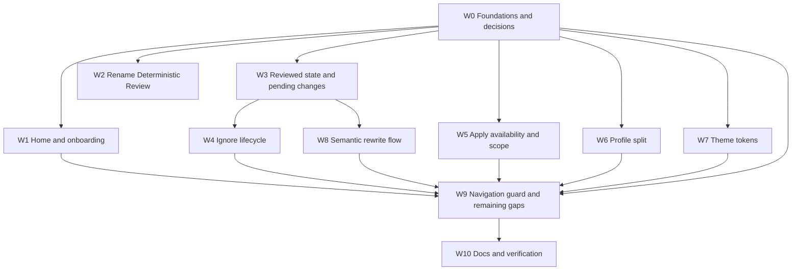

# ToneForge — Post-Restructure Remediation Plan

**Status:** single source of truth for implementation. All prior decisions are
folded in; there is no second plan to reconcile against.

**Supersedes:** the earlier drafts of this document,
[`navigation-and-tab-restructure-review.md`](./navigation-and-tab-restructure-review.md),
and [`post-restructure-plan-disagreements.md`](./post-restructure-plan-disagreements.md).
Their content is either carried forward here or recorded below as settled.

**Inputs:** a review of
[`navigation-and-tab-restructure-plan.md`](./navigation-and-tab-restructure-plan.md)
against the current tree, plus the live-Word defect report and screenshots.

---

## 0. Settled decisions

These came from the product owner. They are not open questions and must not be
re-litigated during implementation.

| #      | Decision                                                                                                                                                                                                                                                                                                          |
| ------ | ----------------------------------------------------------------------------------------------------------------------------------------------------------------------------------------------------------------------------------------------------------------------------------------------------------------- |
| **S1** | **A Home page is required.** It lists a deterministic style profile, a semantic style profile, and an LLM provider, links to the relevant settings page for each, and states in words which capability each missing item is preventing until it is completed. First run is a warning surface, not a lock.         |
| **S2** | **The review surface is renamed Deterministic Review.** The rename is settled. Accessible names, tests, and docs move in the same change.                                                                                                                                                                         |
| **S3** | **No migration of existing user data is required. There are no users.** The v10 → v11 semantic-copy gap is not a defect and no migration work is planned.                                                                                                                                                         |
| **S4** | **Semantic style has its own flow.** It does not work like a deterministic finding and is not folded into the deterministic reviewed/pending model.                                                                                                                                                               |
| **S5** | **The semantic tab has no pending-changes section.** A semantic proposal is presented as one paragraph beside its proposed replacement, with two actions: **Apply revision** (tracked changes, through the single mutation path) and **Regenerate review** (re-send the same selection and profile to the model). |
| **S6** | **XML/JSON manifest parity is a recorded, intentional deviation.** XML controls use `ShowTaskpane` because XML cannot encode command-specific targets. This is not reopened.                                                                                                                                      |
| **S7** | **Reviewed and ignored need different identity policies.** A review is consent to apply a specific correction and invalidates when the text moves; an ignore is "stop showing me this" and tolerates an edit above it.                                                                                            |
| **S8** | **The navigation guard's real contract is honoured:** at most one host call in flight plus one replaceable queued request. `Office.run` cannot be cancelled.                                                                                                                                                      |
| **S9** | **Do not commit unless separately requested.**                                                                                                                                                                                                                                                                    |

### Corrections carried forward from the review

The following three of my earlier claims were wrong and are now settled against
my position, so implementation does not repeat them:

- A burst of ten selections produces **two** host calls, not one, per
  [`createNavigationGuard`](../src/word/navigationGuard.ts:16). Tests assert
  bounded, non-overlapping calls and latest-queued settlement.
- **Do not add body-node text to satisfy a coverage predicate.**
  [`buildCoverage`](../src/analysis/coverage.ts:117) accepts any included node
  with non-empty text; headings and list items already qualify.
- **Do not collapse the Apply gates into one.** Consolidate the _user-facing
  readiness explanation_; leave the fail-closed checks in
  [`applyReviewedPlan`](../src/reformat/orchestrator.ts:543) and the adapter
  intact.

---

## Part A — Verdict on `navigation-and-tab-restructure-plan.md`

| #                     | Item                                                             | Verdict                               | Note                                                                                                                                                                                                                                           |
| --------------------- | ---------------------------------------------------------------- | ------------------------------------- | ---------------------------------------------------------------------------------------------------------------------------------------------------------------------------------------------------------------------------------------------- |
| 3.1                   | Navigation guard                                                 | Built, not wired                      | [`navigationGuard.ts`](../src/word/navigationGuard.ts) exists and is tested; nothing imports it. Contract is one-in-flight plus one-queued (S8).                                                                                               |
| 3.1b                  | Guard wired into selection                                       | Not built                             | [`FindingCard`](../src/taskpane/components/FindingCard.tsx:51) only scrolls.                                                                                                                                                                   |
| 3.2                   | Persistent ignore list                                           | Built, defective                      | Dedupe on fingerprint only — D4.                                                                                                                                                                                                               |
| 4.1–4.4               | Profile namespaces, migration v11, publish-in-place, auto-scan   | Built                                 | No further work (S3).                                                                                                                                                                                                                          |
| 5.1                   | `PendingChanges` last                                            | Not built                             | Currently second on the page.                                                                                                                                                                                                                  |
| 5.2                   | `Last scan` in the header row                                    | Not built                             | Renders in `StaleBanner` instead.                                                                                                                                                                                                              |
| 5.3                   | Auto-navigate on selection                                       | Not built                             | See 3.1b.                                                                                                                                                                                                                                      |
| 5.4                   | Per-finding Apply                                                | Superseded by S4/S5                   | Deterministic findings use the reviewed-only central gate.                                                                                                                                                                                     |
| 5.5–5.7               | Ignore list, summary counts, coverage section                    | Built                                 | —                                                                                                                                                                                                                                              |
| 5.8                   | Auto-preview                                                     | Built, capability propagation missing | See D5.                                                                                                                                                                                                                                        |
| 5.9                   | Apply All                                                        | Deviated, recorded                    | Deliberate removal as a gate bypass.                                                                                                                                                                                                           |
| 5.10                  | Safe Reformat removed                                            | Done, dead code remains               | `ReformatPanel.tsx`, `GovernanceDashboard.tsx` unimported.                                                                                                                                                                                     |
| 6.1                   | Semantic fields off the deterministic editor                     | Built                                 | —                                                                                                                                                                                                                                              |
| 6.1b                  | Duplicate read-only profile sections                             | Not built                             | D6.                                                                                                                                                                                                                                            |
| 6.2                   | Save writes deterministic fields only                            | Built                                 | —                                                                                                                                                                                                                                              |
| 6.3                   | One collapsed revision toggle                                    | Partial                               | [`ProfileRecordSection`](../src/taskpane/components/ProfileRecordSection.tsx:45) collapses its trail; lifecycle controls stay visible and [`ProfileEditor`](../src/taskpane/components/ProfileEditor.tsx:477) has a second history disclosure. |
| 6.4–6.6               | Publish-in-place, policy moved, Learn Style moved                | Built                                 | —                                                                                                                                                                                                                                              |
| 7.1–7.4               | Governance Policy tab and both manifests                         | Built, deviation recorded (S6)        | —                                                                                                                                                                                                                                              |
| 8.1                   | Learn Style paste box                                            | Partial                               | Only "Learn from current document" (`Semantic.tsx`).                                                                                                                                                                                           |
| 8.2                   | Measured + semantic on the semantic tab                          | Built                                 | Measured is displayed read-only; ownership is the deterministic record (see W6).                                                                                                                                                               |
| 8.3                   | Rewrite engine                                                   | Built                                 | `rewritePrompts.ts`, `rewriteEngine.ts`.                                                                                                                                                                                                       |
| 8.4                   | Semantic pending-changes section                                 | **Superseded by S5**                  | Replaced by the side-by-side apply/regenerate presentation.                                                                                                                                                                                    |
| 9.1, 9.3–9.5          | Consistency tab, grouping, unlocatable note, consent             | Built                                 | —                                                                                                                                                                                                                                              |
| 9.2                   | Prev/next stepping and auto-navigate on results                  | Partial                               | Button label correct; no stepping.                                                                                                                                                                                                             |
| 11.1–11.4, 11.6, 11.7 | Context menu, selection read, empty state, ribbon fallback, docs | Built                                 | XML/JSON deviation recorded (S6).                                                                                                                                                                                                              |
| 11.5                  | `supportsContextMenu` probe                                      | Not built                             | [`capabilityProbe.ts`](../src/word/capabilityProbe.ts:275) tests a runtime API that cannot prove a manifest-declared menu.                                                                                                                     |
| 12.1–12.2             | Settings, OAuth docs                                             | Built                                 | —                                                                                                                                                                                                                                              |
| 12.3                  | Three troubleshooting sections                                   | Partial                               | Six checks exist; the three named in the plan are absent.                                                                                                                                                                                      |

---

## Part B — Defect analysis

### D1 — First run has no Home surface

[`Dashboard()`](../src/taskpane/pages/Dashboard.tsx:153) returns
[`NoProfileSetup`](../src/taskpane/pages/Dashboard.tsx:176) with no deterministic
profile, and that component's
[`navigate()`](../src/taskpane/pages/Dashboard.tsx:185) collapses every
destination except `settings`, `troubleshooting`, and `home` back to `home` —
which _is_ the profile editor. The header's other destinations are visible and
inert. The whole pane, including the observer and auto-preview, lives in
`DashboardWithProfile`, which never mounts without a profile.

**Fix (S1):** extract the app shell so every page renders regardless of profile
state; add a Home page carrying the three-item checklist, per-item warnings, and
settings links; make blocked destinations honest rather than silently redirecting.

### D2 — Naming

`Document Governance` is set in
[`TaskPaneHeader.DESTINATIONS`](../src/taskpane/components/TaskPaneHeader.tsx:24)
and repeated in `GovernanceDashboard`, seven breadcrumbs,
`ScanningSettingsSection`, and `troubleshooting/checks.ts`.

**Fix (S2):** rename to **Deterministic Review** everywhere a user can see it,
including manifest labels and supertips, with tests and `aria-label` strings
updated in the same change.

### D3 — Reviewed items do not reach Pending Changes without a re-scan

Three distinct defects, all confirmed in code.

**D3.1 — the gate judges in a namespace it cannot address.** The finding the user
clicks comes from the **observer's** list
([`Dashboard.tsx:891`](../src/taskpane/pages/Dashboard.tsx:891)); the plan comes
from the **preview run**
([`Dashboard.tsx:927`](../src/taskpane/pages/Dashboard.tsx:927));
`reviewFinding` matches by `change.findingId === finding.id`
([`reviewGate.ts:73`](../src/taskpane/reviewGate.ts:73)). Separate runs issue
separate uuids, so the match can never succeed and every observer-sourced finding
prints "the planner proposes no correction for this finding" — verbatim the
screenshot, on a finding that does have a change.

Meanwhile [`reviewedPlan`](../src/taskpane/reviewGate.ts:158) matches by
`reviewKey` (fingerprint plus offset) and does find it, which is why Pending
Changes shows rows in the second screenshot. **The gate and the projection use
two different identities for one decision and disagree.** This is not a messaging
defect: the gate's verdict carries no information.

**D3.2 — the full plan silently stands in for the reviewed subset.**
[`Dashboard.tsx:929`](../src/taskpane/pages/Dashboard.tsx:929) does
`reviewedPlan(...) ?? reviewedOnly.plan`. `reviewedPlan` returns `null` both when
nothing is reviewed and when the reviewed subset is empty, so the fallback
substitutes the **entire unreviewed plan** — unreviewed changes presented as
reviewed, with Apply able to write them.

**D3.3 — reviewed state is unversioned and unowned.** Keys live in
`localStorage["ToneForge.ReviewedFindingFingerprints.v1"]`
([`Dashboard.tsx:63`](../src/taskpane/pages/Dashboard.tsx:63)), outside
`PersistedState` and outside the migration chain, so no write to it triggers the
store subscription the rest of the pane relies on. The message shown to the user
is set at click time and is not recomputed when a preview later lands.

**Fix:** one shared identity between gate and projection (S7); no fallback to
the full plan; reviewed decisions in `PersistedState` so writes drive a
re-render through the existing `usePersistedState` subscription; the message
reconciled when a preview lands.

### D4 — Ignoring a reviewed item corrupts the flow; a second ignore resurrects the first

[`persistIgnore`](../src/core/state/persistence.ts:595) keeps entries by
**fingerprint only**:
`state.ignoredFindings.filter((item) => item.fingerprint !== parsed.fingerprint)`.
A fingerprint is the identity of a _rule_ — it deliberately excludes the range.
Ignoring a second occurrence of the same rule therefore **deletes the first
entry** and the set-aside finding reappears. That is the reported
"clicking ignore on another item brings back ignored items".

Same key, three more consequences:

- [`restoreFinding(fingerprint)`](../src/core/state/persistence.ts:600) deletes
  every entry sharing that fingerprint, so Restore is all-or-nothing per rule.
- [`IgnoredFindings`](../src/taskpane/components/IgnoredFindings.tsx:63) uses
  `entry.fingerprint` as the React key, which collides the moment two entries
  share a rule.
- [`isIgnoredFinding`](../src/taskpane/isIgnoredFinding.ts:40) falls back on
  `sameNode` plus a 400-character tolerance. Typography findings carry
  `nodeIds: []`, so `sameNode([], [])` is vacuously true and the tolerance is the
  only thing separating nearby occurrences.

Ignoring also does **not** clear the review flag, so a set-aside finding keeps
contributing a change to the reviewed-only plan that Apply writes.

**Fix (S7):** occurrence-keyed entries with a relocation-tolerant match for
ignores; per-occurrence React keys and per-occurrence Restore; ignore and review
made atomic in both UI and store; no pruning on an unknown fingerprint alone.

### D5 — Apply is permanently unavailable

The screenshot shows the gate: `Coverage is incomplete; apply is blocked` with
`Unprocessed: No in-scope document content was acquired`. Two provable causes.

**D5.1 — protection exclusions are reported as acquisition failure.** A four-line
deterministic chain with no host dependency:

1. [`analysisAcquisition.ts:350`](../src/word/analysisAcquisition.ts:350) sets
   `includedInGovernance: false` on any paragraph containing a double-quoted
   span. A document that discusses quotations qualifies throughout.
2. [`coverage.ts:117`](../src/analysis/coverage.ts:117) finds no included node
   with text and pushes `No in-scope document content was acquired`.
3. [`coverage.ts:176`](../src/analysis/coverage.ts:176) derives `complete` from
   `unprocessed.length === 0`.
4. [`PendingChanges.tsx:76`](../src/taskpane/components/PendingChanges.tsx:76) and
   [`orchestrator.ts:543`](../src/reformat/orchestrator.ts:543) both refuse Apply.

The screenshot's `unprocessed` line is that exact string and the screenshot
document is visibly quote-heavy. **This is the first thing to test in W5.**

**D5.2 — the preview never passes real capabilities.**
[`Dashboard.tsx:457`](../src/taskpane/pages/Dashboard.tsx:457) calls
`reformatDocument` with no `capabilities`, so the orchestrator falls back to
[`FALLBACK_CAPABILITIES`](../src/reformat/orchestrator.ts:92) — every flag
`false`. That is why the report lists `styles, styleBuiltin, isListItem, listItem,
alignment, lineSpacing, spaceAfter, spaceBefore, font` on a host that serves them
all. The report is a fiction produced by the pane. This establishes that the
preview used fallback values; it does not by itself establish that this is the
whole cause of the refusal, so it is fixed alongside D5.1 rather than instead of
it.

**Contributing:** the same `unprocessed` array gates Apply in two places; and the
deterministic rules scan the whole analysis text while the planner receives
findings without a reliable excluded-node boundary, so protected nodes can produce
findings and changes the adapter would refuse.

**Fix:** classify acquisition gaps, protection exclusions, and no-eligible-content
as three distinct states; `complete` reflects requested acquisition only; pass
settled probed capabilities into preview; carry node scope into rules and planning;
one shared readiness explanation with the fail-closed checks retained.

### D6 — Measured style and Semantic style still on the deterministic tab

[`ProfileEditor.tsx:494`](../src/taskpane/components/ProfileEditor.tsx:494)
renders a read-only **Measured style** `<dl>`;
[`ProfileEditor.tsx:546`](../src/taskpane/components/ProfileEditor.tsx:546)
renders a read-only **Semantic style** `<dl>`. Both duplicate the Semantic tab,
which already owns measured style
(`Semantic.tsx:400`) and the editable
semantic editor ([`SemanticProfileEditor`](../src/taskpane/components/SemanticProfileEditor.tsx:95)).
Those two headings are exactly the two blocks in the screenshot. The editor also
titles itself "Style Profile"
([`ProfileEditor.tsx:432`](../src/taskpane/components/ProfileEditor.tsx:432))
under a page titled "Deterministic Style Profile", so the tab shows two competing
headings.

**Measured-style ownership:** the persisted owner is the **deterministic** record
(`measured` is part of `StyleProfile`, written by the deterministic engine). The
Semantic tab may _display_ those values read-only for comparison; they do not
become editable fields of the semantic record.

**Fix:** remove the semantic section from `ProfileEditor` outright; remove the
measured section from `ProfileEditor` and rely on the Semantic tab's read-only
display; give the editor a single page-owned heading.

### D7 — Controls do not follow the global theme

- Hardcoded colours survive: [`ProfileEditor.sectionStyle`](../src/taskpane/components/ProfileEditor.tsx:85)
  (`#edebe9`), `ReformatPanel`
  (`#a4262c`, `#0b6a0b`).
- Inline style objects across `PendingChanges`, `CoverageBanner`,
  `GovernanceDashboard`, `ConsistencyReviewResults`, `SemanticProfileEditor` and
  others bypass the token layer. Colour-valued styles are the defect; layout-only
  styles are not automatically one.
- Fluent `Dropdown` and `TextField` render light-on-dark on the Profile tab.
  Theme construction is confirmed correct
  ([`createDefaultTheme`](../src/taskpane/fluentTheme.ts:21) sets `isInverted`),
  and the unscoped `input, select, textarea` rule at
  [`taskpane.css:231`](../src/taskpane/taskpane.css:231) is a plausible
  contributor, but the rendered cascade in Word has not been inspected. jsdom
  cannot establish computed styles in a WebView.

**Fix:** a complete token set in `taskpane.css`; colour-bearing styles converted
to token-backed classes; native element rules scoped so they cannot fight Fluent;
a colour-literal guard. Word rendering remains a verification gate.

### D8 — Smaller findings

- Reviewed is conveyed mainly by text and button state, with no distinct card
  treatment.
- Consistency findings are appended **after** observer ignores are filtered
  ([`Dashboard.tsx:891`](../src/taskpane/pages/Dashboard.tsx:891)), so the visible
  list and the open summary can disagree.
- The section header count (5) and the table count (2) differ with no label
  explaining which is which.
- `Findings 3` in the header and `3 finding(s)` in the list are the same number
  in this screenshot but the relationship changes once a reviewed flag exists.

### D9 — The semantic proposal has no way to be applied (S5)

`Semantic.tsx:499` offers
`Review in Document Governance`, which hands the proposal to `reviewOne` — the
deterministic gate from D3.1, which cannot address it. So today a semantic
rewrite has **no working apply path at all**: the button reports that the planner
proposes no correction, and the user is left with a paragraph they cannot use or
refine. S5 replaces this with a self-contained flow on the Semantic tab.

---

## Part C — Workstreams

Every workstream ends green on `npm run verify`. The verified chain is
`typecheck` → `lint` → `format` → `test` → `build` → `validate`, run in that order
via `npm run verify`.

### W0 — Foundations

- [ ] Add a `DashboardPage` member distinct from the review destination, and stop
      overloading one destination for both the landing page and the review surface.
- [ ] Add a pure `src/taskpane/setupStatus.ts` reading `PersistedState` and
      returning, for deterministic profile, semantic profile, and LLM provider, a
      status plus the exact capability it blocks. Keep consent states separate, and
      distinguish a mock/offline provider from a usable remote one. No React, no
      Office.
- [ ] Split occurrence identity by purpose (S7). Review: exact current-plan
      identity with explicit revalidation on a new run. Ignore: a bounded relocation
      match that tolerates an edit above the occurrence. `fingerprint + nodeId +
range.start` alone satisfies neither, and `nodeId` can be absent.
- [ ] Add reviewed state to `PersistedState` so writes flow through the existing
      `usePersistedState` subscription. Reads and writes must not be split between
      `PersistedState` and a separate `useState` plus effect, or the pane will need a
      second re-render path.
- [ ] Add a colour-literal guard scoped to active taskpane UI, with the token file
      and `fluentTheme.ts` as the only exceptions.
- [ ] Record the settled decisions S1–S9 in `docs/decision-log.md` before
      implementation starts, so each workstream's ADR has a baseline to cite.

### W1 — Home page and first-run onboarding (S1)

- [ ] Extract the app shell — header, live region, navigation, page switch — out
      of `DashboardWithProfile` so every page renders regardless of profile state.
- [ ] Create `src/taskpane/pages/Home.tsx` rendering the three-item checklist
      from `setupStatus`, each row stating in words what is unavailable until it is
      done and offering a link to the page that fixes it.
- [ ] Make navigation honest: every destination is reachable. Where a destination
      genuinely cannot function, render its own setup state with the prerequisite
      stated. Do not silently redirect a Semantic, Consistency, or Governance Policy
      click back to the profile editor.
- [ ] Keep the deterministic profile as a real prerequisite for scanning and
      applying. A warning is not a capability grant: a missing semantic profile warns
      that rewrites are unavailable, and a missing provider warns that AI features are
      unavailable, without implying deterministic checks are affected.
- [ ] Keep profile creation on the Deterministic Style Profile tab; Home links to
      it rather than embedding the editor.
- [ ] Delete [`NoProfileSetup`](../src/taskpane/pages/Dashboard.tsx:176) and its
      redirect logic.
- [ ] Tests: with no profile, every nav item renders its page; each checklist item
      reflects its true state; the stated blocker matches the actual gate; no page is
      unreachable.

### W2 — Rename the review surface (S2)

- [ ] Rename the navigation label to **Deterministic Review** in
      [`TaskPaneHeader.DESTINATIONS`](../src/taskpane/components/TaskPaneHeader.tsx:24).
- [ ] Update every user-visible string: breadcrumbs on all pages, the
      `GovernanceDashboard` heading and `aria-label`, `ScanningSettingsSection` copy,
      `troubleshooting/checks.ts` remedy text, coverage and readiness copy, and
      `PendingChanges` headings.
- [ ] Update the manifest group label and supertips in both
      [`manifest.json`](../manifest.json) and [`manifest.xml`](../manifest.xml) and
      re-run `npm run validate`.
- [ ] Update the tests asserting the old label and the docs naming the tab.
      Accessibility names move in the same change, not after it.

### W3 — Reviewed state and automatic pending changes (D3)

- [ ] Give `reviewFinding` and `reviewedPlan` **one shared identity**, so the
      gate and the projection cannot disagree. A reviewed finding on the observer's
      list must reach Pending Changes without a re-scan. Add a test that fails against
      today's `findingId` match.
- [ ] Remove the `?? reviewedOnly.plan` fallback in
      [`Dashboard.tsx`](../src/taskpane/pages/Dashboard.tsx:929). A missing or empty
      reviewed projection must never restore the full plan. Make
      `reviewedPlan` return a discriminated result so the three states are
      distinguishable: no plan yet, plan with nothing reviewed, plan with a reviewed
      subset.
- [ ] Persist reviewed decisions in `PersistedState`, discarding the existing
      unversioned `localStorage` keys (S3: no users, nothing to preserve).
- [ ] Define revalidation for a new run: a review whose occurrence no longer
      matches is expired and must be reported, never silently applied to different
      text. A still-valid review is never silently dropped either.
- [ ] Reconcile the review message when a preview lands, rather than leaving the
      click-time verdict on screen.
- [ ] Auto-open Pending Changes when the reviewed count first becomes non-zero.
- [ ] Label the counts explicitly: total proposed, reviewed, and unreviewed, so a
      header count of 5 above a table of 2 reads as a labelled distinction rather than
      lost work.
- [ ] Disable **Ignore** on a reviewed finding in
      [`FindingDetail`](../src/taskpane/components/FindingDetail.tsx:170), with an
      accessible explanation that it is already queued.
- [ ] Add a distinct reviewed card treatment in `taskpane.css` so Reviewed and
      New are distinguishable without reading the meta line.
- [ ] Tests: gate and projection agree; a reviewed finding reaches Pending Changes
      with no re-scan; an empty reviewed set never exposes the full plan; the applied
      subset is exactly the reviewed set; an expired review is reported; a reviewed
      finding cannot be ignored.

### W4 — Ignore lifecycle (D4)

- [ ] Re-key ignore entries in
      [`persistIgnore`](../src/core/state/persistence.ts) and
      [`restoreFinding`](../src/core/state/persistence.ts) on the occurrence identity
      so a second same-rule occurrence never deletes the first.
- [ ] Update [`isIgnoredFinding`](../src/taskpane/isIgnoredFinding.ts) to
      distinguish nearby same-rule occurrences, including findings with empty
      `nodeIds` where `sameNode` is vacuously true.
- [ ] Key [`IgnoredFindings`](../src/taskpane/components/IgnoredFindings.tsx:63)
      rows on the occurrence identity and give each row its own Restore.
- [ ] Make ignore and review atomic: ignoring clears the review flag, and an
      ignore on a reviewed occurrence is refused in the store as well as disabled in
      the UI.
- [ ] Do not prune an ignore because its fingerprint is unknown during load.
      Without a rule registry carrying removal evidence, an unknown fingerprint is not
      proof of obsolescence; retain it with a working Restore.
- [ ] Tests: two occurrences of one rule ignore independently; restoring one
      leaves the other ignored; an ignored occurrence is absent from the open counts
      and from the pending plan; an edit above an ignored occurrence keeps it ignored.

### W5 — Apply availability and analysis scope (D5)

- [ ] **First:** classify coverage facts into acquisition gaps, protection
      exclusions, and no-eligible-content, and make `complete` reflect requested
      acquisition only. When everything is excluded, say so plainly and state that
      there is no applyable change — do not report an acquisition failure that did
      not happen, and do not imply an empty plan can be applied.
- [ ] Represent capability-probe state as unresolved, successful, or failed.
      Defer actionable preview until it resolves; on success pass the probed
      capabilities into `reformatDocument`; on failure show the probe error with a
      retry path rather than substituting all-false values as though measured.
      Optional unsupported properties alone must never block Apply.
- [ ] Carry node scope into the deterministic rules and the planner so a protected
      node produces no applyable change. A protected finding may stay visible as a
      non-actionable explanation, but it must be a distinct UI state, not both
      promised absent and promised present.
- [ ] Consolidate the user-facing readiness explanation across `PendingChanges` and
      the Dashboard, and keep the fail-closed checks in the Dashboard callback,
      `applyReviewedPlan`, and the adapter. Coverage being advisory does not bypass
      stale-plan, host-capability, conflict, precondition, approval, tracking, or
      document-integrity checks.
- [ ] Make the Apply disabled reason name the remedy and its control, reusing
      `troubleshooting/checks.ts` so no two surfaces state different reasons.
- [ ] Resolve each pending-table row's `findingId` against the run that planned
      it, and keep an explicit unavailable state only for a genuinely orphaned
      finding.
- [ ] Derive the list, the total, the severity summary, the reviewed count, and
      the ignored count from one defined set. Filter ignored **consistency** findings
      as well as observer findings, and distinguish the visible total from the open
      severity buckets.
- [ ] Add a test asserting the section header count and the summary counts can
      never disagree — the exact failure visible in the first screenshot.
- [ ] Tests: quote-only and all-excluded documents; mixed scope; protected-only;
      list-only; acquisition gap; unresolved, failed, and successful probe; optional
      unsupported properties; protected findings with no node ids. Assert no excluded
      change is applyable and that every independent apply refusal still holds.

### W6 — Deterministic and semantic profile split (D6)

- [ ] Remove the **Semantic style** section from
      [`ProfileEditor`](../src/taskpane/components/ProfileEditor.tsx) outright. The
      editable semantic fields live on the Semantic tab.
- [ ] Remove the **Measured style** section from `ProfileEditor`; the Semantic
      tab's read-only display is the single place it is shown. Measured values stay
      persisted on the deterministic record.
- [ ] Remove the duplicate "Style Profile" heading from the editor so the page
      owns the single heading.
- [ ] Document that the Semantic tab displays measured values sourced from the
      deterministic record, and does not make them editable semantic-record fields.
- [ ] Consolidate revision controls: one collapsed-by-default disclosure over
      `ProfileRecordSection` and the version diff, replacing the editor's second
      revision-history `
`.
- [ ] Convert colour styling in the touched components to tokens (W7) in the same
      pass. Convert layout-only inline styles only where there is a concrete benefit.
- [ ] Tests: the deterministic tab renders no measured or semantic fields; the
      semantic tab renders both; revisions are collapsed by default.

### W7 — Theme tokens and global settings (D7)

- [ ] Define the complete token set in `taskpane.css` — surface, subtle surface,
      text, muted text, accent, border, warning, danger, success, focus — for both
      themes, and forbid raw hex outside that file and `fluentTheme.ts`.
- [ ] Scope the native `input, select, textarea` rule so it cannot override
      Fluent's class-based styling.
- [ ] Convert colour-bearing inline styles to token-backed classes, starting with
      `ProfileEditor`, `PendingChanges`, `CoverageBanner`, `GovernanceDashboard`,
      `ConsistencyReviewResults`, `ConsistencyReviewPreflight`, and
      `SemanticProfileEditor`.
- [ ] Delete the hardcoded colours in `ProfileEditor` and `ReformatPanel`.
- [ ] Audit every reference in `src`, `tests`, manifests, and package entry points
      before deleting `ReformatPanel` and `GovernanceDashboard`, satisfying 5.10
      completely. Classify `openGovernance` and `openTaskpane` first: both have no
      internal caller, and `openTaskpane` is a re-exported compatibility function.
      Preserve compatibility exports unless removal is explicitly approved, and do not
      delete tests merely because a component is unmounted.
- [ ] Add theme regression coverage for both themes, and record Word WebView and
      Desktop computed-style inspection as a manual gate — jsdom cannot establish it.
- [ ] Tests: the colour guard fails on a new hardcoded UI colour; both themes
      render with no colour-bearing inline style.

### W8 — Semantic rewrite flow (S4, S5, D9)

- [ ] Replace `Review in Document Governance` on
      `Semantic.tsx` with a self-contained
      proposal card: the **original paragraph** and the **proposed replacement**
      side by side, plus the rationale and the model's confidence.
- [ ] Provide exactly two actions:
  - **Apply revision** — applies the replacement as a tracked change through the
    single mutation path. It must not bypass
    [`applyChangePlan`](../src/word/revisionAdapter.ts) or any gate: schema
    version, precondition, approval, host capability, protection, staleness, and
    post-apply verification all still apply.
  - **Regenerate review** — re-sends the same selection and the same semantic
    profile to the model, exactly as the original prompt did. No new selection, no
    changed profile, no different prompt.
- [ ] Do **not** add a pending-changes section to the Semantic tab, and do not
      route a semantic proposal through the deterministic reviewed/pending model. The
      semantic flow has its own lifecycle because it is not a deterministic finding
      (S4).
- [ ] Keep the consent and privacy posture unchanged: the prompt still requires
      `includeRawText: true` and `semanticOptIn`, and Regenerate is a second send under
      the same consent rather than a new one.
- [ ] Apply readiness on this tab must state its own blocker honestly, reusing
      `applyReadiness` so the semantic Apply and the deterministic Apply cannot
      disagree about the same host.
- [ ] An unanchored or low-confidence proposal stays advisory with its reason
      attached, and offers Regenerate rather than a disabled Apply with no
      explanation.
- [ ] Tests: a proposal renders both paragraphs; Apply goes through the tracked
      mutation path with every gate intact; Regenerate re-sends the identical prompt
      and selection; a blocked host states the remedy; no semantic change appears in
      the deterministic pending plan.

### W9 — Navigation guard and remaining plan gaps

- [ ] Wire [`createNavigationGuard`](../src/word/navigationGuard.ts:133) into
      selected-finding navigation and explicit **Go to text**, in both Deterministic
      Review and Consistency Review.
- [ ] Name **one** guard owner that spans both pages, and state how it survives a
      page switch. A `useRef` guard in each page is two guards, and
      [`FindingDetail`](../src/taskpane/components/FindingDetail.tsx:67) currently
      owns its own per-card navigation state that must move under the shared owner.
- [ ] Test the real contract (S8): no overlapping host calls, the queued slot is
      replaceable, settlement lands on the final destination, failures stay
      retryable, and the guard is reset when document or review context changes. Do
      not assert a single host call for a burst.
- [ ] Add previous/next stepping to the consistency results, reporting only the
      latest request's outcome.
- [ ] Add the pasted-source-text box to Learn Style (8.1). Pasted text is a local
      sample input; sending it for semantic interpretation stays separately
      consent-gated, and pasting alone sends nothing.
- [ ] Correct the `supportsContextMenu` claim in
      [`capabilityProbe.ts`](../src/word/capabilityProbe.ts:275). Report the runtime
      ContextMenuApi capability honestly and separately from manifest installation
      and host-rendered menu availability, which a runtime probe cannot establish.
      Verify the latter in Word.
- [ ] Deliver navigation commands issued **after** the pane has mounted.
      [`consumeTaskpaneTarget`](../src/shared/office/taskpaneNavigation.ts:80) runs
      only on mount, so a ribbon or context-menu command pressed while the pane is
      already open is never consumed. Add a single-consumption update mechanism and
      test repeated commands without remounting.
- [ ] Reorder the review page to Findings → Coverage → Set aside → Pending
      changes (5.1), and move `Last scan` into the header row (5.2).
- [ ] Add the three missing troubleshooting checks: semantic rewrite did not run,
      consistency review is partial, context menu item missing.
- [ ] Keep document text out of `localStorage` and command payloads.

### W10 — Documentation, ADRs, and verification

- [ ] Record ADRs for: document-scoped reviewed state and removal of the
      full-plan fallback; the shared gate/projection identity; occurrence-aware ignore
      policy; coverage as an acquisition claim with protection reported separately;
      the Home page as a warning surface; the semantic apply/regenerate flow (S4, S5);
      token-backed colours; the XML/JSON deviation (S6).
- [ ] Update [`docs/ux-state-matrix.md`](../docs/ux-state-matrix.md) for the Home
      checklist states, the reviewed/ignored/pending matrix, the semantic proposal
      states, and the Apply-gate reasons.
- [ ] Update [`docs/project-state.md`](../docs/project-state.md) and
      [`docs/CHANGELOG.md`](../docs/CHANGELOG.md). Mark baseline items complete only
      after their exit tests pass; mark intentional deviations as superseded, not
      closed.
- [ ] Extend [`docs/manual-verification.md`](../docs/manual-verification.md) with
      host re-tests: a quote-heavy document, mixed scope, a protected-only document,
      live selection ordering, a command issued to an already-mounted pane, context
      menu visibility, theme rendering of Fluent controls, and a semantic
      apply/regenerate cycle.
- [ ] Run focused suites per workstream, then the full chain in order: `typecheck`,
      `lint`, `format`, `test`, `build`, `validate`. Record exact outcomes in
      `project-state.md` and keep Word-host evidence separate from automated evidence.
- [ ] Do not commit unless separately requested (S9).

---

## Invariants

- `applyChangePlan` remains the only Word mutation path. The deterministic Apply
  and the semantic Apply both go through
  [`applyReviewedPlan`](../src/reformat/orchestrator.ts:526).
- No change is applied that the user has not reviewed. If a reviewed change
  becomes stale, ignored, protected, or unresolvable, that state is explained and
  re-review is required rather than the change being applied or dropped silently.
- Deterministic engines never call the LLM. No prompt sends raw text without
  `includeRawText: true` and explicit consent. Regenerate is a second send under
  the same consent, not a new one.
- Protection excludes a node from change production and is reported separately
  from acquisition failure.
- Every disabled control states the reason and names the control that resolves it.
- Every colour in the task pane resolves to a token in both themes.
- All unit tests stay offline via `MockAdapter`.
