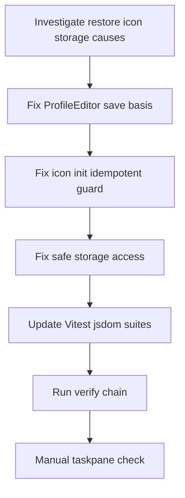

# Root-Cause Fixes — Restore Auto-Bump, Caret Icon, LocalStorage Warning

## Context

Three recent patches silenced symptoms instead of fixing causes:

- [`3564127`](src/taskpane/components/ProfileEditor.tsx:452) sets both bases to snapshot so auto-bump works but leaves dirty versus save inconsistent.
- [`993b736`](src/taskpane/index.tsx:10) removes invalid caret icon and relies on default fallback plus global test silencing.
- [`993b736`](vitest.config.ts:13) adds forks singleFork and logger mock to hide warnings.

This plan recommends proper fixes in code, [`vitest.config.ts`](vitest.config.ts), [`tests/setup.ts`](tests/setup.ts), [`logger.ts`](src/shared/utils/logger.ts), [`revisionAdapter.test.ts`](tests/unit/word/revisionAdapter.test.ts), [`revisionAdapter.apply.test.ts`](tests/unit/word/revisionAdapter.apply.test.ts) and [`package.json`](package.json).

## 1. Restore History Snapshot Patch Auto-Bump Regression

### Observed behavior

- [`restoreHistorySnapshot()`](src/taskpane/components/ProfileEditor.tsx:452) currently sets [`baseProfile`](src/taskpane/components/ProfileEditor.tsx:453) and [`draftBaseProfile`](src/taskpane/components/ProfileEditor.tsx:454) to snapshot, builds [`values`](src/taskpane/components/ProfileEditor.tsx:457) from snapshot, and computes [`dirty`](src/taskpane/components/ProfileEditor.tsx:458) against [`savedProfile`](src/taskpane/components/ProfileEditor.tsx:458).
- [`save()`](src/taskpane/components/ProfileEditor.tsx:465) computes [`contentChanged`](src/taskpane/components/ProfileEditor.tsx:474) and [`versionChanged`](src/taskpane/components/ProfileEditor.tsx:475) against [`draftBaseProfile`](src/taskpane/components/ProfileEditor.tsx:474), not against [`savedProfile`](src/taskpane/components/ProfileEditor.tsx:485).
- [`derivedDirty`](src/taskpane/components/ProfileEditor.tsx:368) compares [`draftProfile`](src/taskpane/components/ProfileEditor.tsx:367) against [`savedProfile`](src/taskpane/components/ProfileEditor.tsx:368).
- Result: after restore without edits, UI shows dirty true but [`save()`](src/taskpane/components/ProfileEditor.tsx:465) early-returns as no-op. After restore plus content edit, [`shouldAutoPatch`](src/taskpane/components/ProfileEditor.tsx:485) bumps from snapshot version, risking duplicate version numbers already present in [`history`](src/taskpane/components/ProfileEditor.tsx:364).
- Pure engine [`bumpProfileVersion()`](src/style/versioning.ts:33) and [`diffProfiles()`](src/style/versioning.ts:125) are correct and need no change. Fix belongs in [`ProfileEditor.tsx`](src/taskpane/components/ProfileEditor.tsx:452).
- New report: loading earlier revision shows downgrade such as v1.0.2 to v1.0.1 with Tone and Rhetorical style reverting, Save does nothing, and [`reset()`](src/taskpane/components/ProfileEditor.tsx:387) does not revert to latest. Expected: restore then Save should bump latest patch such as v1.0.2 to v1.0.3 with restored content, and Reset should revert to latest revision data.

### Root cause

Two sources of truth for change detection. Dirty path uses [`savedProfile`](src/taskpane/components/ProfileEditor.tsx:368). Save path uses [`draftBaseProfile`](src/taskpane/components/ProfileEditor.tsx:474). Restore overwrites [`draftBaseProfile`](src/taskpane/components/ProfileEditor.tsx:454) with snapshot, losing latest baseline.

Overwriting baseline causes save no-op and reset failure. After restore [`validation.profile`](src/taskpane/components/ProfileEditor.tsx:474) equals [`draftBaseProfile`](src/taskpane/components/ProfileEditor.tsx:474), so [`contentChanged`](src/taskpane/components/ProfileEditor.tsx:474) is false and [`save()`](src/taskpane/components/ProfileEditor.tsx:465) returns early despite [`dirty`](src/taskpane/components/ProfileEditor.tsx:458) true. [`reset()`](src/taskpane/components/ProfileEditor.tsx:387) restores from [`draftBaseProfile`](src/taskpane/components/ProfileEditor.tsx:390), now snapshot instead of latest, so Reset stays on old revision rather than reverting to [`savedProfile`](src/taskpane/components/ProfileEditor.tsx:55). Saving snapshot version would also duplicate [`history`](src/taskpane/components/ProfileEditor.tsx:364) instead of bumping latest.

### Recommended code change

- Change [`restoreHistorySnapshot()`](src/taskpane/components/ProfileEditor.tsx:452) to preserve latest baseline:
  - Keep [`draftBaseProfile`](src/taskpane/components/ProfileEditor.tsx:454) as previous latest, do not overwrite with snapshot. Use previous [`draftBaseProfile`](src/taskpane/components/ProfileEditor.tsx:390) or [`savedProfile`](src/taskpane/components/ProfileEditor.tsx:55) fallback.
  - Set [`baseProfile`](src/taskpane/components/ProfileEditor.tsx:453) to snapshot content but with version from [`savedProfile`](src/taskpane/components/ProfileEditor.tsx:55), such as version from latest v1.0.2 instead of snapshot v1.0.1. Preserve `id` so [`buildCandidate()`](src/taskpane/components/ProfileEditor.tsx:224) keeps identity.
  - Build [`values`](src/taskpane/components/ProfileEditor.tsx:457) from that version-preserved base so [`VersionDiff`](src/taskpane/components/ProfileEditor.tsx:891) shows content changes only, not version downgrade.
  - Compute [`dirty`](src/taskpane/components/ProfileEditor.tsx:458) against [`savedProfile`](src/taskpane/components/ProfileEditor.tsx:458) as now, which will be true for restored content.
- Keep [`save()`](src/taskpane/components/ProfileEditor.tsx:465) comparison against [`draftBaseProfile`](src/taskpane/components/ProfileEditor.tsx:474), now still latest. Restored content differs from latest, so [`contentChanged`](src/taskpane/components/ProfileEditor.tsx:474) true and [`versionChanged`](src/taskpane/components/ProfileEditor.tsx:475) false, therefore [`shouldAutoPatch`](src/taskpane/components/ProfileEditor.tsx:485) true and [`bumpProfileVersion()`](src/style/versioning.ts:33) bumps latest such as v1.0.2 to v1.0.3. Immediate save without further edits must now succeed and create v1.0.3, not no-op.
- Keep [`reset()`](src/taskpane/components/ProfileEditor.tsx:387) restoring from [`draftBaseProfile`](src/taskpane/components/ProfileEditor.tsx:390). Since restore no longer clobbers baseline, Reset correctly reverts to latest revision data.
- Do not fix by only toggling [`draftBaseProfile`](src/taskpane/components/ProfileEditor.tsx:454) assignment back and forth. Fix by preserving latest version on restore.

### Vitest and jsdom test updates

- Extend [`ProfileEditor.test.tsx`](tests/unit/taskpane/components/ProfileEditor.test.tsx:288):
  - Keep existing restore-as-draft test asserting [`upsertProfile`](src/core/state/persistence.ts:182) and [`setActiveProfile`](src/core/state/persistence.ts:221) not called on restore click alone.
  - Add restore earlier revision then Save asserts [`upsertProfile`](src/core/state/persistence.ts:182) called once with tone from snapshot, version bumped from latest patch plus one such as v1.0.2 to v1.0.3, not snapshot version plus one, and [`changedCount`](src/style/versioning.ts:29) greater than zero via [`diffProfiles()`](src/style/versioning.ts:125).
  - Add restore then Reset asserts tone reverts to latest and version label returns to latest such as v1.0.2, with Save disabled.
  - Add restore then explicit [`bumpVersion()`](src/taskpane/components/ProfileEditor.tsx:416) then save asserts no double auto-patch.
  - Add changelog assertion that after restore [`VersionDiff`](src/taskpane/components/ProfileEditor.tsx:891) does not show version downgrade.
- Keep deterministic engine tests in [`versioning.test.ts`](tests/unit/style/versioning.test.ts:10) unchanged. They already cover [`bumpProfileVersion()`](src/style/versioning.ts:33).

## 2. Invalid Caret Icon Resolved With ChevronDown Fallback

### Observed behavior

- Prior code set [`buttonIconProps`](src/taskpane/components/ProfileEditor.tsx:660) with invalid name caret on three [`ComboBox`](src/taskpane/components/ProfileEditor.tsx:655) controls.
- Valid Fluent MDL2 names include [`ChevronDown`](src/taskpane/index.tsx:10), [`CaretSolid`](src/taskpane/components/ProfileEditor.tsx:314), [`CaretDown8`](src/taskpane/components/ProfileEditor.tsx:314), not lowercase caret.
- Current fix removes [`buttonIconProps`](src/taskpane/components/ProfileEditor.tsx:660) entirely and relies on default [`ChevronDown`](src/taskpane/index.tsx:10) fallback after [`initializeIcons()`](src/taskpane/index.tsx:10). Test in [`ProfileEditor.test.tsx`](tests/unit/taskpane/components/ProfileEditor.test.tsx:314) now asserts [`ChevronDown`](tests/unit/taskpane/components/ProfileEditor.test.tsx:333).
- Comment in [`index.tsx`](src/taskpane/index.tsx:7) still says caret, chevrondown in lowercase, which are not valid names and mislead future edits.

### Root cause

Explicit invalid icon name. Default [`ComboBox`](src/taskpane/components/ProfileEditor.tsx:655) caret is already [`ChevronDown`](tests/unit/taskpane/components/ProfileEditor.test.tsx:333) once fonts are registered. No custom icon needed.

### Recommended code change

- In [`ProfileEditor.tsx`](src/taskpane/components/ProfileEditor.tsx:655) keep no [`buttonIconProps`](src/taskpane/components/ProfileEditor.tsx:660). Do not reintroduce custom caret.
- In [`index.tsx`](src/taskpane/index.tsx:7) fix comment to PascalCase [`ChevronDown`](src/taskpane/index.tsx:10) and remove mention of invalid caret. Keep bare [`initializeIcons()`](src/taskpane/index.tsx:10) as single production entry point per [`officejs-boundary`](src/shared/office/officeHelpers.ts:37).
- In [`tests/setup.ts`](tests/setup.ts:9) make icon init idempotent to fix duplicate registration warning at its cause:
  - Guard with global flag such as [`__toneforgeIconsInitialized`](tests/setup.ts:9) on [`globalThis`](src/core/state/persistence.ts:37), or check [`getIconContent`](tests/setup.ts:9) for [`ChevronDown`](tests/unit/taskpane/components/ProfileEditor.test.tsx:333) before calling [`initializeIcons()`](tests/setup.ts:9).
  - Do not use [`setIconOptions`](tests/setup.ts:9) with disableWarnings to silence. Guarding is the root fix.
- Keep test assertion on [`data-icon-name`](tests/unit/taskpane/components/ProfileEditor.test.tsx:333) equals [`ChevronDown`](tests/unit/taskpane/components/ProfileEditor.test.tsx:333). Add comment explaining default caret comes from Fluent, not custom prop.

## 3. Node LocalStorage ExperimentalWarning In Vitest Workers

### Observed behavior

- [`tests/setup.ts`](tests/setup.ts:66) uses bare [`localStorage`](tests/setup.ts:66) typeof check for polyfill.
- [`persistence.ts`](src/core/state/persistence.ts:97) uses bare [`localStorage`](src/core/state/persistence.ts:98) in [`getLocalStorage()`](src/core/state/persistence.ts:97) and [`setLocalStorage()`](src/core/state/persistence.ts:109).
- On Node 22 plus, global [`localStorage`](tests/setup.ts:66) is experimental and emits ExperimentalWarning on any access, including typeof. Vitest forks workers surface this per file. Current [`vitest.config.ts`](vitest.config.ts:13) uses [`pool`](vitest.config.ts:13) forks [`singleFork`](vitest.config.ts:16) which reduces worker count and thus warning volume but does not remove cause. Mocking [`logger`](src/shared/utils/logger.ts:36) in [`revisionAdapter.test.ts`](tests/unit/word/revisionAdapter.test.ts:5) similarly hides expected warn error output instead of asserting it.
- [`package.json`](package.json:9) declares engines node greater than or equal to 20, while [`.nvmrc`](.nvmrc:1) pins 20.18.1. Warning reproduces on 22 where experimental storage exists, not on pinned 20.

### Root cause

Bare global [`localStorage`](src/core/state/persistence.ts:98) access hits Node experimental getter in workers instead of jsdom-provided storage. Logger mock and singleFork hide output rather than fixing access path.

### Recommended code change

- In [`persistence.ts`](src/core/state/persistence.ts:97) avoid bare global:
  - Prefer [`window.localStorage`](src/core/state/persistence.ts:97) when [`window`](tests/setup.ts:66) exists, as jsdom provides it without warning.
  - Fall back to in-memory Map only if neither [`window.localStorage`](src/core/state/persistence.ts:97) nor safe [`globalThis`](src/core/state/persistence.ts:37) storage exists.
  - Implement helper [`getSafeStorage()`](src/core/state/persistence.ts:97) that checks `typeof window` first, then uses [`Object.getOwnPropertyDescriptor`](src/core/state/persistence.ts:97) style safe probe or try access without triggering Node warning. Never reference bare [`localStorage`](src/core/state/persistence.ts:98) directly.
  - Apply same pattern in [`getLocalStorage()`](src/core/state/persistence.ts:97) and [`setLocalStorage()`](src/core/state/persistence.ts:109).
- In [`tests/setup.ts`](tests/setup.ts:65) apply same safe probe:
  - If jsdom already provides [`window.localStorage`](src/core/state/persistence.ts:97), do nothing.
  - Else install in-memory polyfill on both [`globalThis`](src/core/state/persistence.ts:37) and [`window`](tests/setup.ts:66) without reading Node experimental [`localStorage`](tests/setup.ts:66).
  - Ensure polyfill implements [`getItem`](tests/setup.ts:69), [`setItem`](tests/setup.ts:70), [`removeItem`](tests/setup.ts:73), [`clear`](tests/setup.ts:76), [`key`](tests/setup.ts:79) and [`length`](tests/setup.ts:80) as now, but keyed off safe check.
- In [`vitest.config.ts`](vitest.config.ts:8) remove [`pool`](vitest.config.ts:13) forks [`singleFork`](vitest.config.ts:16) silencing. Revert to default threads pool for isolation and speed unless Office mock requires single process. Document reason if singleFork is retained for unrelated determinism, not for warning suppression.
- In [`logger.ts`](src/shared/utils/logger.ts:24) keep production behavior: [`info`](src/shared/utils/logger.ts:37) gated by [`TELEMETRY_DISABLED`](src/shared/utils/logger.ts:25), [`warn`](src/shared/utils/logger.ts:38) and [`error`](src/shared/utils/logger.ts:39) always emitting via [`console`](src/shared/utils/logger.ts:33). Do not add test-only silencing there.
- In [`revisionAdapter.test.ts`](tests/unit/word/revisionAdapter.test.ts:3) replace global [`vi.mock`](tests/unit/word/revisionAdapter.test.ts:5) of [`logger`](src/shared/utils/logger.ts:36) with per-test spies:
  - Use [`vi.spyOn`](tests/unit/word/revisionAdapter.test.ts:90) on [`logger`](src/word/revisionAdapter.ts:14) warn error with mockImplementation no-op, then assert expected messages for Stage 01 gate, validation failure, hash mismatch in [`applyChangePlan()`](src/word/revisionAdapter.ts:38).
  - Mirror same spy pattern in [`revisionAdapter.apply.test.ts`](tests/unit/word/revisionAdapter.apply.test.ts:9) for consistency. Do not leave one file mocked and the other unmocked.
  - This keeps stderr clean while verifying logging contract instead of hiding it.

### Vitest and jsdom test updates

- Update [`tests/setup.ts`](tests/setup.ts:1) per above and add regression test file such as storage probe test asserting no ExperimentalWarning on import and that [`localStorage`](tests/setup.ts:66) resolves to jsdom or polyfill, not Node experimental.
- Update both revision adapter suites to assert [`logger.warn`](src/word/revisionAdapter.ts:45) called with planId on gate refusal, [`logger.warn`](src/word/revisionAdapter.ts:60) on [`validatePlanBeforeApply()`](src/word/revisionAdapter.ts:227) failure, [`logger.error`](src/word/revisionAdapter.ts:96) on per-change failure.
- Ensure [`persistence.test.ts`](tests/unit/core/state/persistence.test.ts:11) and [`persistenceOffice.test.ts`](tests/unit/core/state/persistenceOffice.test.ts:16) clear via safe storage helper, not bare global, to avoid reintroducing warning.

## Verification Steps

- Run full chain in order per build manifest rule:
  - [`typecheck`](package.json:29) via `npm run typecheck`
  - [`lint`](package.json:25) via `npm run lint` with zero warnings
  - [`format`](package.json:27) via `npm run format`
  - [`test`](package.json:22) via `npm run test` and confirm zero ExperimentalWarning and zero icon not registered warnings in stderr
  - [`build`](package.json:14) via `npm run build`
  - [`validate`](package.json:20) via `npm run validate`
- Targeted suites:
  - `npm run test -- tests/unit/taskpane/components/ProfileEditor.test.tsx` for restore and caret cases
  - `npm run test -- tests/unit/style/versioning.test.ts` for [`bumpProfileVersion()`](src/style/versioning.ts:33)
  - `npm run test -- tests/unit/word/revisionAdapter.test.ts tests/unit/word/revisionAdapter.apply.test.ts` for logger spy assertions
  - `npm run test -- tests/unit/core/state/persistence.test.ts` for safe storage
- Manual checks:
  - Launch taskpane via [`dev`](package.json:14) and confirm [`ComboBox`](src/taskpane/components/ProfileEditor.tsx:655) carets render as [`ChevronDown`](tests/unit/taskpane/components/ProfileEditor.test.tsx:333) with no console warning.
  - Restore earlier revision such as v1.0.1 when latest is v1.0.2, confirm [`VersionDiff`](src/taskpane/components/ProfileEditor.tsx:891) shows content changes without version downgrade, Save creates v1.0.3 with restored Tone and Rhetorical style via [`bumpProfileVersion()`](src/style/versioning.ts:33), Reset reverts to latest v1.0.2 data, explicit Major Minor Patch via [`bumpVersion()`](src/taskpane/components/ProfileEditor.tsx:416) does not double-bump.
  - Run tests on Node 20.18.1 per [`.nvmrc`](.nvmrc:1) and Node 22 to confirm warning gone on both without `NODE_OPTIONS` no-warnings flag.

## Workflow Diagram

## Files To Change

- [`ProfileEditor.tsx`](src/taskpane/components/ProfileEditor.tsx:452) save basis and restore semantics
- [`index.tsx`](src/taskpane/index.tsx:7) comment correction, keep [`initializeIcons()`](src/taskpane/index.tsx:10)
- [`tests/setup.ts`](tests/setup.ts:9) idempotent icons plus safe storage polyfill
- [`persistence.ts`](src/core/state/persistence.ts:97) safe storage helper
- [`vitest.config.ts`](vitest.config.ts:13) remove singleFork silencing
- [`revisionAdapter.test.ts`](tests/unit/word/revisionAdapter.test.ts:5) spy instead of mock
- [`revisionAdapter.apply.test.ts`](tests/unit/word/revisionAdapter.apply.test.ts:9) matching spy assertions
- [`ProfileEditor.test.tsx`](tests/unit/taskpane/components/ProfileEditor.test.tsx:288) restore regression tests
