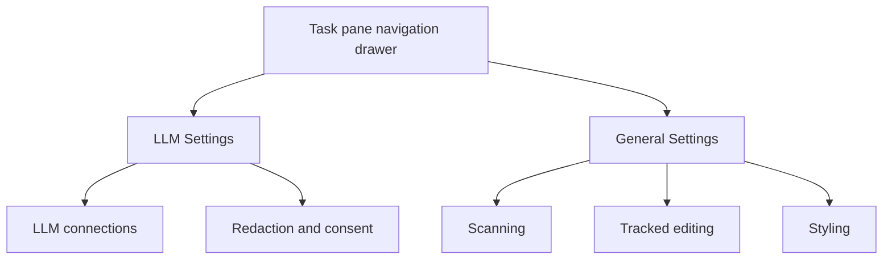

# Plan — split Settings into LLM Settings and General Settings

Restore the project-wide settings that the LLM connector change removed, and
relabel the surviving page so each page names what it actually contains.

## 1. Summary

Commit `147237af` (`feat(ai): dual-role llm connector with gateway-routed
credentials`) replaced the composed Settings page with a single-purpose LLM
dashboard. [`LlmSettings.tsx`](../src/taskpane/pages/LlmSettings.tsx:25) now renders
only [`SettingsDashboard`](../src/taskpane/components/SettingsDashboard.tsx:28),
which owns the two LLM roles, the connect-a-provider card, and the
redaction/consent section. Three general, project-wide settings lost their only
control surface but their **underlying logic and persistence still run**: the
components are orphaned, not deleted.

The fix is small and mostly additive:

1. Relabel the current page to **LLM Settings** (keep every LLM behaviour intact).
2. Add a **General Settings** page that mounts the three orphaned sections
   unchanged.
3. Split the overloaded `onOpenSettings` routing so consent/provider blockers go
   to LLM Settings and tracked-editing blockers go to General Settings.
4. Repoint the stale remedy labels that still say `Settings → Provider and
privacy`, `Settings → Scanning`, and `Settings → Tracked editing`.

No persisted-state schema change is required, so no migration bump.

## 2. Investigation findings

### 2.1 The change that overwrote the page

- Commit `147237af` — message: _"Replace the settings form with a Fluent v8
  dashboard: per-role connection cards, a connection test button, a decision
  fallback policy control, and a redaction section."_
- Before it, Settings was a **composition shell** over independently-saved
  sections (ADR-0047 in [`decision-log.md`](../docs/decision-log.md:384)).
- After it, [`LlmSettings.tsx`](../src/taskpane/pages/LlmSettings.tsx:24) shows one
  `<h2>Settings</h2>` over `SettingsDashboard` only. The general sections were
  never wired into the new page.

### 2.2 General settings lost — still present, no longer mounted

Each of these components exists in [`src/taskpane/components/`](../src/taskpane/components)
and is imported by nothing except its own test.

| Setting         | Component                                                                                              | UI element                                                                                                                         | Underlying logic / storage                                                                                                                        | Still honoured?                                                                            |
| --------------- | ------------------------------------------------------------------------------------------------------ | ---------------------------------------------------------------------------------------------------------------------------------- | ------------------------------------------------------------------------------------------------------------------------------------------------- | ------------------------------------------------------------------------------------------ |
| Styling / theme | [`StylingSettingsSection.tsx`](../src/taskpane/components/StylingSettingsSection.tsx:13)               | `Dropdown` — Use system setting / Light / Dark, inside a `SettingsSectionCard` with Save + Cancel                                  | [`theme.tsx`](../src/taskpane/theme.tsx:35) writes `localStorage["ToneForge.ThemePreference"]`; consumed app-wide by `ThemeProvider`              | Yes — `App` wraps every page in `ThemeProvider`                                            |
| Scanning        | [`ScanningSettingsSection.tsx`](../src/taskpane/components/ScanningSettingsSection.tsx:36)             | `Toggle` — Scan automatically as the document changes, plus the `AUTO_SCAN_OFF_NOTE` explanation                                   | `settings.autoScan` in the persisted state schema ([`persistence.ts`](../src/core/state/persistence.ts:162)); `saveState` on Save                 | Yes — [`Dashboard.tsx`](../src/taskpane/pages/Dashboard.tsx:494) gates the observer on it  |
| Tracked editing | [`TrackedEditingSettingsSection.tsx`](../src/taskpane/components/TrackedEditingSettingsSection.tsx:25) | `Toggle` — Allow ToneForge to apply tracked changes, plus a Check this Word host probe button and capability/warning `MessageBar`s | [`trackedEditing.ts`](../src/reformat/trackedEditing.ts:35) writes `localStorage["ToneForge.TrackedEditingEnabled"]`; persists **before** probing | Yes — `prepareTrackedEditing`, `isTrackedEditingEnabled`, and `applyReadiness` all read it |

Shared chrome that is now also orphaned and should be reused:
[`SettingsSectionCard.tsx`](../src/taskpane/components/SettingsSectionCard.tsx:21)
and the pure [`settingsModel.ts`](../src/taskpane/settings/settingsModel.ts:1)
status helpers (`INITIAL_SECTION_STATUS`, `markDirty`, `markSaved`).

Evidence the orphaned state is not intentional: the components' own doc comments
say they live "in Settings", and
[`docs/stages/07-settings-ui.md`](../docs/stages/07-settings-ui.md:11) and
ADR-0047 both describe Settings as the composition shell for exactly these
sections.

### 2.3 Deliberately retired — do **not** restore

- **Telemetry** (`TelemetrySettingsSection`, `settings.telemetryDisabled`): the
  flag was dropped in migration v10 because no analytics endpoint is configured
  (retired with ADR-0059). It is referenced only in migration tests that assert
  its **absence**. Restoring it would revive a control that governs nothing.
- **Legacy provider form** (`SettingsForm.tsx`) and the `spotReviewConsent` /
  `fullDocumentReviewConsent` review consents: retired with the same change.
- The obsolete LLM draft helpers in `settingsModel.ts` (`LlmSettingsDraft`,
  `applyLlmDraft`, `validateBrokerBaseUrl`, `normalizeLlmDraft`,
  `isLlmDraftDirty`) are now imported only by their own tests. Leave them alone
  (YAGNI): the new dashboard does not use them. Note the triage, do not rebuild a
  broker-URL control without a requirement.

### 2.4 Stale references introduced by the overwrite

These name sections/pages that no longer exist and will read as lies once the
pages are split:

- [`setupStatus.ts`](../src/taskpane/setupStatus.ts:119) —
  `control: "Settings → Provider and privacy → Provider"`.
- [`checks.ts`](../src/taskpane/troubleshooting/checks.ts:244) −
  `"Settings → Scanning → …"`, `"Settings → Tracked editing → …"`,
  `"Settings → Provider and privacy → Provider, then enter the key"`,
  `"Settings → Provider and privacy → Allow semantic analysis"`.
- [`gates.ts`](../src/taskpane/semantic/gates.ts:34) — `SemanticRemedy`
  destination `"settings"` with label `"Open Settings"`.

### 2.5 Routing surface today

- One destination `settings`: `TaskPaneDestination` union and the drawer list in
  [`TaskPaneHeader.tsx`](../src/taskpane/components/TaskPaneHeader.tsx:65).
- `Dashboard` branches on `page === "settings"` in **both** the no-profile and
  profiled paths, and passes a single overloaded `onOpenSettings` to semantic,
  consistency, and pending-change surfaces.
- [`DashboardNoProfile.test.tsx`](../tests/unit/taskpane/pages/DashboardNoProfile.test.tsx:133)
  enumerates `TASKPANE_DESTINATIONS` and fails if a drawer entry has no page
  branch — the guard that keeps a new destination honest.
- `settings` is **not** a `TaskpaneTarget` command, so no manifest/command change
  is needed; the split stays inside the pane's own drawer navigation.

## 3. Proposed routing and navigation

Two destinations replace the one:

- **`llm-settings`** — the relabelled current page: `SettingsDashboard` (role
  cards, connect a provider, redaction and consent).
- **`general-settings`** — the new page: Scanning, Tracked editing, Styling.

Rename the route key `settings` → `llm-settings` rather than keeping `settings`
for the LLM page. The repository's own convention is that a target whose name no
longer names its destination is the defect that eventually strands navigation;
`llm-settings` is what the page will be labelled, so the key should match.

Routing by blocker (the reason the two pages must be distinct):

- **LLM Settings** — missing consent, missing/unreachable provider, semantic
  learning/review remedies. Callers: `SemanticReview`, `SemanticStyle`,
  `ConsistencyReview` `onOpenSettings`; `Home` setup-row `llmProvider`; the
  `AiReviewSection` blocker.
- **General Settings** — tracked-editing-disabled and host-unavailable blockers.
  Callers: the host-readiness "Open Settings" button in `Dashboard`, and
  `PendingChanges`' `onOpenSettings`.

## 4. Component separation

- **Keep** [`SettingsDashboard`](../src/taskpane/components/SettingsDashboard.tsx:28)
  as the LLM page body, unchanged. It already owns role bindings, connection
  merge/disconnect, and state writes.
- **Reuse unchanged** `ScanningSettingsSection`, `TrackedEditingSettingsSection`,
  `StylingSettingsSection`, `SettingsSectionCard`. Each already owns its own
  draft/commit/persist behaviour, so no new data plumbing is needed.
- **New page** `GeneralSettings.tsx`: a thin composition page (title, breadcrumb,
  the three sections), mirroring `Settings.tsx`'s shape.
- **Rename page** `Settings.tsx` → `LlmSettings.tsx`, retitle its `<h2>` to
  "LLM Settings", keep the "Back to Deterministic Review" breadcrumb and the
  `SettingsDashboard` body byte-for-byte.
- **`RedactionSettingsSection`** stays on the LLM page: `semanticOptIn`,
  `consistencyReviewConsent`, and `decisionFallbackPolicy` all govern whether
  text may leave the add-in to a provider, so they belong with the LLM layer.

## 5. Code and file changes

### 5.1 New / renamed pages

- Rename `src/taskpane/pages/Settings.tsx` → `src/taskpane/pages/LlmSettings.tsx`;
  change the `<h2>` text to `LLM Settings`; keep everything else.
- Add `src/taskpane/pages/GeneralSettings.tsx` (`onBack` prop, `<h2>General
Settings</h2>`, breadcrumb, then the three sections).

### 5.2 Routing and navigation

- [`TaskPaneHeader.tsx`](../src/taskpane/components/TaskPaneHeader.tsx:5) —
  `TaskPaneDestination`: drop `"settings"`, add `"llm-settings"` and
  `"general-settings"`. Update `TASKPANE_DESTINATIONS` labels to `LLM Settings`
  and `General Settings` and order them beside each other.
- [`Dashboard.tsx`](../src/taskpane/pages/Dashboard.tsx:78) — update the lazy
  import names; add a `general-settings` branch and change the `settings` branch
  to `llm-settings` in **both** `DashboardWithoutProfile` and
  `DashboardWithProfile`; repoint each `navigate`/`setPage` call site:
  - semantic/consistency `onOpenSettings` → `llm-settings`
  - host-readiness "Open Settings" button → `general-settings`
  - `PendingChanges` `onOpenSettings` → `general-settings`
- [`setupStatus.ts`](../src/taskpane/setupStatus.ts:62) — `SetupDestination`:
  `"settings"` → `"llm-settings"`; update the `llmProvider` item's `destination`
  and `control` (`"LLM Settings → LLM connections → Connect a provider"`).
- [`gates.ts`](../src/taskpane/semantic/gates.ts:34) — `SemanticRemedy`
  destination `"settings"` → `"llm-settings"` (four literals at lines ~121-133).

### 5.3 Remedy/labels in logic

- [`checks.ts`](../src/taskpane/troubleshooting/checks.ts:243) — update the four
  `remedyTarget.label` strings to name the correct page and the on-screen control
  label:
  - Scanning → `General Settings → Scanning → Scan automatically as the document changes`
  - Tracked editing → `General Settings → Tracked editing → Allow ToneForge to apply tracked changes`
  - Provider → `LLM Settings → LLM connections → Connect a provider`
  - Consent → `LLM Settings → Redaction and consent → Allow semantic analysis`

### 5.4 Optional label tidy (only if low-risk)

- `PendingChanges` primary button text `Open Settings` → `Open General Settings`
  and the `AiReviewSection` action label → `Open LLM Settings`, so the button
  names the page it opens. If the extra test churn is unwanted, leave the labels
  and rely on the destination split; the routing fix is what matters.

### 5.5 No schema change

`autoScan` is already in the state schema; theme and tracked-editing already
persist to `localStorage`. Do **not** bump `CURRENT_STATE_VERSION`, do **not** add
a migration, and do **not** add fields to `ProviderConnection` or `settings`.

## 6. Data handling

- **General Settings** writes through the same paths the sections already use:
  `loadState`/`saveState` for `autoScan`; `useTheme().setThemePreference` for the
  theme; `setTrackedEditingEnabled` + host probe for tracked editing. No new
  store, no new field.
- **LLM Settings** is untouched: `SettingsDashboard` keeps its
  `state`/`onStateChange` contract and merge-on-connect behaviour.
- Both pages read the same `PersistedState`; because the theme is applied by the
  app-level `ThemeProvider`, a General Settings change is visible immediately
  across both pages.
- Tracked editing keeps the **persist-before-probe** ordering; a General Settings
  mount must not move that write after `prepareTrackedEditing`.

## 7. Validation and access control

- No new credential, consent, or secret surface. The split adds no field a secret
  could occupy; `RedactionSettingsSection` stays the single consent surface.
- Both pages remain reachable with **no active profile**, matching today's
  `settings` destination, so first-run users can still change the theme, toggle
  scanning, and arm tracked editing before creating a profile.
- Styling validates by construction (a fixed three-option `Dropdown`); Scanning
  is a boolean; tracked editing is validated by the live host probe, which is the
  only thing that may arm it.
- Reuse `SettingsSectionCard`'s one-live-region-per-card behaviour so a screen
  reader hears a save once, not per keystroke.

## 8. Testing and verification

Update:

- [`DashboardNoProfile.test.tsx`](../tests/unit/taskpane/pages/DashboardNoProfile.test.tsx:82)
  — heading `Settings` → `LLM Settings`; the enumerated
  `TASKPANE_DESTINATIONS` case automatically covers the new `general-settings`
  branch (this is the guard that fails if the branch is forgotten).
- [`TaskPaneHeader.test.tsx`](../tests/unit/taskpane/components/TaskPaneHeader.test.tsx:31)
  — button name and expected `onNavigate` argument.
- [`gates.test.ts`](../tests/unit/taskpane/semantic/gates.test.ts:39) —
  `destination: "llm-settings"`.
- [`checks.test.ts`](../tests/unit/taskpane/troubleshooting/checks.test.ts:190)
  — the four remedy labels.
- [`findingsAndPending.test.tsx`](../tests/unit/taskpane/components/findingsAndPending.test.tsx:219)
  — only if the button label is changed in 5.4.

Add:

- `tests/unit/taskpane/pages/GeneralSettings.test.tsx` — asserts the page title
  `General Settings` and that Scanning, Tracked editing, and Styling controls are
  present (mirroring the existing per-section tests).
- `tests/unit/taskpane/pages/LlmSettings.test.tsx` — asserts the page title
  `LLM Settings` and that `SettingsDashboard` still renders.

Leave as-is (still valid because the components are unchanged):

- [`ScanningSettingsSection.test.tsx`](../tests/unit/taskpane/components/ScanningSettingsSection.test.tsx:26)
- [`TrackedEditingSettingsSection.test.tsx`](../tests/unit/taskpane/components/TrackedEditingSettingsSection.test.tsx:28)
- [`SettingsDashboard.test.tsx`](../tests/unit/taskpane/components/SettingsDashboard.test.tsx:87)
- [`theme.test.tsx`](../tests/unit/taskpane/theme.test.tsx:28)
- [`DashboardAutoScan.test.tsx`](../tests/unit/taskpane/pages/DashboardAutoScan.test.tsx:139)

Verification chain (all must pass, in order):

1. `npm run typecheck`
2. `npm run lint` (zero warnings)
3. `npm run format` (then `format:write` if needed)
4. `npm run test`
5. `npm run build`
6. `npm run validate` (manifest untouched, but run it)
7. `npm run verify` for the full graph

The Word-host evidence gate stays **open**; a green automated run is not a
release.

## 9. Documentation and governance

- Add an ADR to [`docs/decision-log.md`](../docs/decision-log.md:384) recording
  the split: LLM Settings vs General Settings, why the `onOpenSettings` callback
  was overloaded, and that this extends ADR-0047's composition-shell decision
  rather than reversing it. Note that Telemetry is **not** restored.
- Update [`ROADMAP.md`](../ROADMAP.md) status note and
  [`docs/project-state.md`](../docs/project-state.md:29) (the Settings rows and
  the stale "Provider and privacy" control text).
- Update [`docs/manual-verification.md`](../docs/manual-verification.md:213) to
  check Styling/Scanning/Tracked editing on General Settings and LLM/consent on
  LLM Settings independently, including a reload.
- Update [`docs/ux-state-matrix.md`](../docs/ux-state-matrix.md:203) rows that
  name the Settings page for theme, scanning, and tracked editing.
- Update [`docs/architecture.md`](../docs/architecture.md) if it names the
  Settings composition.

## 10. Risks and non-goals

- **Risk — double-mounting state owners.** Mounting `ScanningSettingsSection` on
  a second page is fine because it is only ever mounted once at a time; do not
  also keep it inside `SettingsDashboard`.
- **Risk — route rename ripple.** The rename touches tests and two label tables;
  the destination-enumeration test is the safety net.
- **Non-goal — resurrecting Telemetry** or any retired consent.
- **Non-goal — a new broker-URL control.** Out of scope unless separately
  required.
- **Non-goal — redesigning either page.** The General page composes existing
  sections; the LLM page keeps its current look.

## 11. Todo checklist

- [ ] Confirm findings against `147237af` and the orphaned components.
- [ ] Rename `pages/Settings.tsx` to `pages/LlmSettings.tsx`, retitle to LLM Settings.
- [ ] Add `pages/GeneralSettings.tsx` composing Scanning, Tracked editing, Styling.
- [ ] Extend `TaskPaneDestination` and `TASKPANE_DESTINATIONS` with `llm-settings` and `general-settings`.
- [ ] Add the `general-settings` branch and rename the `settings` branch in both Dashboard paths; split `onOpenSettings` by blocker.
- [ ] Update `setupStatus` destination and control label.
- [ ] Update `semantic/gates.ts` remedy destination.
- [ ] Update `troubleshooting/checks.ts` remedy labels.
- [ ] Update / add the tests listed in section 8.
- [ ] Run the full verification chain.
- [ ] Add the ADR and update ROADMAP, project-state, manual-verification, ux-state-matrix.
