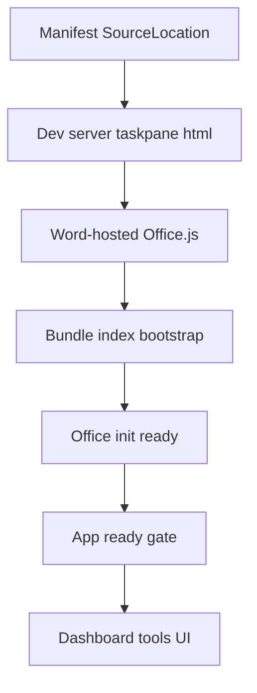

# Sideload Blank Pane — Root Cause Plan

> Historical remediation plan. The authoritative current status and sequencing
> are in [`ROADMAP.md`](../ROADMAP.md).

Baseline: sideload of [`manifest.xml`](manifest.xml) via [`sideload`](package.json:18) into Word desktop on Windows. Shell chrome loads, body is blank dark as in screenshot. Dev server is [`dev`](package.json:14) on HTTPS port 3000.

## 1. Manifest audit

- Primary sideload file is [`manifest.xml`](manifest.xml), not [`manifest.json`](manifest.json). Script [`sideload`](package.json:18) calls [`office-addin-debugging`](package.json:69) with [`manifest.xml`](manifest.xml). Unified [`manifest.json`](manifest.json) is Teams format v1.30 and is ignored by Word desktop sideload.
- [`SourceLocation`](manifest.xml:35) is `https://localhost:3000/taskpane.html`. Matches [`Taskpane.Url`](manifest.xml:88) and [`ToneForge.Commands.Url`](manifest.xml:87). Correct for dev.
- [`AppDomain`](manifest.xml:24) is `https://localhost:3000`. Correct, single entry covers page and assets.
- [`Permissions`](manifest.xml:37) is `ReadWriteDocument`. Correct for read plus revision adapter.
- [`Requirements`](manifest.xml:29) requests [`WordApi`](manifest.xml:31) 1.1, plus [`AddinCommands`](manifest.xml:42) 1.1 in [`VersionOverrides`](manifest.xml:38). Correct, minimal gate.
- [`Hosts`](manifest.xml:26) uses `Name=Document` and [`Host`](manifest.xml:46) uses `xsi:type=Document`. Correct for Word, validated by [`validateXmlFallback()`](scripts/validate-manifest.mjs:201).
- Shell loads, so manifest parsing and ribbon button [`ToneForgeTaskpane`](manifest.xml:58) wiring work. No manifest misconfiguration blocks load.
- Remaining manifest risks: Office cache serving stale [`taskpane.html`](src/taskpane/taskpane.html:1), and `localhost` vs `127.0.0.1` mismatch described below. Clear with `npx office-addin-debugging stop` plus WebView2 cache clear.

## 2. Dev server audit

- [`webpack.dev.js`](webpack.dev.js:13) sets `host: localhost`, `port: 3000`, `server.type: https` with `localhost.key` and `localhost.crt` from `.office-addin-dev-certs`. [`package.json`](package.json:14) repeats `--host localhost --port 3000`. [`docs/onboarding.md`](docs/onboarding.md:32) documents HTTPS on `localhost:3000`.
- Manifest requests `https://localhost:3000`. Cert CN is `localhost`, so binding to `localhost` matches the certificate. Binding to `127.0.0.1` while requesting `localhost` triggers cert trust failure in Edge WebView2 even after [`office-addin-dev-certs`](package.json:68) install. Fix: set `host: localhost` in [`webpack.dev.js`](webpack.dev.js:20) and [`dev`](package.json:14), then reinstall certs per [`docs/onboarding.md`](docs/onboarding.md:20).
- [`webpack.common.js`](webpack.common.js:13) sets `publicPath: /` and `filename: [name].js`. Dev uses [`runtimeChunk`](webpack.dev.js:48) as `single`, which emits `runtime.js` separate from `taskpane.js`. [`HtmlWebpackPlugin`](webpack.dev.js:34) lists `chunks: ["runtime","taskpane"]`, so runtime is included in generated [`taskpane.html`](src/taskpane/taskpane.html:1). Browser then loads runtime + taskpane correctly.
- [`webpack.common.js`](webpack.common.js:40) uses [`style-loader`](webpack.common.js:42) plus [`css-loader`](webpack.common.js:42), which injects CSS via JS. Source [`taskpane.html`](src/taskpane/taskpane.html:1) no longer has a manual `<link>` to `taskpane.css`, which 404s in `dist` and can block render in Word. Fix: remove manual link, let [`HtmlWebpackPlugin`](webpack.dev.js:34) inject, or switch to CSS extraction.
- [`commands.html`](src/commands/commands.html:9) no longer hardcodes `<script src=commands.js>`, while [`HtmlWebpackPlugin`](webpack.dev.js:40) injects `commands` chunk. Avoids double load.
- No `DefinePlugin` for `process.env`, so [`env.ts`](src/core/config/env.ts:23) reading `process.env` yields empty in browser bundle. Not fatal for blank pane, but breaks [`OPENAI_API_KEY`](.env.example:11) and [`TELEMETRY_DISABLED`](.env.example:18) config. Fix with `dotenv-webpack` or `DefinePlugin`.

## 3. Task pane init path trace

Flow:

- Entry [`taskpane.html`](src/taskpane/taskpane.html:1) contains only `
` and no manual Office.js script. **Word desktop injects the Office.js runtime into the taskpane iframe itself**; loading it again from `appsforoffice.microsoft.com` (a cross-origin URL) conflicts with the host copy and produces a generic "Script error." with no stack. The taskpane bundle waits for the global `Office` object via `Office.onReady` in [`officeInit.ts`](src/taskpane/officeInit.ts:10).
- Bootstrap [`bootstrap()`](src/taskpane/index.tsx:15) looks up `document.getElementById` for `root` and calls [`ReactDOM.createRoot()`](src/taskpane/index.tsx:21). Wraps [`App`](src/taskpane/App.tsx:7) in [`ErrorBoundary`](src/taskpane/index.tsx:24) and [`React.StrictMode`](src/taskpane/index.tsx:23). Any bundle 404 or runtime missing above prevents this from running, matching blank screenshot with no `Loading` text.
- Init [`initializeOffice()`](src/taskpane/officeInit.ts:10) now prefers [`Office.onReady()`](src/types/office.d.ts:85), falls back to [`Office.initialize`](src/taskpane/officeInit.ts:29), and no longer calls [`finish()`](src/taskpane/officeInit.ts:43) immediately. The 2s timeout remains only as a safety net with logged warning via [`logger`](src/shared/utils/logger.ts:24).
- Types [`office.d.ts`](src/types/office.d.ts:85) declare [`onReady`](src/types/office.d.ts:85), [`initialize`](src/taskpane/officeInit.ts:29), [`context`](src/shared/office/officeHelpers.ts:44) and [`HostType`](src/word/capabilityProbe.ts:24).
- Helper [`isOfficeReady()`](src/shared/office/officeHelpers.ts:27) only checks existence, not readiness. Helper [`runInWord()`](src/shared/office/officeHelpers.ts:37) throws if [`run`](src/types/office.d.ts:86) missing. Probe [`probeWordCapabilities()`](src/word/capabilityProbe.ts:43) catches and returns defaults with `hostName: unknown`, so UI degrades silently.
- Gate [`App`](src/taskpane/App.tsx:7) holds `ready` false until [`initializeOffice()`](src/taskpane/officeInit.ts:10) resolves, showing `Loading` via [`useEffect()`](src/taskpane/App.tsx:11). Screenshot shows no `Loading`, suggesting failure is before React render, i.e. bundle serving, not React gate.
- Final [`Dashboard`](src/taskpane/pages/Dashboard.tsx:7) is placeholder only: title `ToneForge`, text about next stage, plus [`runProbe()`](src/taskpane/pages/Dashboard.tsx:20) button calling [`probeWordCapabilities()`](src/word/capabilityProbe.ts:43). No tools exist because stages 07 to 28 are `PENDING` per [`project-state.md`](docs/project-state.md:7). Import uses fragile `../../word/capabilityProbe` via [`probeWordCapabilities`](src/taskpane/pages/Dashboard.tsx:5); should be `../../word/capabilityProbe`. Even with perfect load, user would see placeholder, not tools.

## 4. Precise root cause ranking

1. Broken bundle reference: [`runtimeChunk`](webpack.dev.js:48) split plus [`chunks`](webpack.dev.js:37) filter omitted runtime, causing blank with no console React logs, only `GET https://localhost:3000/runtime.js 404` or `taskpane.js` parse error in F12.
2. Host and cert mismatch: `127.0.0.1` bind vs `localhost` URL plus untrusted `localhost.crt`. Causes `ERR_CERT_COMMON_NAME_INVALID` or `ERR_CONNECTION_REFUSED` in Word WebView2 network trace.
3. Cross-origin Office.js conflict: adding a manual Office.js CDN script to [`taskpane.html`](src/taskpane/taskpane.html:1) while Word already injects the host copy causes a generic "Script error." with no stack at the webpack-dev-server React overlay (`taskpane.js:38196/38223`).
4. Init race: unconditional [`finish()`](src/taskpane/officeInit.ts:43) and legacy [`Office.initialize`](src/taskpane/officeInit.ts:29) instead of [`Office.onReady()`](src/types/office.d.ts:85). Causes intermittent `Office.run is not available` from [`runInWord()`](src/shared/office/officeHelpers.ts:37).
5. By-design empty tools: [`Dashboard`](src/taskpane/pages/Dashboard.tsx:7) has no tool registry, router, auth, fetch, or state. Stages 07 onward `PENDING`. Must be called out so fix does not stop at blank-pane repair.

Excluded: CORS, auth token, env vars, feature flags. No fetch, no auth, no flags found in `src` search. [`env.ts`](src/core/config/env.ts:23) failure would throw at import, not blank after shell.

## 5. Exact fixes required

- [`src/taskpane/taskpane.html`](src/taskpane/taskpane.html:1): **remove** the manual Office.js CDN script; Word injects it. Remove manual `taskpane.css` link.
- [`webpack.dev.js`](webpack.dev.js:13): change `host` to `localhost`, fix [`HtmlWebpackPlugin`](webpack.dev.js:34) to include runtime chunk or set [`runtimeChunk`](webpack.dev.js:48) to false, set `publicPath` consistent with [`webpack.prod.js`](webpack.prod.js:13).
- [`webpack.common.js`](webpack.common.js:13): verify `output.publicPath` works for `https://localhost:3000/taskpane.html` served from `dist`.
- [`src/commands/commands.html`](src/commands/commands.html:1): remove hardcoded `commands.js` script tag.
- [`src/taskpane/officeInit.ts`](src/taskpane/officeInit.ts:10): rewrite to prefer [`Office.onReady()`](src/types/office.d.ts:85), fallback to [`Office.initialize`](src/taskpane/officeInit.ts:29), remove immediate [`finish()`](src/taskpane/officeInit.ts:43), keep 2s timeout only as safety net with logged warning via [`logger`](src/shared/utils/logger.ts:24).
- [`src/types/office.d.ts`](src/types/office.d.ts:85): add `onReady`, `initialize`, `context`, `HostType` declarations.
- [`src/taskpane/pages/Dashboard.tsx`](src/taskpane/pages/Dashboard.tsx:7): fix import to `../../word/capabilityProbe`, then either implement minimal tool list or document that tools are pending per [`project-state.md`](docs/project-state.md:7).
- Validation: `npm run dev`, open `https://localhost:3000/taskpane.html` in browser, confirm no cert warning, no 404 for `taskpane.js` and `runtime.js`, F12 in Word shows [`Office.onReady()`](src/types/office.d.ts:85) host `Word`, [`probeWordCapabilities()`](src/word/capabilityProbe.ts:43) returns `Word` not `unknown`, [`Dashboard`](src/taskpane/pages/Dashboard.tsx:7) placeholder appears. Then implement real tools.

## 6. Resolution

All five root causes were addressed. The task pane now loads, the "Probe Word
capabilities" button works, and a "Diagnose Office runtime" button has been added
for non-destructive host inspection.

- **Favicon 404** — silenced with an inline SVG data-URI favicon in
  [`taskpane.html`](src/taskpane/taskpane.html:6). No external file needed.
- **Dashboard diagnostics** — [`probeOfficeRuntime()`](src/shared/office/diagnostics.ts:33)
  and [`formatDiagnostics()`](src/shared/office/diagnostics.ts:116) are wired to
  a new button on the Dashboard. The probe inspects the global `Office` and
  `Word` objects read-only and reports `Office global is undefined` when loaded
  outside Word, which is expected.
- **Stage 01 updated** — [`docs/stages/01-officejs-spike.md`](docs/stages/01-officejs-spike.md)
  now records that the task pane loads, both buttons are clickable, and the
  runtime findings from this debugging session.
- **Onboarding updated** — [`docs/onboarding.md`](docs/onboarding.md:61) adds
  rows for the favicon 404, the `Office` global being `undefined` outside Word,
  and the diagnostic button.

## 7. Execution todos

- [x] Repro capture: F12 console, network, cert check.
- [x] Manifest cache clear and ID sync check via [`validate-manifest.mjs`](scripts/validate-manifest.mjs:1).
- [x] Dev server fix and bundle serving proof.
- [x] HTML and Office.js wiring fix.
- [x] Init rewrite and type fix.
- [x] Dashboard triage and tool restore.
- [ ] End-to-end sideload sign-off inside Word (human-only, see `docs/manual-verification.md`).
