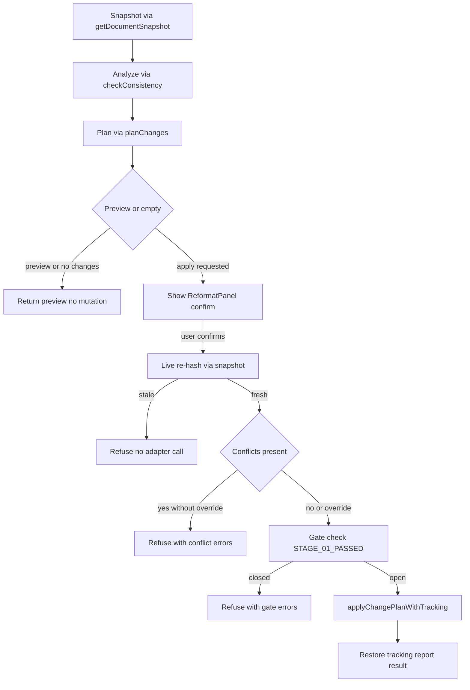

# Stage 22 — Safe Application: Implementation Plan

**Stage file:** [`docs/stages/22-safe-application.md`](docs/stages/22-safe-application.md)
**ROADMAP entry:** `feat(safety): add stale-result protection and safe application` in [`ROADMAP.md`](ROADMAP.md:47)
**Status in:** [`docs/project-state.md`](docs/project-state.md:30) — PENDING, Gate Yes
**User decision:** Option A — new ReformatPanel with preview + confirm, keep SmokePanel deprecated as-is

## 1. Objectives

- Close the preview-to-apply race: live re-hash immediately before mutation, abort when stale.
- Enforce conflict safety: conflicting [`ChangePlan`](src/core/domain/ChangePlan.ts:25) never applies silently.
- Add taskpane-safe UI confirmation before any mutation, without breaking the one-mutation-path rule.
- Preserve all Stage 17 / 18 / 21 guards as defense-in-depth.
- Pass the full verification chain and update stage gate artifacts.

Existing Stage 22 scope from [`docs/stages/22-safe-application.md`](docs/stages/22-safe-application.md:9):

- [`src/changes/staleGuard.ts`](src/changes/staleGuard.ts) — re-hash before apply, abort if stale.
- [`src/word/revisionAdapter.ts`](src/word/revisionAdapter.ts:1) — integrate stale check before apply.
- UI confirmation before applying changes.

## 2. Prerequisites and Required Inputs

- Stages 17, 18, 20, 21 must remain PASS / PASS WITH DOCUMENTED LIMITATION:
  - [`src/changes/planner.ts`](src/changes/planner.ts:286) — [`planChanges()`](src/changes/planner.ts:286) validates via [`FindingSchema`](src/core/domain/Finding.ts:1), maps to [`ChangeSchema`](src/core/domain/Change.ts:1), calls [`detectConflicts()`](src/changes/conflictDetector.ts:40) and [`markStale()`](src/changes/staleGuard.ts:16).
  - [`src/word/revisionAdapter.ts`](src/word/revisionAdapter.ts:69) — [`applyChangePlan()`](src/word/revisionAdapter.ts:69) and [`applyChangePlanWithTracking()`](src/word/revisionAdapter.ts:171) with [`validatePlanBeforeApply()`](src/word/revisionAdapter.ts:517), [`STAGE_01_PASSED`](src/word/revisionAdapter.ts:18), hash-mismatch refusal.
  - [`src/reformat/orchestrator.ts`](src/reformat/orchestrator.ts:74) — [`reformatDocument()`](src/reformat/orchestrator.ts:74) with preview, stale pre-entry refusal, gate pre-entry refusal.
  - [`src/word/documentReader.ts`](src/word/documentReader.ts:39) — [`getDocumentSnapshot()`](src/word/documentReader.ts:39) and [`hashDocument()`](src/word/documentReader.ts:21).
- Authoritative docs:
  - [`docs/architecture.md`](docs/architecture.md:39) module boundaries table.
  - [`docs/decision-log.md`](docs/decision-log.md:180) ADR-0028, ADR-0029, ADR-0024, ADR-0005.
  - [`docs/stages/21-reformat-orchestrator.md`](docs/stages/21-reformat-orchestrator.md:16) out-of-scope note: Stage 22 owns confirmation / re-hash UX.
  - [`eslint.config.mjs`](eslint.config.mjs:179) `reformat/` and `ui/*` scopes.
  - [`package.json`](package.json:30) `verify` chain definition.
  - [`scripts/stage-verify.mjs`](scripts/stage-verify.mjs:7) verification order.
- Live host constraint: Stage 01 / 18 / 27 hard gates remain human-only for Word web / Mac matrix; Stage 22 must be fully verifiable with mocks plus `npm run verify`.

## 3. Inventory: What Already Exists vs Delta

| Capability                           | Existing location                                                                                                                                                              | Stage 22 delta                                                                                                                                                                                                                              |
| ------------------------------------ | ------------------------------------------------------------------------------------------------------------------------------------------------------------------------------ | ------------------------------------------------------------------------------------------------------------------------------------------------------------------------------------------------------------------------------------------- |
| Pure stale mark on caller hash       | [`markStale()`](src/changes/staleGuard.ts:16) in [`src/changes/staleGuard.ts`](src/changes/staleGuard.ts)                                                                      | Keep pure; no Word import. Add explicit unit tests for `undefined` passthrough.                                                                                                                                                             |
| Plan-time stale flag                 | [`planChanges()`](src/changes/planner.ts:286) passes `currentDocHash`                                                                                                          | Keep. Orchestrator continues to pass snapshot hash vs caller hash.                                                                                                                                                                          |
| Adapter hash refusal                 | [`applyChangePlan()`](src/word/revisionAdapter.ts:69) lines 106-120                                                                                                            | Keep as defense-in-depth. No logic removal.                                                                                                                                                                                                 |
| Orchestrator pre-entry stale refusal | [`reformatDocument()`](src/reformat/orchestrator.ts:137) lines 137-147                                                                                                         | Keep. Add live re-read before apply so `currentDocHash` is not trusted blindly.                                                                                                                                                             |
| Conflict detection                   | [`detectConflicts()`](src/changes/conflictDetector.ts:40)                                                                                                                      | Add enforcement: orchestrator refuses conflicting plans unless explicit override; adapter adds same refusal as defense-in-depth.                                                                                                            |
| Preview without mutation             | [`reformatDocument()`](src/reformat/orchestrator.ts:123) preview branch                                                                                                        | Keep. New UI consumes preview first.                                                                                                                                                                                                        |
| UI confirmation                      | None — [`src/taskpane/pages/Dashboard.tsx`](src/taskpane/pages/Dashboard.tsx:96) hosts only [`src/taskpane/components/SmokePanel.tsx`](src/taskpane/components/SmokePanel.tsx) | New [`src/taskpane/components/ReformatPanel.tsx`](src/taskpane/components/ReformatPanel.tsx) + preview/confirm/apply states. [`src/taskpane/components/SmokePanel.tsx`](src/taskpane/components/SmokePanel.tsx) stays deprecated untouched. |
| Live re-hash                         | Missing — orchestrator trusts `currentDocHash ?? docHash`                                                                                                                      | New `re-read hash via` [`getDocumentSnapshot()`](src/word/documentReader.ts:39) `immediately before` [`applyChangePlanWithTracking()`](src/word/revisionAdapter.ts:171).                                                                    |

## 4. Key Activities and Step-by-Step Sequence

Execute in order. Do not skip inspect-before-modify per Stage protocol.

### Step 0 — Inspect before modifying

- Read [`src/reformat/orchestrator.ts`](src/reformat/orchestrator.ts), [`src/word/revisionAdapter.ts`](src/word/revisionAdapter.ts:69), [`src/changes/staleGuard.ts`](src/changes/staleGuard.ts), [`src/changes/conflictDetector.ts`](src/changes/conflictDetector.ts), [`src/word/documentReader.ts`](src/word/documentReader.ts:39), [`src/core/domain/ChangePlan.ts`](src/core/domain/ChangePlan.ts:14), [`src/taskpane/pages/Dashboard.tsx`](src/taskpane/pages/Dashboard.tsx:1), [`tests/integration/reformatOrchestrator.test.ts`](tests/integration/reformatOrchestrator.test.ts:105).
- Confirm [`eslint.config.mjs`](eslint.config.mjs:179) boundaries still satisfy [`docs/architecture.md`](docs/architecture.md:39).

### Step 1 — Harden pure guards in [`src/changes/`](src/changes/planner.ts)

- Keep [`isStale()`](src/changes/staleGuard.ts:11) and [`markStale()`](src/changes/staleGuard.ts:16) pure; forbid `word/`, `ai/`, `ui/`, `Office` imports per [`eslint.config.mjs`](eslint.config.mjs:151).
- Add focused unit tests under `tests/unit/changes/` for stale true / false / undefined passthrough.
- No new Word access here — hash production stays at the Word boundary per ADR-0024 in [`docs/decision-log.md`](docs/decision-log.md:204).

### Step 2 — Add live re-hash safe-apply path in [`src/reformat/orchestrator.ts`](src/reformat/orchestrator.ts)

- After planning and after preview/gate checks, call [`getDocumentSnapshot()`](src/word/documentReader.ts:39) a second time to obtain `liveHash`.
- Compare `liveHash` to `plan.docHash` via [`isStale()`](src/changes/staleGuard.ts:11). On mismatch return preview-shaped outcome: `results: []`, `tracking: { managed: false }`, `stale: true`, `applied: false` without calling [`applyChangePlanWithTracking()`](src/word/revisionAdapter.ts:171).
- Honor `signal` abort through the re-read; propagate caller abort, do not swallow.
- Preserve empty-text short-circuit and `preview` early return.
- Add `allowConflictingApply?: boolean` to [`ReformatOptions`](src/reformat/orchestrator.ts:28) default `false`. When `plan.conflicts.length > 0` and override is false, refuse with per-change `applied: false` + explicit conflict error, same shape as gate refusal.
- Pass through `semanticStatus` / `semanticError` unchanged per ADR-0029 in [`docs/decision-log.md`](docs/decision-log.md:209).

### Step 3 — Defense-in-depth in [`src/word/revisionAdapter.ts`](src/word/revisionAdapter.ts:1)

- Extend [`validatePlanBeforeApply()`](src/word/revisionAdapter.ts:517) to report `ChangePlan has unresolved conflicts` when `plan.conflicts.length > 0` unless caller passes explicit override. Keep return type `string[]`.
- Keep [`STAGE_01_PASSED`](src/word/revisionAdapter.ts:18) gate, range validation, payload validation, reverse-offset order, per-change isolation.
- Do not add UI imports; `word/` must not import `ai/` or `taskpane/` per [`eslint.config.mjs`](eslint.config.mjs:76).

### Step 4 — New confirmation UI in [`src/taskpane/`](src/taskpane/pages/Dashboard.tsx)

- Create [`src/taskpane/components/ReformatPanel.tsx`](src/taskpane/components/ReformatPanel.tsx):
  - State machine: idle → previewing → preview-ready → confirming → applying → applied / stale / blocked.
  - Preview calls [`reformatDocument()`](src/reformat/orchestrator.ts:74) with `preview: true`; renders change count, [`conflicts`](src/core/domain/ChangePlan.ts:14), `stale`, `tracking` honesty, semantic degradation.
  - Apply requires explicit button click; disabled when `stale === true` or `conflicts.length > 0` without checkbox acknowledgement.
  - Never imports [`src/word/revisionAdapter.ts`](src/word/revisionAdapter.ts:1) directly — only [`src/reformat/index.ts`](src/reformat/index.ts:1) barrel.
  - Uses Fluent v8 + `aria-live` regions; full Stage 23 hardening explicitly out of scope.
- Wire into [`src/taskpane/pages/Dashboard.tsx`](src/taskpane/pages/Dashboard.tsx:1) alongside [`src/taskpane/components/SmokePanel.tsx`](src/taskpane/components/SmokePanel.tsx); do not modify SmokePanel logic.
- Extract pure helpers to `src/taskpane/components/reformatView.ts` if needed for testability.

### Step 5 — Tests

- Unit `tests/unit/changes/staleGuard.test.ts` extension + conflict-enforcement tests.
- Integration extension in [`tests/integration/reformatOrchestrator.test.ts`](tests/integration/reformatOrchestrator.test.ts:105): live-hash mismatch aborts before adapter spy; conflicting plan refuses without override and applies with override; gate + stale + abort + tracking-fallback preserved.
- Component tests for ReformatPanel with `MockAdapter` only, Office mock from `tests/setup.ts`; never hit live network.
- Mirror rule: `src/reformat/orchestrator.ts` → `tests/integration/reformatOrchestrator.test.ts`; `src/changes/` → `tests/unit/changes/`; panel → `tests/unit/taskpane/`.

### Step 6 — Verification, docs, commit

- Run in order: `npm run typecheck` then `npm run lint` with zero warnings then `npm run format` then `npm run test` then `npm run build` then `npm run validate` then `npm run stage:verify` per [`package.json`](package.json:30) and [`scripts/stage-verify.mjs`](scripts/stage-verify.mjs:7).
- Coverage gate: `src/changes/` and `src/reformat/` at 80%+ lines/statements/functions/branches; document repository-wide gap as PASS WITH DOCUMENTED LIMITATION if pre-existing UI files pull global below threshold, same pattern as Stage 21.
- Update [`docs/architecture.md`](docs/architecture.md:57) data flow step 4-6 to name live re-hash + confirmation.
- Append ADR-0030 in [`docs/decision-log.md`](docs/decision-log.md:1): live re-hash ownership, conflict-refusal default, ReformatPanel vs SmokePanel boundary.
- Mark [`docs/stages/22-safe-application.md`](docs/stages/22-safe-application.md:21) PASS with verification checklist checked.
- Update [`docs/project-state.md`](docs/project-state.md:30) Stage 22 row.
- Commit `feat(safety): add stale-result protection and safe application` per commit rules.

## 5. Architecture Flow

## 6. Essential Skills and Resources

- `toneforge-scaffold` — ROADMAP alignment, module placement under [`src/reformat/`](src/reformat/orchestrator.ts), [`src/changes/`](src/changes/planner.ts), [`src/taskpane/`](src/taskpane/pages/Dashboard.tsx), barrel exports, ADR + architecture updates.
- `toneforge-officejs` — `runInWord` wrapper in `src/shared/office/officeHelpers.ts`, [`getDocumentSnapshot()`](src/word/documentReader.ts:39), [`applyChangePlanWithTracking()`](src/word/revisionAdapter.ts:171), capability gate handling.
- `toneforge-llm` — preserve `includeRawText` opt-in, `MockAdapter` semantic paths, `semanticStatus` degraded handling; no new prompt builders.
- `toneforge-testing` — Vitest + jsdom, Office mock, `MockAdapter`, mirror structure, 80% thresholds.
- Zoo rules: `typescript-contracts`, `deterministic-purity`, `officejs-boundary`, `llm-privacy`, `persistence-state` not touched, `test-coverage`, `build-manifest`, `commit-docs`.

## 7. Dependencies

- Upstream: Stages 16 unified findings, 17 planning, 18 adapter hard gate evidence, 20 checker, 21 orchestrator must stay green.
- Downstream: Stage 23 a11y hardening assumes ReformatPanel exists; Stage 24 perf assumes re-read cost is bounded; Stage 25 privacy review assumes no raw-text logging in confirmation; Stage 26 regression covers new refusal paths; Stage 27 manual verification can exercise preview → confirm → tracked apply live.
- Cross-cutting: [`eslint.config.mjs`](eslint.config.mjs:179) must gain no new scopes except possibly panel helper; `manifest.json` unchanged.

## 8. Risks and Mitigations

| Risk                                                                                                   | Impact                                | Mitigation                                                                                                                                                                                                 |
| ------------------------------------------------------------------------------------------------------ | ------------------------------------- | ---------------------------------------------------------------------------------------------------------------------------------------------------------------------------------------------------------- |
| Time-of-check vs time-of-use race between live re-hash and mutation                                    | Silent overwrite if user types in gap | Minimize window by re-hashing immediately before apply; document residual race; reverse-order apply already reduces shift; UI disables Apply while typing is not detectable so docs note re-plan on stale. |
| FNV-1a collision in [`hashDocument()`](src/word/documentReader.ts:21)                                  | False fresh                           | Acceptable for guard; adapter validation + conflicts remain; note in ADR that hash is not cryptographic.                                                                                                   |
| Conflict false positives block legitimate applies                                                      | User frustration                      | Longest-match + severity policy already in Stage 16; override flag + explicit checkbox acknowledgement; conflicts rendered verbatim for review.                                                            |
| UI bypass via direct [`reformatDocument()`](src/reformat/orchestrator.ts:74) call without confirmation | Unsafe apply                          | Confirmation is UX-only by design; orchestrator enforces stale + conflict + gate regardless of caller; document that programmatic callers must set preview first.                                          |
| Double Word read cost on large docs                                                                    | Perf regression                       | Reuse `maxChars` bound; skip second formatting read; Stage 24 will profile; note in plan.                                                                                                                  |
| Breaking Stage 21 integration expectations                                                             | Test churn                            | Keep preview/gate/stale shapes identical; add new branches only; run targeted `vitest run tests/integration/reformatOrchestrator.test.ts` before full suite.                                               |
| Scope creep into Stage 23/24                                                                           | Gate delay                            | Confirmation panel minimal accessible baseline only; defer keyboard audit, theme polish, virtualization to Stages 23/24.                                                                                   |
| Secrets in preview logs                                                                                | Privacy breach                        | Reuse `logger` redaction; never log `text` or `findings evidence`; keep `includeRawText` gate.                                                                                                             |

## 9. Measurable Milestones and Completion Criteria

- M1 Pure guards hardened: `tests/unit/changes/` green, no new imports in [`src/changes/`](src/changes/planner.ts).
- M2 Live re-hash + conflict refusal in [`src/reformat/orchestrator.ts`](src/reformat/orchestrator.ts): integration tests prove stale aborts before adapter spy, conflicts refuse without override.
- M3 Adapter defense-in-depth: [`validatePlanBeforeApply()`](src/word/revisionAdapter.ts:517) reports conflicts; existing 59 mock tests still green.
- M4 ReformatPanel preview → confirm → apply wired in [`src/taskpane/pages/Dashboard.tsx`](src/taskpane/pages/Dashboard.tsx:1) without importing [`src/word/revisionAdapter.ts`](src/word/revisionAdapter.ts:1); component tests green with `MockAdapter`.
- M5 Full chain: `npm run typecheck`, `npm run lint`, `npm run format`, `npm run test`, `npm run build`, `npm run validate`, `npm run stage:verify` all pass in order.
- M6 Docs: [`docs/architecture.md`](docs/architecture.md:1), [`docs/decision-log.md`](docs/decision-log.md:1), [`docs/stages/22-safe-application.md`](docs/stages/22-safe-application.md:1), [`docs/project-state.md`](docs/project-state.md:30) updated; commit `feat(safety)` ready.
- Gate PASS requires M5 + M6 + module coverage 80%+ for `src/changes/` and `src/reformat/`; otherwise PASS WITH DOCUMENTED LIMITATION with gap noted, or FAIL/BLOCKED per Stage protocol in [`ROADMAP.md`](ROADMAP.md:55).

## 10. Responsibilities

- Implementation mode owns Steps 1-5 code + tests; must respect one-mutation-path and deterministic-purity boundaries.
- Architect owns ADR wording and boundary review.
- Human owns live Word smoke of preview → confirm → tracked apply on Desktop Word, recording results toward Stage 27 matrix; web/Mac remains pending and does not block Stage 22 PASS.

## 11. Timeline and Effort Estimate

Assume one senior implementation engineer, 0.5 FTE architecture/security review, and 0.25 FTE independent test review. Estimates include implementation and targeted verification but exclude waiting time for a separate human Word verifier.

| Work package                                                  | Owner                           |   Effort | Target window | Exit milestone                                           |
| ------------------------------------------------------------- | ------------------------------- | -------: | ------------- | -------------------------------------------------------- |
| Inspect contracts, boundaries, and existing Stage 21 behavior | Senior engineer + architect     | 0.25 day | Day 1 AM      | Step 0 complete; no boundary ambiguity                   |
| Pure stale/conflict guard tests and contract hardening        | Senior engineer                 |  0.5 day | Day 1 PM      | M1                                                       |
| Live re-hash and orchestrator refusal outcomes                | Senior engineer                 | 1.5 days | Days 2-3      | M2; targeted integration suite green                     |
| Adapter defense-in-depth                                      | Senior engineer                 | 0.75 day | Day 3 PM      | M3; adapter tests green                                  |
| ReformatPanel preview/confirm/apply and Dashboard wiring      | Senior engineer                 | 1.5 days | Days 4-5      | M4; component tests green                                |
| Unit, integration, and component coverage                     | Senior engineer + test reviewer | 1.5 days | Days 5-6      | Stage 22 targeted tests green; changed modules ≥80%      |
| Full verification, documentation, and ADR                     | Senior engineer + architect     |    1 day | Day 7         | M5-M6; gate evidence recorded                            |
| Optional human Desktop Word smoke                             | Human verifier                  |  0.5 day | Day 8-10      | Evidence captured for Stage 27; not a Stage 22 hard gate |

**Estimated total:** 7.5 engineer-days plus 0.5 human-verification day. A realistic calendar plan is **7-10 business days**, allowing review and scheduling of the Word smoke. Parallelize architecture review and test design during Days 2-5; do not parallelize implementation and final verification because the verification chain must run sequentially.

## 12. Explicit Non-Goals

- No changes to [`src/ai/prompts/`](src/ai/prompts/profilePrompts.ts:1) builders or `includeRawText` semantics.
- No Dashboard redirection of SmokePanel; SmokePanel stays deprecated per ADR-0028.
- No Stage 23 keyboard/screen-reader audit beyond baseline `aria-live` + focus.
- No Stage 24 large-doc virtualization or perf tuning beyond `maxChars` reuse.
- No Stage 25 encryption/telemetry changes.
