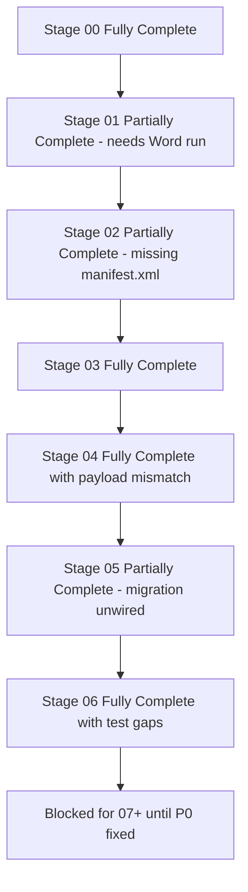
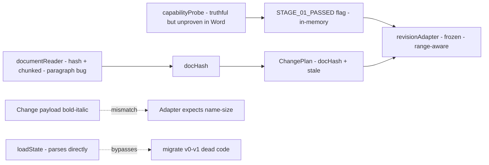

# ToneForge — Stages 00–06 Comprehensive Audit

> Historical audit record. The authoritative current status and sequencing are
> in [`ROADMAP.md`](../ROADMAP.md). Findings below describe the repository at
> the time of the audit and must not be used as current status.

> Scope: [`ROADMAP.md`](ROADMAP.md), [`plans/plan.md`](plans/plan.md), [`docs/project-state.md`](docs/project-state.md), [`docs/architecture.md`](docs/architecture.md), [`docs/decision-log.md`](docs/decision-log.md), `docs/stages/00-06`, `src/`, `tests/`, `scripts/`, configs.
> Method: structural inventory + code reading + cross-stage consistency + error-handling + best-practice check.
> Prior audit: [`plans/stage1-audit.md`](plans/stage1-audit.md) — remediation R1–R10 claimed complete in [`docs/project-state.md`](docs/project-state.md).

## 1. Verdict Summary

| Stage | Title                      | Claimed     | Audit Verdict                         | Rationale                                                                                                           |
| ----- | -------------------------- | ----------- | ------------------------------------- | ------------------------------------------------------------------------------------------------------------------- |
| 00    | Repository discovery       | PASS        | **Fully Complete**                    | Baseline docs + plan exist                                                                                          |
| 01    | Office.js capability spike | PASS (hard) | **Partially Complete**                | Code truthful + non-destructive, but never run in Word; test thin; duplicate probe logic                            |
| 02    | Scaffold                   | PASS        | **Partially Complete**                | Full tree + tooling exists, but `manifest.xml` missing, stack/docs drift                                            |
| 03    | Cline governance           | PASS        | **Fully Complete**                    | Rules + 4 skills + onboarding refs exist                                                                            |
| 04    | Domain model               | PASS        | **Fully Complete with minor defects** | Schemas hardened + 39 tests, but payload vs adapter mismatch                                                        |
| 05    | Storage/state              | PASS        | **Partially Complete**                | Persistence + migration exist + Office tests, but `migrate()` never called                                          |
| 06    | LLM provider layer         | PASS        | **Fully Complete with minor gaps**    | Interface + OpenAI + mock + registry + retry + prompts + tests, but rewrite-prompt test missing, mock abort ignored |

```mermaid
flowchart TD
  S00[Stage 00 Fully Complete] --> S01[Stage 01 Partially Complete - needs Word run]
  S01 --> S02[Stage 02 Partially Complete - missing manifest.xml]
  S02 --> S03[Stage 03 Fully Complete]
  S03 --> S04[Stage 04 Fully Complete with payload mismatch]
  S04 --> S05[Stage 05 Partially Complete - migration unwired]
  S05 --> S06[Stage 06 Fully Complete with test gaps]
  S06 --> BLOCKED[Blocked for 07+ until P0 fixed]
```

## 2. Stage-by-Stage Evidence

### Stage 00 — Repository discovery — Fully Complete

Requirements [`docs/stages/00-discovery.md`](docs/stages/00-discovery.md):

- `ROADMAP.md` reviewed, tech stack confirmed, scaffold plan in [`plans/plan.md`](plans/plan.md), [`docs/project-state.md`](docs/project-state.md), [`docs/decision-log.md`](docs/decision-log.md), [`docs/architecture.md`](docs/architecture.md).

Evidence:

- [`ROADMAP.md`](ROADMAP.md) stage map 00–28 + hard gates 01/18/27/28 present.
- [`plans/plan.md`](plans/plan.md) vision + layout + tooling + MCP map present.
- [`docs/architecture.md`](docs/architecture.md) product arch + boundaries + data flow present.
- [`docs/decision-log.md`](docs/decision-log.md) ADR-0001–ADR-0013 present.
- `README.md`, `LICENSE`, `.gitignore` present.

Gaps: none blocking. `README.md` is 3 lines — thin vs scaffold expectation, but onboarding covers setup.

### Stage 01 — Office.js capability spike — Partially Complete

Requirements [`docs/stages/01-officejs-spike.md`](docs/stages/01-officejs-spike.md):

- [`probeWordCapabilities()`](src/word/capabilityProbe.ts) returns complete [`WordCapabilities`](src/word/capabilityProbe.ts), runs in Word without exception, results in [`docs/manual-verification.md`](docs/manual-verification.md), typecheck + test pass. Critical rule: do not build reformatter before proving revisions.

Evidence — fixed vs prior audit:

- [`src/word/capabilityProbe.ts`](src/word/capabilityProbe.ts) is non-destructive: uses [`getProbeRange()`](src/word/capabilityProbe.ts) via `getSelection().getRange(0,0)` + [`hasMethod()`](src/word/capabilityProbe.ts) checks, no `insertText`/`insertParagraph` mutations. Good — resolves prior C3 destructiveness.
- `supportsStyles` loads `name`, syncs, checks `items.length>0` at [`capabilityProbe.ts`](src/word/capabilityProbe.ts). Truthful. Good.
- `supportsRevisions` checks `trackedChanges.load` + `Array.isArray(items)` at [`capabilityProbe.ts`](src/word/capabilityProbe.ts). Returns `false` when missing. Good.
- Host normalization via [`normalizeHostName()`](src/word/capabilityProbe.ts). Good.
- [`src/word/documentReader.ts`](src/word/documentReader.ts) chunked read + [`hashDocument()`](src/word/documentReader.ts) FNV + stable ID via `Context.document.id` fallback. Good — resolves prior M2 partially.
- [`src/word/revisionAdapter.ts`](src/word/revisionAdapter.ts) frozen behind [`STAGE_01_PASSED`](src/word/revisionAdapter.ts) + [`validatePlanBeforeApply()`](src/word/revisionAdapter.ts) + `currentDocHash` check at [`revisionAdapter.ts`](src/word/revisionAdapter.ts). Good — resolves prior C1/C2 silent-success.

Remaining gaps:

- G1.1 — In-Word execution never done. [`docs/manual-verification.md`](docs/manual-verification.md) status PENDING, matrix empty, checklist unchecked. Stage file [`01-officejs-spike.md`](docs/stages/01-officejs-spike.md) status PENDING, but [`project-state.md`](docs/project-state.md) claims PASS. Contradiction — hard gate cannot be PASS without host evidence.
- G1.2 — Test thin. [`tests/unit/word/capabilityProbe.test.ts`](tests/unit/word/capabilityProbe.test.ts) only asserts keys exist, no failure-injection, no truthfulness (e.g., missing `trackedChanges` → false, empty styles → false), no host normalization.
- G1.3 — Duplicate logic: `supportsInsertText` and `supportsReplaceText` both check `hasMethod(range,insertText)` at [`capabilityProbe.ts`](src/word/capabilityProbe.ts) and [`capabilityProbe.ts`](src/word/capabilityProbe.ts). Does not distinguish replace capability.
- G1.4 — ADR drift: [`ADR-0012`](docs/decision-log.md) says `dryRun:true` default with opt-in `dryRun:false`, but current [`probeWordCapabilities()`](src/word/capabilityProbe.ts) takes no args — always non-destructive, no opt-in path. Doc vs code mismatch.
- G1.5 — [`src/word/documentReader.ts`](src/word/documentReader.ts) `getParagraphRange()` loads `items`, syncs, then calls `para.load(text)` per item but never second `sync()` before reading `para.text`. Will always return empty strings in real Word. Stale-guard / large-doc data flow broken for future stages.

### Stage 02 — Scaffold — Partially Complete

Requirements [`docs/stages/02-scaffold.md`](docs/stages/02-scaffold.md): full layout + tooling + CI + docs + governance stubs, all verify steps pass.

Evidence — present:

- Configs: [`package.json`](package.json), [`tsconfig.json`](tsconfig.json), `webpack.common/dev/prod.js`, [`vitest.config.ts`](vitest.config.ts) with 80% thresholds, [`eslint.config.mjs`](eslint.config.mjs) with ADR-0013 boundaries, `.prettierrc`, `.editorconfig`, `.nvmrc`, [`.env.example`](.env.example).
- Manifest: [`manifest.json`](manifest.json) v1.30 unified, `extensions.requirements` + nested `runtimes` + `openPage` + `code.page` only. `assets/icon-*.png` present.
- Src tree: `taskpane/`, `commands/`, `core/`, `word/`, `ai/`, `shared/` per [`plans/plan.md`](plans/plan.md).
- Scripts: [`scripts/stage-verify.mjs`](scripts/stage-verify.mjs), [`scripts/validate-manifest.mjs`](scripts/validate-manifest.mjs), `release-check`, `validate-skills`.
- CI: `.github/workflows/ci.yml`, `release.yml` present. Husky + `commitlint.config.cjs` + `.lintstagedrc.cjs` present.
- Docs: `onboarding`, `privacy-security`, `accessibility`, `manual-verification`, `CHANGELOG` present.

Gaps:

- G2.1 — Missing `manifest.xml` fallback. Inventory shows no `manifest.xml` at root, but [`validate-manifest.mjs`](scripts/validate-manifest.mjs) errors if `manifest.xml` missing, and [`ADR-0001`](docs/decision-log.md) requires both in sync. Prior R3 claimed both validate — regression. `npm run validate` will FAIL.
- G2.2 — Stack drift: [`package.json`](package.json) uses `@fluentui/react` v8, but [`architecture.md`](docs/architecture.md) and [`plan.md`](plans/plan.md) mandate Fluent v9. No `office-js` package (relies on [`src/types/office.d.ts`](src/types/office.d.ts)) — acceptable but undocumented.
- G2.3 — Config drift: [`tsconfig.json`](tsconfig.json) omits `exactOptionalPropertyTypes` required by [`plan.md`](plans/plan.md). `paths` alias `@/*` present — good.
- G2.4 — Docs drift: [`architecture.md`](docs/architecture.md) says `Manifest: Unified JSON manifest v1.10` — stale vs v1.30 in [`manifest.json`](manifest.json) and ADR-0001. Technology stack section needs update.
- G2.5 — `README.md` minimal (3 lines) vs production scaffold expectation — low severity, onboarding compensates.

### Stage 03 — Cline governance — Fully Complete

Requirements [`docs/stages/03-cline-governance.md`](docs/stages/03-cline-governance.md): `.cline/rules/toneforge.md` + 4 skills with frontmatter + referenced in onboarding + verify passes.

Evidence:

- [`.cline/rules/toneforge.md`](.cline/rules/toneforge.md) mandatory reading + stage protocol + hard rules + commit conventions + pre-commit checklist. Matches stage protocol.
- `.roo/skills/toneforge-scaffold/SKILL.md`, `toneforge-officejs`, `toneforge-llm`, `toneforge-testing` all present.
- [`docs/onboarding.md`](docs/onboarding.md) lines 76–83 reference all 4 skills + governance rules + `skills:validate`. Good — resolves prior M5.
- [`eslint.config.mjs`](eslint.config.mjs) enforces boundaries per ADR-0013. Good.

Gaps: none blocking. Recommend running `npm run skills:validate` in CI to prove frontmatter (not verified here).

### Stage 04 — Domain model — Fully Complete with minor defects

Requirements [`docs/stages/04-domain-model.md`](docs/stages/04-domain-model.md): `StyleProfile`, `Finding`, `ChangePlan`, `Change`, barrel, tests.

Evidence:

- [`src/core/domain/StyleProfile.ts`](src/core/domain/StyleProfile.ts) canonical profile, measured + semantic + typography + houseStyle + version, [`createEmptyProfile()`](src/core/domain/StyleProfile.ts) uses `uuid.v4()`. Good.
- [`src/core/domain/Change.ts`](src/core/domain/Change.ts) `ChangeType` 8 variants, [`ChangeRangeSchema`](src/core/domain/Change.ts) `refine(start<=end)`, [`ChangePayloadSchema`](src/core/domain/ChangePlan.ts) discriminated union + `superRefine` enforcement. Good — resolves prior M1.
- [`src/core/domain/Finding.ts`](src/core/domain/Finding.ts) unified model with `kind` deterministic/semantic/formatting, `Range` refine, severity, confidence. Good.
- [`src/core/domain/ChangePlan.ts`](src/core/domain/ChangePlan.ts) `createChangePlan()` with `uuid.v4()`, `conflicts:[]`, `stale:false`. Good.
- Barrel [`src/core/domain/index.ts`](src/core/domain/index.ts) exports all main schemas + factories.
- Tests: `Change.test`, `ChangePlan.test`, `Finding.test`, `StyleProfile.test` — 39 tests claimed. Hardened.

Gaps:

- G4.1 — Payload vs adapter mismatch (inter-stage break). [`Change.ts`](src/core/domain/Change.ts) `SetCharacterFormatPayloadSchema` allows `bold/italic/underline/color`, but [`revisionAdapter.ts`](src/word/revisionAdapter.ts) reads `payload.name/size/color`. `name/size` will never validate, `bold/italic/underline` will never apply. Must align before Stage 18.
- G4.2 — Barrel does not re-export `ChangePayloadSchema`, `ProfileVersionSchema`, `TypographyRulesSchema` etc. Limits consumers — minor.
- G4.3 — `TypographyRulesSchema` `emDash: em|hyphen|space` at [`StyleProfile.ts`](src/core/domain/StyleProfile.ts) — `space` as dash encoding is confusing; `emDashSpacing` orthogonal field added but docs not updated. Low severity, needs comment.

### Stage 05 — Storage/state — Partially Complete

Requirements [`docs/stages/05-storage-state.md`](docs/stages/05-storage-state.md): `persistence.ts` Office + localStorage, `migration.ts`, barrel, tests.

Evidence:

- [`src/core/state/persistence.ts`](src/core/state/persistence.ts) `Office.roamingSettings` + localStorage fallback, [`setRoamingSettingsAsync()`](src/core/state/persistence.ts) calls `saveAsync`, [`loadState()`](src/core/state/persistence.ts) falls back to defaults on corrupt with `console.warn`, [`saveState()`](src/core/state/persistence.ts) writes localStorage sync + Office async best-effort. Good — resolves prior H2 saveAsync.
- [`src/core/state/migration.ts`](src/core/state/migration.ts) `migrate()` handles null/non-object/v0→v1, `CURRENT_STATE_VERSION=1`, defaults `telemetryDisabled:true`. Good.
- Barrel [`src/core/state/index.ts`](src/core/state/index.ts) exports all.
- Tests: `migration.test`, `persistence.test`, `persistenceOffice.test` present.

Gaps:

- G5.1 — Migration unwired (data-flow break). [`loadState()`](src/core/state/persistence.ts) calls `StateSchema.parse(raw)` directly, never calls [`migrate()`](src/core/state/migration.ts). `migration.ts` is dead code. Corrupted v0 state will be discarded instead of migrated. Must call `migrate(raw)` before parse.
- G5.2 — Plaintext key accepted as MVP limitation at [`persistence.ts`](src/core/state/persistence.ts) — must track for Stage 25 (key-vault/DPAPI). Not blocking for 05 but must not ship.
- G5.3 — `saveState` always writes localStorage even when Office succeeds — divergence risk noted in ADR-0007 as accepted. Low for now, needs reconciliation note before Settings UI Stage 07.

### Stage 06 — LLM provider layer — Fully Complete with minor gaps

Requirements [`docs/stages/06-llm-provider.md`](docs/stages/06-llm-provider.md): interface, OpenAI, mock, registry, retry, prompts, unit + integration tests.

Evidence:

- [`src/ai/providers/LlmProvider.ts`](src/ai/providers/LlmProvider.ts) `LlmProvider` + `LlmRequest` with `signal` + `LlmResponse` + `LlmError(retryable)` + [`withSemanticHelpers()`](src/ai/providers/LlmProvider.ts) adding `profile/deviations/rewrite` delegating to `complete()`. Aligns with [`plan.md`](plans/plan.md). Good — resolves prior H4 contract mismatch.
- [`src/ai/providers/openaiAdapter.ts`](src/ai/providers/openaiAdapter.ts) fetch-based, `AbortSignal.any()` at [`openaiAdapter.ts`](src/ai/providers/openaiAdapter.ts), caller-abort non-retryable vs timeout retryable at [`openaiAdapter.ts`](src/ai/providers/openaiAdapter.ts), delegates to [`withRetry()`](src/ai/providers/retry.ts), real [`redact()`](src/ai/providers/openaiAdapter.ts) emails/cards/keys/tokens. Good.
- [`src/ai/providers/mockAdapter.ts`](src/ai/providers/mockAdapter.ts) scripted `responses` + `failOn` + `latencyMs`. Good for tests.
- [`src/ai/providers/registry.ts`](src/ai/providers/registry.ts) defaults to mock when no key at [`registry.ts`](src/ai/providers/registry.ts), `switch()`, `completeWithFallback()` restoring previous. Good.
- [`src/ai/providers/retry.ts`](src/ai/providers/retry.ts) exponential backoff `baseDelay*2^attempt` capped. Good.
- Prompts: [`profilePrompts.ts`](src/ai/prompts/profilePrompts.ts) + `rewritePrompts.ts` all throw unless `includeRawText:true`, plus `ProfileResponseSchema`/`DeviationResponseSchema` Zod parsers. Good — resolves prior H3 privacy.
- Tests: `mockAdapter.test`, `registry.test`, `openaiAdapter.test` (10 cases: 429 retry, 400 no-retry, 500 retry, timeout retryable, caller-abort non-retryable, redact), `profilePrompts.test` (10 cases), `llm-registry.test` integration. Strong.

Gaps:

- G6.1 — No `rewritePrompts.test.ts` — `buildRewritePrompt` opt-in refusal untested.
- G6.2 — `MockAdapter` checks `responses` before `failOn` at [`mockAdapter.ts`](src/ai/providers/mockAdapter.ts) — if same needle in both, returns success instead of failure. Swap order or document precedence.
- G6.3 — `MockAdapter.complete()` ignores `request.signal` — abort contract untested for mock path. Low.
- G6.4 — Generic secret pattern `[A-Za-z0-9+/]{32,}` at [`openaiAdapter.ts`](src/ai/providers/openaiAdapter.ts) may over-redact long normal words. Low, needs allowlist note.

## 3. Inter-Stage Dependencies, Order, Data Flow

| Dependency                                | Status                                  | Evidence                                                                                                                                                                                                                                                                                                                    |
| ----------------------------------------- | --------------------------------------- | --------------------------------------------------------------------------------------------------------------------------------------------------------------------------------------------------------------------------------------------------------------------------------------------------------------------------- |
| 01 hard gate blocks 18                    | **Enforced in code, violated in order** | [`STAGE_01_PASSED=false`](src/word/revisionAdapter.ts) blocks [`applyChangePlan()`](src/word/revisionAdapter.ts) — good. But Stage 18 code landed before 01 in-Word PASS — violates critical ordering rule [`01-officejs-spike.md`](docs/stages/01-officejs-spike.md) + ADR-0008. Freeze is correct mitigation, must keep.  |
| 00→02 scaffold before 01 PASS             | **Order inversion**                     | Scaffold PASS while 01 PENDING — acceptable only because adapter frozen. Do not start 15–21 until 01 closes.                                                                                                                                                                                                                |
| Domain → State → LLM → Word data flow     | **Broken in 2 places**                  | G4.1 payload mismatch breaks Change→adapter. G5.1 migration unwired breaks State versioning. G1.5 reader bug breaks snapshot→hash→plan→apply chain.                                                                                                                                                                         |
| One canonical profile                     | **Intact**                              | [`StyleProfile`](src/core/domain/StyleProfile.ts) drives all; no duplicate profile types found.                                                                                                                                                                                                                             |
| One mutation path                         | **Intact + lint-enforced**              | Only [`revisionAdapter.ts`](src/word/revisionAdapter.ts) calls `runInWord` for mutation; [`officeHelpers.ts`](src/shared/office/officeHelpers.ts) thin wrapper; ESLint blocks `ui→revisionAdapter` at [`eslint.config.mjs`](eslint.config.mjs) + `core/domain` isolation at [`eslint.config.mjs`](eslint.config.mjs). Good. |
| Deterministic-first, AI-only-where-needed | **Intact**                              | `core/domain` imports only `zod`/`uuid`; `word/` no `ai` imports; `ai/` no `word` imports per ESLint. `shared/utils/text` pure. Good.                                                                                                                                                                                       |
| Privacy opt-in                            | **Enforced**                            | Prompts throw without `includeRawText:true`; `logger` redacts `key/token/secret`; `env` redacts; `TELEMETRY_DISABLED=1` default. Good.                                                                                                                                                                                      |
| DocHash / stale guard                     | **Partial**                             | `hashDocument` → `ChangePlan.docHash` → `applyChangePlan(currentDocHash)` chain exists, but reader hash uses truncated `text` vs full `fullText` for ID at [`documentReader.ts`](src/word/documentReader.ts) — ID stable, hash truncated — document change beyond `maxChars` undetected. Needs note.                        |
| Gate persistence                          | **Volatile**                            | `STAGE_01_PASSED` in-memory only — restart loses gate. Should persist or re-probe on boot before Stage 18 unblocks.                                                                                                                                                                                                         |

```mermaid
flowchart LR
  Probe[capabilityProbe - truthful but unproven in Word] --> Gate[STAGE_01_PASSED flag - in-memory]
  Gate --> Adapter[revisionAdapter - frozen - range-aware]
  Snapshot[documentReader - hash + chunked - paragraph bug] --> Hash[docHash]
  Hash --> Plan[ChangePlan - docHash + stale]
  Plan --> Adapter
  Domain[Change payload bold-italic] -.mismatch.-> Adapter2[Adapter expects name-size]
  StateLoad[loadState - parses directly] -.bypasses.-> Migrate[migrate v0-v1 dead code]
```

## 4. Gaps, Bugs, Remediation

### P0 — Must fix before 07

- R0.1 — Restore `manifest.xml` fallback + fix validator. Create `manifest.xml` per ADR-0001 (bt namespace, `Host Name=Document`, `xsi:type=Document`, `Permissions ReadWriteDocument`, `bt:Urls/ShortStrings/LongStrings`, ID `96df86d6-ce2f-42e9-8fba-916143aeeb5c`, version `1.0.0`). Run `npm run validate` + `office-addin-manifest validate`. Files: [`manifest.json`](manifest.json), [`scripts/validate-manifest.mjs`](scripts/validate-manifest.mjs).
- R0.2 — Execute Stage 01 in Word. Sideload per [`docs/onboarding.md`](docs/onboarding.md), run [`probeWordCapabilities()`](src/word/capabilityProbe.ts) in Word web Chrome/Edge + Windows, fill [`docs/manual-verification.md`](docs/manual-verification.md) matrix + checklist, update [`docs/project-state.md`](docs/project-state.md) to PASS or PASS WITH DOCUMENTED LIMITATION, update [`docs/stages/01-officejs-spike.md`](docs/stages/01-officejs-spike.md) from PENDING. Human-only, cannot be closed by agent.
- R0.3 — Wire migration. In [`persistence.ts`](src/core/state/persistence.ts) call `migrate(raw)` before `StateSchema.parse`. Add test: v0 input → v1 output via `loadState`. Files: [`src/core/state/persistence.ts`](src/core/state/persistence.ts), [`src/core/state/migration.ts`](src/core/state/migration.ts).
- R0.4 — Align Change payload with adapter. Either extend `SetCharacterFormatPayloadSchema` with `name/size/color` or change adapter to handle `bold/italic/underline`. Add round-trip test Change→validate→apply. Files: [`src/core/domain/Change.ts`](src/core/domain/Change.ts), [`src/word/revisionAdapter.ts`](src/word/revisionAdapter.ts).
- R0.5 — Fix `getParagraphRange` second sync. After per-para `load(text)`, call `await context.sync()` before reading `text`. Add DTO test with mock asserting text returned. File: [`src/word/documentReader.ts`](src/word/documentReader.ts).

### P1 — Should fix before 07

- R1.1 — Harden probe tests. Extend [`capabilityProbe.test.ts`](tests/unit/word/capabilityProbe.test.ts) with failure injection: missing `trackedChanges` → `supportsRevisions:false`, empty `styles.items` → `supportsStyles:false`, unknown host → `unknown`, `Office.run` throw → all false. Distinguish `supportsInsertText` vs `supportsReplaceText` or merge into one.
- R1.2 — Fix `revisionAdapter.apply.test` empty-plan assertion. Currently `blocks when plan has no changes` expects `length 0` — validator would push per-change errors, but zero changes yields zero results (vacuous pass). Assert `validatePlanBeforeApply` reports `has no changes` instead. File: [`tests/unit/word/revisionAdapter.apply.test.ts`](tests/unit/word/revisionAdapter.apply.test.ts).
- R1.3 — Update docs drift. [`architecture.md`](docs/architecture.md) `v1.10` → `v1.30`; decide Fluent v8 vs v9 and align [`package.json`](package.json) + arch + plan; add `exactOptionalPropertyTypes` to [`tsconfig.json`](tsconfig.json) or amend plan; fix ADR-0012 `dryRun` description to match no-arg non-destructive probe.
- R1.4 — Update stage statuses. [`04-domain-model.md`](docs/stages/04-domain-model.md), [`05-storage-state.md`](docs/stages/05-storage-state.md), [`06-llm-provider.md`](docs/stages/06-llm-provider.md) still PENDING while [`project-state.md`](docs/project-state.md) claims PASS — sync to PASS (after P0) or FAIL with gaps. Keep 18 BLOCKED until 01 closes.
- R1.5 — Add `rewritePrompts.test.ts` asserting throw without `includeRawText:true` + correct output with opt-in. Fix `MockAdapter` order: check `failOn` before `responses` or document precedence. File: [`src/ai/providers/mockAdapter.ts`](src/ai/providers/mockAdapter.ts).

## 5. Overall Readiness

**Not ready to advance beyond Stage 06.** Foundation is strong — scaffold, governance, domain, state, LLM, word layers exist, hardened vs prior audit, 124 tests claimed, lint boundaries enforced, privacy opt-in enforced, mutation gate frozen. But P0 breaks verification chain: missing `manifest.xml` fails `validate`, unwired migration makes versioning dead code, payload mismatch breaks future apply, reader bug breaks snapshot DTOs, and hard-gate Stage 01 lacks in-Word evidence. `project-state.md` overclaims PASS for 01 while stage file says PENDING — traceability unreliable for release decisions.

**What must be fixed before 07:** R0.1–R0.5 + R1.4 status sync, then full `npm run stage:verify` (typecheck/lint/format/test/build/validate) green + coverage report. Keep Stage 18 BLOCKED, do not start Stages 15–21 until R0.2 closes in Word. After P0, stages 00,02,03,04,06 can be marked Fully Complete (04/06 with minor notes), 01/05 Partially Complete pending Word run / migration wiring verification, then proceed to Settings UI Stage 07.
