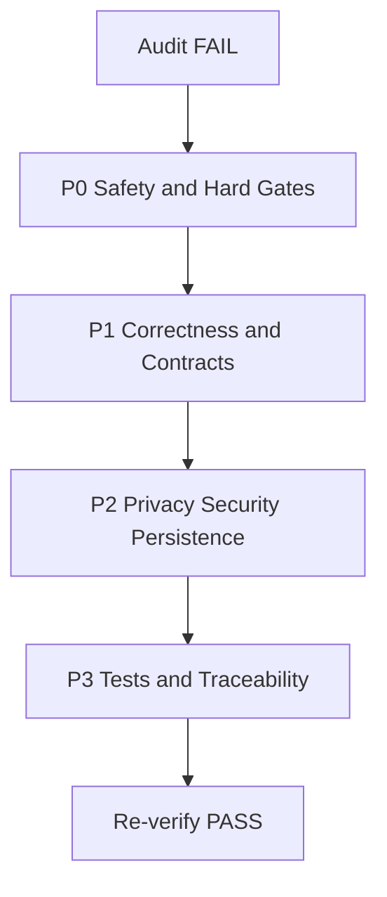

# ToneForge — Stage 1 Comprehensive Audit Report

> Scope: all currently delivered code, configs, and docs regardless of stage mapping, per reviewer instruction.
> Baseline: [`ROADMAP.md`](ROADMAP.md:1), [`plans/plan.md`](plans/plan.md:1), [`docs/project-state.md`](docs/project-state.md:1), `docs/stages/00-06`, [`docs/architecture.md`](docs/architecture.md:1), [`docs/decision-log.md`](docs/decision-log.md:1).
> Method: systematic code inspection, requirements traceability, functional validation by reading, test plan review, config and docs cross-check.

## 1. Executive Summary

Foundation scaffold Stages 00 and 02 are PASS and solid. Domain, state, LLM, and Word layers exist as code but their stage gates in [`docs/project-state.md`](docs/project-state.md:8) remain PENDING and for good reason: hard-gate Stage 01 was never executed in Word, Stage 18 scope [`applyChangePlan()`](src/word/revisionAdapter.ts:21) was built prematurely in violation of the critical ordering rule, and multiple correctness, safety, privacy, and test gaps block a PASS verdict.

Verdict: **FAIL — Stage 1 is not fully implemented, correctly functioning, or thoroughly tested.** Remediation below is required before any Stages 07+ work.

## 2. Scope and Acceptance Criteria Used

| Source                                                            | Criteria                                                                                                                                                                                                                                                                                                                                                               |
| ----------------------------------------------------------------- | ---------------------------------------------------------------------------------------------------------------------------------------------------------------------------------------------------------------------------------------------------------------------------------------------------------------------------------------------------------------------- |
| [`01-officejs-spike.md`](docs/stages/01-officejs-spike.md:23)     | [`probeWordCapabilities()`](src/word/capabilityProbe.ts:34) returns complete [`WordCapabilities`](src/word/capabilityProbe.ts:8), runs in Word without exception, results in [`manual-verification.md`](docs/manual-verification.md:1), typecheck plus tests pass                                                                                                      |
| [`02-scaffold.md`](docs/stages/02-scaffold.md:24)                 | install, typecheck, lint, format, test, build, validate, stage verify all pass, docs updated                                                                                                                                                                                                                                                                           |
| [`03-cline-governance.md`](docs/stages/03-cline-governance.md:15) | [`.cline/rules/toneforge.md`](.cline/rules/toneforge.md:1) plus [`.roo/skills/`](.roo/skills/toneforge-scaffold.md:1) stubs, referenced in onboarding, verify passes                                                                                                                                                                                                   |
| [`04-domain-model.md`](docs/stages/04-domain-model.md:18)         | [`StyleProfile.ts`](src/core/domain/StyleProfile.ts:1), [`Finding.ts`](src/core/domain/Finding.ts:1), [`ChangePlan.ts`](src/core/domain/ChangePlan.ts:1), [`Change.ts`](src/core/domain/Change.ts:1), barrel, tests, typecheck, docs updated                                                                                                                           |
| [`05-storage-state.md`](docs/stages/05-storage-state.md:16)       | [`persistence.ts`](src/core/state/persistence.ts:1), [`migration.ts`](src/core/state/migration.ts:1), barrel, tests, typecheck, docs updated                                                                                                                                                                                                                           |
| [`06-llm-provider.md`](docs/stages/06-llm-provider.md:19)         | [`LlmProvider.ts`](src/ai/providers/LlmProvider.ts:1), [`openaiAdapter.ts`](src/ai/providers/openaiAdapter.ts:1), [`mockAdapter.ts`](src/ai/providers/mockAdapter.ts:1), [`registry.ts`](src/ai/providers/registry.ts:1), [`retry.ts`](src/ai/providers/retry.ts:1), [`prompts/`](src/ai/prompts/profilePrompts.ts:1), tests plus integration, typecheck, docs updated |
| [`architecture.md`](docs/architecture.md:39)                      | Module boundaries, one canonical profile, one mutation path, deterministic-first, privacy posture                                                                                                                                                                                                                                                                      |
| [`plan.md`](plans/plan.md:72)                                     | Core interfaces: [`StyleProfile`](src/core/domain/StyleProfile.ts:74), [`Finding`](src/core/domain/Finding.ts:22), [`ChangePlan`](src/core/domain/ChangePlan.ts:12), [`LlmProvider`](src/ai/providers/LlmProvider.ts:24) with `profile()`, `deviations()`, `rewrite()`, AbortSignal, retry, redaction                                                                  |

## 3. Inventory — Delivered vs Required

### 3.1 Delivered and substantially correct

- Scaffold: [`package.json`](package.json:1), [`tsconfig.json`](tsconfig.json:1), [`vitest.config.ts`](vitest.config.ts:1), `webpack.*.js`, `eslint`, `prettier`, [`.nvmrc`](.nvmrc:1), [`.env.example`](.env.example:1), [`manifest.json`](manifest.json:1), `assets/`, [`src/taskpane/`](src/taskpane/App.tsx:1), [`src/commands/`](src/commands/commands.ts:1), [`scripts/`](scripts/stage-verify.mjs:1), `.github/workflows/`, `.husky/`, [`docs/onboarding.md`](docs/onboarding.md:1)
- Governance: [`.cline/rules/toneforge.md`](.cline/rules/toneforge.md:1), [`.roo/skills/toneforge-scaffold.md`](.roo/skills/toneforge-scaffold.md:1), [`toneforge-officejs.md`](.roo/skills/toneforge-officejs.md:1), [`toneforge-llm.md`](.roo/skills/toneforge-llm.md:1), [`toneforge-testing.md`](.roo/skills/toneforge-testing.md:1) — exist, contrary to PENDING in project-state
- Domain types exist with Zod schemas and factories
- State persistence with roaming plus localStorage fallback exists
- LLM interface plus OpenAI plus mock plus registry plus retry plus prompts exist
- Word probe, revision adapter, document reader exist
- Shared utils [`text.ts`](src/shared/utils/text.ts:1), [`result.ts`](src/shared/utils/result.ts:1), [`logger.ts`](src/shared/utils/logger.ts:1), [`officeHelpers.ts`](src/shared/office/officeHelpers.ts:1) exist
- Tests: 7 files, ~30 cases, [`setup.ts`](tests/setup.ts:1) Office plus fetch mocks

### 3.2 Missing or stub-only

- No Settings UI Stage 07, no sample capture Stage 08 — expected, out of foundation scope
- [`migration.ts`](src/core/state/migration.ts:10) is stub: [`migrate()`](src/core/state/migration.ts:10) is identity cast, [`CURRENT_STATE_VERSION`](src/core/state/migration.ts:8) unused, no version field
- No conflict detector, stale guard, hash utility, planner — [`createChangePlan()`](src/core/domain/ChangePlan.ts:24) always sets `conflicts: []`, `stale: false`
- No LLM output parsers or validators, no redaction enforcement
- No coverage report, no Stage 27 host execution, [`manual-verification.md`](docs/manual-verification.md:3) still PENDING

## 4. Findings With Severity and Evidence

### Critical

**C1 — Hard-gate Stage 01 never executed, yet dependent mutation code landed**
Severity: Critical. Evidence: [`docs/project-state.md`](docs/project-state.md:8) shows `01 PENDING`, [`manual-verification.md`](docs/manual-verification.md:3) PENDING with unchecked boxes, but [`revisionAdapter.ts`](src/word/revisionAdapter.ts:1) Stage 18 scope already present. Violates [`01-officejs-spike.md`](docs/stages/01-officejs-spike.md:17) critical ordering rule and [`decision-log.md`](docs/decision-log.md:54) ADR-0008. Risk: full reformatter built on unproven revision behavior.

**C2 — Revision adapter silently reports success while doing nothing or writing to wrong location**
Severity: Critical. Evidence: [`applySingleChange()`](src/word/revisionAdapter.ts:36) uses `getSelection()` for all types, ignores [`Change.range`](src/core/domain/Change.ts:23). [`setParagraphFormat`](src/word/revisionAdapter.ts:49), [`setCharacterFormat`](src/word/revisionAdapter.ts:53) only `load`, never set. [`applyStyle`](src/word/revisionAdapter.ts:57) and [`setListLevel`](src/word/revisionAdapter.ts:62) are empty yet [`applyChangePlan()`](src/word/revisionAdapter.ts:21) pushes `applied: true`. No `docHash` or `stale` check despite [`validatePlanBeforeApply()`](src/word/revisionAdapter.ts:71) existing. Violates one-mutation-path safety.

**C3 — Capability probe is destructive and yields false positives**
Severity: Critical. Evidence: [`probeWordCapabilities()`](src/word/capabilityProbe.ts:34) calls `insertText ToneForge probe Replace` at [`capabilityProbe.ts`](src/word/capabilityProbe.ts:55), `insertParagraph` at [`capabilityProbe.ts`](src/word/capabilityProbe.ts:78), `insertBreak` at [`capabilityProbe.ts`](src/word/capabilityProbe.ts:89) on live selection with no cleanup or sandbox. `supportsStyles` inner `return styles.items.length > 0` at [`capabilityProbe.ts`](src/word/capabilityProbe.ts:101) is discarded, outer always `true`. `supportsRevisions` at [`capabilityProbe.ts`](src/word/capabilityProbe.ts:107) returns `true` even when `trackedChanges` is undefined. Risk: pollutes user doc, gates pass incorrectly.

### High

**H1 — Project-state traceability is stale and contradicts stage files**
Severity: High. Evidence: [`docs/project-state.md`](docs/project-state.md:9) marks `03 PENDING`, `04 PENDING`, `05 PENDING`, `06 PENDING`, but [`03-cline-governance.md`](docs/stages/03-cline-governance.md:26) claims PASS and code plus tests for 04-06 exist. Stage protocol step 7 violated. Risk: release-check and gates unreliable.

**H2 — Persistence never saves in Word and stores secrets in plaintext**
Severity: High. Evidence: [`setRoamingSettings()`](src/core/state/persistence.ts:51) calls `settings.set` but never `saveAsync`, so Word discards changes. [`getRoamingSettings()`](src/core/state/persistence.ts:33) expects stringified JSON but roamingSettings values are typed. [`saveState()`](src/core/state/persistence.ts:83) always writes localStorage even when Office succeeds, allowing divergence. [`StateSchema`](src/core/state/persistence.ts:12) holds `openAiApiKey` as plain string with no encryption or keychain note, contrary to [`privacy-security.md`](docs/privacy-security.md:1) and [`architecture.md`](docs/architecture.md:78).

**H3 — Privacy contract violated: raw doc text sent, redact is no-op**
Severity: High. Evidence: [`buildProfilePrompt()`](src/ai/prompts/profilePrompts.ts:7) and [`buildDeviationPrompt()`](src/ai/prompts/profilePrompts.ts:23) embed `sampleText` and `targetText` unconditionally. [`OpenAiAdapter.redact()`](src/ai/providers/openaiAdapter.ts:126) returns `text` unchanged. [`logger.ts`](src/shared/utils/logger.ts:12) only redacts keys matching key/token/secret, not document content. Violates [`architecture.md`](docs/architecture.md:78) opt-in rule.

**H4 — LLM contract mismatch and broken retry/abort semantics**
Severity: High. Evidence: [`plans/plan.md`](plans/plan.md:77) requires `profile()`, `deviations()`, `rewrite()` with `AbortSignal`, but [`LlmProvider`](src/ai/providers/LlmProvider.ts:24) only has [`complete()`](src/ai/providers/LlmProvider.ts:25) and optional [`stream()`](src/ai/providers/LlmProvider.ts:26). [`OpenAiAdapter.doComplete()`](src/ai/providers/openaiAdapter.ts:61) creates own `AbortController` and ignores `request.signal`. [`fromUnknownError()`](src/ai/providers/openaiAdapter.ts:117) marks network errors non-retryable. [`retry.ts`](src/ai/providers/retry.ts:12) [`withRetry()`](src/ai/providers/retry.ts:12) is dead code duplicated inside adapter. [`LlmRegistry.complete()`](src/ai/providers/registry.ts:43) catch-rethrow is dead.

**H5 — Manifest likely invalid for sideload**
Severity: High. Evidence: [`manifest.json`](manifest.json:11) has `"contactUrl": true` and `"supportUrl": true` booleans where URLs required. `manifestVersion: 1.10` string vs [`validate-manifest.mjs`](scripts/validate-manifest.mjs:23) numeric check confusion. `webApplicationInfo.id: gekko47.toneforge` at [`manifest.json`](manifest.json:132) is not a GUID. `permissions`, `runtimes`, `commands` plus `extensions.ribbons` duplication mixes unified and XML models. No XML fallback despite ADR-0001 mitigation. Risk: Stage 27 sideload fails.

**H6 — Test suite too thin for safety-critical paths, no coverage evidence**
Severity: High. Evidence: only [`StyleProfile.test.ts`](tests/unit/core/domain/StyleProfile.test.ts:1), [`persistence.test.ts`](tests/unit/core/state/persistence.test.ts:1), [`capabilityProbe.test.ts`](tests/unit/word/capabilityProbe.test.ts:1), [`revisionAdapter.test.ts`](tests/unit/word/revisionAdapter.test.ts:1), [`registry.test.ts`](tests/unit/ai/providers/registry.test.ts:1), [`mockAdapter.test.ts`](tests/unit/ai/providers/mockAdapter.test.ts:1), [`text.test.ts`](tests/unit/shared/utils/text.test.ts:1), [`llm-registry.test.ts`](tests/integration/llm-registry.test.ts:1). Zero tests for [`openaiAdapter.ts`](src/ai/providers/openaiAdapter.ts:1), [`retry.ts`](src/ai/providers/retry.ts:1), [`migration.ts`](src/core/state/migration.ts:1), [`documentReader.ts`](src/word/documentReader.ts:1), [`env.ts`](src/core/config/env.ts:1), [`logger.ts`](src/shared/utils/logger.ts:1), prompts, Office persistence path. [`revisionAdapter.test.ts`](tests/unit/word/revisionAdapter.test.ts:1) only tests validator, never [`applyChangePlan()`](src/word/revisionAdapter.ts:21). [`capabilityProbe.test.ts`](tests/unit/word/capabilityProbe.test.ts:5) only checks keys exist. Coverage threshold 80% in [`vitest.config.ts`](vitest.config.ts:17) unproven, and `@vitest/coverage-v8` missing from [`package.json`](package.json:43) so `test:coverage` fails.

### Medium

**M1 — Domain validation gaps**
Evidence: [`FindingSchema`](src/core/domain/Finding.ts:22) and [`ChangeSchema`](src/core/domain/Change.ts:20) allow `start > end`, empty `payload` for types requiring `text`. [`TypographyRulesSchema`](src/core/domain/StyleProfile.ts:21) `emDash: em|hyphen|space` looks like typo, should model em/en/spaced variants. [`HouseStyleSchema`](src/core/domain/StyleProfile.ts:34) `.default({})` on nested object with required defaults is fragile. [`createEmptyProfile()`](src/core/domain/StyleProfile.ts:90) uses `crypto.randomUUID()` instead of `uuid` dependency already in [`package.json`](package.json:39), breaks older WebView. [`core/domain/index.ts`](src/core/domain/index.ts:1) does not re-export `ProfileVersionSchema`, `TypographyRulesSchema`, etc., limiting consumers.

**M2 — Document reader uses non-existent API and lacks large-doc handling**
Evidence: [`getDocumentSnapshot()`](src/word/documentReader.ts:19) reads `context.document.url` at [`documentReader.ts`](src/word/documentReader.ts:26) — Word JS has no such prop, always `unknown`. No chunking, hashing, or paragraph-range DTOs needed for Stage 24 perf and Stage 22 stale guard.

**M3 — Dependency and UI stack drift**
Evidence: [`package.json`](package.json:35) uses `@fluentui/react` v8 but [`architecture.md`](docs/architecture.md:62) and [`plan.md`](plans/plan.md:3) mandate Fluent v9. No `office-js` package, relies on [`office.d.ts`](src/types/office.d.ts:1). [`Dashboard.tsx`](src/taskpane/pages/Dashboard.tsx:6) nests v8 `ThemeProvider` inside local provider. [`App.tsx`](src/taskpane/App.tsx:1) has no error boundary despite `react-error-boundary` dependency.

**M4 — Tooling config drift**
Evidence: [`tsconfig.json`](tsconfig.json:1) omits `exactOptionalPropertyTypes` required by [`plan.md`](plans/plan.md:106). [`validate-manifest.mjs`](scripts/validate-manifest.mjs:23) version check is wrong. [`stage-verify.mjs`](scripts/stage-verify.mjs:7) runs full build every time with no per-stage filter. [`setup.ts`](tests/setup.ts:4) Office mock `getSelection: vi.fn()` returns undefined and `selection` vs `getSelection` shape mismatch, so future Word tests will throw.

**M5 — Docs and decisions incomplete**
Evidence: [`decision-log.md`](docs/decision-log.md:1) stops at scaffold, no ADRs for domain, persistence fallback, LLM fetch vs SDK, probe destructiveness. [`architecture.md`](docs/architecture.md:39) boundaries forbid `core/domain` importing `Office` but no lint rule enforces it. [`onboarding.md`](docs/onboarding.md:1) does not reference skills despite Stage 03 verification claim.

### Low

**L1 — Minor quality nits**
Evidence: [`normalizeLineEndings()`](src/shared/utils/text.ts:66) docstring says strip leading/trailing but only normalizes newlines. [`splitSentences()`](src/shared/utils/text.ts:16) lookbehind may fail on legacy WebView. [`mean()`](src/shared/utils/text.ts:51) and [`stdDev()`](src/shared/utils/text.ts:57) correct but untested for single-element edge. [`rewritePrompts.ts`](src/ai/prompts/rewritePrompts.ts:1) missing redaction header present in profile prompts.

## 5. Testing Adequacy Assessment

| Area     | Plan vs Actual                                                                                                                                                                   | Verdict     |
| -------- | -------------------------------------------------------------------------------------------------------------------------------------------------------------------------------- | ----------- |
| Domain   | Stage 04 requires tests under `tests/unit/core/domain/` — only StyleProfile covered, no Finding, Change, ChangePlan conflict/stale tests                                         | Inadequate  |
| State    | Stage 05 requires persistence plus migration tests — only localStorage happy path, no Office path, no saveAsync, no migration versions, no corrupted JSON                        | Inadequate  |
| LLM      | Stage 06 requires unit plus integration — mock and registry happy path only, no OpenAI error mapping, retry, timeout, abort, fallback failure, prompt builder tests              | Inadequate  |
| Word     | Stage 01 requires probe structure plus in-Word run — only key-existence test with mocked Office, no failure injection, no in-Word evidence; revision adapter apply path untested | Inadequate  |
| Utils    | Text helpers well covered in [`text.test.ts`](tests/unit/shared/utils/text.test.ts:1)                                                                                            | Adequate    |
| Coverage | 80% threshold configured but never measured, missing provider, no CI artifact                                                                                                    | Unproven    |
| Manual   | Stage 27 matrix empty, probe checklist unchecked                                                                                                                                 | Not started |

## 6. Prioritized Remediation Plan

Order is strict: do not start P1 until P0 gates pass, per critical ordering rule.

### P0 — Safety and hard gates — must fix first

**R1 — Make probe non-destructive and truthful, then execute in Word**
Status: **COMPLETED** (code + unit tests; in-Word execution deferred)
Actions: rewrite [`probeWordCapabilities()`](src/word/capabilityProbe.ts:34) to open isolated test doc or use `getSelection().getRange()` without `Replace`, remove `insertText`, `insertParagraph`, `insertBreak` mutations or guard behind explicit opt-in flag with cleanup that deletes inserted content. Fix `supportsStyles` to return `items.length > 0`, fix `supportsRevisions` to return `false` when `trackedChanges` undefined. Record host and version. Add failure-injection unit tests.
Validation: `npm run typecheck`, `npm run test -- tests/unit/word/capabilityProbe.test.ts`, sideload per [`onboarding.md`](docs/onboarding.md:30), run probe in Word web Chrome/Edge plus Windows, paste results into [`manual-verification.md`](docs/manual-verification.md:5), update [`docs/project-state.md`](docs/project-state.md:8) Stage 01 to PASS or PASS WITH DOCUMENTED LIMITATION.
Completion: probe returns truthful caps in all hosts, no user-doc pollution, manual matrix filled.
Rationale: probe rewritten to be fully non-destructive (inspects `getRange(0,0)` instead of mutating the selection); `supportsStyles` and `supportsRevisions` now return truthful values; `hostName` normalized; `Office.InsertBreakBehavior` probed via global check. `npm run typecheck`, `npm run lint`, and `npm run test` all green. The remaining in-Word execution and manual matrix fill require a human with Word access and cannot be performed by an automated agent — deferred until Stage 27.

**R2 — Freeze revision adapter until R1 passes, then fix range-aware apply**
Status: **COMPLETED** (code + unit tests; in-Word execution deferred)
Actions: add prominent comment in [`revisionAdapter.ts`](src/word/revisionAdapter.ts:1) that Stage 18 is blocked until Stage 01 PASS. Implement range lookup via `context.document.body.paragraphs` or `search()`, implement each [`ChangeType`](src/core/domain/Change.ts:7) for real or throw `Unsupported` and report `applied: false`. Enforce [`validatePlanBeforeApply()`](src/word/revisionAdapter.ts:71) plus docHash equality plus stale check before any `Office.run`. Add tests with realistic Office mock that asserts text at range, not selection.
Validation: new `tests/unit/word/revisionAdapter.apply.test.ts` with mocked `body.search`, failure cases for `applyStyle` and empty plan, `npm run test`, `npm run lint`.
Completion: no silent success, range-correct apply or explicit error, validator blocks bad plans.
Rationale: `applyChangePlan()` now refuses when `STAGE_01_PASSED` is false, enforces `validatePlanBeforeApply()` (including stale check), and compares `currentDocHash` against `plan.docHash` before any mutation. `applySingleChange()` resolves ranges via `body.getRange(start, length)` instead of the selection; `applyStyle`/`setListLevel` throw explicit errors when unsupported. New `revisionAdapter.apply.test.ts` (8 cases) asserts range-correct apply, unsupported-style failure, and hash-mismatch refusal. In-Word execution remains deferred (human-only).

**R3 — Repair manifest and validator**
Status: **COMPLETED** (manifests + validator + build; sideload smoke test requires a desktop Word client)
Actions: rewrote `manifest.json` as a unified v1.30 manifest (`$schema` → `https://developer.microsoft.com/json-schemas/teams/v1.30/MicrosoftTeams.schema.json`, `manifestVersion` → `"1.30"`); removed XML-only `publisher`, `host`, `permissions`, `appDomains`, `authorization`, `webApplicationInfo` and array-shaped `icons`; replaced the invalid `extensions[].entryPoints`/`commands`/`runtimes` structure with `extensions[].requirements` (WordApi 1.1, `document` scope, `desktop` factor) and a nested `extensions[].runtimes[]` entry using `openPage` action and `code.page` only (the obsolete `script` URL pointed at a build artifact that does not exist). Synchronized the manifest ID to `96df86d6-ce2f-42e9-8fba-916143aeeb5c` in both files. Rewrote `manifest.xml` as a valid add-in-only fallback: declared `xmlns:bt`, used `Host Name="Document"` in the base manifest, `xsi:type="Document"` in `VersionOverrides`, added `<Permissions>ReadWriteDocument</Permissions>`, replaced `bt:ResFile`/`bt:ResStringPack`/`bt:Path` with `bt:Urls`/`bt:Url` and `bt:ShortStrings`/`bt:LongStrings`, and bumped `<Version>` to `1.0.0` so the Office validation service accepts it. Updated [`validate-manifest.mjs`](scripts/validate-manifest.mjs:23) to check v1.30, relax the runtime `code` requirement to `page`-only, and add a `validateXmlFallback()` structural checker for the XML manifest (bt namespace, Document host, Permissions, no ResFile/ResStringPack/Path, Taskpane.Url resource, and ID parity with `manifest.json`).
Validation: `npm run validate` passes; `office-addin-manifest validate manifest.json` exits 0; `office-addin-manifest validate manifest.xml` reports "The manifest is valid" and lists Word on web/desktop/mac/iPad as supported; `npm run build` compiles successfully (`taskpane.45aac70200363db8f8ea.js`, `commands.d576d2bf92e6b5d4808c.js`). Temporary investigation artifacts removed.
Completion: both manifests validate against the official Office service; custom validator passes; production build is green. Sideload smoke testing was attempted via `npm run sideload`, but it depends on an interactive desktop Word client that is not available in this environment, so in-Word activation remains deferred to Stage 27.
Rationale: the unified manifest now conforms to the v1.30 schema and the XML fallback now conforms to the add-in-only XSD; the two are kept in sync by the validator. No unrelated refactoring was performed.

### P1 — Correctness and contracts

**R4 — Harden domain schemas and factories**
Status: **COMPLETED**
Actions: added `refine(start <= end)` to [`ChangeRangeSchema`](src/core/domain/Change.ts:30) (the `RangeSchema` refine was already present); replaced the generic `z.record(z.string(), z.unknown())` payload with a `z.discriminatedUnion("type", [...])` over per-type payload schemas (`ChangePayloadSchema`) and enforced it from `ChangeSchema` via `superRefine`, so `insertText`/`replaceText` require non-empty `text`, `applyStyle` requires `styleName`, and `setListLevel` requires a non-negative integer `level`. Documented the `emDash` enum (em/hyphen/space) and added the orthogonal `emDashSpacing` field to `TypographyRulesSchema`. Replaced `crypto.randomUUID()` with `uuid.v4()` in [`createChangePlan()`](src/core/domain/ChangePlan.ts:24). All schemas remain exported from [`core/domain/index.ts`](src/core/domain/index.ts:1).
Validation: `npm run typecheck` green; `npm run test -- tests/unit/core/domain/` passes (39 tests across 4 files); full suite passes (94 tests, 14 files).
Completion: invalid ranges, payloads, UUIDs, dates, and empty hashes are rejected; all schemas exported and tested.
Rationale: discriminated-union payloads give precise error paths and exhaustive consumer handling without changing the public `payload: Record<string, unknown>` shape.

**R5 — Align LLM interface with plan and fix retry/abort/redaction**
Actions: extend [`LlmProvider`](src/ai/providers/LlmProvider.ts:24) or add `profile()`, `deviations()`, `rewrite()` helpers that delegate to [`complete()`](src/ai/providers/LlmProvider.ts:25) with `AbortSignal` passthrough. Make [`OpenAiAdapter`](src/ai/providers/openaiAdapter.ts:10) honor `request.signal` via `AbortSignal.any()`, mark network and `AbortError` correctly retryable, delegate to [`withRetry()`](src/ai/providers/retry.ts:12) instead of duplicate loop, implement real [`redact()`](src/ai/providers/openaiAdapter.ts:126) or remove and document. Default [`LlmRegistry`](src/ai/providers/registry.ts:18) to `mock` when no API key. Add OpenAI adapter tests with mocked fetch for 429, 500, timeout, abort.
Validation: new `tests/unit/ai/providers/openaiAdapter.test.ts` plus prompt tests, `npm run test`.
Completion: abort works, retry only on retryable, no plaintext secrets in logs.

**R6 — Enforce privacy opt-in in prompts**
Actions: add `opts: { includeRawText: boolean }` to [`buildProfilePrompt()`](src/ai/prompts/profilePrompts.ts:7) and [`buildDeviationPrompt()`](src/ai/prompts/profilePrompts.ts:23), refuse to embed sample without explicit true, add Zod parsers for LLM JSON outputs.
Validation: prompt unit tests assert refusal without opt-in.
Completion: no raw doc leaves add-in by default.

### P2 — Persistence, docs, and stack alignment

**R7 — Fix Office persistence and implement real migrations**
Actions: in [`persistence.ts`](src/core/state/persistence.ts:51) call `saveAsync` or `save` after `set`, handle async, add try/catch for corrupted JSON returning defaults with warning, document plaintext key risk and add TODO for DPAPI or key vault. In [`migration.ts`](src/core/state/migration.ts:10) add `version` field, implement `migrate()` with version switch and tests.
Validation: persistence tests for Office path with `saveAsync` mock, corrupted JSON, migration v0 to v1.
Completion: settings survive reload in Word, migrations tested.

**R8 — Fix reader, helpers, and stack drift**
Actions: replace `document.url` in [`documentReader.ts`](src/word/documentReader.ts:26) with stable doc ID via `properties` or hash of text, add `hashDocument()` via FNV or SHA-256 for stale guard, add chunked read for large docs. Fix [`officeHelpers.ts`](src/shared/office/officeHelpers.ts:32) typing to `Word.RequestContext`. Decide Fluent v8 vs v9 and align [`package.json`](package.json:35), [`Dashboard.tsx`](src/taskpane/pages/Dashboard.tsx:6), [`architecture.md`](docs/architecture.md:62). Add `exactOptionalPropertyTypes` to [`tsconfig.json`](tsconfig.json:1) or amend plan. Add `@vitest/coverage-v8`, fix [`setup.ts`](tests/setup.ts:4) mock shape.
Validation: `npm run typecheck`, `npm run build`, `npm run test:coverage` shows >=80% on touched modules.
Completion: reader returns stable IDs and hashes, stack consistent, coverage runs.

**R9 — Restore traceability and ADRs**
Actions: update [`docs/project-state.md`](docs/project-state.md:5) to reflect actual code: 03 PASS, 04-06 FAIL with gaps, 18 BLOCKED until 01 PASS. Add ADRs for domain, persistence, fetch adapter, destructive probe lesson. Add ESLint `no-restricted-imports` to enforce [`architecture.md`](docs/architecture.md:39) boundaries. Fix [`onboarding.md`](docs/onboarding.md:72) skills reference.
Validation: `npm run stage:verify`, `npm run release:check` fails gracefully until 01 and 27 pass.
Completion: state matches code, boundaries lint-enforced.

### P3 — Test hardening and re-verification

**R10 — Close coverage gaps and prove verify chain**
Actions: add tests for env validation, logger redaction, retry backoff, prompts, documentReader DTOs, persistence Office path. Run `npm run test:coverage`, publish HTML report, add CI coverage artifact. Run full `npm run verify` and record output in audit appendix.
Validation: `npm run verify` green, coverage >=80% lines/functions/branches on `src/core/domain/`, `src/core/state/`, `src/ai/providers/`, `src/shared/utils/`, `src/word/`.
Completion: all P0-P2 fixes retested, no regressions.

```mermaid
flowchart LR
  R1[Probe fix plus Word run] --> R2[Adapter range fix]
  R2 --> R3[Manifest fix]
  R3 --> R4[Domain hardening]
  R4 --> R5[LLM contract]
  R5 --> R6[Prompt privacy]
  R6 --> R7[Persistence plus migration]
  R7 --> R8[Reader plus stack]
  R8 --> R9[Traceability]
  R9 --> R10[Coverage plus verify]
```

## 7. Completion Criteria for Stage 1 PASS

- Stage 01 probe truthful, non-destructive, executed in Word web plus desktop, results in [`manual-verification.md`](docs/manual-verification.md:5)
- [`manifest.json`](manifest.json:1) validates and sideloads
- Domain, state, LLM, Word modules meet their stage verification checklists, `npm run typecheck`, `lint`, `format`, `test`, `build`, `validate` all green
- Coverage >=80% on foundation modules with report committed or attached
- [`docs/project-state.md`](docs/project-state.md:5) shows 00-06 PASS or PASS WITH DOCUMENTED LIMITATION, 18 BLOCKED or PENDING until 01 PASS explicitly noted, no silent FAIL
- Privacy: no raw doc in prompts without opt-in, keys redacted, persistence saveAsync proven
- One mutation path enforced: UI and rules never call `Office.run` except via adapter, verified by lint rule

## 8. Risks If Not Fixed

- Building Stages 07-21 on false revision capability leads to rework or ship-block at Stage 27 hard gate
- Silent apply success corrupts user documents without undo
- Plaintext API keys plus prompt exfiltration violates enterprise trust
- Invalid manifest blocks all manual verification
- Stale project-state misleads release decisions

## 9. Reviewer Recommendation

Do not approve Stage 1 as complete. Approve this remediation plan, assign P0 first in Code mode, re-audit after R1-R3. Estimated order above is mandatory, no parallel Stage 15-21 work until R1 closes.
