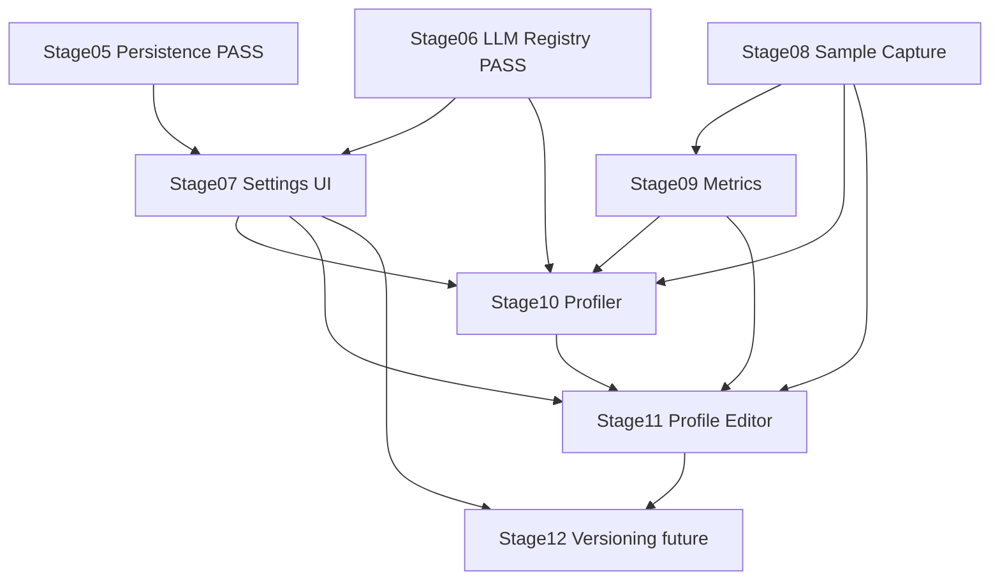

# Stages 07–11 Implementation Plan — Style Learning Thread

> Historical execution plan. The authoritative current status and sequencing are
> in [`ROADMAP.md`](../ROADMAP.md). This file records the original plan only.

Source of truth: [`ROADMAP.md`](ROADMAP.md:21), [`docs/stages/07-settings-ui.md`](docs/stages/07-settings-ui.md:1), [`docs/stages/08-style-sample.md`](docs/stages/08-style-sample.md:1), [`docs/stages/09-deterministic-metrics.md`](docs/stages/09-deterministic-metrics.md:1), [`docs/stages/10-style-profiler.md`](docs/stages/10-style-profiler.md:1), [`docs/stages/11-editable-profile-ui.md`](docs/stages/11-editable-profile-ui.md:1), [`docs/architecture.md`](docs/architecture.md:1), [`docs/project-state.md`](docs/project-state.md:1), [`docs/decision-log.md`](docs/decision-log.md:1), plus zoo skills in [`.roo/skills`](.roo/skills/toneforge-scaffold/SKILL.md:1) and zoo rules in [`.roo/rules`](.roo/rules/zoo-rules-build-manifest.md:1).

## 0. UI location decision — which is better

**Recommendation: use [`src/taskpane/`](src/taskpane/App.tsx:1) canonical, treat `src/ui/` in stage files as stale.**

Rationale:

- Scaffold skill placement guide in [`SKILL.md`](.roo/skills/toneforge-scaffold/SKILL.md:32) verifies current `src/` tree and states UI lives in [`src/taskpane/`](src/taskpane/App.tsx:1), not `src/ui/`, with explicit do-not-create `src/ui/`.
- Existing implementation already has [`src/taskpane/App.tsx`](src/taskpane/App.tsx:1), [`src/taskpane/pages/Dashboard.tsx`](src/taskpane/pages/Dashboard.tsx:1), [`src/taskpane/theme.tsx`](src/taskpane/theme.tsx:1), [`src/taskpane/fluentTheme.ts`](src/taskpane/fluentTheme.ts:1).
- Architecture boundary in [`docs/architecture.md`](docs/architecture.md:39) allows [`ui/*`](src/taskpane/App.tsx:1) to import [`core/*`](src/core/domain/StyleProfile.ts:1), [`shared/*`](src/shared/utils/text.ts:1), [`ai/providers`](src/ai/providers/registry.ts:1), [`word/documentReader`](src/word/documentReader.ts:1) but forbids direct [`word/revisionAdapter`](src/word/revisionAdapter.ts:1). Creating a second `src/ui/` root would split that boundary and break lint scopes.
- ESLint `no-restricted-imports` per [ADR-0013](docs/decision-log.md:92) scopes `taskpane/` and `commands/` — a new `src/ui/` would need new lint scopes for zero benefit.
- Corrective action in plan: implement Stage 07 as [`src/taskpane/pages/Settings.tsx`](src/taskpane/pages/Dashboard.tsx:1) and [`src/taskpane/components/SettingsForm.tsx`](src/taskpane/App.tsx:1), Stage 11 as [`src/taskpane/pages/Profile.tsx`](src/taskpane/pages/Dashboard.tsx:1) plus [`src/taskpane/components/ProfileEditor.tsx`](src/taskpane/App.tsx:1) and [`src/taskpane/components/VersionDiff.tsx`](src/taskpane/App.tsx:1). File a docs fix to update stages 07/11/12 to say `src/taskpane/` instead of `src/ui/`.

No shim with both roots. Single canonical root avoids import divergence and test-mirror confusion.

## 1. Per-stage synthesis

### Stage 07 — Settings UI — `feat(settings): add provider configuration`

- Objective: provider configuration UI in taskpane per [`docs/stages/07-settings-ui.md`](docs/stages/07-settings-ui.md:5).
- Prerequisites: Stage 05 PASS [`persistence.ts`](src/core/state/persistence.ts:1) with [`loadState()`](src/core/state/persistence.ts:104) and [`saveState()`](src/core/state/persistence.ts:134); Stage 06 PASS [`LlmProvider.ts`](src/ai/providers/LlmProvider.ts:1), [`registry.ts`](src/ai/providers/registry.ts:1), [`env.ts`](src/core/config/env.ts:1); [`Dashboard.tsx`](src/taskpane/pages/Dashboard.tsx:1) shell exists.
- Required inputs: [`StateSchema`](src/core/state/persistence.ts:16) settings shape with [`openAiApiKey`](src/core/state/persistence.ts:22), [`openAiBaseUrl`](src/core/state/persistence.ts:23), [`openAiModel`](src/core/state/persistence.ts:24), [`telemetryDisabled`](src/core/state/persistence.ts:25); [`EnvSchema`](src/core/config/env.ts:13); [`privacy-security.md`](docs/privacy-security.md:1) key-handling rules.
- Key activities:
  - Add `Settings` page + form with password-type key field, base URL, model, telemetry toggle, explicit opt-in checkbox for semantic analysis.
  - Wire to [`loadState()`](src/core/state/persistence.ts:104) on mount and [`saveState()`](src/core/state/persistence.ts:134) on submit with `saveAsync` persistence.
  - Redact on display via [`redact()`](src/core/config/env.ts:43) and [`logger.ts`](src/shared/utils/logger.ts:1); never log raw key.
  - Add `jsx-a11y` compliant labels, error association, `aria-live` per [`docs/accessibility.md`](docs/accessibility.md:1).
- Essential skills/resources: [`toneforge-scaffold`](.roo/skills/toneforge-scaffold/SKILL.md:1) for placement and verify chain; [`toneforge-testing`](.roo/skills/toneforge-testing/SKILL.md:1) for component tests with Testing Library; zoo rules `typescript-contracts`, `persistence-state`, `llm-privacy`, `officejs-boundary`, `build-manifest`, `commit-docs`.
- Dependencies: blocks 10 semantic opt-in; feeds 11 persistence wiring.
- Risks: storing key in plaintext `localStorage` fallback; diverging `roamingSettings` vs `localStorage`; leaking key in logs; building `src/ui/` instead of `src/taskpane/`.
- Completion criteria: `npm run typecheck` + `npm run test` pass; key round-trips through [`persistence.ts`](src/core/state/persistence.ts:1); redaction verified in test; [`docs/project-state.md`](docs/project-state.md:15) set to PASS; conventional commit `feat(settings): add provider configuration`.

### Stage 08 — Style sample — `feat(style): add writing sample capture`

- Objective: writing sample capture from active document or clipboard per [`docs/stages/08-style-sample.md`](docs/stages/08-style-sample.md:5).
- Prerequisites: [`documentReader.ts`](src/word/documentReader.ts:1) with [`getDocumentSnapshot()`](src/word/documentReader.ts:39), [`getSelectionText()`](src/word/documentReader.ts:67), [`getParagraphRange()`](src/word/documentReader.ts:77), [`hashDocument()`](src/word/documentReader.ts:21); [`officeHelpers.ts`](src/shared/office/officeHelpers.ts:1) with [`runInWord()`](src/shared/office/officeHelpers.ts:1).
- Required inputs: [`DocumentSnapshot`](src/word/documentReader.ts:10) DTO; [`sampleDocs.ts`](tests/fixtures/sampleDocs.ts:1) fixtures; [`setup.ts`](tests/setup.ts:1) Office mock.
- Key activities:
  - Create [`src/style/sampleCapture.ts`](src/shared/utils/text.ts:1) accepting DTO or selection text, preferring selection when non-empty, falling back to snapshot, enforcing `maxChars` truncation.
  - Create [`src/style/sampleQuality.ts`](src/shared/utils/text.ts:1) validating word count, sentence count, empty/whitespace rejection, returning typed quality result with reasons.
  - Never import `Office` or `ai` in these modules — accept DTO params only.
  - Add clipboard-paste path as pure fallback for outside-Word use.
- Essential skills/resources: [`toneforge-officejs`](.roo/skills/toneforge-officejs/SKILL.md:1) for `runInWord` boundary; [`toneforge-scaffold`](.roo/skills/toneforge-scaffold/SKILL.md:1) for new `src/style/` module + lint scope; [`toneforge-testing`](.roo/skills/toneforge-testing/SKILL.md:1) for direct pure tests.
- Dependencies: requires 07 only for future opt-in flag; strictly requires `word/` reader; feeds 09 and 10.
- Risks: reading via direct `Office.run` instead of wrapper; putting Office imports in `style/` breaking deterministic purity; quality thresholds too strict or too lax; large-doc truncation loss.
- Completion criteria: typecheck + test pass; purity lint passes with no `ai`/`Office`/`ui` imports in `style/`; quality gate unit-covered; `project-state` updated; commit `feat(style): add writing sample capture`.

### Stage 09 — Deterministic metrics — `feat(style): add deterministic style metrics`

- Objective: deterministic style metrics from samples per [`docs/stages/09-deterministic-metrics.md`](docs/stages/09-deterministic-metrics.md:5).
- Prerequisites: Stage 08 sample DTOs; [`text.ts`](src/shared/utils/text.ts:1) with [`splitSentences()`](src/shared/utils/text.ts:16), [`splitParagraphs()`](src/shared/utils/text.ts:24), [`countWords()`](src/shared/utils/text.ts:32), [`mean()`](src/shared/utils/text.ts:51), [`stdDev()`](src/shared/utils/text.ts:57); [`MeasuredProfileSchema`](src/core/domain/StyleProfile.ts:67).
- Required inputs: [`StyleProfile.ts`](src/core/domain/StyleProfile.ts:1) measured fields [`avgSentenceLength`](src/core/domain/StyleProfile.ts:68), [`sentenceLengthStdDev`](src/core/domain/StyleProfile.ts:69), [`emDashFrequency`](src/core/domain/StyleProfile.ts:70), [`curlyQuoteFrequency`](src/core/domain/StyleProfile.ts:72), [`paragraphLengthAvg`](src/core/domain/StyleProfile.ts:73), [`sampleWordCount`](src/core/domain/StyleProfile.ts:75).
- Key activities:
  - Create [`src/style/metrics.ts`](src/shared/utils/text.ts:1) pure functions computing sentence length mean/stddev, dash/quote frequencies, paragraph metrics, capitalization consistency.
  - Reuse [`text.ts`](src/shared/utils/text.ts:1) helpers, do not duplicate.
  - Extend ESLint `no-restricted-imports` to cover new `style/` scope if not yet present.
  - Add `tests/unit/style/metrics.test.ts` mirroring source, covering empty, single-sentence, unicode dashes/quotes, and large inputs.
- Essential skills/resources: [`toneforge-testing`](.roo/skills/toneforge-testing/SKILL.md:1) for 80 percent coverage gate; scaffold skill for boundary declaration; zoo rules `deterministic-purity`, `typescript-contracts`, `test-coverage`.
- Dependencies: hard depends on 08; feeds 10 measured half and 11 editor display.
- Risks: importing `ai`/`Office` breaking purity; duplicating text helpers; missing `noUncheckedIndexedAccess` guards; coverage below threshold blocking gate.
- Completion criteria: typecheck + test pass; coverage threshold met for `style/`; purity lint clean; `project-state` updated; commit `feat(style): add deterministic style metrics`.

### Stage 10 — Style profiler — `feat(style): add semantic style profiling`

- Objective: semantic profiling via LLM per [`docs/stages/10-style-profiler.md`](docs/stages/10-style-profiler.md:5).
- Prerequisites: Stage 06 [`registry.ts`](src/ai/providers/registry.ts:1) + [`mockAdapter.ts`](src/ai/providers/mockAdapter.ts:1) + [`retry.ts`](src/ai/providers/retry.ts:1); [`profilePrompts.ts`](src/ai/prompts/profilePrompts.ts:1) with [`buildProfilePrompt()`](src/ai/prompts/profilePrompts.ts:43) and [`ProfileResponseSchema`](src/ai/prompts/profilePrompts.ts:19); Stage 08 sample + Stage 09 measured baseline; Stage 07 opt-in flag.
- Required inputs: [`LlmRegistry`](src/ai/providers/registry.ts:1) with `completeWithFallback`; [`SemanticProfileSchema`](src/core/domain/StyleProfile.ts:54); [`StyleProfileSchema`](src/core/domain/StyleProfile.ts:80).
- Key activities:
  - Create [`src/style/profiler.ts`](src/shared/utils/text.ts:1) calling registry to produce `StyleProfile` from sample, merging measured metrics + semantic response.
  - Enforce `includeRawText: true` only when user opted in, else throw per [`profilePrompts.ts`](src/ai/prompts/profilePrompts.ts:48).
  - Validate with [`ProfileResponseSchema`](src/ai/prompts/profilePrompts.ts:19), strip unknown fields, surface typed errors.
  - Honor `AbortSignal`, delegate retries to [`withRetry()`](src/ai/providers/retry.ts:1), distinguish caller-abort non-retryable vs timeout retryable.
  - Tests use `MockAdapter` with `{ provider: "mock" }`, never live network; mock `fetch` stays offline per [`setup.ts`](tests/setup.ts:1).
- Essential skills/resources: [`toneforge-llm`](.roo/skills/toneforge-llm/SKILL.md:1) primary; testing skill for mock patterns; zoo rules `llm-privacy`, `deterministic-purity` inverse, `officejs-boundary`.
- Dependencies: hard depends on 07 opt-in, 08 sample, 09 measured, 06 registry; feeds 11 editor and 12 versioning.
- Risks: sending raw text without opt-in; trusting raw model JSON; ignoring abort; hitting live network in tests; placing profiler in pure `style/metrics` violating boundary — keep profiler separate from pure metrics.
- Completion criteria: typecheck + test pass; mock-only tests green; privacy gate verified; `project-state` updated; commit `feat(style): add semantic style profiling`.

### Stage 11 — Editable Style Profile UI — `feat(style): add editable Style Profile UI`

- Objective: editable profile UI in taskpane per [`docs/stages/11-editable-profile-ui.md`](docs/stages/11-editable-profile-ui.md:5).
- Prerequisites: [`StyleProfileSchema`](src/core/domain/StyleProfile.ts:80) with [`measured`](src/core/domain/StyleProfile.ts:84), [`semantic`](src/core/domain/StyleProfile.ts:85), [`typography`](src/core/domain/StyleProfile.ts:86), [`houseStyle`](src/core/domain/StyleProfile.ts:87); [`persistence.ts`](src/core/state/persistence.ts:1); Stages 07–10 outputs.
- Required inputs: [`createEmptyProfile()`](src/core/domain/StyleProfile.ts:96); [`Dashboard.tsx`](src/taskpane/pages/Dashboard.tsx:1) navigation; [`accessibility.md`](docs/accessibility.md:1) form rules; Fluent v8 theme in [`fluentTheme.ts`](src/taskpane/fluentTheme.ts:1).
- Key activities:
  - Build `ProfileEditor` with sections for measured read-only plus semantic/typography/house-style editable fields, Zod-validated on change.
  - Build `VersionDiff` read-only preview — full versioning logic deferred to Stage 12 per [`docs/stages/12-profile-versioning.md`](docs/stages/12-profile-versioning.md:1), do not build `versioning.ts` early.
  - Wire active profile load/save via [`loadState()`](src/core/state/persistence.ts:104) and [`saveState()`](src/core/state/persistence.ts:134).
  - Enforce `import type` for types, no `any`, `exactOptionalPropertyTypes` discipline, `jsx-a11y` clean.
- Essential skills/resources: scaffold skill for taskpane placement; testing skill for component + integration tests; zoo rules `typescript-contracts`, `persistence-state`, `officejs-boundary` — UI must not import [`revisionAdapter`](src/word/revisionAdapter.ts:1) directly.
- Dependencies: culmination of 07–10; must not anticipate Stage 12 diff engine beyond display.
- Risks: scope creep into versioning; direct Word mutation from UI; uncontrolled inputs breaking Zod parse; a11y violations blocking Stage 23 later.
- Completion criteria: typecheck + test pass; edit-save round-trip persists; validation errors surfaced with `role=alert`; `project-state` updated; commit `feat(style): add editable Style Profile UI`.

## 2. Optimal sequence and interstage dependencies

Strict numeric order 07 → 08 → 09 → 10 → 11 is optimal. No parallelization across stages because each gate is a prerequisite. Within a stage, implementation and tests can proceed together.

Notes:

- 07 first unlocks privacy opt-in needed by 10.
- 08 before 09 before 10 respects data flow Capture → Measured → Semantic per [`docs/architecture.md`](docs/architecture.md:52).
- 11 last because it consumes all prior outputs.
- Stage 12 must not start early; 11 shows diff UI only, 12 builds `versioning.ts` engine.

## 3. Step-by-step actions per stage

Each stage follows stage protocol in [`ROADMAP.md`](ROADMAP.md:55): read stage file, load only relevant skills, inspect before modifying, implement only scope, targeted tests, stage verification, update [`project-state.md`](docs/project-state.md:1), record ADR in [`decision-log.md`](docs/decision-log.md:1) if architectural, commit only after gate passes.

### Stage 07 steps

1. Inspect [`persistence.ts`](src/core/state/persistence.ts:1), [`env.ts`](src/core/config/env.ts:1), [`App.tsx`](src/taskpane/App.tsx:1).
2. Add `Settings` page and form under `src/taskpane/`, wire [`loadState()`](src/core/state/persistence.ts:104) and [`saveState()`](src/core/state/persistence.ts:134).
3. Add unit plus component tests for redaction, validation, persistence round-trip.
4. Run `npm run typecheck`, `npm run lint`, `npm run format`, `npm run test`, `npm run build`, `npm run validate`.
5. Update [`project-state.md`](docs/project-state.md:15), commit.

### Stage 08 steps

1. Inspect [`documentReader.ts`](src/word/documentReader.ts:1) and [`officeHelpers.ts`](src/shared/office/officeHelpers.ts:1).
2. Add `src/style/sampleCapture.ts` and `src/style/sampleQuality.ts` pure on DTOs.
3. Add `tests/unit/style/` mirroring source with empty, selection-preferred, truncation, clipboard cases.
4. Verify purity lint, run verify chain, update state, commit.

### Stage 09 steps

1. Inspect [`text.ts`](src/shared/utils/text.ts:1) and [`StyleProfile.ts`](src/core/domain/StyleProfile.ts:67).
2. Add `src/style/metrics.ts` reusing helpers, no new duplicates.
3. Add exhaustive unit tests, check `npm run test:coverage` for 80 percent on `style/`.
4. Run verify chain, update state, commit.

### Stage 10 steps

1. Inspect [`registry.ts`](src/ai/providers/registry.ts:1), [`profilePrompts.ts`](src/ai/prompts/profilePrompts.ts:1), [`mockAdapter.ts`](src/ai/providers/mockAdapter.ts:1).
2. Add `src/style/profiler.ts` with opt-in gate, Zod validation, abort and retry.
3. Add mock-only tests for success, validation failure, abort, fallback.
4. Run verify chain, update state, commit.

### Stage 11 steps

1. Inspect [`StyleProfile.ts`](src/core/domain/StyleProfile.ts:80), [`Dashboard.tsx`](src/taskpane/pages/Dashboard.tsx:1), [`accessibility.md`](docs/accessibility.md:1).
2. Add `ProfileEditor` and `VersionDiff` display components under `src/taskpane/`, wire persistence.
3. Add component plus integration tests for edit-validate-save round-trip.
4. Run verify chain including `jsx-a11y`, update state, commit.

## 4. Resource and capability requirements

- Codebase: TypeScript strict with [`tsconfig.json`](tsconfig.json:1) flags `strict`, `exactOptionalPropertyTypes`, `noUncheckedIndexedAccess`; React 18 + Fluent v8; Webpack 5; Vitest + jsdom + Testing Library.
- Skills: [`toneforge-scaffold`](.roo/skills/toneforge-scaffold/SKILL.md:1) every stage; [`toneforge-testing`](.roo/skills/toneforge-testing/SKILL.md:1) every stage; [`toneforge-officejs`](.roo/skills/toneforge-officejs/SKILL.md:1) for 08; [`toneforge-llm`](.roo/skills/toneforge-llm/SKILL.md:1) for 07 privacy and 10 profiler.
- Test doubles: [`setup.ts`](tests/setup.ts:1) Office mock, [`sampleDocs.ts`](tests/fixtures/sampleDocs.ts:1) fixtures, `MockAdapter` for LLM.
- Tooling: `npm run verify` chain in [`package.json`](package.json:13) plus `npm run stage:verify` via [`stage-verify.mjs`](scripts/stage-verify.mjs:1); manifest check via [`validate-manifest.mjs`](scripts/validate-manifest.mjs:1).
- Human: Word host for manual sanity of Settings persistence and sample capture; no live LLM key needed because tests stay offline.

## 5. Responsibilities

- Implementer: one owner per stage, follows scope only, no cross-stage anticipation.
- Reviewer: checks module boundaries per [`architecture.md`](docs/architecture.md:39), lint `no-restricted-imports`, deterministic purity, privacy opt-in.
- Docs owner: updates [`project-state.md`](docs/project-state.md:1) PASS or BLOCKED with notes, appends ADR to [`decision-log.md`](docs/decision-log.md:1) when boundary or schema changes.
- Release guard: blocks commit unless `npm run verify` six steps pass in order per [build-manifest rule](.roo/rules/zoo-rules-build-manifest.md:1).

## 6. Risk mitigations

| Risk                               | Mitigation                                                                                                                                        |
| ---------------------------------- | ------------------------------------------------------------------------------------------------------------------------------------------------- |
| `src/ui/` vs `src/taskpane/` drift | Enforce `src/taskpane/` canonical; fix stage docs; lint scope covers `taskpane/`                                                                  |
| Plaintext key in fallback storage  | Document as MVP limitation per [`privacy-security.md`](docs/privacy-security.md:19); defer encryption to Stage 25; redact logs                    |
| Raw text egress without consent    | Throw unless `includeRawText: true` per [`profilePrompts.ts`](src/ai/prompts/profilePrompts.ts:48); Settings opt-in required; test the throw path |
| Purity violation in `style/`       | Accept DTO params only; ESLint scope forbids `ai`, `Office`, `ui`; test directly without mocks                                                    |
| Trusting LLM JSON                  | Parse with [`ProfileResponseSchema`](src/ai/prompts/profilePrompts.ts:19); strip unknowns; typed errors                                           |
| Abort and retry confusion          | Use `AbortSignal.any`, caller-abort non-retryable, timeout retryable via [`retry.ts`](src/ai/providers/retry.ts:1)                                |
| Coverage gate miss on 09           | Reuse [`text.ts`](src/shared/utils/text.ts:1); mirror tests; run `test:coverage` early                                                            |
| Scope creep 11 into 12             | 11 builds editor + diff display only; `versioning.ts` stays in Stage 12                                                                           |
| UI mutates Word directly           | UI imports [`documentReader`](src/word/documentReader.ts:1) for reads only; never [`revisionAdapter`](src/word/revisionAdapter.ts:1)              |

## 7. Milestones and success criteria — sequence-gated, no time estimates

- M07 Settings persisted: key redacted in UI and logs, round-trips via `roamingSettings` with `localStorage` fallback, `verify` green.
- M08 Sample gated: selection-preferred capture, quality rejects empty/short, truncation bounded, purity lint clean.
- M09 Metrics proven: all measured fields populated from fixture, 80 percent coverage on `style/`, no duplicated helpers.
- M10 Profile semantic: mock-driven profile merges measured + semantic, opt-in enforced, abort honored, no live network.
- M11 Profile editable: edit-validate-save round-trip persists, Zod errors surfaced accessibly, no direct Word mutation.
- Thread success: 07→11 PASS in order, [`project-state.md`](docs/project-state.md:15) all PASS, ADRs recorded, each stage committed with roadmap-aligned scope per [commit-docs rule](.roo/rules/zoo-rules-commit-docs.md:1), ready for Stage 12 versioning.

## 8. Verification per stage

Run in order per [build-manifest rule](.roo/rules/zoo-rules-build-manifest.md:1): `npm run typecheck`, `npm run lint`, `npm run format`, `npm run test`, `npm run build`, `npm run validate`, then `npm run stage:verify`. Never commit on partial run. Update [`CHANGELOG.md`](docs/CHANGELOG.md:1) only if user-facing behavior changes.
