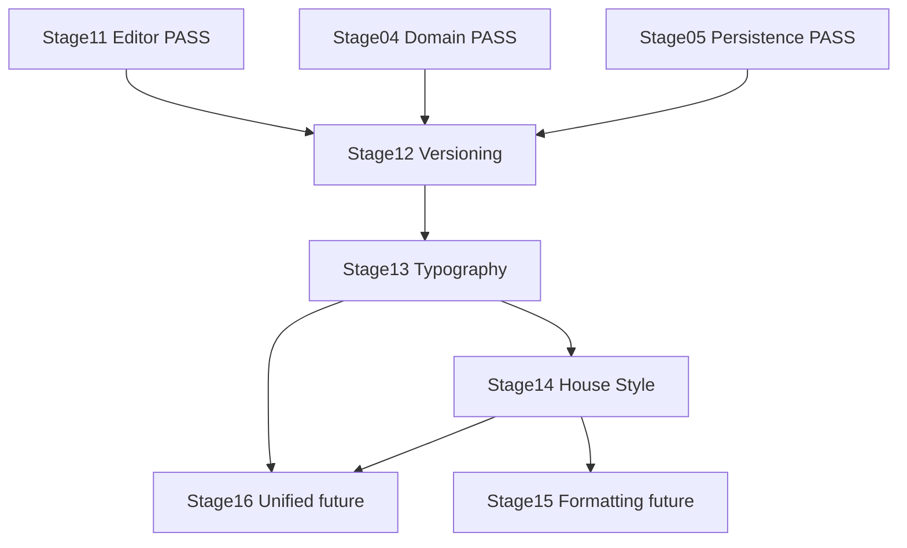

# Stages 12–14 Implementation Plan — Versioning plus Deterministic Rules Thread

Source of truth: [`ROADMAP.md`](ROADMAP.md:21), [`docs/stages/12-profile-versioning.md`](docs/stages/12-profile-versioning.md:1), [`docs/stages/13-typography-rules.md`](docs/stages/13-typography-rules.md:1), [`docs/stages/14-house-style-rules.md`](docs/stages/14-house-style-rules.md:1), [`docs/architecture.md`](docs/architecture.md:39), [`docs/project-state.md`](docs/project-state.md:20), [`docs/decision-log.md`](docs/decision-log.md:1), plus zoo skills in [`.roo/skills`](.roo/skills/toneforge-scaffold/SKILL.md:1) and zoo rules in [`.roo/rules`](.roo/rules/zoo-rules-build-manifest.md:1).

> Note on timelines: per delivery policy no time-based estimates are provided. Sequencing, entry gates, and measurable exit criteria below define progress from Stage 12 through Stage 14.

## 0. Key discovery — what already exists versus greenfield

- Stage 12 engine already implemented: [`src/style/versioning.ts`](src/style/versioning.ts:1) provides [`bumpProfileVersion()`](src/style/versioning.ts:33), [`diffProfiles()`](src/style/versioning.ts:127), [`formatChangelog()`](src/style/versioning.ts:149) with pure deterministic logic, plus [`tests/unit/style/versioning.test.ts`](tests/unit/style/versioning.test.ts:1) covering bumps, scalar changes, array and record changes, measured exclusion, and changelog formatting.
- Stage 12 UI partially wired: [`src/taskpane/components/ProfileEditor.tsx`](src/taskpane/components/ProfileEditor.tsx:20) already imports [`bumpProfileVersion()`](src/style/versioning.ts:33) and [`diffProfiles()`](src/style/versioning.ts:127). [`src/taskpane/components/VersionDiff.tsx`](src/taskpane/components/VersionDiff.tsx:1) still duplicates diff logic locally instead of consuming [`src/style/versioning.ts`](src/style/versioning.ts:1) — refactor required to close Stage 12 without duplication.
- Stage 12 persistence gap: [`src/core/state/persistence.ts`](src/core/state/persistence.ts:148) provides [`upsertProfile()`](src/core/state/persistence.ts:148) and [`setActiveProfile()`](src/core/state/persistence.ts:170) but stores only latest snapshot per id. No version-history list exists. Stage 12 must decide explicit history model versus snapshot-only plus changelog.
- Stages 13 and 14 greenfield: `src/rules/` does not exist yet. No [`src/rules/typography.ts`](src/rules/typography.ts:1) and no [`src/rules/houseStyle.ts`](src/rules/houseStyle.ts:1). Tests under `tests/unit/rules/` also absent. Both stages must establish the new module, lint scope, and test mirror from scratch.
- Domain ready: [`src/core/domain/StyleProfile.ts`](src/core/domain/StyleProfile.ts:22) already defines [`TypographyRulesSchema`](src/core/domain/StyleProfile.ts:22) and [`HouseStyleSchema`](src/core/domain/StyleProfile.ts:40). [`src/core/domain/Finding.ts`](src/core/domain/Finding.ts:27) already defines [`FindingSchema`](src/core/domain/Finding.ts:27) with [`FindingKindSchema`](src/core/domain/Finding.ts:8) and [`RangeSchema`](src/core/domain/Finding.ts:14) for future unified findings.
- Shared helpers ready: [`src/shared/utils/text.ts`](src/shared/utils/text.ts:1) provides [`splitSentences()`](src/shared/utils/text.ts:16), [`splitParagraphs()`](src/shared/utils/text.ts:24), [`countWords()`](src/shared/utils/text.ts:32), [`countSubstring()`](src/shared/utils/text.ts:39), [`mean()`](src/shared/utils/text.ts:51), [`stdDev()`](src/shared/utils/text.ts:57), plus dash and quote constants. Pattern reference: [`src/style/metrics.ts`](src/style/metrics.ts:75) shows pure reuse via [`computeMeasuredProfile()`](src/style/metrics.ts:75).

## 1. Per-stage synthesis

### Stage 12 — Profile versioning — [`feat(style): add profile versioning and diffs`](ROADMAP.md:37)

- Objective: close versioning per [`docs/stages/12-profile-versioning.md`](docs/stages/12-profile-versioning.md:5) — version bump helpers, profile diff plus changelog, taskpane integration.
- Prerequisites: Stage 04 PASS [`src/core/domain/StyleProfile.ts`](src/core/domain/StyleProfile.ts:80) with [`StyleProfileSchema`](src/core/domain/StyleProfile.ts:80) and [`ProfileVersionSchema`](src/core/domain/StyleProfile.ts:14); Stage 05 PASS [`src/core/state/persistence.ts`](src/core/state/persistence.ts:100) with [`loadState()`](src/core/state/persistence.ts:100) and [`saveState()`](src/core/state/persistence.ts:130); Stage 11 PASS [`src/taskpane/components/ProfileEditor.tsx`](src/taskpane/components/ProfileEditor.tsx:1) and [`src/taskpane/components/VersionDiff.tsx`](src/taskpane/components/VersionDiff.tsx:1).
- Required inputs: existing [`src/style/versioning.ts`](src/style/versioning.ts:1); [`src/core/state/persistence.ts`](src/core/state/persistence.ts:16) with [`StateSchema`](src/core/state/persistence.ts:16); [`tests/unit/style/versioning.test.ts`](tests/unit/style/versioning.test.ts:1); [`docs/architecture.md`](docs/architecture.md:39) boundary for `style/metrics`.
- Key activities:
  - Audit [`src/style/versioning.ts`](src/style/versioning.ts:95) field list against [`TypographyRulesSchema`](src/core/domain/StyleProfile.ts:22) and [`HouseStyleSchema`](src/core/domain/StyleProfile.ts:40) for completeness.
  - Refactor [`src/taskpane/components/VersionDiff.tsx`](src/taskpane/components/VersionDiff.tsx:96) to import [`diffProfiles()`](src/style/versioning.ts:127) and [`formatChangelog()`](src/style/versioning.ts:149) instead of local duplicates.
  - Decide and implement history model: either extend [`StateSchema`](src/core/state/persistence.ts:16) with version-history collection plus migration in [`src/core/state/migration.ts`](src/core/state/migration.ts:1), or document snapshot-only plus changelog as accepted limitation.
  - Wire explicit bump control in [`src/taskpane/components/ProfileEditor.tsx`](src/taskpane/components/ProfileEditor.tsx:1) using [`bumpProfileVersion()`](src/style/versioning.ts:33) with major, minor, patch selection and [`updatedAt`](src/core/domain/StyleProfile.ts:89) refresh.
  - Harden tests for bump reset semantics, empty diff, record ordering, and history round-trip.
- Essential skills and resources: [`toneforge-scaffold`](.roo/skills/toneforge-scaffold/SKILL.md:1) for placement and verify chain; [`toneforge-testing`](.roo/skills/toneforge-testing/SKILL.md:1) for unit plus component tests; zoo rules `typescript-contracts`, `deterministic-purity`, `persistence-state`, `test-coverage`, `build-manifest`, `commit-docs`.
- Dependencies: closes style-learning thread from Stages 07–11; unblocks rule stages by freezing profile contract that rules will consume; feeds Stage 16 unified findings via stable diff shape.
- Risks: duplicating diff logic between UI and engine; storing history without migration breaking [`loadState()`](src/core/state/persistence.ts:100); bumping version on every keystroke versus explicit save; scope creep into rule engines.
- Completion criteria: [`npm run typecheck`](package.json:13) plus [`npm run test`](package.json:13) pass; no duplicated diff helpers; history decision recorded; [`docs/project-state.md`](docs/project-state.md:20) set to PASS; commit `feat(style): add profile versioning and diffs`.

### Stage 13 — Typography rules — [`feat(rules): add typography and punctuation engine`](ROADMAP.md:38)

- Objective: deterministic typography engine per [`docs/stages/13-typography-rules.md`](docs/stages/13-typography-rules.md:5) — em dash, en dash, quotes, apostrophes, whitespace, ellipsis.
- Prerequisites: Stage 12 PASS freezing [`TypographyRulesSchema`](src/core/domain/StyleProfile.ts:22); [`src/shared/utils/text.ts`](src/shared/utils/text.ts:1) helpers; [`src/core/domain/Finding.ts`](src/core/domain/Finding.ts:27) for finding shape if rules emit findings now versus plain violations deferred to Stage 16.
- Required inputs: [`TypographyRulesSchema`](src/core/domain/StyleProfile.ts:22) fields [`emDash`](src/core/domain/StyleProfile.ts:27), [`emDashSpacing`](src/core/domain/StyleProfile.ts:28), [`doubleQuotes`](src/core/domain/StyleProfile.ts:30), [`ellipsis`](src/core/domain/StyleProfile.ts:35); [`src/shared/utils/text.ts`](src/shared/utils/text.ts:6) constants; [`tests/fixtures/sampleDocs.ts`](tests/fixtures/sampleDocs.ts:1) fixtures.
- Key activities:
  - Create `src/rules/` module with [`src/rules/typography.ts`](src/rules/typography.ts:1) as pure functions accepting text plus [`TypographyRules`](src/core/domain/StyleProfile.ts:38) and returning typed violations or [`Finding`](src/core/domain/Finding.ts:39) list with character offsets.
  - Reuse [`countSubstring()`](src/shared/utils/text.ts:39), [`splitSentences()`](src/shared/utils/text.ts:16), and dash quote constants; do not duplicate.
  - Add `tests/unit/rules/typography.test.ts` mirroring source covering straight versus curly quotes, double-hyphen versus em dash, spaced versus tight, ellipsis variants, whitespace edge cases, empty input, unicode.
  - Extend [`eslint.config.mjs`](eslint.config.mjs:1) with `src/rules/` scope forbidding `ai`, `Office`, `taskpane` imports per [`docs/architecture.md`](docs/architecture.md:39).
  - Update [`docs/architecture.md`](docs/architecture.md:39) if new boundary declared and record ADR if finding contract chosen early.
- Essential skills and resources: [`toneforge-scaffold`](.roo/skills/toneforge-scaffold/SKILL.md:1) for new module plus lint scope; [`toneforge-testing`](.roo/skills/toneforge-testing/SKILL.md:1) for 80 percent coverage gate; zoo rules `deterministic-purity`, `typescript-contracts`, `test-coverage`, `build-manifest`.
- Dependencies: hard depends on Stage 12 profile freeze; establishes `src/rules/` pattern reused by Stage 14; feeds Stage 15 formatting and Stage 16 unified findings.
- Risks: choosing finding shape too early before Stage 16; importing [`Office`](src/types/office.d.ts:1) or `ai` breaking purity; regex missing unicode edge cases; coverage below threshold blocking gate; `for` loops violating `no-restricted-syntax`.
- Completion criteria: typecheck plus test pass; coverage threshold met for `rules/`; purity lint clean with no `ai` or `Office` imports; [`docs/project-state.md`](docs/project-state.md:21) set to PASS; commit `feat(rules): add typography and punctuation engine`.

### Stage 14 — House style rules — [`feat(rules): add spelling terminology and house style`](ROADMAP.md:39)

- Objective: house-style engine per [`docs/stages/14-house-style-rules.md`](docs/stages/14-house-style-rules.md:5) — preferred terminology, banned terms, capitalization, spelling variants.
- Prerequisites: Stage 13 PASS establishing `src/rules/` conventions, lint scope, and finding return type; Stage 12 PASS freezing [`HouseStyleSchema`](src/core/domain/StyleProfile.ts:40).
- Required inputs: [`HouseStyleSchema`](src/core/domain/StyleProfile.ts:40) fields [`preferredTerminology`](src/core/domain/StyleProfile.ts:41), [`bannedTerms`](src/core/domain/StyleProfile.ts:42), [`capitalization`](src/core/domain/StyleProfile.ts:43), [`spellingVariant`](src/core/domain/StyleProfile.ts:49); Stage 13 module as pattern reference; [`tests/fixtures/sampleDocs.ts`](tests/fixtures/sampleDocs.ts:1).
- Key activities:
  - Create [`src/rules/houseStyle.ts`](src/rules/houseStyle.ts:1) as pure functions accepting text plus [`HouseStyle`](src/core/domain/StyleProfile.ts:52) and returning same violation or [`Finding`](src/core/domain/Finding.ts:39) shape as Stage 13 for consistency.
  - Implement case-insensitive terminology mapping, banned-term detection with word boundaries, sentence-case versus title-case checks, en-US versus en-GB versus au variant lists kept as data tables not hardcoded branches.
  - Add `tests/unit/rules/houseStyle.test.ts` covering overlapping terms, case folding, empty terminology, variant word lists, and large inputs.
  - Reuse [`src/shared/utils/text.ts`](src/shared/utils/text.ts:1) helpers; keep variant dictionaries small and reviewable; document limitation that full spellcheck is deferred.
  - Update [`docs/project-state.md`](docs/project-state.md:22) and [`docs/decision-log.md`](docs/decision-log.md:1) if terminology matching strategy is architectural.
- Essential skills and resources: [`toneforge-scaffold`](.roo/skills/toneforge-scaffold/SKILL.md:1); [`toneforge-testing`](.roo/skills/toneforge-testing/SKILL.md:1); zoo rules `deterministic-purity`, `typescript-contracts`, `test-coverage`, `build-manifest`, `commit-docs`.
- Dependencies: strictly follows Stage 13 to reuse return type and lint scope; together Stages 13 plus 14 unblock Stage 16 unified findings and Stage 20 checker; no dependency on Stage 15 formatting engine which proceeds in parallel thread after.
- Risks: inconsistent return type with Stage 13 forcing Stage 16 rework; overbuilding spellcheck dictionary; case-sensitive misses; performance on large documents deferred to Stage 24 but avoid pathological regex.
- Completion criteria: typecheck plus test pass; coverage threshold met for `rules/`; consistent contract with Stage 13 verified by shared type import; [`docs/project-state.md`](docs/project-state.md:22) set to PASS; commit `feat(rules): add spelling terminology and house style`.

## 2. Optimal sequence and interstage dependencies

Strict numeric order 12 then 13 then 14 is optimal. No parallelization across stages because each gate is a prerequisite. Within a stage, implementation and tests proceed together.

Notes:

- 12 first because it freezes the profile contract and closes the style-learning thread before rule engines consume it.
- 13 before 14 because 13 creates `src/rules/`, lint scope, test mirror, and finding return type that 14 must reuse without rework.
- 14 last in this thread because terminology and spelling tables benefit from stable violation shape proven in 13.
- Stages 15 and 16 must not start early; 13 plus 14 define deterministic finding producers that 16 will merge.

## 3. Step-by-step actions per stage

Each stage follows stage protocol in [`ROADMAP.md`](ROADMAP.md:55): read stage file, load only relevant skills, inspect before modifying, implement only scope, targeted tests, stage verification, update [`docs/project-state.md`](docs/project-state.md:1), record ADR in [`docs/decision-log.md`](docs/decision-log.md:1) if architectural, commit only after gate passes.

### Stage 12 steps

1. Inspect [`src/style/versioning.ts`](src/style/versioning.ts:1), [`src/taskpane/components/VersionDiff.tsx`](src/taskpane/components/VersionDiff.tsx:1), [`src/taskpane/components/ProfileEditor.tsx`](src/taskpane/components/ProfileEditor.tsx:1), [`src/core/state/persistence.ts`](src/core/state/persistence.ts:100).
2. Refactor [`src/taskpane/components/VersionDiff.tsx`](src/taskpane/components/VersionDiff.tsx:96) to consume [`diffProfiles()`](src/style/versioning.ts:127); delete local duplicates.
3. Implement or explicitly defer history persistence with migration in [`src/core/state/migration.ts`](src/core/state/migration.ts:1); preserve existing values over defaults.
4. Add unit plus component tests for bump, diff, changelog, history round-trip, corrupt-state fallback.
5. Run [`npm run verify`](package.json:13) chain plus [`scripts/stage-verify.mjs`](scripts/stage-verify.mjs:1); update [`docs/project-state.md`](docs/project-state.md:20); commit.

### Stage 13 steps

1. Inspect [`src/core/domain/StyleProfile.ts`](src/core/domain/StyleProfile.ts:22), [`src/shared/utils/text.ts`](src/shared/utils/text.ts:1), [`src/style/metrics.ts`](src/style/metrics.ts:75), [`src/core/domain/Finding.ts`](src/core/domain/Finding.ts:27).
2. Scaffold `src/rules/` with [`src/rules/typography.ts`](src/rules/typography.ts:1) pure on text plus profile DTO; add lint scope in [`eslint.config.mjs`](eslint.config.mjs:1).
3. Add `tests/unit/rules/typography.test.ts` mirroring source with unicode, empty, and boundary cases.
4. Verify purity, check coverage for `rules/`, run verify chain, update state, commit.

### Stage 14 steps

1. Inspect Stage 13 output plus [`src/core/domain/StyleProfile.ts`](src/core/domain/StyleProfile.ts:40) house-style fields.
2. Add [`src/rules/houseStyle.ts`](src/rules/houseStyle.ts:1) reusing Stage 13 return type; keep variant tables as data.
3. Add `tests/unit/rules/houseStyle.test.ts` mirroring source with terminology, banned terms, capitalization, variant cases.
4. Run verify chain, confirm contract consistency with Stage 13, update state, commit.

## 4. Resource and capability requirements

- Codebase: TypeScript strict with [`tsconfig.json`](tsconfig.json:1) flags `strict`, `exactOptionalPropertyTypes`, `noUncheckedIndexedAccess`; React 18 plus Fluent v8; Webpack 5; Vitest plus jsdom plus Testing Library.
- Skills: [`toneforge-scaffold`](.roo/skills/toneforge-scaffold/SKILL.md:1) every stage; [`toneforge-testing`](.roo/skills/toneforge-testing/SKILL.md:1) every stage; no [`toneforge-llm`](.roo/skills/toneforge-llm/SKILL.md:1) and no [`toneforge-officejs`](.roo/skills/toneforge-officejs/SKILL.md:1) needed because all three stages are deterministic and Office-free by design.
- Test doubles: [`tests/setup.ts`](tests/setup.ts:1) Office mock not needed for pure tests; [`tests/fixtures/sampleDocs.ts`](tests/fixtures/sampleDocs.ts:1) fixtures for rule inputs; no `MockAdapter` needed.
- Tooling: [`npm run verify`](package.json:13) chain in [`package.json`](package.json:13) plus [`npm run stage:verify`](scripts/stage-verify.mjs:1); manifest check via [`scripts/validate-manifest.mjs`](scripts/validate-manifest.mjs:1).
- Human: Word host for sanity of version-history persistence display; no live LLM key needed.

## 5. Responsibilities

- Implementer: one owner per stage, follows scope only, no cross-stage anticipation beyond declared contract.
- Reviewer: checks module boundaries per [`docs/architecture.md`](docs/architecture.md:39), lint `no-restricted-imports`, deterministic purity, Zod validation, `import type` discipline.
- Docs owner: updates [`docs/project-state.md`](docs/project-state.md:1) PASS or BLOCKED with notes, appends ADR to [`docs/decision-log.md`](docs/decision-log.md:1) when boundary or schema or finding contract changes.
- Release guard: blocks commit unless [`npm run verify`](package.json:13) six steps pass in order per [build-manifest rule](.roo/rules/zoo-rules-build-manifest.md:1).

## 6. Risk mitigations

| Risk                                     | Mitigation                                                                                                                                                                                                                            |
| ---------------------------------------- | ------------------------------------------------------------------------------------------------------------------------------------------------------------------------------------------------------------------------------------- |
| VersionDiff duplication drift            | Delete local helpers in [`src/taskpane/components/VersionDiff.tsx`](src/taskpane/components/VersionDiff.tsx:40); import from [`src/style/versioning.ts`](src/style/versioning.ts:1); add test asserting parity                        |
| History migration breaks load            | Run [`migrate()`](src/core/state/migration.ts:1) before [`StateSchema`](src/core/state/persistence.ts:16) parse; test v1 plus history upgrade; [`loadState()`](src/core/state/persistence.ts:100) falls back to defaults with warning |
| Purity violation in rules                | Accept DTO params only; ESLint scope forbids `ai`, `Office`, `taskpane`; test directly without mocks                                                                                                                                  |
| Finding contract divergence 13 versus 14 | Freeze return type in Stage 13; Stage 14 reuses same type via shared import; Stage 16 ADR records choice                                                                                                                              |
| Trusting profile input                   | Parse with [`StyleProfileSchema`](src/core/domain/StyleProfile.ts:80); use `.default()` for safe fields; typed errors                                                                                                                 |
| Coverage gate miss on rules              | Mirror tests per source file; run coverage early; reuse [`src/shared/utils/text.ts`](src/shared/utils/text.ts:1) to avoid untested branches                                                                                           |
| Scope creep into formatting or findings  | Stages 13 and 14 produce violations only; unified merge stays in Stage 16; formatting stays in Stage 15                                                                                                                               |
| UI mutates Word directly                 | UI imports [`src/word/documentReader.ts`](src/word/documentReader.ts:1) for reads only; never [`src/word/revisionAdapter.ts`](src/word/revisionAdapter.ts:44)                                                                         |

## 7. Milestones and success criteria — sequence-gated, no time estimates

- M12 Versioning closed: bump plus diff plus changelog unified in engine, [`src/taskpane/components/VersionDiff.tsx`](src/taskpane/components/VersionDiff.tsx:96) consumes engine, history model decided and migrated, verify green.
- M13 Typography proven: all typography options enforced deterministically, 80 percent coverage on `src/rules/`, purity lint clean, no duplicated helpers.
- M14 House style proven: terminology plus banned terms plus capitalization plus variant checks share Stage 13 contract, coverage holds, no live network, no Office import.
- Thread success: 12 then 13 then 14 PASS in order, [`docs/project-state.md`](docs/project-state.md:20) all PASS, ADRs recorded, each stage committed with roadmap-aligned scope per [commit-docs rule](.roo/rules/zoo-rules-commit-docs.md:1), ready for Stage 15 formatting and Stage 16 unified findings.

## 8. Verification per stage

Run in order per [build-manifest rule](.roo/rules/zoo-rules-build-manifest.md:1): [`npm run typecheck`](package.json:13), [`npm run lint`](package.json:13), [`npm run format`](package.json:13), [`npm run test`](package.json:13), [`npm run build`](package.json:13), [`npm run validate`](package.json:13), then [`npm run stage:verify`](scripts/stage-verify.mjs:1). Never commit on partial run. Update [`docs/CHANGELOG.md`](docs/CHANGELOG.md:1) only if user-facing behavior changes.
