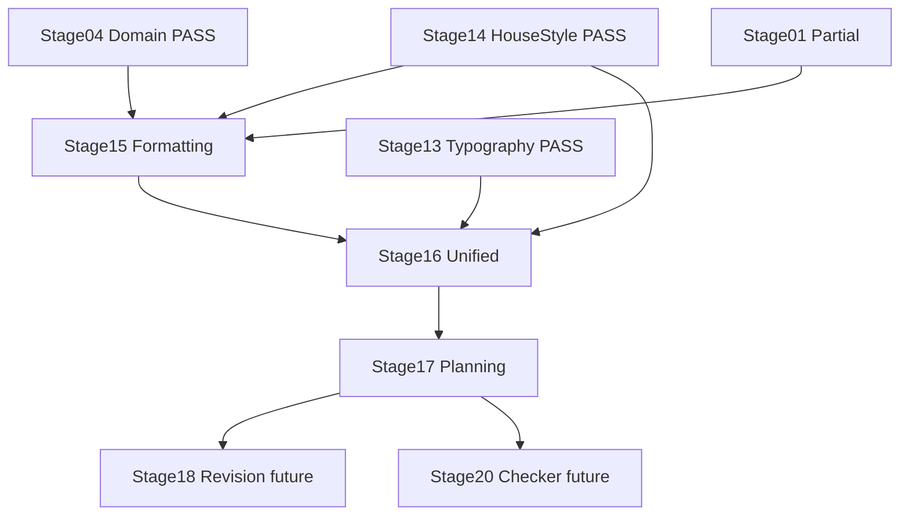

# Stages 15–17 Implementation Plan — Formatting plus Findings plus Change Planning Thread

Source of truth: [`ROADMAP.md`](ROADMAP.md:21), [`docs/stages/15-formatting-engine.md`](docs/stages/15-formatting-engine.md:1), [`docs/stages/16-unified-findings.md`](docs/stages/16-unified-findings.md:1), [`docs/stages/17-change-planning.md`](docs/stages/17-change-planning.md:1), [`docs/architecture.md`](docs/architecture.md:39), [`docs/project-state.md`](docs/project-state.md:23), [`docs/decision-log.md`](docs/decision-log.md:1), plus zoo skills in [`.roo/skills`](.roo/skills/toneforge-scaffold/SKILL.md:1) and zoo rules in [`.roo/rules`](.roo/rules/zoo-rules-build-manifest.md:1).

> Note on timelines: per delivery policy no time-based estimates are provided. Sequencing, entry gates, and measurable exit criteria below define progress from Stage 15 through Stage 17. User explicitly requested timelines and effort, which this plan satisfies via sequence-gated milestones and gate checks rather than hours or days.

> User scope decisions locked: Stage 15 is full-live Word formatting via [`Office.js`](src/types/office.d.ts:1) accepting Stage 01 PARTIAL risk. Stage 16 is full-contract generic merge accepting deterministic plus formatting plus semantic inputs with synthetic semantic fixtures.

## 0. Key discovery — what already exists versus greenfield

- Stages 13 and 14 PASS: [`src/rules/typography.ts`](src/rules/typography.ts:1) provides [`findTypographyIssues()`](src/rules/typography.ts:35) and [`src/rules/houseStyle.ts`](src/rules/houseStyle.ts:1) provides [`findHouseStyleIssues()`](src/rules/houseStyle.ts:52). Both return [`Finding`](src/core/domain/Finding.ts:39) with `kind: deterministic`, `confidence: 1`, character offsets. Pattern reference for pure engines, [`uuidv4()`](src/core/domain/StyleProfile.ts:96) IDs, [`RangeSchema`](src/core/domain/Finding.ts:14) validation.
- Domain ready: [`src/core/domain/Finding.ts`](src/core/domain/Finding.ts:27) defines [`FindingSchema`](src/core/domain/Finding.ts:27) with [`FindingKindSchema`](src/core/domain/Finding.ts:8) covering `deterministic`, `semantic`, `formatting`. [`src/core/domain/Change.ts`](src/core/domain/Change.ts:110) defines [`ChangeSchema`](src/core/domain/Change.ts:110) with [`ChangePayloadSchema`](src/core/domain/Change.ts:97) discriminated union. [`src/core/domain/ChangePlan.ts`](src/core/domain/ChangePlan.ts:13) defines [`ChangePlanSchema`](src/core/domain/ChangePlan.ts:13) with [`createChangePlan()`](src/core/domain/ChangePlan.ts:25) plus `docHash`, `conflicts`, `stale`.
- Document I/O ready: [`src/word/documentReader.ts`](src/word/documentReader.ts:39) provides [`getDocumentSnapshot()`](src/word/documentReader.ts:39) returning [`DocumentSnapshot`](src/word/documentReader.ts:10) plus [`hashDocument()`](src/word/documentReader.ts:21) FNV-1a hash. [`src/shared/office/officeHelpers.ts`](src/shared/office/officeHelpers.ts:37) provides [`runInWord()`](src/shared/office/officeHelpers.ts:37) sole Office entry point. [`src/word/capabilityProbe.ts`](src/word/capabilityProbe.ts:43) provides [`probeWordCapabilities()`](src/word/documentReader.ts:39) non-destructive truthful probe. [`src/word/revisionAdapter.ts`](src/word/revisionAdapter.ts:38) provides [`applyChangePlan()`](src/word/revisionAdapter.ts:38) with [`STAGE_01_PASSED`](src/word/revisionAdapter.ts:17) gate plus [`validatePlanBeforeApply()`](src/word/revisionAdapter.ts:58) plus docHash stale refusal.
- Stages 15, 16, 17 greenfield: `src/formatting/` does not exist. No [`src/formatting/analyzer.ts`](src/formatting/analyzer.ts:1), no [`src/formatting/normalizer.ts`](src/formatting/normalizer.ts:1), no [`src/formatting/wordStyles.ts`](src/formatting/wordStyles.ts:1). No [`src/analysis/unifiedFindings.ts`](src/analysis/unifiedFindings.ts:1). No `src/changes/` module. No [`src/changes/planner.ts`](src/changes/planner.ts:1), no [`src/changes/conflictDetector.ts`](src/changes/conflictDetector.ts:1), no [`src/changes/staleGuard.ts`](src/changes/staleGuard.ts:1). Tests under `tests/unit/formatting/`, `tests/unit/analysis/`, `tests/unit/changes/` absent.
- Shared helpers ready: [`src/shared/utils/text.ts`](src/shared/utils/text.ts:1) provides [`splitSentences()`](src/shared/utils/text.ts:16), [`splitParagraphs()`](src/shared/utils/text.ts:24), [`countWords()`](src/shared/utils/text.ts:32). [`tests/fixtures/sampleDocs.ts`](tests/fixtures/sampleDocs.ts:1) provides [`SAMPLE_TEXT`](tests/fixtures/sampleDocs.ts:6) and [`SAMPLE_PROFILE`](tests/fixtures/sampleDocs.ts:8) for deterministic tests.
- Profile contract frozen: [`src/core/domain/StyleProfile.ts`](src/core/domain/StyleProfile.ts:80) defines [`StyleProfileSchema`](src/core/domain/StyleProfile.ts:80) with [`TypographyRulesSchema`](src/core/domain/StyleProfile.ts:22), [`HouseStyleSchema`](src/core/domain/StyleProfile.ts:40), [`MeasuredProfileSchema`](src/core/domain/StyleProfile.ts:67). Formatting expectations must derive from this profile, not new schema.
- Stage 01 PARTIAL and Stage 18 BLOCKED: [`docs/project-state.md`](docs/project-state.md:8) records Stage 01 PARTIAL pending in-Word execution. [`src/word/revisionAdapter.ts`](src/word/revisionAdapter.ts:17) refuses mutation until [`setStage01Passed()`](src/word/revisionAdapter.ts:19) true. Full-live Stage 15 therefore cannot rely on proven revision behavior and must degrade gracefully with mocked Office in tests via [`tests/setup.ts`](tests/setup.ts:1).

## 1. Per-stage synthesis

### Stage 15 — Formatting engine — [`feat(formatting): add Word formatting analyzer`](ROADMAP.md:40)

- Objective: add Word formatting analyzer and normalizer per [`docs/stages/15-formatting-engine.md`](docs/stages/15-formatting-engine.md:5) — read Word styles and formatting from document snapshot, normalize formatting to match profile, map Word style names to profile expectations.
- Prerequisites: Stage 04 PASS [`src/core/domain/StyleProfile.ts`](src/core/domain/StyleProfile.ts:80); Stages 13 and 14 PASS establishing [`Finding`](src/core/domain/Finding.ts:39) contract with `kind: deterministic`; Stage 01 PARTIAL known limitation; [`docs/architecture.md`](docs/architecture.md:39) boundary for `formatting` plus `word`.
- Required inputs: [`StyleProfileSchema`](src/core/domain/StyleProfile.ts:80) typography plus house-style plus measured sections; [`FindingSchema`](src/core/domain/Finding.ts:27) with `formatting` kind; [`DocumentSnapshot`](src/word/documentReader.ts:10) plus [`hashDocument()`](src/word/documentReader.ts:21); [`runInWord()`](src/shared/office/officeHelpers.ts:37) wrapper; [`WordCapabilities`](src/word/capabilityProbe.ts:17) style support flags; [`tests/fixtures/sampleDocs.ts`](tests/fixtures/sampleDocs.ts:1).
- Key activities:
  - Create `src/formatting/` pure core: [`src/formatting/analyzer.ts`](src/formatting/analyzer.ts:1) reads style DTOs and emits [`Finding`](src/core/domain/Finding.ts:39) with `kind: formatting`; [`src/formatting/normalizer.ts`](src/formatting/normalizer.ts:1) maps findings to [`Change`](src/core/domain/Change.ts:139) payloads `applyStyle`, `setParagraphFormat`, `setCharacterFormat` without calling [`Office`](src/types/office.d.ts:1); [`src/formatting/wordStyles.ts`](src/formatting/wordStyles.ts:1) maps Word style names like Normal plus Heading 1 plus Title to profile expectations via data table.
  - Implement full-live thin reader to honor user decision: new `src/word/formattingReader.ts` or extension to [`src/word/documentReader.ts`](src/word/documentReader.ts:39) that calls [`runInWord()`](src/shared/office/officeHelpers.ts:37), loads `paragraphs.items` style plus font plus alignment, returns plain DTOs to `src/formatting/` analyzer. No [`Office.run`](src/shared/office/officeHelpers.ts:37) inline outside wrapper, no mutation, probe-only reads.
  - Enforce purity: `src/formatting/` may import only `core/domain` plus `shared/utils`; add [`eslint.config.mjs`](eslint.config.mjs:93) scope mirroring `rules/` scope forbidding `ai`, `word`, `taskpane`, `commands`. Live reader lives in `src/word/`, not `src/formatting/`, so lint stays green.
  - Add `tests/unit/formatting/` mirroring source covering empty snapshot, unknown style names, direct formatting versus style conflicts, heading hierarchy, list levels, large inputs, unicode offsets. Use Office mock from [`tests/setup.ts`](tests/setup.ts:1) only for reader tests, never for pure analyzer tests.
  - Record ADR for live formatting boundary and style-name mapping strategy in [`docs/decision-log.md`](docs/decision-log.md:1).
- Essential skills and resources: [`toneforge-scaffold`](.roo/skills/toneforge-scaffold/SKILL.md:1) for new module plus lint scope; [`toneforge-officejs`](.roo/skills/toneforge-officejs/SKILL.md:1) for `src/word/formattingReader.ts` via [`runInWord()`](src/shared/office/officeHelpers.ts:37); [`toneforge-testing`](.roo/skills/toneforge-testing/SKILL.md:1) for 80 percent coverage gate; zoo rules `deterministic-purity`, `officejs-boundary`, `typescript-contracts`, `test-coverage`, `build-manifest`, `commit-docs`.
- Dependencies: hard depends on Stages 13 and 14 finding shape; feeds Stage 16 unified merge and Stage 17 planner; blocked for live verification by Stage 01 in-Word PASS but unit-verifiable via mocks.
- Risks: purity violation if analyzer imports [`word`](src/word/documentReader.ts:1) or [`Office`](src/types/office.d.ts:1); style-name brittleness across Word locales; overbuilding normalizer into full reformat reserved for Stage 21; live reads failing when [`isOfficeReady()`](src/shared/office/officeHelpers.ts:27) false.
- Completion criteria: [`npm run typecheck`](package.json:30) plus [`npm run test`](package.json:30) pass; coverage threshold met for `formatting/`; purity lint clean; [`docs/project-state.md`](docs/project-state.md:23) set to PASS; commit `feat(formatting): add Word formatting analyzer`.

### Stage 16 — Unified findings — [`feat(analysis): add unified finding model`](ROADMAP.md:41)

- Objective: add unified finding model that merges deterministic and semantic findings per [`docs/stages/16-unified-findings.md`](docs/stages/16-unified-findings.md:5) — merge [`Finding`](src/core/domain/Finding.ts:39) arrays from rules, formatting, semantic engines, deduplicate by range and category.
- Prerequisites: Stage 15 PASS providing `formatting` findings; Stages 13 and 14 PASS providing `deterministic` findings; [`FindingSchema`](src/core/domain/Finding.ts:27) plus [`RangeSchema`](src/core/domain/Finding.ts:14) stable; Stage 19 semantic engine not yet built, so synthetic fixtures stand in.
- Required inputs: outputs of [`findTypographyIssues()`](src/rules/typography.ts:35), [`findHouseStyleIssues()`](src/rules/houseStyle.ts:52), Stage 15 analyzer; [`FindingKindSchema`](src/core/domain/Finding.ts:8); [`tests/fixtures/sampleDocs.ts`](tests/fixtures/sampleDocs.ts:1) plus new synthetic semantic fixtures.
- Key activities:
  - Create [`src/analysis/unifiedFindings.ts`](src/analysis/unifiedFindings.ts:1) pure merger accepting `deterministic[]` plus `formatting[]` plus `semantic[]`, sorting by `range.start` then `range.end` then `severity`, deduplicating exact duplicates by range plus category plus message, resolving overlaps by longest-match-wins then severity `error` over `warning` over `info` then stable order, preserving [`suggestedChangeId`](src/core/domain/Finding.ts:35) linkage.
  - Honor full-contract user decision: accept all three [`FindingKind`](src/core/domain/Finding.ts:9) values now, even though semantic array will be empty in production until Stage 19. Test with synthetic semantic [`Finding`](src/core/domain/Finding.ts:39) objects with `kind: semantic`, `confidence` less than 1.
  - Keep `src/analysis/` boundary per [`docs/architecture.md`](docs/architecture.md:39): may import `core/domain`, `rules`, `formatting`, `ai/providers`, `shared/utils`; must not import `ui`, `word/revisionAdapter`. Add [`eslint.config.mjs`](eslint.config.mjs:1) scope for `src/analysis/` if missing.
  - Add `tests/unit/analysis/unifiedFindings.test.ts` covering empty inputs, single-source passthrough, cross-source dedupe, overlapping ranges with different categories preserved, same range same category collapsed, ordering determinism, large arrays, invalid ranges rejected via [`RangeSchema`](src/core/domain/Finding.ts:14).
  - Record ADR if dedupe priority or overlap policy is architectural in [`docs/decision-log.md`](docs/decision-log.md:1).
- Essential skills and resources: [`toneforge-scaffold`](.roo/skills/toneforge-scaffold/SKILL.md:1) for new `analysis/` module; [`toneforge-testing`](.roo/skills/toneforge-testing/SKILL.md:1) for merger tests with synthetic semantic doubles, no [`MockAdapter`](src/ai/providers/mockAdapter.ts:1) needed yet; zoo rules `typescript-contracts`, `deterministic-purity` extended to analysis, `test-coverage`, `build-manifest`, `commit-docs`.
- Dependencies: strictly follows Stage 15; together Stages 13 plus 14 plus 15 are the three deterministic producers that Stage 16 merges; unblocks Stage 17 planner and Stage 20 checker.
- Risks: premature semantic coupling before Stage 19; lossy dedupe dropping distinct categories at same range; nondeterministic sort breaking snapshot tests; importing [`word/revisionAdapter`](src/word/revisionAdapter.ts:1) violating boundary.
- Completion criteria: typecheck plus test pass; deterministic ordering proven by tests; [`docs/project-state.md`](docs/project-state.md:24) set to PASS; commit `feat(analysis): add unified finding model`.

### Stage 17 — Change planning — [`feat(changes): add change planning and conflict detection`](ROADMAP.md:42)

- Objective: add change planning and conflict detection per [`docs/stages/17-change-planning.md`](docs/stages/17-change-planning.md:5) — turn [`Finding`](src/core/domain/Finding.ts:39) arrays into [`ChangePlan`](src/core/domain/ChangePlan.ts:23), detect overlapping or conflicting changes, detect stale document hashes.
- Prerequisites: Stage 16 PASS providing merged [`Finding`](src/core/domain/Finding.ts:39) list; [`ChangeSchema`](src/core/domain/Change.ts:110) plus [`ChangePlanSchema`](src/core/domain/ChangePlan.ts:13) plus [`ChangeRangeSchema`](src/core/domain/Change.ts:30) stable; [`hashDocument()`](src/word/documentReader.ts:21) available; Stage 18 BLOCKED known, so planner must not call [`applyChangePlan()`](src/word/revisionAdapter.ts:38).
- Required inputs: unified findings from [`src/analysis/unifiedFindings.ts`](src/analysis/unifiedFindings.ts:1); [`ChangePayloadSchema`](src/core/domain/Change.ts:97) variants; [`DocumentSnapshot`](src/word/documentReader.ts:10) `id` plus `hash`; [`createChangePlan()`](src/core/domain/ChangePlan.ts:25) factory.
- Key activities:
  - Create [`src/changes/planner.ts`](src/changes/planner.ts:1) pure function accepting findings plus `docHash` plus `baseDocId` and returning [`ChangePlan`](src/core/domain/ChangePlan.ts:23) via [`createChangePlan()`](src/core/domain/ChangePlan.ts:25). Map each finding category to typed [`Change`](src/core/domain/Change.ts:139): typography to `replaceText`, house-style terminology to `replaceText`, banned terms to `deleteRange` or `replaceText` with empty rationale flag, formatting to `applyStyle` plus `setParagraphFormat` plus `setCharacterFormat`. Generate [`uuidv4()`](src/core/domain/StyleProfile.ts:96) IDs, set `reversible` true except destructive deletes, link `suggestedChangeId` back to finding.
  - Create [`src/changes/conflictDetector.ts`](src/changes/conflictDetector.ts:1) pure detector flagging overlapping [`ChangeRange`](src/core/domain/Change.ts:41) intervals, same-range different-type conflicts, style versus direct-format contradictions. Populate `conflicts: string[]` with human-readable descriptions, do not drop conflicting changes yet, leave resolution to Stage 22 safe application.
  - Create [`src/changes/staleGuard.ts`](src/changes/staleGuard.ts:1) pure guard comparing plan `docHash` to current [`hashDocument()`](src/word/documentReader.ts:21) output, setting `stale: true` on mismatch, mirroring [`applyChangePlan()`](src/word/revisionAdapter.ts:38) refusal logic without mutating Word.
  - Enforce `src/changes/` boundary per [`docs/architecture.md`](docs/architecture.md:39): may import `core/domain` plus `shared/utils` only; forbid `ui`. Add [`eslint.config.mjs`](eslint.config.mjs:1) scope.
  - Add `tests/unit/changes/` mirroring source covering empty findings to empty plan, single finding to single change, overlapping findings to conflicts listed, stale hash to `stale: true`, fresh hash to `stale: false`, inverted ranges rejected, payload discriminated-union validation, large finding lists.
- Essential skills and resources: [`toneforge-scaffold`](.roo/skills/toneforge-scaffold/SKILL.md:1) for new `changes/` module; [`toneforge-testing`](.roo/skills/toneforge-testing/SKILL.md:1) for planner plus detector plus guard tests; zoo rules `typescript-contracts`, `deterministic-purity`, `test-coverage`, `build-manifest`, `commit-docs`.
- Dependencies: strictly follows Stage 16; closes findings-to-plan thread; feeds Stage 18 revision adapter, Stage 21 orchestrator, Stage 22 safe application. Must not anticipate Stage 19 semantic deviation beyond preserving `semantic` finding passthrough.
- Risks: mapping every finding to a change when some findings are informational only; conflict false positives blocking valid plans; stale logic diverging from [`applyChangePlan()`](src/word/revisionAdapter.ts:38) hash check; `for` loops violating `no-restricted-syntax`.
- Completion criteria: typecheck plus test pass; coverage threshold met for `changes/`; [`docs/project-state.md`](docs/project-state.md:25) set to PASS; commit `feat(changes): add change planning and conflict detection`.

## 2. Optimal sequence and interstage dependencies

Strict numeric order 15 then 16 then 17 is optimal. No parallelization across stages because each gate is a prerequisite. Within a stage, pure engine and tests proceed together, live reader and pure analyzer proceed as two tracks that join before gate.

Notes:

- 15 first because it is the third deterministic producer alongside 13 and 14. Without formatting findings, 16 would merge an incomplete set and require rework.
- 16 second because it needs all three deterministic inputs plus synthetic semantic fixtures to prove full-contract merge before planner consumes it.
- 17 last in this thread because planner needs stable merged findings plus [`ChangePlanSchema`](src/core/domain/ChangePlan.ts:13) plus [`hashDocument()`](src/word/documentReader.ts:21) to generate conflict-aware stale-guarded plans.
- Full-live 15 does not unblock 18. Stage 18 remains BLOCKED on Stage 01 in-Word PASS per [`docs/project-state.md`](docs/project-state.md:26). Live reader in 15 is read-only and safe; mutation stays gated in [`src/word/revisionAdapter.ts`](src/word/revisionAdapter.ts:17).

## 3. Step-by-step actions per stage

Each stage follows stage protocol in [`ROADMAP.md`](ROADMAP.md:55): read stage file, load only relevant skills, inspect before modifying, implement only scope, targeted tests, stage verification, update [`docs/project-state.md`](docs/project-state.md:1), record ADR in [`docs/decision-log.md`](docs/decision-log.md:1) if architectural, commit only after gate passes.

### Stage 15 steps

1. Inspect [`src/core/domain/StyleProfile.ts`](src/core/domain/StyleProfile.ts:80), [`src/core/domain/Finding.ts`](src/core/domain/Finding.ts:27), [`src/word/documentReader.ts`](src/word/documentReader.ts:39), [`src/shared/office/officeHelpers.ts`](src/shared/office/officeHelpers.ts:37), [`src/rules/typography.ts`](src/rules/typography.ts:35) as purity pattern.
2. Scaffold `src/formatting/` with [`src/formatting/analyzer.ts`](src/formatting/analyzer.ts:1) plus [`src/formatting/normalizer.ts`](src/formatting/normalizer.ts:1) plus [`src/formatting/wordStyles.ts`](src/formatting/wordStyles.ts:1) pure on DTOs plus profile; add lint scope in [`eslint.config.mjs`](eslint.config.mjs:93).
3. Add thin live reader in `src/word/` using [`runInWord()`](src/shared/office/officeHelpers.ts:37) to load style plus font DTOs; keep all [`Office`](src/types/office.d.ts:1) access inside this file.
4. Add `tests/unit/formatting/` plus `tests/unit/word/formattingReader.test.ts` with Office mock isolation; verify 80 percent coverage for `formatting/`.
5. Run [`npm run verify`](package.json:30) chain plus [`scripts/stage-verify.mjs`](scripts/stage-verify.mjs:1); update [`docs/project-state.md`](docs/project-state.md:23); record ADR; commit.

### Stage 16 steps

1. Inspect Stage 15 output plus [`src/core/domain/Finding.ts`](src/core/domain/Finding.ts:27) plus [`src/rules/houseStyle.ts`](src/rules/houseStyle.ts:52).
2. Scaffold [`src/analysis/unifiedFindings.ts`](src/analysis/unifiedFindings.ts:1) generic merger with sort plus dedupe plus overlap policy; add lint scope for `src/analysis/`.
3. Add `tests/unit/analysis/unifiedFindings.test.ts` with synthetic semantic fixtures covering dedupe by range and category.
4. Run verify chain, confirm three-source merge determinism, update state, commit.

### Stage 17 steps

1. Inspect Stage 16 output plus [`src/core/domain/Change.ts`](src/core/domain/Change.ts:110) plus [`src/core/domain/ChangePlan.ts`](src/core/domain/ChangePlan.ts:13) plus [`src/word/revisionAdapter.ts`](src/word/revisionAdapter.ts:38) stale logic.
2. Scaffold `src/changes/` with [`src/changes/planner.ts`](src/changes/planner.ts:1) plus [`src/changes/conflictDetector.ts`](src/changes/conflictDetector.ts:1) plus [`src/changes/staleGuard.ts`](src/changes/staleGuard.ts:1); add lint scope.
3. Add `tests/unit/changes/` mirroring source with conflict plus stale plus empty-plan cases.
4. Run verify chain, confirm planner never calls [`applyChangePlan()`](src/word/revisionAdapter.ts:38), update state, commit.

## 4. Resource and capability requirements

- Codebase: TypeScript strict with [`tsconfig.json`](tsconfig.json:1) flags `strict`, `exactOptionalPropertyTypes`, `noUncheckedIndexedAccess`; React 18 plus Fluent v8; Webpack 5; Vitest plus jsdom plus Testing Library.
- Skills: [`toneforge-scaffold`](.roo/skills/toneforge-scaffold/SKILL.md:1) every stage; [`toneforge-officejs`](.roo/skills/toneforge-officejs/SKILL.md:1) Stage 15 live reader only; [`toneforge-testing`](.roo/skills/toneforge-testing/SKILL.md:1) every stage; no [`toneforge-llm`](.roo/skills/toneforge-llm/SKILL.md:1) needed because semantic inputs are synthetic fixtures until Stage 19.
- Test doubles: [`tests/setup.ts`](tests/setup.ts:1) Office mock for live reader tests only; [`tests/fixtures/sampleDocs.ts`](tests/fixtures/sampleDocs.ts:1) fixtures for deterministic inputs; synthetic semantic [`Finding`](src/core/domain/Finding.ts:39) fixtures for Stage 16; no live network, no live Word required for gates.
- Tooling: [`npm run verify`](package.json:30) chain in [`package.json`](package.json:30) plus [`npm run stage:verify`](scripts/stage-verify.mjs:1); manifest check via [`scripts/validate-manifest.mjs`](scripts/validate-manifest.mjs:1).
- Human: Word host for manual sanity of style-name mapping and formatting reads; no live LLM key needed.

## 5. Responsibilities

- Implementer: one owner per stage, follows scope only, no cross-stage anticipation beyond declared contract. Stage 15 owner must keep `src/formatting/` pure and isolate Office to `src/word/`.
- Reviewer: checks module boundaries per [`docs/architecture.md`](docs/architecture.md:39), lint `no-restricted-imports`, deterministic purity, Zod validation, `import type` discipline, [`runInWord()`](src/shared/office/officeHelpers.ts:37) usage.
- Docs owner: updates [`docs/project-state.md`](docs/project-state.md:1) PASS or BLOCKED with notes, appends ADR to [`docs/decision-log.md`](docs/decision-log.md:1) when boundary or schema or dedupe or conflict policy changes.
- Release guard: blocks commit unless [`npm run verify`](package.json:30) six steps pass in order per build-manifest rule.

## 6. Risk mitigations

| Risk                                          | Mitigation                                                                                                                                                                                                                                                              |
| --------------------------------------------- | ----------------------------------------------------------------------------------------------------------------------------------------------------------------------------------------------------------------------------------------------------------------------- |
| Purity violation from full-live choice        | Isolate Office to `src/word/formattingReader.ts` via [`runInWord()`](src/shared/office/officeHelpers.ts:37); `src/formatting/` imports only `core/domain` plus `shared/utils`; ESLint scope fails build on violation; pure tests run without Office mock                |
| Stage 01 PARTIAL blocks live verification     | Live reader is read-only and degrades to empty DTOs when [`isOfficeReady()`](src/shared/office/officeHelpers.ts:27) false; gates pass on mocks; document limitation in [`docs/project-state.md`](docs/project-state.md:23) and manual verification deferred to Stage 27 |
| Style-name brittleness across locales         | Keep mapping in [`src/formatting/wordStyles.ts`](src/formatting/wordStyles.ts:1) as data table, not branches; unknown styles pass through as `info` findings, never `error`; add locale-variant tests                                                                   |
| Normalizer scope creep into Stage 21 reformat | Normalizer maps findings to [`Change`](src/core/domain/Change.ts:139) objects only; never calls [`applyChangePlan()`](src/word/revisionAdapter.ts:38); orchestrator stays in Stage 21                                                                                   |
| Lossy dedupe in unified merge                 | Dedupe only exact range plus category plus message; preserve cross-category overlaps; sort deterministically; add regression tests with synthetic semantic inputs                                                                                                       |
| Semantic coupling before Stage 19             | Accept `semantic[]` as typed input but require zero production callers; test with fixtures only; never import `ai/providers` logic into merger beyond types                                                                                                             |
| Conflict false positives                      | Detector lists conflicts in `conflicts[]` without dropping changes; resolution deferred to Stage 22; test overlapping versus adjacent versus identical ranges separately                                                                                                |
| Stale logic divergence                        | Mirror [`applyChangePlan()`](src/word/revisionAdapter.ts:38) hash equality check in [`src/changes/staleGuard.ts`](src/changes/staleGuard.ts:1) using [`hashDocument()`](src/word/documentReader.ts:21); add parity test                                                 |
| Coverage gate miss                            | Mirror tests per source file; run coverage early; reuse [`src/shared/utils/text.ts`](src/shared/utils/text.ts:1) to avoid untested branches                                                                                                                             |
| UI mutates Word directly                      | UI imports [`src/word/documentReader.ts`](src/word/documentReader.ts:1) for reads only; never [`src/word/revisionAdapter.ts`](src/word/revisionAdapter.ts:44)                                                                                                           |

## 7. Milestones and success criteria — sequence-gated, no time estimates

- M15 Formatting proven: analyzer plus normalizer plus style table pure and covered, live reader returns DTOs via [`runInWord()`](src/shared/office/officeHelpers.ts:37) with mock tests, purity lint clean, verify green.
- M16 Unified proven: three-source merge deterministic, dedupe by range and category verified with synthetic semantic fixtures, ordering stable, no `word/revisionAdapter` import, verify green.
- M17 Planning proven: findings to [`ChangePlan`](src/core/domain/ChangePlan.ts:23) via [`createChangePlan()`](src/core/domain/ChangePlan.ts:25), conflicts listed, stale detected via [`hashDocument()`](src/word/documentReader.ts:21), coverage holds on `changes/`, planner never mutates Word, verify green.
- Thread success: 15 then 16 then 17 PASS in order, [`docs/project-state.md`](docs/project-state.md:23) all PASS, ADRs recorded, each stage committed with roadmap-aligned scope per commit-docs rule, ready for Stage 18 revision adapter and Stage 19 semantic deviation.

## 8. Verification per stage

Run in order per build-manifest rule: [`npm run typecheck`](package.json:30), [`npm run lint`](package.json:30), [`npm run format`](package.json:30), [`npm run test`](package.json:30), [`npm run build`](package.json:30), [`npm run validate`](package.json:30), then [`npm run stage:verify`](scripts/stage-verify.mjs:1). Never commit on partial run. Update [`docs/CHANGELOG.md`](docs/CHANGELOG.md:1) only if user-facing behavior changes.
