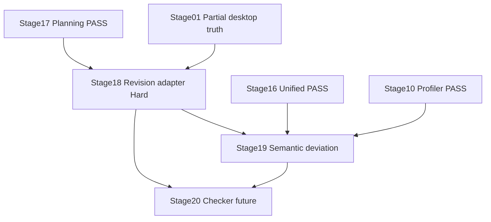

# Stages 18–19 Implementation Plan — Revision Adapter plus Semantic Deviation Thread

Source of truth: [`ROADMAP.md`](ROADMAP.md:21), [`docs/stages/18-revision-adapter.md`](docs/stages/18-revision-adapter.md:1), [`docs/stages/19-semantic-deviation.md`](docs/stages/19-semantic-deviation.md:1), [`docs/architecture.md`](docs/architecture.md:39), [`docs/project-state.md`](docs/project-state.md:26), [`docs/decision-log.md`](docs/decision-log.md:34), [`docs/manual-verification.md`](docs/manual-verification.md:1), plus zoo skills in [`.roo/skills`](.roo/skills/toneforge-scaffold/SKILL.md:1) and zoo rules in [`.roo/rules`](.roo/rules/zoo-rules-build-manifest.md:1).

> Note on timelines and effort: per delivery policy no time-based estimates are provided. Sequencing, entry gates, and measurable exit criteria below define progress from Stage 18 through Stage 19. This satisfies the request for timelines and effort via sequence-gated milestones and gate checks rather than hours or days.

> User scope: systematic review of Stages 18 to 19 with objectives, prerequisites, inputs, activities, skills, dependencies, risks, completion criteria, plus optimal sequence, step-by-step actions, resources, responsibilities, interstage dependencies, mitigations, milestones and success criteria.

## 0. Key discovery — what already exists versus greenfield

- Stages 15, 16, 17 PASS: [`src/formatting/analyzer.ts`](src/formatting/analyzer.ts:1) plus [`src/formatting/normalizer.ts`](src/formatting/normalizer.ts:1) plus [`src/formatting/wordStyles.ts`](src/formatting/wordStyles.ts:1) provide formatting [`Finding`](src/core/domain/Finding.ts:39) with `kind: formatting`; [`src/analysis/unifiedFindings.ts`](src/analysis/unifiedFindings.ts:1) provides [`unifyFindings()`](src/analysis/unifiedFindings.ts:104) three-source merger; `src/changes/` provides [`planner.ts`](src/changes/planner.ts:1) plus [`conflictDetector.ts`](src/changes/conflictDetector.ts:1) plus [`staleGuard.ts`](src/changes/staleGuard.ts:1) producing [`ChangePlan`](src/core/domain/ChangePlan.ts:13).
- Revision adapter partially exists but BLOCKED: [`src/word/revisionAdapter.ts`](src/word/revisionAdapter.ts:38) provides [`applyChangePlan()`](src/word/revisionAdapter.ts:38) plus [`validatePlanBeforeApply()`](src/word/revisionAdapter.ts:227) plus [`getRangeByOffset()`](src/word/revisionAdapter.ts:207) plus [`STAGE_01_PASSED`](src/word/revisionAdapter.ts:17) gate. Until [`setStage01Passed()`](src/word/revisionAdapter.ts:19) is true, every change returns `applied: false`. No live in-Word verification recorded in [`docs/manual-verification.md`](docs/manual-verification.md:1).
- Stage 01 truth: [`docs/project-state.md`](docs/project-state.md:8) records Stage 01 PASS WITH DOCUMENTED LIMITATION. Desktop Word result in [`docs/manual-verification.md`](docs/manual-verification.md:14) shows `supportsInsertText: true`, `supportsReplaceText: true`, `supportsInsertParagraph: true`, but `supportsInsertBreak: false`, `supportsStyles: false`, `supportsRevisions: false`. Per ADR-0005 and ADR-0008, native revision behavior is unproven; fallback is tracked-change insertion with explicit documentation.
- Semantic deviation greenfield: `src/analysis/` exists with [`unifyFindings()`](src/analysis/unifiedFindings.ts:104) accepting `semantic[]` via synthetic fixtures only. No [`src/analysis/deviationEngine.ts`](src/analysis/deviationEngine.ts:1) exists. Prompt foundation ready: [`src/ai/prompts/profilePrompts.ts`](src/ai/prompts/profilePrompts.ts:72) provides [`buildDeviationPrompt()`](src/ai/prompts/profilePrompts.ts:72) plus [`DeviationResponseSchema`](src/ai/prompts/profilePrompts.ts:35) with `includeRawText` opt-in gate. Provider ready: [`src/ai/providers/LlmProvider.ts`](src/ai/providers/LlmProvider.ts:36) defines [`LlmSemanticProvider`](src/ai/providers/LlmProvider.ts:36) with [`deviations()`](src/ai/providers/LlmProvider.ts:38); [`src/ai/providers/mockAdapter.ts`](src/ai/providers/mockAdapter.ts:15) provides [`MockAdapter`](src/ai/providers/mockAdapter.ts:15) with `failOn` precedence plus abort honor; [`src/ai/providers/registry.ts`](src/ai/providers/registry.ts:1) provides [`createLlmRegistry()`](src/ai/providers/registry.ts:1). Pattern reference: [`src/style/profiler.ts`](src/style/profiler.ts:41) shows [`buildStyleProfile()`](src/style/profiler.ts:41) with [`withRetry()`](src/ai/providers/retry.ts:1) plus [`ProfileResponseSchema`](src/ai/prompts/profilePrompts.ts:19) validation plus [`AbortSignal`](src/ai/providers/LlmProvider.ts:12) passthrough.
- Domain ready: [`src/core/domain/Finding.ts`](src/core/domain/Finding.ts:27) defines [`FindingSchema`](src/core/domain/Finding.ts:27) with [`FindingKindSchema`](src/core/domain/Finding.ts:8) covering `deterministic`, `semantic`, `formatting`; [`src/core/domain/StyleProfile.ts`](src/core/domain/StyleProfile.ts:80) defines [`StyleProfileSchema`](src/core/domain/StyleProfile.ts:80) canonical profile; [`src/core/domain/Change.ts`](src/core/domain/Change.ts:110) plus [`src/core/domain/ChangePlan.ts`](src/core/domain/ChangePlan.ts:13) define mutation contract.
- Document I/O ready: [`src/shared/office/officeHelpers.ts`](src/shared/office/officeHelpers.ts:37) provides [`runInWord()`](src/shared/office/officeHelpers.ts:37) sole Office entry; [`src/word/documentReader.ts`](src/word/documentReader.ts:39) provides [`getDocumentSnapshot()`](src/word/documentReader.ts:39) plus [`hashDocument()`](src/word/documentReader.ts:21); [`src/word/capabilityProbe.ts`](src/word/capabilityProbe.ts:43) provides [`probeWordCapabilities()`](src/word/capabilityProbe.ts:43) non-destructive probe.
- Boundaries enforced: [`docs/architecture.md`](docs/architecture.md:41) declares `word` may import `shared/office` plus `core/domain`, forbids `ai` plus `ui`; `analysis` may import `core/domain` plus `rules` plus `formatting` plus `ai/providers` plus `shared/utils`, forbids `ui` plus `word/revisionAdapter`; `changes` pure. [`eslint.config.mjs`](eslint.config.mjs:1) enforces via `no-restricted-imports`.
- Tooling: [`package.json`](package.json:30) defines [`npm run verify`](package.json:30) six-step chain plus [`npm run stage:verify`](package.json:31) via [`scripts/stage-verify.mjs`](scripts/stage-verify.mjs:1); [`vitest.config.ts`](vitest.config.ts:1) enforces 80 percent coverage; [`tests/setup.ts`](tests/setup.ts:1) mocks `Office` global.

## 1. Per-stage synthesis

### Stage 18 — Revision adapter — [`feat(word): add native revision adapter`](ROADMAP.md:43)

- Objective: prove the single mutation path per [`docs/stages/18-revision-adapter.md`](docs/stages/18-revision-adapter.md:5) — harden [`src/word/revisionAdapter.ts`](src/word/revisionAdapter.ts:1) so [`applyChangePlan()`](src/word/revisionAdapter.ts:38) applies [`ChangePlan`](src/core/domain/ChangePlan.ts:13) to live Word via [`runInWord()`](src/shared/office/officeHelpers.ts:37) without unhandled exceptions, per-change isolation, pre-flight validation.
- Prerequisites: Stage 01 probe truth recorded in [`docs/manual-verification.md`](docs/manual-verification.md:14); Stage 17 PASS providing schema-valid [`ChangePlan`](src/core/domain/ChangePlan.ts:13) with `docHash` plus `conflicts` plus `stale`; [`docs/architecture.md`](docs/architecture.md:57) one-mutation-path rule; ADR-0005 plus ADR-0008 plus ADR-0012.
- Required inputs: [`ChangePlanSchema`](src/core/domain/ChangePlan.ts:13) plus [`ChangeSchema`](src/core/domain/Change.ts:110) discriminated union; [`hashDocument()`](src/word/documentReader.ts:21) current hash; [`runInWord()`](src/shared/office/officeHelpers.ts:37) wrapper; [`WordCapabilities`](src/word/capabilityProbe.ts:17) flags; [`docs/manual-verification.md`](docs/manual-verification.md:65) probe checklist; [`tests/fixtures/sampleDocs.ts`](tests/fixtures/sampleDocs.ts:1).
- Key activities:
  - Harden [`src/word/revisionAdapter.ts`](src/word/revisionAdapter.ts:38): keep [`STAGE_01_PASSED`](src/word/revisionAdapter.ts:17) refusal until live verification; keep [`validatePlanBeforeApply()`](src/word/revisionAdapter.ts:227) checks for missing `docHash`, empty `changes`, `stale: true`; keep `currentDocHash` mismatch refusal mirroring [`src/changes/staleGuard.ts`](src/changes/staleGuard.ts:1); ensure each change in [`applySingleChange()`](src/word/revisionAdapter.ts:103) is `try` plus `catch` isolated, never fatal, returning [`RevisionResult`](src/word/revisionAdapter.ts:23) with `changeId` plus `applied` plus `error`.
  - Verify all eight `Change` kinds against host truth: `insertText`, `replaceText`, `deleteRange` proven via `supportsInsertText` plus `supportsReplaceText`; `setParagraphFormat`, `setCharacterFormat`, `applyStyle` degraded because `supportsStyles: false`; `insertBreak` degraded because `supportsInsertBreak: false`; `setListLevel` degraded unless `format.setListLevel` exists. Document per-kind fallback in code comments and manual verification notes.
  - Fix [`getRangeByOffset()`](src/word/revisionAdapter.ts:207) offset-to-Word-range mapping: current `body.getRange` cast is unproven in Desktop host; validate live or document limitation and propose tracked-change insertion fallback per ADR-0005.
  - Add `tests/unit/word/revisionAdapter.test.ts` using [`tests/setup.ts`](tests/setup.ts:1) Office mock: gate refusal when [`STAGE_01_PASSED`](src/word/revisionAdapter.ts:17) false, validation failure path, hash mismatch refusal, per-change isolation with one throw plus one success, empty-plan message, out-of-bounds range error. Never hit live network; never require live Word for unit gate.
  - Run live in-Word smoke in Desktop Word via sideload per [`docs/manual-verification.md`](docs/manual-verification.md:75): build release artifact, open test document, apply minimal plan with one `replaceText` plus one `insertText`, record `applied` results plus host version plus exceptions in [`docs/manual-verification.md`](docs/manual-verification.md:1). This is human-only; cannot pass in CI.
- Essential skills and resources: [`toneforge-scaffold`](.roo/skills/toneforge-scaffold/SKILL.md:1) for Word-boundary changes; [`toneforge-officejs`](.roo/skills/toneforge-officejs/SKILL.md:1) for [`runInWord()`](src/shared/office/officeHelpers.ts:37) plus `context.sync` discipline plus non-destructive probe respect; [`toneforge-testing`](.roo/skills/toneforge-testing/SKILL.md:1) for Office-mock isolation; zoo rules `officejs-boundary`, `typescript-contracts`, `test-coverage`, `build-manifest`, `commit-docs`.
- Dependencies: hard depends on Stage 01 live truth and Stage 17 plan contract; feeds Stage 21 orchestrator plus Stage 22 safe application plus Stage 27 host matrix. Critical ordering rule in [`ROADMAP.md`](ROADMAP.md:17) forbids building full reformatter before proving this adapter.
- Risks: `supportsRevisions: false` means native revisions unproven — adapter may only prove insert plus replace, not tracked revisions; `getRangeByOffset` may fail on large docs or complex bodies; style plus break kinds unsupported in tested host; live verification requires human Word session and blocks automation.
- Completion criteria: [`npm run typecheck`](package.json:29) plus [`npm run lint`](package.json:25) plus [`npm run format`](package.json:27) plus [`npm run test`](package.json:22) plus [`npm run build`](package.json:15) plus [`npm run validate`](package.json:20) pass; adapter runs inside Word without unhandled exceptions; results recorded in [`docs/manual-verification.md`](docs/manual-verification.md:1); [`docs/project-state.md`](docs/project-state.md:26) updated from PENDING; commit `feat(word): add native revision adapter`. If live proof partial, mark PARTIAL or PASS WITH DOCUMENTED LIMITATION per legend in [`docs/project-state.md`](docs/project-state.md:38), never silent PASS.

### Stage 19 — Semantic deviation — [`feat(ai): add semantic style deviation engine`](ROADMAP.md:44)

- Objective: add semantic style deviation engine per [`docs/stages/19-semantic-deviation.md`](docs/stages/19-semantic-deviation.md:5) — new [`src/analysis/deviationEngine.ts`](src/analysis/deviationEngine.ts:1) uses [`LlmRegistry`](src/ai/providers/registry.ts:1) to detect semantic deviations from [`StyleProfile`](src/core/domain/StyleProfile.ts:80), emitting [`Finding`](src/core/domain/Finding.ts:39) with `kind: semantic` for [`unifyFindings()`](src/analysis/unifiedFindings.ts:104) plus Stage 17 planner passthrough plus Stage 20 checker.
- Prerequisites: Stage 10 PASS [`src/style/profiler.ts`](src/style/profiler.ts:41) pattern; Stage 16 PASS [`src/analysis/unifiedFindings.ts`](src/analysis/unifiedFindings.ts:104) accepting `semantic[]`; Stage 17 PASS preserving semantic findings unless explicit quoted replacement extractable; [`DeviationResponseSchema`](src/ai/prompts/profilePrompts.ts:35) plus [`buildDeviationPrompt()`](src/ai/prompts/profilePrompts.ts:72) stable; ADR-0006 plus ADR-0011 plus LLM privacy rules.
- Required inputs: [`StyleProfileSchema`](src/core/domain/StyleProfile.ts:80) canonical profile; [`FindingSchema`](src/core/domain/Finding.ts:27) with `kind: semantic` plus `confidence` less than 1; [`buildDeviationPrompt()`](src/ai/prompts/profilePrompts.ts:72) plus [`DeviationResponseSchema`](src/ai/prompts/profilePrompts.ts:35); [`LlmSemanticProvider`](src/ai/providers/LlmProvider.ts:36) via [`createLlmRegistry()`](src/ai/providers/registry.ts:1); [`withRetry()`](src/ai/providers/retry.ts:1); [`MockAdapter`](src/ai/providers/mockAdapter.ts:15) for tests; [`tests/fixtures/sampleDocs.ts`](tests/fixtures/sampleDocs.ts:1) plus [`SAMPLE_PROFILE`](tests/fixtures/sampleDocs.ts:8).
- Key activities:
  - Create [`src/analysis/deviationEngine.ts`](src/analysis/deviationEngine.ts:1) modeled on [`src/style/profiler.ts`](src/style/profiler.ts:41): accept `targetText` plus `profile` plus `opts` with `includeRawText: true` required, `registry` defaulting to [`createLlmRegistry()`](src/ai/providers/registry.ts:1), `signal` passthrough, retry via [`withRetry()`](src/ai/providers/retry.ts:1) with `isRetryable` distinguishing [`LlmError`](src/ai/providers/LlmProvider.ts:42) retryable versus caller abort non-retryable; build prompt via [`buildDeviationPrompt()`](src/ai/prompts/profilePrompts.ts:72); call `registry.deviations`; parse JSON array defensively; validate each entry via [`DeviationResponseSchema`](src/ai/prompts/profilePrompts.ts:35); map to [`Finding`](src/core/domain/Finding.ts:39) with `kind: semantic`, `category: semantic-deviation` or prompt-derived category, `range` character offsets where extractable else full-text range, `severity` mapping `low` to `info`, `medium` to `warning`, `high` to `error`, `confidence` less than 1, `evidence` from deviation text, fresh [`uuidv4()`](src/core/domain/StyleProfile.ts:96) IDs.
  - Enforce privacy: throw unless `includeRawText: true` explicitly passed; never log raw text; rely on [`src/shared/utils/logger.ts`](src/shared/utils/logger.ts:1) redaction plus [`OpenAiAdapter.redact()`](src/ai/providers/openaiAdapter.ts:29); honor [`AbortSignal`](src/ai/providers/LlmProvider.ts:12) cancellation as non-retryable.
  - Keep `src/analysis/` boundary per [`docs/architecture.md`](docs/architecture.md:41): may import `core/domain` plus `ai/providers` plus `shared/utils`; must not import `ui` plus `word/revisionAdapter`; add or reuse [`eslint.config.mjs`](eslint.config.mjs:1) scope from ADR-0023.
  - Add `tests/unit/analysis/deviationEngine.test.ts` with [`MockAdapter`](src/ai/providers/mockAdapter.ts:15) only, never live network: valid JSON array to findings mapping, severity mapping, invalid JSON error, schema failure on missing fields, `includeRawText: false` throw, abort non-retryable, retryable error retried via `failOn` plus `withRetry`, empty target text to empty array, Zod-invalid findings skipped. Mirror source structure per test-coverage rule.
  - Verify integration with [`unifyFindings()`](src/analysis/unifiedFindings.ts:104): engine output feeds `semantic[]` input; synthetic fixtures replaced by engine output in tests; Stage 17 planner preserves engine findings without forced change mapping.
- Essential skills and resources: [`toneforge-llm`](.roo/skills/toneforge-llm/SKILL.md:1) for provider-agnostic engine plus prompt template plus [`MockAdapter`](src/ai/providers/mockAdapter.ts:15) doubles; [`toneforge-scaffold`](.roo/skills/toneforge-scaffold/SKILL.md:1) for new `analysis` file placement; [`toneforge-testing`](.roo/skills/toneforge-testing/SKILL.md:1) for semantic mock tests plus 80 percent coverage; zoo rules `llm-privacy`, `typescript-contracts`, `deterministic-purity` extended to analysis, `test-coverage`, `build-manifest`, `commit-docs`.
- Dependencies: strictly follows Stage 18 in numeric order but technically decoupled — engine is pure semantic, adapter is Word-boundary; both feed Stage 20 checker which requires deterministic plus formatting plus semantic inputs. Stage 19 unblocks Stage 20 hybrid report.
- Risks: LLM output non-determinism and schema drift; privacy violation if raw text sent without opt-in; over-mapping vague deviations to precise character ranges; retry storm on transient failures; test flakiness if live provider used instead of mock.
- Completion criteria: [`npm run typecheck`](package.json:29) plus [`npm run test`](package.json:22) pass; [`docs/project-state.md`](docs/project-state.md:27) updated from PENDING to PASS; commit `feat(ai): add semantic style deviation engine`. Full [`npm run verify`](package.json:30) chain green before commit.

## 2. Optimal sequence and interstage dependencies

Strict numeric order 18 then 19 is optimal. No parallelization across stages because Stage 18 hard gate must close before reformatter thread proceeds, and Stage 20 requires both outputs. Within a stage, unit hardening and live or mock verification proceed as two tracks that join before gate.

Notes:

- 18 first because [`ROADMAP.md`](ROADMAP.md:17) critical ordering rule blocks full reformatter before proving native Word revision behavior. Stage 17 plans are unproven until [`applyChangePlan()`](src/word/revisionAdapter.ts:38) is exercised live.
- 19 second because semantic engine completes the three-source contract that [`unifyFindings()`](src/analysis/unifiedFindings.ts:104) was designed for with synthetic fixtures. Building 19 before 18 would leave mutation path unproven while adding new findings producers.
- 18 live verification is human-only and may remain PARTIAL; 19 unit verification is mock-only and can PASS in CI. Sequence allows 19 to proceed on mocks even if 18 records documented limitation, provided limitation is explicit in [`docs/project-state.md`](docs/project-state.md:26) and [`docs/manual-verification.md`](docs/manual-verification.md:83).
- Both feed Stage 20: adapter proves application safety, deviation engine proves semantic input quality. Stage 20 checker must not start until both gates close.

## 3. Step-by-step actions per stage

Each stage follows stage protocol in [`ROADMAP.md`](ROADMAP.md:55): read stage file, load only relevant skills, inspect before modifying, implement only scope, targeted tests, stage verification, update [`docs/project-state.md`](docs/project-state.md:1), record ADR in [`docs/decision-log.md`](docs/decision-log.md:1) if architectural, commit only after gate passes.

### Stage 18 steps

1. Inspect [`src/word/revisionAdapter.ts`](src/word/revisionAdapter.ts:1), [`src/core/domain/ChangePlan.ts`](src/core/domain/ChangePlan.ts:13), [`src/core/domain/Change.ts`](src/core/domain/Change.ts:110), [`src/shared/office/officeHelpers.ts`](src/shared/office/officeHelpers.ts:37), [`src/word/capabilityProbe.ts`](src/word/capabilityProbe.ts:43), [`docs/manual-verification.md`](docs/manual-verification.md:1) as baseline.
2. Harden Word-boundary logic: keep [`STAGE_01_PASSED`](src/word/revisionAdapter.ts:17) gate, [`validatePlanBeforeApply()`](src/word/revisionAdapter.ts:227) pre-flight, `currentDocHash` stale refusal, per-change isolation in [`applySingleChange()`](src/word/revisionAdapter.ts:103); add per-kind capability comments reflecting Desktop truth.
3. Add `tests/unit/word/revisionAdapter.test.ts` with Office mock isolation covering gate refusal, validation failure, hash mismatch, per-change isolation, empty plan, out-of-bounds range.
4. Run [`npm run verify`](package.json:30) chain plus [`scripts/stage-verify.mjs`](scripts/stage-verify.mjs:1); confirm 80 percent coverage for `word/` boundary where applicable.
5. Human live smoke: `npm run build`, sideload per `docs/onboarding.md`, apply minimal [`ChangePlan`](src/core/domain/ChangePlan.ts:13) in Desktop Word, record results in [`docs/manual-verification.md`](docs/manual-verification.md:1) with host plus version plus per-change `applied` flags plus exceptions.
6. Update [`docs/project-state.md`](docs/project-state.md:26) to PASS or PARTIAL or PASS WITH DOCUMENTED LIMITATION with notes; record ADR if fallback policy or range-mapping strategy changes in [`docs/decision-log.md`](docs/decision-log.md:1); commit `feat(word): add native revision adapter` only after hard gate evidence exists.

### Stage 19 steps

1. Inspect [`src/style/profiler.ts`](src/style/profiler.ts:41), [`src/ai/prompts/profilePrompts.ts`](src/ai/prompts/profilePrompts.ts:72), [`src/ai/providers/LlmProvider.ts`](src/ai/providers/LlmProvider.ts:36), [`src/ai/providers/mockAdapter.ts`](src/ai/providers/mockAdapter.ts:15), [`src/analysis/unifiedFindings.ts`](src/analysis/unifiedFindings.ts:104), [`src/core/domain/Finding.ts`](src/core/domain/Finding.ts:27) as patterns.
2. Scaffold [`src/analysis/deviationEngine.ts`](src/analysis/deviationEngine.ts:1) with `includeRawText` gate, [`LlmRegistry`](src/ai/providers/registry.ts:1) injection, [`withRetry()`](src/ai/providers/retry.ts:1) policy, [`DeviationResponseSchema`](src/ai/prompts/profilePrompts.ts:35) validation, [`Finding`](src/core/domain/Finding.ts:39) mapping with `kind: semantic`.
3. Add `tests/unit/analysis/deviationEngine.test.ts` with [`MockAdapter`](src/ai/providers/mockAdapter.ts:15) doubles covering mapping, severity translation, invalid JSON, schema failure, opt-in throw, abort, retry, empty input.
4. Run verify chain, confirm three-source merge with live engine output into [`unifyFindings()`](src/analysis/unifiedFindings.ts:104), confirm Stage 17 planner passthrough preserves semantic findings, update state, commit.

## 4. Resource and capability requirements

- Codebase: TypeScript strict with [`tsconfig.json`](tsconfig.json:1) flags `strict`, `exactOptionalPropertyTypes`, `noUncheckedIndexedAccess`; React 18 plus Fluent v8; Webpack 5; Vitest plus jsdom plus Testing Library.
- Skills: [`toneforge-scaffold`](.roo/skills/toneforge-scaffold/SKILL.md:1) every stage; [`toneforge-officejs`](.roo/skills/toneforge-officejs/SKILL.md:1) Stage 18 live adapter only; [`toneforge-llm`](.roo/skills/toneforge-llm/SKILL.md:1) Stage 19 engine only; [`toneforge-testing`](.roo/skills/toneforge-testing/SKILL.md:1) every stage.
- Test doubles: [`tests/setup.ts`](tests/setup.ts:1) Office mock for Stage 18 unit tests only; [`MockAdapter`](src/ai/providers/mockAdapter.ts:15) for Stage 19 with `{ provider: mock }` in [`LlmRegistry`](src/ai/providers/registry.ts:1); [`tests/fixtures/sampleDocs.ts`](tests/fixtures/sampleDocs.ts:1) fixtures; no live network, no live Word required for unit gates.
- Tooling: [`npm run verify`](package.json:30) chain in [`package.json`](package.json:30) plus [`npm run stage:verify`](package.json:31); manifest check via [`scripts/validate-manifest.mjs`](scripts/validate-manifest.mjs:1).
- Human: Word host owner for Stage 18 sideload plus probe plus minimal plan application; LLM reviewer for Stage 19 prompt plus schema plus redaction review; no live LLM key needed for gates.

## 5. Responsibilities

- Implementer: one owner per stage, follows scope only, no cross-stage anticipation beyond declared contract. Stage 18 owner must keep all [`Office`](src/types/office.d.ts:1) access inside [`runInWord()`](src/shared/office/officeHelpers.ts:37) and never mutate from rules or UI. Stage 19 owner must never import `word` or `ui` into `analysis`.
- Reviewer: checks module boundaries per [`docs/architecture.md`](docs/architecture.md:39), lint `no-restricted-imports`, deterministic versus semantic separation, Zod validation, `import type` discipline, [`runInWord()`](src/shared/office/officeHelpers.ts:37) usage, `includeRawText` opt-in, [`AbortSignal`](src/ai/providers/LlmProvider.ts:12) passthrough.
- Docs owner: updates [`docs/project-state.md`](docs/project-state.md:1) PASS or PARTIAL or BLOCKED with notes, appends ADR to [`docs/decision-log.md`](docs/decision-log.md:1) when boundary or schema or fallback or merge policy changes, records live results in [`docs/manual-verification.md`](docs/manual-verification.md:1).
- Release guard: blocks commit unless [`npm run verify`](package.json:30) six steps pass in order per build-manifest rule; blocks Stage 18 commit unless live Word evidence exists.

## 6. Risk mitigations

| Risk                                                    | Mitigation                                                                                                                                                                                                                                       |
| ------------------------------------------------------- | ------------------------------------------------------------------------------------------------------------------------------------------------------------------------------------------------------------------------------------------------ |
| Stage 01 `supportsRevisions: false` blocks native proof | Prove insert plus replace live; document style plus break plus revision gaps as limitation in [`docs/manual-verification.md`](docs/manual-verification.md:83); define tracked-change insertion fallback explicitly; mark PARTIAL not silent PASS |
| `getRangeByOffset` unproven mapping fails live          | Test minimal offsets live first; add bounds validation already in [`src/word/revisionAdapter.ts`](src/word/revisionAdapter.ts:207); log `changeId` plus range on failure; propose paragraph-scoped fallback in ADR if needed                     |
| Style plus break kinds unsupported in tested host       | Gate per-kind attempts on capability flags; throw explicit unsupported errors collected as `applied: false`; never fatal; cover with mock tests                                                                                                  |
| Live verification human-only blocks CI                  | Unit gates pass on mocks; live smoke tracked separately in [`docs/manual-verification.md`](docs/manual-verification.md:1); Stage 19 proceeds on mocks even if Stage 18 PARTIAL, with explicit note                                               |
| Semantic hallucination plus schema drift                | Validate every LLM entry via [`DeviationResponseSchema`](src/ai/prompts/profilePrompts.ts:35); strip unknown fields; skip invalid entries; map vague deviations to full-text range, never invented offsets                                       |
| Privacy leak of raw text                                | Require `includeRawText: true` in both [`buildDeviationPrompt()`](src/ai/prompts/profilePrompts.ts:72) and engine opts; redact logs via [`src/shared/utils/logger.ts`](src/shared/utils/logger.ts:1); no telemetry by default                    |
| Retry storm plus abort mishandling                      | Delegate to [`withRetry()`](src/ai/providers/retry.ts:1); caller abort non-retryable, timeout retryable per ADR-0011; test with `failOn` plus aborted signal                                                                                     |
| Boundary violation                                      | `word` forbids `ai` plus `ui`; `analysis` forbids `ui` plus `word/revisionAdapter`; lint fails build; pure tests run without Office mock for engine, without network for adapter units                                                           |
| Coverage gate miss                                      | Mirror tests per source file; run coverage early; reuse [`src/shared/utils/text.ts`](src/shared/utils/text.ts:1) helpers; target 80 percent lines plus statements plus functions plus branches                                                   |
| Scope creep into Stage 20 plus 21 plus 22               | Adapter applies plans only, never plans; engine emits findings only, never changes; orchestrator stays in Stage 21; safe application stays in Stage 22                                                                                           |

## 7. Milestones and success criteria — sequence-gated, no time estimates

- M18 Adapter hardened: [`applyChangePlan()`](src/word/revisionAdapter.ts:38) plus [`validatePlanBeforeApply()`](src/word/revisionAdapter.ts:227) plus stale refusal proven by mock tests; live smoke in Desktop Word without unhandled exceptions; per-change isolation verified; results in [`docs/manual-verification.md`](docs/manual-verification.md:1); verify green.
- M19 Deviation proven: [`src/analysis/deviationEngine.ts`](src/analysis/deviationEngine.ts:1) maps profile plus text to `semantic` [`Finding`](src/core/domain/Finding.ts:39) via [`MockAdapter`](src/ai/providers/mockAdapter.ts:15); severity mapping plus opt-in gate plus abort plus retry proven; feeds [`unifyFindings()`](src/analysis/unifiedFindings.ts:104) `semantic[]`; verify green.
- Thread success: 18 then 19 PASS in order, [`docs/project-state.md`](docs/project-state.md:26) both PASS or 18 PARTIAL with documented limitation plus 19 PASS, ADRs recorded, each stage committed with roadmap-aligned scope per commit-docs rule, ready for Stage 20 consistency checker.

## 8. Verification per stage

Run in order per build-manifest rule: [`npm run typecheck`](package.json:29), [`npm run lint`](package.json:25), [`npm run format`](package.json:27), [`npm run test`](package.json:22), [`npm run build`](package.json:15), [`npm run validate`](package.json:20), then [`npm run stage:verify`](package.json:31). Never commit on partial run. Update [`docs/CHANGELOG.md`](docs/CHANGELOG.md:1) only if user-facing behavior changes.
