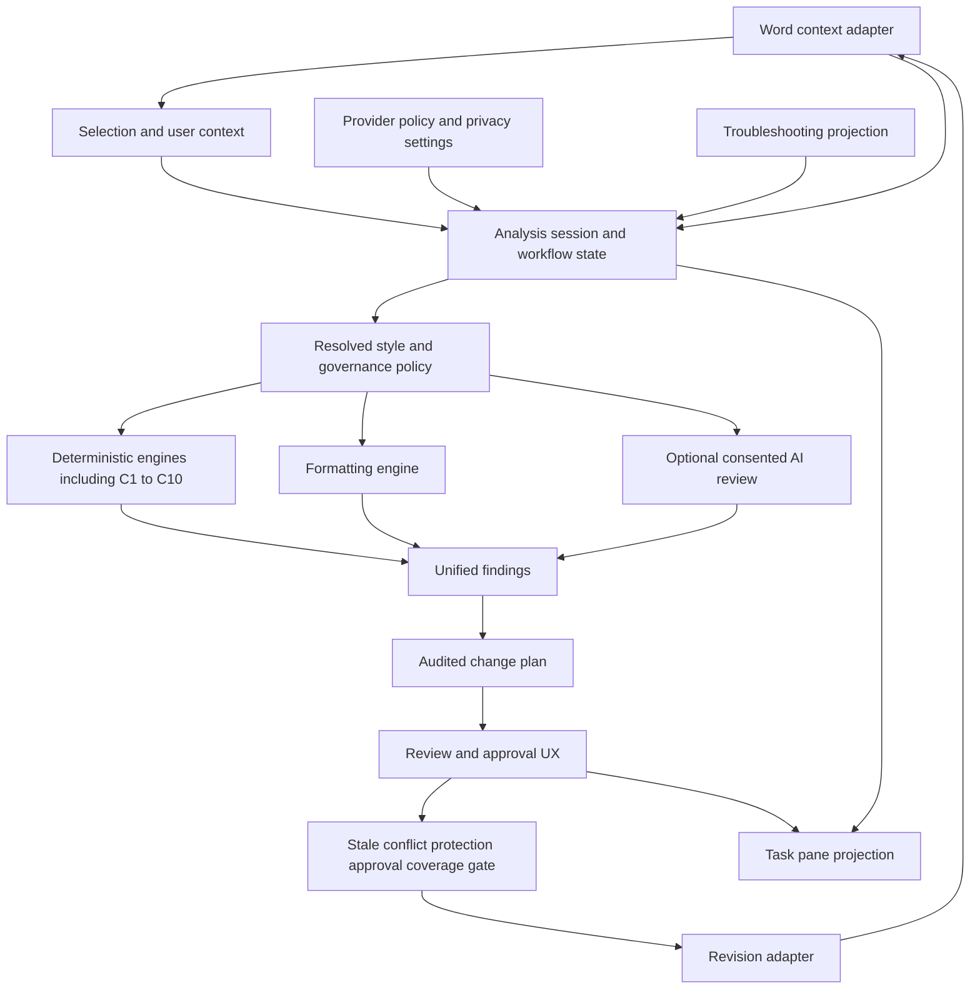

# ToneForge Modern UX, Provider Integration, Consistency, and Release Implementation Plan

> **Plan status:** Approved execution plan. Phases 0 and 1 are complete and verified; Phase 2 is the next implementation phase.
>
> **Canonical status and sequencing:** [`ROADMAP.md`](../ROADMAP.md) remains the canonical roadmap and status ledger. This file is the implementation-ready plan for the refactor/UX review dispositions. Implementation must update the roadmap and evidence documents as each phase changes status.
>
> **Architecture authority:** [`docs/architecture.md`](../docs/architecture.md) defines module boundaries and the single analysis-to-plan-to-revision workflow. [`docs/decision-log.md`](../docs/decision-log.md) records accepted architectural decisions. [`docs/project-state.md`](../docs/project-state.md) remains the evidence index.
>
> **Execution rule:** complete and verify each phase before starting the next. Run targeted tests first, then the complete [`npm run verify`](../package.json) graph at the phase gate. Human Word, provider, accessibility, security, and performance evidence is recorded in the named evidence documents and is never replaced by mocks.

## 1. Objectives and approved scope

This plan implements the complete proposal inventory from [`ToneForge_REFACTOR_ALIGNMENT_AND_MODERN_UX_REVIEW.md`](../ToneForge_Refactor_Implementation/ToneForge_REFACTOR_ALIGNMENT_AND_MODERN_UX_REVIEW.md), including items previously classified as optional or deferred. The following are now mandatory:

- Machine-readable verification summaries.
- A generated host-matrix dashboard derived from the canonical manual evidence record.
- Splitting Settings before the provider/privacy redesign.
- Side-by-side visual profile history.
- Finding and change previous/next navigation.
- A formal draft/published organizational profile lifecycle.
- Full C1–C10 content-consistency expansion.
- Production deployment, security, accessibility, and performance evidence after C1–C10.

The plan also adds:

- **B23 integration:** the task pane is a projection of one canonical workflow, not a parallel product architecture. Word context, user context, analysis state, findings, plan state, approval state, and Apply state originate in shared workflow state and are rendered through focused views.
- Modern AI provider selection with provider-specific authentication and dynamic model catalogs.
- OAuth sign-in where a provider officially supports an applicable application OAuth flow.
- OpenRouter API-key and base-URL configuration through a secure broker/service boundary.
- Phase 6 as the mandatory production release-evidence phase after C1–C10.

## 2. Non-negotiable architecture constraints

The following remain unchanged throughout the implementation:

1. **Deterministic first.** Rules, formatting, style metrics, coverage, protection, and C1–C10 deterministic engines do not import Office, AI, or UI modules.
2. **One canonical style contract.** [`StyleProfile`](../src/core/domain/StyleProfile.ts) stores learned/evidence-backed style characteristics. [`GovernanceProfile`](../src/core/domain/GovernanceProfile.ts) stores normative enforcement policy, scope, protection, lifecycle, and provenance.
3. **One resolved policy.** Analysis and planning consume one immutable resolved policy rather than independently interpreting style defaults and governance overrides.
4. **One reviewed plan.** Finding review, spot AI review, full-document review, deterministic reformat, and C1–C10 all produce the same [`ChangePlan`](../src/core/domain/ChangePlan.ts) contract.
5. **One production mutation path.** Task pane and commands never import [`revisionAdapter`](../src/word/revisionAdapter.ts) directly. All mutation flows through [`applyReviewedPlan()`](../src/reformat/orchestrator.ts) and then the revision adapter.
6. **B23 task-pane projection.** The task pane renders shared workflow state and sends commands to shared workflow hooks/services. It does not create independent finding, plan, provider, or mutation state that can drift.
7. **Office boundary.** Word access and event registration use local Office.js types and the repository Office boundary. No new direct Office access bypasses the existing wrapper conventions.
8. **Prompt privacy.** Raw document text leaves the add-in only through explicit, scope-specific consent. Prompt builders retain the `includeRawText: true` gate.
9. **Credential-free ordinary state.** OAuth access/refresh tokens and OpenRouter API keys are never written to local storage, Office roaming settings, logs, URLs, or browser bundles. Production credentials are held by the production authentication/broker service.
10. **Runtime validation.** Provider settings, model catalogs, OAuth state, responses, and API keys are parsed with Zod at trust boundaries.
11. **Deterministic verification.** Semantic provider tests use [`MockAdapter`](../src/ai/providers/mockAdapter.ts); no unit test may call a live provider.
12. **Coverage and testing.** Tests mirror source structure. The configured coverage threshold is not reduced.

## 3. Target architecture



### 3.1 B23 UX state ownership

Create one workflow store or a small set of reducers with explicit ownership:

- `DocumentContextState`: document identity, current version, selection, changed paragraph identifiers, capability tier.
- `AnalysisSessionState`: active profile and governance policy, resolved policy revision, acquisition scope, coverage, scan status, findings.
- `AiProviderState`: selected provider, authentication state, dynamic model catalog, selected model, consent scopes. Secrets are represented only by opaque connection references and non-secret status metadata.
- `PlanReviewState`: exact plan, selected finding/change, before/after, keep/skip/reject status, conflicts, stale state, approval state.
- `ApplyState`: idle, ready, applying, verified success, refused, failed.
- `TroubleshootingState`: host/runtime diagnostics and technical details not shown in the primary workflow.

Views consume selectors and dispatch workflow actions. Components do not independently mutate the underlying persisted records or invoke the revision adapter.

## 4. Modern AI provider architecture

### 4.1 Supported provider modes

| Provider       | Authentication mode                                                                                                                       | Model discovery                                                                 | Completion protocol                               | Planned adapter                                   |
| -------------- | ----------------------------------------------------------------------------------------------------------------------------------------- | ------------------------------------------------------------------------------- | ------------------------------------------------- | ------------------------------------------------- |
| Offline / mock | None                                                                                                                                      | Static local mock models                                                        | Existing deterministic mock responses             | Existing mock adapter                             |
| OpenAI         | Official provider OAuth when approved and available; otherwise deployment-managed service connection                                      | Authenticated provider model-list endpoint                                      | Provider-native request/response normalization    | OpenAI adapter extended behind provider interface |
| Claude         | Anthropic developer/Console OAuth with authorization-code flow and refresh-token support where officially enabled                         | Authenticated Anthropic models endpoint                                         | Anthropic Messages request/response normalization | Claude adapter                                    |
| OpenRouter     | User-supplied API key plus configurable HTTPS base URL, submitted once to the secure production broker and never persisted in the browser | Broker fetches models from configured base URL and returns a normalized catalog | OpenAI-compatible chat-completions normalization  | OpenRouter adapter                                |

### 4.2 OAuth design

OAuth is implemented in the production authentication/broker service, not directly in the Office task pane.

- Authorization code flow with PKCE.
- OIDC-compliant identity metadata where available.
- State, nonce, PKCE verifier, redirect URI, and provider selection are validated.
- Authorization codes and client secrets never enter the task-pane bundle or ordinary application state.
- Access and refresh tokens are encrypted at rest by the production service.
- The browser receives an opaque connection ID and non-secret account/provider/model metadata.
- Token refresh, revocation, expiry, reconnect, and account selection occur server-side.
- Logout/disconnect removes the server-side connection and invalidates the local connection reference.
- Re-authentication uses a fresh authorization request and cannot reuse stale state.
- Every provider request receives a user/session identity from the broker; the browser cannot substitute another user’s provider credential.

**Provider qualification:** provider OAuth support is enabled only after official registration and a verified production flow. Current official OpenAI API documentation confirms API-key and workload-identity authentication for ordinary model requests; it does not establish a general third-party end-user OAuth login equivalent to the Anthropic developer OAuth flow. The implementation must therefore:

1. Implement the common OAuth client/broker contract.
2. Enable Claude developer OAuth.
3. Keep OpenAI OAuth behind a feature capability and approved provider configuration.
4. Provide a deployment-managed OpenAI connection mode if general user OAuth is unavailable.
5. Never mislabel ChatGPT subscription login, remote MCP connector OAuth, workload identity, or an API key as general OpenAI API OAuth.

### 4.3 OpenRouter API-key mode

The user selects OpenRouter and enters:

- API key.
- HTTPS base URL, defaulting to the official OpenRouter API base when deployment configuration permits.
- Optional approved model identifier discovered after connection.

The task pane sends the key once over the authenticated production broker channel. The broker validates and stores or references it under the approved credential-custody policy. The task pane immediately discards the input. Ordinary state stores only:

- Provider `openrouter`.
- Opaque connection ID.
- Normalized and validated base origin/path classification.
- Selected model.
- Authentication status and last verified time.

Model discovery is performed against the configured base URL through the broker. A custom base URL is not treated as trusted merely because it is syntactically valid; deployment policy defines allowed origins or an explicit user-approved self-hosted endpoint policy.

### 4.4 Dynamic model catalog contract

Define a provider-neutral model catalog:

```text
ProviderModelCatalog
  provider
  connectionId
  fetchedAt
  expiresAt
  models[]
    id
    displayName
    description
    contextWindow
    inputModalities
    outputModalities
    supportsStructuredOutput
    supportsTools
    supportsReasoning
    deprecated
```

Rules:

- The model dropdown is disabled until a connection is ready and the provider model catalog has loaded.
- Changing provider invalidates the previous provider’s model list and selected model.
- The selected model must exist in the current catalog or be accepted as an explicitly typed custom model only when provider policy permits it.
- The catalog refreshes after connect, explicit refresh, reconnect, and expiry.
- Loading, empty, stale, failed, and offline states are distinct.
- The model catalog is not stored as a hard-coded allowlist.
- Provider responses remain untrusted until normalized through Zod.
- The selected model participates in workflow/session identity and AI preflight disclosure.

## 5. Phase 0 — Correctness, trust, and truthful coverage

### Dependencies

None beyond the current repository baseline.

### Implementation

1. Add a first-run no-profile state to [`Dashboard`](../src/taskpane/pages/Dashboard.tsx).
2. Fix observer full-rescan replacement in [`documentObserver`](../src/word/documentObserver.ts) so findings are retained.
3. Define truthful analysis scope separately from unexpected incomplete coverage.
4. Ensure observer and full-document UI do not claim complete coverage when required scope is unsupported.
5. Replace the misleading finding `Apply` action with a truthful Review status entry point, Go to text, and Ignore. Central plan navigation remains a Phase 2 B23 responsibility because a finding alone does not create an apply-able plan.
6. Implement pending plan Reject as a real state transition.
7. Remove the second plan-level Apply surface from [`ReformatPanel`](../src/taskpane/components/ReformatPanel.tsx).
8. Move acquisition counters and technical coverage metrics to [`DebuggingPanel`](../src/taskpane/components/DebuggingPanel.tsx).
9. Fix blank optional broker URL persistence.
10. Surface source-navigation asynchronous success and failure.
11. Replace ignored finding UUIDs with a versioned, stable finding fingerprint.
12. Add component and integration regression tests before refactoring the large UI files.

### Acceptance criteria

- A new installation reaches a setup state rather than the global error boundary.
- A successful observer scan exposes its findings.
- Exactly one plan-level Apply control exists.
- Reject removes or invalidates the current plan.
- No card labelled Apply merely changes review status.
- Unsupported declared scope is shown accurately and does not masquerade as a provider failure.
- No acquisition diagnostic counters appear in the normal workflow.
- No ignored-finding storage grows indefinitely across scans.

### Verification

Phase 0 verification passed on the working tree; the current repository gate
reports 73 test files and 693 tests with 92.90% lines / 92.90% statements /
83.75% functions / 81.53% branches, and a passing `toneforge-repository-v1`
graph. The Review
control currently records reviewed status only; B23 central plan navigation and
selection context are deliberately deferred to Phase 2.

- Targeted Dashboard, observer, coverage, Settings, finding, pending-change, and reformat tests.
- [`npm run typecheck`](../package.json).
- [`npm run lint`](../package.json).
- [`npm run test`](../package.json).
- [`npm run build`](../package.json).
- [`npm run verify`](../package.json).
- Manual first-run, scan, reject, stale-plan, and navigation smoke evidence.

## 6. Phase 1 — Resolved policy and Learn Style

### Dependencies

Phase 0 complete; state migration and provider-consent contracts stable.

### Implementation

1. Define ownership:
   - `StyleProfile`: learned and measured characteristics plus user-authored style evidence.
   - `GovernanceProfile`: normative enforcement settings, scope, protection, terminology policy, editorial policy, rule metadata, lifecycle, and provenance.
2. Implement one immutable resolved-policy DTO.
3. Make deterministic, formatting, semantic, and C1–C10-capable analysis consume that policy.
4. Implement Learn Style:
   - Capture selection or eligible document sample.
   - Run sample-quality checks.
   - Build deterministic metrics.
   - Optionally interpret semantics only after explicit consent.
   - Create a draft profile.
   - Show evidence and normative recommendations separately.
   - Validate, edit, approve, and persist a versioned profile.
5. Add task-pane and ribbon entry points.
6. Define Refine behavior: new evidence produces a proposed draft diff and never silently overwrites the active published profile.
7. Persist only safe sample metadata/identifiers unless raw-sample retention is separately designed, consented, encrypted, and approved.

### Acceptance criteria

- Analysis and planning cannot bypass the resolved policy.
- Learn from selection, eligible document, and Refine have explicit, tested semantics.
- No semantic request occurs without consent.
- The learned draft is schema-valid, editable, recoverable, and versioned.
- The active published profile remains unchanged until approval.
- Deterministic evidence is visibly separate from normative policy.

### Verification

- Pure resolved-policy unit tests.
- Learn Style state-machine tests.
- Persistence and migration tests.
- Mock-provider semantic profiler tests.
- Component journey tests.
- Complete phase verification graph.
- Manual sample-capture evidence in supported Word hosts.

Phase 1 verification passed with [`resolveResolvedPolicy()`](../src/core/domain/ResolvedPolicy.ts)
consumed by [`checkConsistency()`](../src/analysis/consistencyChecker.ts) and
[`reformatDocument()`](../src/reformat/orchestrator.ts), plus
[`learnStyleDraft()`](../src/style/learnStyle.ts) and the Learn Style entry point
in [`Profile.tsx`](../src/taskpane/pages/Profile.tsx). Draft editing, approval
through the existing versioned ProfileEditor save path, and safe sample metadata
persistence are repository-verified; live sample capture and provider consent
remain host evidence.

## 7. Phase 2 — Word integration and B23 workflow projection

### Dependencies

Phase 1 complete; local Office.js event declarations and host capability probing available.

### Implementation

1. Add capability evidence tiers:
   - API present.
   - Host-tested.
   - Release-supported.
2. Add a Word event adapter for paragraph added, changed, and deleted events.
3. Normalize paragraph identifiers before optional range resolution.
4. Register and deregister handlers through the Word boundary.
5. Coalesce events, discard obsolete runs, and fall back to conservative full rescan.
6. Replace mount-only navigation with a sequenced live navigation controller.
7. Track selection changes contextually.
8. Build B23 workflow state and selectors.
9. Make the task pane a projection of document, analysis, plan-review, apply, provider, and troubleshooting state.
10. Add task-first current-document status and primary next action.
11. Add finding Previous/Next with current index and Word highlighting.
12. Add change Previous/Next after per-change plan-selection state exists.

### Acceptance criteria

- Paragraph edits trigger the observer on supported hosts.
- Unsupported hosts use a truthful conservative fallback.
- Superseded events cannot commit stale findings.
- Ribbon navigation works whether the pane is closed or mounted.
- Selection context updates without reload.
- Source navigation reports success, failure, and unsupported states.
- The task pane cannot create a second independent plan or Apply state.
- All Word event handlers are removed on teardown.

### Verification

- Event registration, deregistration, coalescing, and fallback tests.
- Navigation bridge tests for closed pane, mounted pane, repeated commands, and stale targets.
- Workflow-store reducer/selector tests.
- Component focus and status-announcement tests.
- Windows desktop and Word web event evidence.

## 8. Phase 3 — UX decomposition, visual history, lifecycle, and review navigation

### Dependencies

Phase 2 workflow state and navigation complete.

### Implementation

1. Split [`Dashboard`](../src/taskpane/pages/Dashboard.tsx) into shell, views, selectors, and workflow hooks.
2. Split [`ProfileEditor`](../src/taskpane/components/ProfileEditor.tsx) into:
   - Profile overview.
   - Voice and language.
   - Typography.
   - Evidence.
   - Terminology and policy.
   - History.
   - Shared reducer and validation.
3. Split [`SettingsForm`](../src/taskpane/components/SettingsForm.tsx) before provider/privacy redesign into:
   - Styling settings.
   - AI/provider settings.
   - Privacy/consent settings.
   - Telemetry settings.
4. Implement side-by-side visual profile history.
5. Retain technical field diffs under progressive disclosure.
6. Implement formal lifecycle:
   - Draft.
   - Published.
   - Activation.
   - Immutable published versions.
   - Draft clone/edit.
   - Restore as new draft.
   - Governance alignment.
   - Safe state migration from existing profiles.
7. Implement finding/change previous-next review with:
   - Current item count.
   - Before/after.
   - Keep/Skip/Reject.
   - Plan recomputation.
   - Word range highlighting.
8. Add responsive card/table alternatives for pending changes.
9. Consolidate nested live regions into a controlled status-announcement policy.
10. Add terminology editing, rule scope, and auto-fix visibility after resolved policy enforcement is authoritative.

### Acceptance criteria

- No extracted view owns independent mutation or provider state.
- Published versions cannot be silently edited in place.
- Restore creates a recoverable draft or published version according to the approved lifecycle policy.
- Side-by-side history explains semantic impact while technical diff remains available.
- Finding and change review supports keyboard and narrow task-pane widths.
- Unsupported operations are actionable without exposing raw engine diagnostics.
- Focus order follows visual order and modal focus remains contained.

### Verification

- Reducer and selector unit tests.
- Component tests for every profile/settings section.
- State migration and corrupt-state fallback tests.
- Keyboard, focus, screen-reader semantics, 200% zoom, high contrast, and dark-theme tests.
- 320 px, 360 px, and standard task-pane-width visual checks.
- Complete phase verification graph.

## 9. Phase 4 — Modern provider authentication, model selection, verification, and dashboards

### Dependencies

Phase 3 complete; production authentication/broker service decision approved.

### Implementation

1. Add a production provider gateway contract independent from the Office task pane.
2. Add provider connection records containing non-secret metadata and opaque credential references.
3. Implement OAuth authorization-code plus PKCE infrastructure.
4. Enable Anthropic developer OAuth after official client registration and production verification.
5. Keep general OpenAI user OAuth feature-gated until officially supported and approved; otherwise use a deployment-managed OpenAI connection.
6. Implement OpenRouter API-key plus base-URL flow through the secure broker.
7. Add provider connection lifecycle:
   - Start authorization.
   - Callback.
   - Connected.
   - Reconnect required.
   - Expired.
   - Revoked.
   - Disconnected.
   - Failed.
8. Implement dynamic model catalog endpoints for OpenAI, Anthropic, and OpenRouter/custom base URL.
9. Implement provider-specific adapters:
   - OpenAI.
   - Anthropic.
   - OpenRouter.
   - Existing mock/offline adapter.
10. Normalize request/response behavior behind the existing provider interface.
11. Add abort, retry, redaction, and telemetry metadata tests for each adapter.
12. Remove browser production apiKey mode from [`OpenAiAdapter`](../src/ai/providers/openaiAdapter.ts).
13. Add machine-readable verification output to every stage in [`VERIFICATION_GRAPH`](../scripts/verification-graph.mjs).
14. Distinguish:
    - Repository code failure.
    - Dependency/install failure.
    - Build/package failure.
    - External host/provider/evidence failure.
15. Generate a host-matrix dashboard from [`docs/manual-verification.md`](../docs/manual-verification.md).
16. Preserve the manual evidence record as canonical and add freshness/staleness warnings to the dashboard.
17. Implement production HTTPS manifest/release packaging and reject localhost production manifests.
18. Upgrade critical direct development dependencies in isolated, verified changes.
19. Run dependency audit and threat-model review.

### Acceptance criteria

- OpenAI, Anthropic, and OpenRouter can be selected through the provider interface.
- Anthropic OAuth and any officially supported OpenAI OAuth use a server-side authorization-code/PKCE flow.
- Unsupported or unapproved OpenAI OAuth is not exposed as a working option.
- OpenRouter key submission is one-time and never enters ordinary state, logs, URLs, or bundles.
- Model dropdown options are loaded dynamically from the selected provider connection.
- Provider changes invalidate stale model catalogs and model selections.
- Machine-readable verification output is generated for success and failure.
- The host dashboard is generated from evidence and never becomes a second authority.
- Production packages reject localhost URLs.
- Direct browser API-key options are absent from production UI and production adapter construction.

### Verification

- Offline provider and OAuth state-machine tests.
- Mock callback, refresh, revoke, expiry, reconnect, and CSRF/state/PKCE rejection tests.
- Provider model-catalog normalization tests.
- Dynamic model dropdown component tests.
- Browser bundle sentinel tests proving no tokens, keys, client secrets, or PKCE verifiers are emitted.
- Provider request redaction and prompt-content tests.
- Machine-readable verification schema tests.
- Host-dashboard generation and stale-evidence tests.
- Production manifest and package tests.
- Complete phase verification graph.
- Live OAuth and provider verification only in approved non-production test tenants; no secrets in CI.

## 10. Phase 5 — Full C1–C10 content-consistency expansion

### Dependencies

Phase 4 complete; C1–C10 contracts and privacy/coverage semantics approved in ADRs and the roadmap.

### Implementation

1. Replace the documentation-only seam with a real bounded analysis module.
2. Define C1–C10 contracts, IDs, severity, evidence, provenance, remediation, scope, and coverage behavior.
3. Keep C1–C10 deterministic unless a specific check is explicitly semantic and consent-gated.
4. Implement each checker as independent pure modules with mirrored unit tests.
5. Add stable cross-check evidence identities.
6. Integrate C1–C10 into unified findings without suppressing materially different remediation paths.
7. Support bounded incremental checks only when reliable Word paragraph identity exists; otherwise use conservative rescan.
8. Connect C1–C10 findings to the existing planner and preview-before-apply workflow.
9. Add C1–C10 task-pane results, coverage, provenance, and plain-language descriptions.
10. Add Troubleshooting diagnostics without exposing them in the normal view.
11. Ensure protection, stale, conflict, approval, coverage, and capability gates remain mandatory.

### Acceptance criteria

- All ten checks are implemented and independently tested.
- Each check has deterministic fixtures and clear ownership.
- C1–C10 findings flow through unified findings, planning, review, and the sole mutation path.
- No check directly reads Word or mutates the document.
- Incremental behavior is truthful and falls back safely.
- Partial or unsupported coverage is explicit.
- C1–C10 cannot bypass safety gates.

### Verification

- C1–C10 pure unit suites.
- Unified finding and remediation de-duplication tests.
- Planner and conflict tests.
- Observer/incremental integration tests.
- End-to-end preview/apply refusal and success tests with mocks.
- Coverage and security/privacy review.
- Complete phase verification graph.
- Supported-host verification of preview and safe apply.

## 11. Phase 6 — Production deployment, security, accessibility, and performance evidence

Phase 6 runs after C1–C10 is complete. It is the final release-evidence phase, not an optional follow-up.

### Dependencies

Phases 0–5 complete; production provider gateway and production origins available.

### Production deployment

1. Define production static-add-in origin, HTTPS certificates, CSP-compatible headers, cache policy, and deployment rollback.
2. Generate production JSON/XML manifests from validated metadata.
3. Reject localhost, development broker, and secret-shaped values in production packages.
4. Deploy and smoke-test the provider gateway independently from the static add-in.
5. Validate OAuth callback origins, OpenRouter base-URL policy, encryption, rotation, revocation, and disaster recovery.
6. Produce a signed or otherwise integrity-verifiable release package with checksums and provenance.
7. Verify release rollback does not invalidate active Word installations or provider connections.

### Security evidence

1. Complete a threat model covering:
   - Document text and prompts.
   - OAuth authorization code, state, nonce, PKCE, access tokens, and refresh tokens.
   - OpenRouter API keys and custom base URLs.
   - Broker authorization and tenant isolation.
   - Logging, diagnostics, telemetry, crash reports, and generated artifacts.
   - Manifest and release supply chain.
2. Verify encryption at rest and in transit.
3. Verify secrets never enter ordinary application state, local storage, roaming settings, URLs, logs, analytics, or browser bundles.
4. Verify tenant/session isolation and authorization on every gateway operation.
5. Verify token revocation, reconnect, key rotation, and compromised-credential response.
6. Run source, dependency, built-artifact, and release-package secret scans.
7. Classify every dependency advisory as fixed or explicitly risk-accepted with owner and review trigger.

### Accessibility evidence

1. Validate WCAG-compatible semantics, names, roles, states, focus order, and announcements.
2. Run keyboard-only evidence for all navigation, Learn Style, settings, provider connection, model refresh, findings, plan review, C1–C10 results, Apply, and Troubleshooting workflows.
3. Run screen-reader evidence with at least one supported desktop and web host.
4. Validate 200% zoom, high contrast, dark theme, reduced motion, and supported narrow widths.
5. Validate modal focus containment/restoration and dynamic announcement noise.
6. Verify the generated host dashboard is accessible and does not replace textual evidence.
7. Record failures as failures; do not infer accessibility from lint or jsdom tests.

### Performance evidence

1. Define measurable budgets for startup, task-pane interactive readiness, acquisition, deterministic scan, C1–C10 scan, model-catalog refresh, provider response, plan preview, and Apply.
2. Capture baseline and post-change measurements on representative 5k, 20k, and 50k-word documents.
3. Include paragraph-only, formatting-heavy, protected-content, full-document AI preflight, and C1–C10 cases.
4. Measure event-to-finding latency and incremental fallback behavior.
5. Measure memory, cancellation, stale-run suppression, and provider batching.
6. Verify dynamic model catalogs do not block Settings or workflow rendering.
7. Record deviations and prove they remain within approved budgets or block release.

### Host and release evidence

1. Complete Windows desktop, Word web Chrome, Word web Edge, and conditional Mac evidence.
2. Verify OAuth/provider behavior in supported browser engines and document any provider-specific limitations.
3. Verify production manifests, ribbon commands, task-pane loading, provider settings, C1–C10 results, navigation, and safe Apply.
4. Generate the final host dashboard and confirm the canonical evidence record is current.
5. Run clean install, full verification, machine-readable summary, release staging, package inspection, and rollback rehearsal.
6. Publish only when all automated, host, provider, security, accessibility, and performance gates are PASS or explicitly accepted by the release authority.

### Acceptance criteria

- Production deployment and rollback are proven.
- Security and privacy review has no unresolved critical or high finding.
- Accessibility evidence covers all supported hosts and primary workflows.
- 50k-word and event-to-finding performance evidence meets approved budgets.
- The host dashboard accurately represents current evidence and never overrides the canonical record.
- Release check passes with all human gates complete.
- Phase 6 produces complete, current, linked release evidence.

### Verification

- Production deploy and rollback smoke evidence.
- Security threat-model review and penetration/security test report.
- Provider gateway authorization, token, key, and tenant-isolation tests.
- Accessibility audit and host-specific evidence.
- Performance benchmark report with raw measurements.
- Supported-host manual matrix.
- Clean-install and complete release verification.
- Signed/checksummed release package inspection.

## 12. Cross-phase implementation rules

### Required before each phase

- Confirm previous phase targeted tests and complete verification passed.
- Review current roadmap status and unresolved decisions.
- Load the relevant project skill: scaffold, Office.js, LLM, or testing.
- Identify exact source, test, configuration, and documentation changes.
- Add or update tests before broad refactoring where behavior changes.
- Record new architectural choices in [`docs/decision-log.md`](../docs/decision-log.md).

### Required during each phase

- Keep deterministic modules pure.
- Keep UI free of direct adapter imports.
- Keep provider secrets outside browser-owned state.
- Add normal user-facing language while retaining detailed diagnostics in Troubleshooting.
- Preserve compatibility through explicit migrations, not ad-hoc fallbacks.
- Update tests and documentation with the implementation, not after an untracked gap.

### Required after each phase

1. Run targeted tests.
2. Run [`npm run typecheck`](../package.json).
3. Run [`npm run lint`](../package.json).
4. Run [`npm run format`](../package.json).
5. Run [`npm run test`](../package.json).
6. Run [`npm run test:coverage`](../package.json).
7. Run [`npm run build:check`](../package.json).
8. Run manifest, secret, package, and release checks relevant to the phase.
9. Run [`npm run verify`](../package.json).
10. Update the canonical roadmap, evidence index, decision log, UX matrix, privacy/security, accessibility, performance, and host evidence as applicable.
11. Do not start the next phase while the current phase gate is red.

## 13. Cleanup and rollout

### Required cleanup

- Remove misleading finding Apply and duplicate plan Apply behavior.
- Move acquisition diagnostics to Troubleshooting.
- Remove unstable ignored-finding UUID persistence.
- Replace the provider-specific openAI settings model with provider-neutral connection metadata.
- Remove browser production apiKey support.
- Split oversized Dashboard, ProfileEditor, and SettingsForm along the approved boundaries.
- Remove the C1–C10 documentation-only seam once real implementation exists.
- Remove historical smoke code only after final live evidence no longer depends on it.
- Regenerate documentation and dashboards rather than maintaining duplicate hand-edited status.
- Remove stale assumptions from review/design documents through clear supersession notes, not silent edits.

### Rollout controls

- Feature flags or deployment configuration may gate unfinished production provider connections, but cannot weaken tests or safety behavior.
- Local mock/offline mode remains available if provider infrastructure is unavailable.
- Provider failure must not disable deterministic governance.
- C1–C10 failure must be visible and coverage-qualified; it must not silently claim success.
- Production rollback must preserve accepted releases, evidence, and audit history.
- State migrations must be versioned, tested against corrupt/legacy data, and capable of safe default fallback.

## 14. Final reconciliation gate

Before release, reconcile all implementation work against:

- The full numbered proposal inventory in [`ToneForge_REFACTOR_ALIGNMENT_AND_MODERN_UX_REVIEW.md`](../ToneForge_Refactor_Implementation/ToneForge_REFACTOR_ALIGNMENT_AND_MODERN_UX_REVIEW.md).
- The mandatory additions in this plan.
- B23 workflow-projection architecture.
- OpenAI, Anthropic, and OpenRouter authentication/model-selection requirements.
- C1–C10 completeness.
- Phase 6 deployment, security, accessibility, performance, and host evidence.

Every item must be marked implemented, adjusted with rationale, superseded by a documented decision, or blocked with an explicit release effect. No proposal may be silently omitted.
